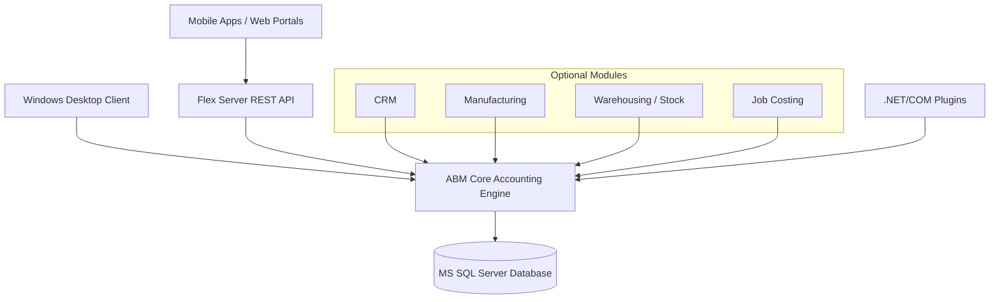

# Architecture overview for ABM

Advanced Business Manager (ABM) is a mature, modular ERP built specifically for the ANZ and UK markets. Here is a technical summary of its architecture and database schema based on its system design and developer-facing characteristics.

## System Architecture
ABM is built on an open, modular architecture designed for high extensibility. It follows a traditional client-server model but has evolved to support hosted/cloud configurations.

Core + Modules: The system consists of a "Core Accounting" engine. All other functionalities (Manufacturing, CRM, Warehousing) are "Optional Modules" that attach directly to the core.

Database Engine: It runs exclusively on Microsoft SQL Server. The software leverages SQL Server’s robustness for handling high transaction volumes (Enterprise edition) or smaller scales (Small Business edition).

Integration Layer: ABM is known for its "Open Architecture," which exposes functionality through several avenues:
* **.NET & COM:** Traditional methods using assemblies and COM interfaces for local third-party plug-ins to interact with business logic.
* **Flex Server & REST API:** Modern configurations support the ABM REST API (often via "Flex Server") which uses HTTPS, JSON formatted responses, and bearer token authentication (endpoints typically prefixed with `/api/v1`).

Desktop & Mobile: While the core is a Windows-based application, it uses a Document Server module to offload resource-intensive tasks (like batch reporting) and provides a mobile API for apps like zapMYstock or Opmetrix.

## System Architecture Principles

1. **Virtual Relationships**: The system is highly decoupled at the DB layer to allow fast inserts and flexible migrations; referential integrity is entirely application-handled.
2. **Event Sourcing / State Transfer**: Instead of mutating single records through complex states, major workflows (like Sales Orders becoming Invoices) progress by moving primary data into new tables (`ZSALES_ORDERS` -> `ZSALES_INVOICES`), providing a very clear audit trail of transactional states.
3. **Flat Polymorphism**: Linking columns (like `AccountID` or `ContactID`) can point to multiple different core entities depending on the context table they exist in.

## Database Schema Overview
Because ABM is an accounting-first ERP, the schema is strictly relational and organized by functional ledgers.

| Category | Primary Tables (Prefixes/Types) | Description |
|---|---|---|
| General Ledger | GL... | Chart of accounts, budgets, and sub-accounts for multi-dimensional analysis. |
| Sales & Debtors | DR... (Debtors) | Customer masters, sales orders, invoices, and quotations. |
| Purchases & Creditors | CR... (Creditors) | Supplier masters, purchase orders, and requisitions. |
| Inventory | ST... (Stock) | Multi-layered stock structure, bins, serial/lot numbers, and warehouse locations. |
| Jobs & Projects | JB... | Job costing, timesheets, and project-based invoicing. |

Custom Fields: ABM allows for the addition of user-defined fields. In the schema, these are often handled via supplementary tables or specific "UserField" columns within the main entity tables to maintain upgrade compatibility.

Multi-Company/Branch: The schema supports multiple entities. Most transaction tables include a CompanyID or BranchID to segregate data within a single SQL database or across multiple databases.

## Developing Extensions
If you are writing extensions, your primary resources and entry points will be:

The Jira Wiki: ABM maintains a developer-centric wiki at abmissues.jira.com. This is the "source of truth" for hotfixes, schema changes, and SDK updates.

ABM Developer Kit: An official subscription-based resource that includes a comprehensive help file providing detailed descriptions of the ABM data structure, transaction engine, and the ABM Report Engine, complete with code snippets.

Plugin Hooks: You can typically "slot" your code into the open architecture. If you are doing UI work, ABM supports custom screens that can be called from the main menu or triggered by events (e.g., "Post Invoice").

Direct SQL vs. API: For read-only reporting, direct SQL queries are standard. However, for writing data (especially transactions), you should use the ABM Business Objects/API to ensure that the double-entry accounting integrity and "audit trail" remain intact.

Schema Discovery: Since the documentation is often restricted to authorized partners, the most effective way to map the schema is to use SQL Server Management Studio (SSMS). Perform an action in the ABM UI (like saving a new Customer) and use a tool like SQL Profiler to see exactly which tables and stored procedures are being hit.