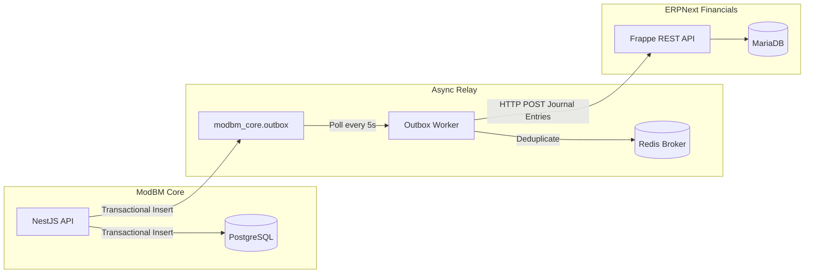

# ERPNext General Ledger Integration Guide

The ModBM platform integrates with ERPNext entirely headlessly. Under the project's strict architecture guidelines (Constitution §3: Ruthless Decoupling), ModBM treats ERPNext solely as an external REST API consumer for Journal Entries and Chart of Accounts capabilities.

## Architecture

The integration follows an **Outbox Relay Pattern** to guarantee eventual consistency without coupling ModBM's core operations to the availability of the ERPNext stack:



### 1. Synchronous Transaction (ModBM)
When a business operation concludes (e.g., Goods Receipt, Sales Delivery), the NestJS API writes the core entity changes and an `event_type` payload into the `modbm_core.outbox` table securely wrapped inside the same database transaction.

### 2. Relay Poller (Worker)
A dedicated Node.js daemon (`apps/worker`) polls the outbox every 5 seconds. Pending events are dispatched to a Redis-backed BullMQ Queue (`erpnext-sync`). 

### 3. Asynchronous Sync
The worker evaluates the `eventType` natively. If it triggers financial movement (e.g., `goods_received` or `goods_dispatched`), it constructs an ERPNext-compatible Journal Entry using pre-mapped Accounts via the `@modbm/erpnext-client` wrapper, and executes the HTTP requests. Successful requests trigger a `processedAt` timestamp update inside Postgres. 

## Deployment & Setup

ERPNext executes in entirely isolated containers alongside ModBM. It is **optional**. 

To boot environments with ERPNext, deploy using the `erpnext` profile:
```bash
make up-erpnext
```

### Self-Provisioning Configurator
ERPNext doesn't load a pre-configured database. Instead, `docker-compose.yml` mounts a one-shot configurator image that executes Frappe Bench commands to dynamically bootstrap the instance. ModBM maintains `configs/erpnext/chart_of_accounts.csv` as the canonical declaration for all Financial ledgers deployed.

## Observability

To maintain visibility without binding the Frappe backend to the ModBM API directly, the `outbox-worker` natively listens on port `9090`. 
The central Prometheus registry continuously scrapes `/metrics` across this port to export Node & BullMQ metrics (active, completed, failed jobs) natively into the PLG Stack.

*Note: The actual Frappe backend containers (`erpnext-backend` and `erpnext-frontend`) do not currently expose Prometheus endpoints natively. However, `promtail` automatically scrapes their `stdout` Podman logs out of `/var/log/pods` to ship them to `loki` for full observability.*

## Inventory Valuations
Phase 1 restricts syncing immediately to Party-agnostic Journal Entries spanning Inventory variations:

| Event | Valuation Strategy | ModBM Operation | Debit Account | Credit Account |
|---|---|---|---|---|
| `goods_received` | WAC / Standard | Purchase Receptions | Inventory | Goods Received Not Invoiced (GRNI) |
| `goods_dispatched` | WAC / Standard | Sales Pick & Ship | Cost of Goods Sold (COGS) | Inventory |
