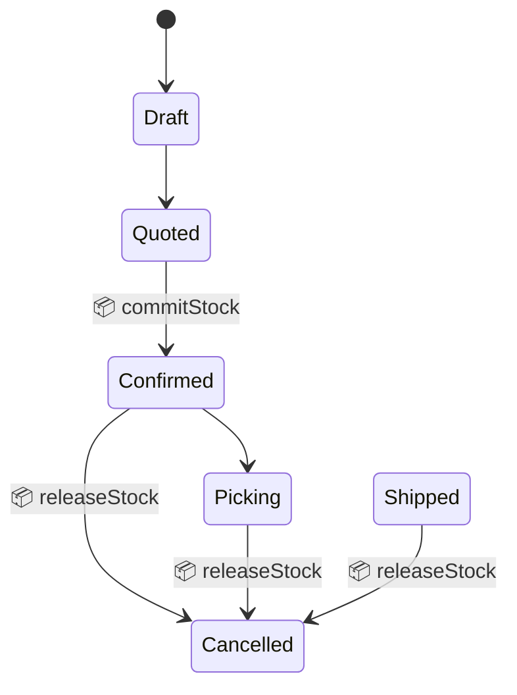
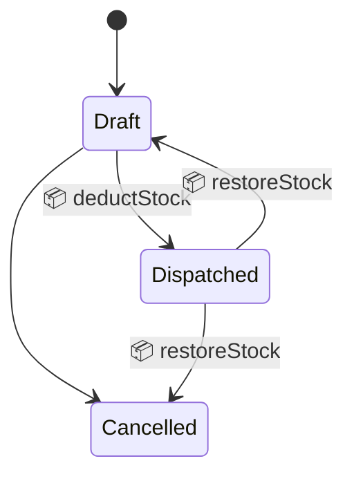
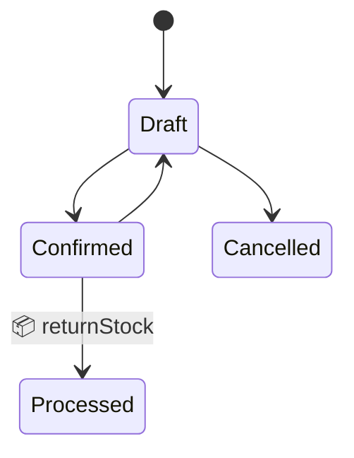
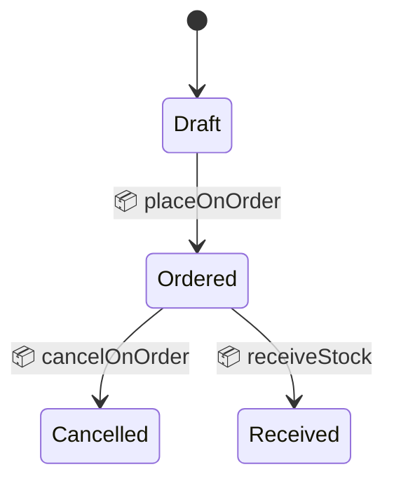

# Inventory Management

This document describes how inventory works in modbm — the data model, how stock levels change across the order lifecycle, and the relationship between read-only reporting and app-owned inventory.

---

## Two Inventory Systems

Inventory data exists in two separate stores:

| Store | Schema | Purpose | Mutated by |
|-------|--------|---------|------------|
| **mart_inventory** | `public_marts` | Read-only reporting view, sourced from ABM via ELT | dbt transform only |
| **inventory_levels** | `modbm_core` | App-owned stock tracking, mutated transactionally | Order lifecycle events |

**`mart_inventory`** is the warehouse truth from ABM — it reflects what the physical warehouse management system knows. It is refreshed periodically via `make elt`.

**`inventory_levels`** is the app-owned working copy, seeded once from `mart_inventory` and then kept up to date by the application as orders, shipments, returns, and purchase orders change state.

> [!IMPORTANT]
> **UI queries read from `mart_inventory`** (product search, availability tabs). **Inventory mutations write to `modbm_core.inventory_levels`**. These are separate tables — the app-owned table tracks deltas caused by the application, while the mart table reflects the ABM warehouse state.

---

## Data Model

### `modbm_core.inventory_levels`

| Column | Type | Description |
|--------|------|-------------|
| `inventory_level_id` | UUID PK | Auto-generated |
| `product_id` | TEXT NOT NULL | References the product |
| `location_no` | TEXT NOT NULL | Warehouse location (default: `MAIN`) |
| `quantity_on_hand` | NUMERIC | Physical stock available |
| `quantity_committed` | NUMERIC | Reserved by confirmed sales orders |
| `quantity_on_order` | NUMERIC | Expected from purchase orders |
| `modified_on` | TIMESTAMPTZ | Last mutation timestamp |

**Unique constraint:** `(product_id, location_no)` — one row per product per location.

### Derived quantities

These are not stored but can be computed:

| Quantity | Formula | Meaning |
|----------|---------|---------|
| **Available** | `on_hand − committed` | Stock available for new orders |
| **Projected** | `on_hand − committed + on_order` | Expected future availability |

---

## Sales Order Lifecycle

Stock levels change at specific state transitions:



### Confirm (quoted → confirmed)

When an order is **confirmed**, the ordered quantities are **committed** — reserved so other orders can see the reduced availability.

| Column | Change |
|--------|--------|
| `quantity_committed` | **+qty** per line |

### Cancel (from confirmed, picking, or shipped)

When a previously-confirmed order is **cancelled**, the committed stock is **released** back to availability.

| Column | Change |
|--------|--------|
| `quantity_committed` | **−qty** per line |

> [!IMPORTANT]
> Cancelling from `draft` or `quoted` does **not** release stock — stock was never committed in those states.

The code uses `COMMITTED_STATES = ['confirmed', 'picking', 'shipped']` to determine whether a cancellation should release stock.

---

## Shipment Lifecycle

Shipments represent the physical dispatch of goods. Each shipment contains lines referencing the parent sales order's lines.



### Dispatch (draft → dispatched)

When a shipment is **dispatched**, the shipped quantities are **deducted** from physical stock and the commitment is released (the goods have left the warehouse).

| Column | Change |
|--------|--------|
| `quantity_on_hand` | **−qty** per shipment line |
| `quantity_committed` | **−qty** per shipment line |

### Reverse / Cancel (dispatched → draft or cancelled)

If a dispatched shipment is **reversed** (back to draft) or **cancelled**, the stock is **restored** — put back on the shelf and re-committed.

| Column | Change |
|--------|--------|
| `quantity_on_hand` | **+qty** per shipment line |
| `quantity_committed` | **+qty** per shipment line |

> [!NOTE]
> Cancelling a `draft` shipment does **not** affect inventory — no stock was deducted.

---

## Return Lifecycle

Returns record goods sent back by a customer against a previously invoiced order.



### Process (confirmed → processed)

When a return is **processed**, the returned quantities are added back to physical stock.

| Column | Change |
|--------|--------|
| `quantity_on_hand` | **+qty** per return line |

Returned stock is **not** committed — it becomes immediately available.

> [!NOTE]
> `quantity_committed` is not affected by returns. The original commitment was released when the shipment was dispatched.

---

## Purchase Order Lifecycle

Purchase orders track goods being ordered from suppliers.



### Order (draft → ordered)

When a PO is **ordered**, the quantities are marked as **on order** — expected future arrivals.

| Column | Change |
|--------|--------|
| `quantity_on_order` | **+qty** per PO line |

### Cancel (ordered → cancelled)

When an ordered PO is **cancelled**, the on-order quantities are removed.

| Column | Change |
|--------|--------|
| `quantity_on_order` | **−qty** per PO line |

### Receive (ordered → received) — *future*

When goods are **received** against a PO, they are added to physical stock and the on-order quantity is reduced.

| Column | Change |
|--------|--------|
| `quantity_on_hand` | **+qty** per reception line |
| `quantity_on_order` | **−qty** per reception line |

> [!NOTE]
> The `receiveStock` method exists in `InventoryService` but is not yet wired to a UI workflow. Reception management will be added when the reception screen is built.

---

## Transaction Safety

All inventory mutations run **inside the same database transaction** as the state change that triggers them. This guarantees:

- **Atomicity** — if the state change fails, inventory is not modified.
- **Consistency** — the inventory always reflects the current order state.
- **No eventual consistency gaps** — unlike the outbox pattern used for ERPNext, inventory updates are synchronous.

The `InventoryService` methods accept a `tx` parameter (the active transaction) rather than using their own connection.

---

## Upsert Pattern

All mutations use `INSERT … ON CONFLICT (product_id, location_no) DO UPDATE`:

```sql
INSERT INTO modbm_core.inventory_levels
  (product_id, location_no, quantity_committed, modified_on)
VALUES ($productId, $locationNo, $delta, NOW())
ON CONFLICT (product_id, location_no) DO UPDATE
SET quantity_committed = inventory_levels.quantity_committed + $delta,
    modified_on = NOW()
```

This means:
- If a product/location row exists, the delta is **added** to the existing value.
- If it doesn't exist (e.g. a new product), a row is created with the delta as the initial value.

---

## Summary Matrix

| Event | `on_hand` | `committed` | `on_order` |
|-------|-----------|-------------|------------|
| **Order confirmed** | — | +qty | — |
| **Order cancelled** (from confirmed+) | — | −qty | — |
| **Shipment dispatched** | −qty | −qty | — |
| **Shipment reversed** | +qty | +qty | — |
| **Return processed** | +qty | — | — |
| **PO ordered** | — | — | +qty |
| **PO cancelled** (from ordered) | — | — | −qty |
| **PO received** *(future)* | +qty | — | −qty |

---

## Seeding

The `inventory_levels` table was seeded from `mart_inventory` via migration `0007_add_inventory_levels.sql`. This is a one-time snapshot. After seeding, the app owns the data and updates it transactionally.

The seed query filters out rows with `NULL` product_id and uses `ON CONFLICT DO NOTHING` for idempotency.
