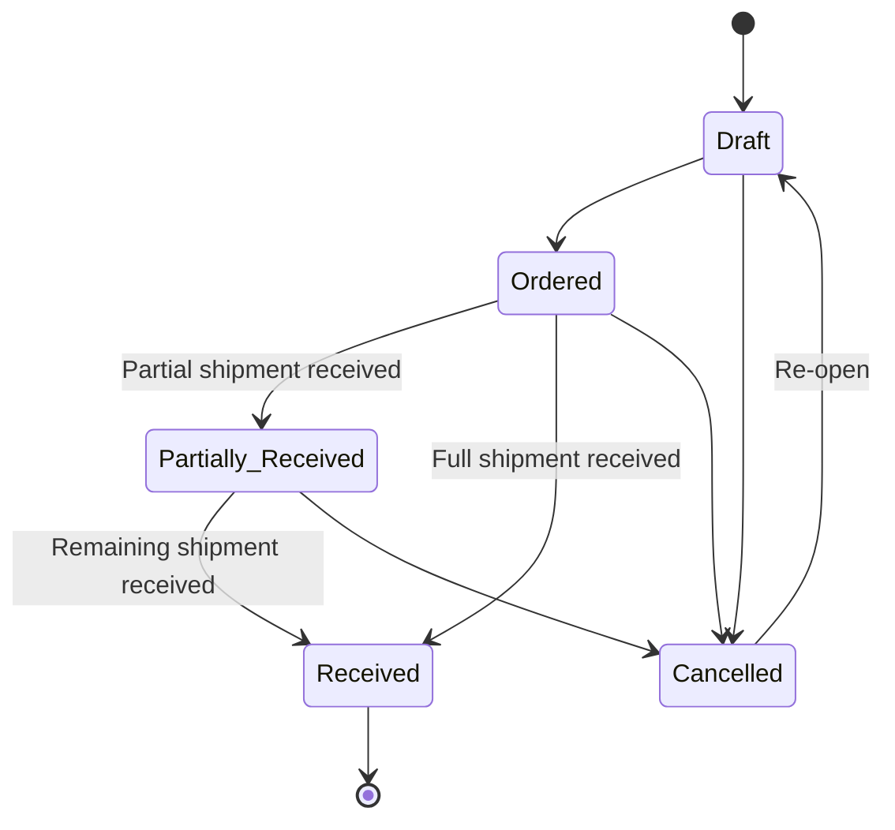

# Purchase Order Management

This document describes how purchase orders work in modbm, including the order lifecycle, pricing, currency, and the receiving process for suppliers.

---

## Order Lifecycle

Every purchase order passes through a defined set of statuses. The system enforces which transitions are valid — you cannot skip stages or move backwards except where explicitly allowed.



### Status Definitions

| Status | Meaning | What can be changed? |
|--------|---------|---------------------|
| **Draft** | Purchase order is being prepared. | Everything — lines, quantities, prices, currency, header fields. |
| **Ordered** | Purchase order has been sent to the supplier/vendor. | Cannot edit order lines. Ready to receive shipments. |
| **Partially Received**| Some, but not all, of the ordered goods have been received. | Cannot edit order lines. More receptions can be added. |
| **Received** | All ordered goods have been fully received. | Nothing — the order is closed. |
| **Cancelled** | Order was cancelled at any prior stage. | Can be re-opened as a new Draft. |

> [!IMPORTANT]
> **Only Draft orders can be edited.** Once an order moves to Ordered or beyond, all line items and prices are locked.

---

## Pricing

### Line Amount Calculation

Each order line calculates its amounts as follows:

```
Amount = Quantity × Unit Price
```

**Example:** 10 units at EUR 12.50 each:
- Amount = 10 × 12.50 = **EUR 125.00**

---

## Currency

The system uses standard **ISO 4217** currency codes (EUR, SGD, USD, AUD, etc.). 

When a new purchase order is created, the currency is set on the order header (defaulting to EUR if not provided). This currency is displayed alongside all monetary amounts on the order.

> [!NOTE]
> Currency is informational at this stage — the system does not perform exchange rate conversions. All prices are entered and stored as-is in the order's currency.

---

## Data Sources

Purchase Orders in the system come from two sources:

| Source | Description | Editable? |
|--------|-------------|-----------|
| **App** | Created in the Supplier Portal | Yes (when in Draft) |
| **ABM** | Historical purchase orders imported from the legacy ABM system | No (read-only) |

ABM purchase orders appear in the order list (via unified view) alongside new app orders and can be viewed in full detail. The originals cannot be modified.

---

## Receptions

A Reception records goods received from a supplier against an active purchase order. Receptions can be full (entire order) or partial (specific lines and quantities). Multiple partial receptions can be raised against the same order.

### Reception Features

When a shipment arrives with a packing slip, a Reception is created in the system to log the arriving goods.

### Validation Rules

- Receptions update the `quantityReceived` on the corresponding purchase order lines.
- The `quantityReceived` in a reception plus any previously received quantity **cannot exceed** the original `quantity` ordered for that line. Attempting to receive more than ordered will result in a validation error.
- When a reception is created, the system checks if all lines on the purchase order have been fully received (i.e., `quantityReceived` >= `quantity`). 
  - If all lines are fulfilled, the purchase order status is automatically updated to `received`. 
  - If some lines are still pending, the purchase order status is updated to `partially_received`.

### Data Model

Receptions are stored as two tables in `modbm_core`:

- **`purchase_order_receptions`** — reception header (linked to `purchase_orders`), storing the auto-generated reception number, packing slip number, notes, and the user who created it.
- **`purchase_order_reception_lines`** — per-line received quantities (linked to `purchase_order_line_items`).
