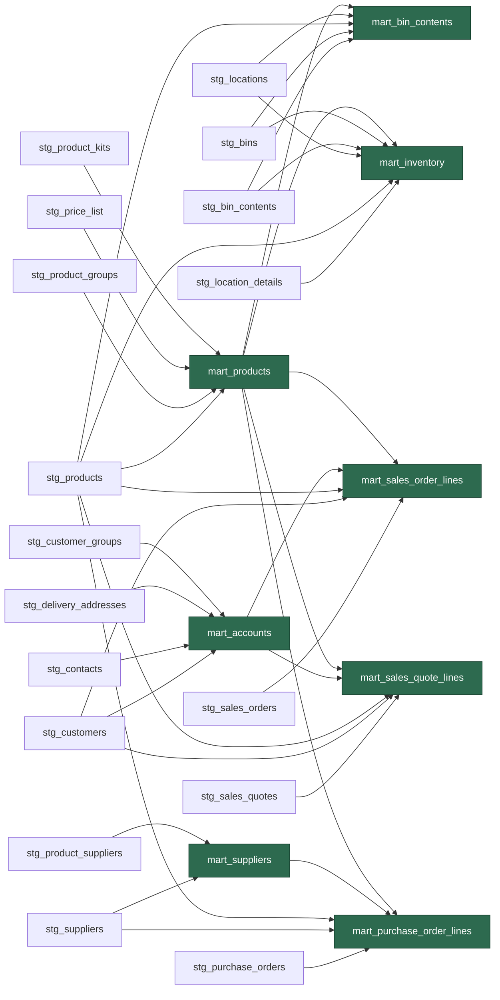

# Schema Reference

> Auto-generated from dbt metadata. Only documents the **mart layer**.
> Last generated: 2026-03-13 14:07 UTC
> Regenerate with: `make schema-ref`

**Postgres schema:** `public_marts`

All mart tables use **dbt Model Contracts** (🔒) with enforced data types and database-level constraints.

**Source freshness:**
 Last raw data load: `2026-03-12 21:05:05.845235+00`
 Freshness checks: warn after 36h, error after 72h

## Models

| Model | Rows | Description |
|-------|------|-------------|
| [`mart_accounts`](#mart_accounts) | 17 | Customer accounts with primary contact and delivery address count |
| [`mart_bin_contents`](#mart_bin_contents) | 5,052 | Bin-level stock for warehouse picking |
| [`mart_inventory`](#mart_inventory) | 19,023 | Stock position per product per location |
| [`mart_products`](#mart_products) | 14,896 | Product catalogue with group name resolved |
| [`mart_purchase_order_lines`](#mart_purchase_order_lines) | 7,806 | Purchase order line items with supplier and product resolved |
| [`mart_sales_order_lines`](#mart_sales_order_lines) | 21,207 | Sales order line items with customer and product resolved |
| [`mart_sales_quote_lines`](#mart_sales_quote_lines) | 1,638 | Sales quote line items with customer and product resolved |
| [`mart_suppliers`](#mart_suppliers) | 54 | Supplier/vendor master with product count enrichment |

---

## Lineage

---

## Join Reference

| From | Join column | → To | Key column |
|------|------------|------|------------|
| `mart_bin_contents` | `product_id` | `mart_products` | `product_id` |
| `mart_inventory` | `product_id` | `mart_products` | `product_id` |
| `mart_purchase_order_lines` | `vendor_id` | `mart_suppliers` | `vendor_id` |
| `mart_purchase_order_lines` | `product_id` | `mart_products` | `product_id` |
| `mart_sales_order_lines` | `account_id` | `mart_accounts` | `account_id` |
| `mart_sales_order_lines` | `product_id` | `mart_products` | `product_id` |
| `mart_sales_quote_lines` | `account_id` | `mart_accounts` | `account_id` |
| `mart_sales_quote_lines` | `product_id` | `mart_products` | `product_id` |

---

### `public_marts.mart_accounts` (17 rows)

Customer accounts with primary contact and delivery address count. CDM entity: Account.

**Staging sources:** `stg_customers`, `stg_contacts`, `stg_delivery_addresses`, `stg_customer_groups`

**Model tests:** `mart_row_count_sanity`

| # | Column | Type | Constraints | Tests | Description |
|---|--------|------|-------------|-------|-------------|
| 1 | `account_id` | `text` | primary_key |  | Unique customer identifier (ABM UniqueID) |
| 2 | `account_number` | `text` |  |  |  |
| 3 | `name` | `text` |  |  |  |
| 4 | `address1_line1` | `text` |  |  |  |
| 5 | `address1_line2` | `text` |  |  |  |
| 6 | `address1_city` | `text` |  |  |  |
| 7 | `address1_state_or_province` | `text` |  |  |  |
| 8 | `address1_postal_code` | `text` |  |  |  |
| 9 | `address1_country` | `text` |  |  |  |
| 10 | `telephone1` | `text` |  |  |  |
| 11 | `fax` | `text` |  |  |  |
| 12 | `email_address1` | `text` |  |  |  |
| 13 | `primary_contact_name` | `text` |  |  |  |
| 14 | `primary_contact_email` | `text` |  |  |  |
| 15 | `primary_contact_phone` | `text` |  |  |  |
| 16 | `customer_group` | `text` |  |  |  |
| 17 | `state_code` | `text` |  | accepted_values('', 'A', 'S', 'H', 'A1', 'A2', 'A28') |  |
| 18 | `gst_position` | `text` |  | accepted_values('exempt', 'taxable') | Customer GST position (exempt or taxable) |
| 19 | `currency_code` | `text` |  | not_null | ISO 4217 currency code (mapped from ABM country code) |
| 20 | `created_on` | `timestamp with time zone` |  |  |  |
| 21 | `delivery_address_count` | `bigint` |  |  |  |
| 22 | `price_scale` | `integer` |  | not_null, accepted_values(1, 2, 3, 4, 5, 6) | ABM price tier (1-4): maps to products price{N}1 columns |
| 23 | `group_discount` | `numeric` |  | not_negative (warn) | Group-level default discount percentage |
| 24 | `customer_discount` | `numeric` |  | not_negative (warn) | Per-customer discount percentage (overrides group if set) |

> [!NOTE]
> **Data quirks:**
> - Status codes include legacy classifications `A1`, `A2`, `A28` beyond standard `A`/`S`/`H`.

### `public_marts.mart_bin_contents` (5,052 rows)

Bin-level stock for warehouse picking. Custom entity: BinStock.

**Mart dependencies:** `mart_products`
**Staging sources:** `stg_bin_contents`, `stg_bins`, `stg_products`, `stg_locations`

**Model tests:** `mart_row_count_sanity`

| # | Column | Type | Constraints | Tests | Description |
|---|--------|------|-------------|-------|-------------|
| 1 | `bin_contents_id` | `text` | primary_key |  | Unique bin-contents identifier |
| 2 | `bin_id` | `text` | not_null |  |  |
| 3 | `bin_number` | `text` |  |  |  |
| 4 | `bin_type` | `text` |  |  |  |
| 5 | `location_no` | `text` |  |  |  |
| 6 | `location_name` | `text` |  |  |  |
| 7 | `product_id` | `text` | foreign_key → mart_products(product_id) | not_null (warn) |  |
| 8 | `product_number` | `text` |  |  |  |
| 9 | `product_name` | `text` |  |  |  |
| 10 | `actual_quantity` | `numeric` |  |  |  |
| 11 | `base_quantity` | `numeric` |  |  |  |
| 12 | `is_consignment` | `boolean` |  |  |  |
| 13 | `is_bonded` | `boolean` |  |  |  |
| 14 | `is_unavailable` | `boolean` |  |  |  |

### `public_marts.mart_inventory` (19,023 rows)

Stock position per product per location. Schema.org entity: InventoryLevel.

**Mart dependencies:** `mart_products`
**Staging sources:** `stg_location_details`, `stg_products`, `stg_locations`, `stg_bin_contents`, `stg_bins`

**Model tests:** `mart_row_count_sanity`

| # | Column | Type | Constraints | Tests | Description |
|---|--------|------|-------------|-------|-------------|
| 1 | `inventory_level_id` | `text` | primary_key |  | Unique location-detail identifier |
| 2 | `product_id` | `text` | foreign_key → mart_products(product_id) | not_null (warn) |  |
| 3 | `product_number` | `text` |  |  |  |
| 4 | `product_name` | `text` |  |  |  |
| 5 | `location_no` | `text` |  |  |  |
| 6 | `location_name` | `text` |  |  |  |
| 7 | `quantity_on_hand` | `numeric` |  | not_negative |  |
| 8 | `quantity_committed` | `numeric` |  |  |  |
| 9 | `quantity_on_order` | `numeric` |  |  |  |
| 10 | `quantity_available` | `numeric` |  |  |  |
| 11 | `quantity_reserved` | `numeric` |  |  |  |
| 12 | `quantity_back_ordered` | `numeric` |  |  |  |
| 13 | `min_quantity` | `numeric` |  |  |  |
| 14 | `max_quantity` | `numeric` |  |  |  |
| 15 | `value_on_hand` | `numeric` |  | not_negative (warn) |  |
| 16 | `last_in_unit_cost` | `numeric` |  | not_negative (warn) |  |
| 17 | `default_bin_number` | `text` |  |  | Bin location(s) for this product at this location. Prefers ABM's native default bin (plocdetails.bin_number) when populated; otherwise aggregates bin numbers from bin contents.
 |

> [!NOTE]
> **Data quirks:**
> - `quantity_available` can be legitimately negative (oversold stock: `qty_on_hand - qty_customer_orders`).
> - `value_on_hand` has 28 sub-cent rounding residuals (max magnitude $0.008) on zero-stock items — ERP moving-average artefact.
> - `last_in_unit_cost` is negative for 3 pseudo-products (`Discount`, `GST`, one fitting) — side-effect of routing non-stock line items through the costing engine.

### `public_marts.mart_products` (14,896 rows)

Product catalogue with group name resolved. CDM entity: Product.

**Staging sources:** `stg_products`, `stg_product_groups`, `stg_price_list`, `stg_product_kits`

**Model tests:** `mart_row_count_sanity`

| # | Column | Type | Constraints | Tests | Description |
|---|--------|------|-------------|-------|-------------|
| 1 | `product_id` | `text` | primary_key |  | Unique product identifier (ABM UniqueID) |
| 2 | `product_number` | `text` |  |  |  |
| 3 | `name` | `text` |  |  |  |
| 4 | `product_group_name` | `text` |  |  |  |
| 5 | `default_vendor_id` | `text` |  |  |  |
| 6 | `default_vendor_name` | `text` |  |  |  |
| 7 | `standard_cost` | `numeric` |  | not_negative (warn) |  |
| 8 | `list_price` | `numeric` |  | not_negative (warn) | ABM price level 1 (list/retail price ex-tax) |
| 9 | `trade_price` | `numeric` |  | not_negative (warn) | ABM price level 2 (trade/stockist price ex-tax) |
| 10 | `price_level_3` | `numeric` |  | not_negative (warn) |  |
| 11 | `price_level_4` | `numeric` |  | not_negative (warn) |  |
| 12 | `quantity_on_hand` | `numeric` |  |  |  |
| 13 | `quantity_available` | `numeric` |  |  |  |
| 14 | `barcode` | `text` |  |  |  |
| 15 | `state_code` | `text` |  | accepted_values('', 'A', 'S', 'H', 'D') |  |
| 16 | `gst_category` | `text` |  | not_null | Product-level GST category from ABM (e.g. '9% GST', 'Zero Rated Products') |
| 17 | `created_on` | `timestamp with time zone` |  |  |  |
| 18 | `price_list_count` | `bigint` |  |  | Number of customer-specific price list entries for this product |
| 19 | `is_kit` | `boolean` |  |  | True if this product is a parent kit/BOM |

> [!NOTE]
> **Data quirks:**
> - Includes system pseudo-products (e.g., `Discount`, `GST`) that have zero stock and anomalous `last_in_unit_cost` values. These are not real inventory items.

### `public_marts.mart_purchase_order_lines` (7,806 rows)

Purchase order line items with supplier and product resolved. CDM entity: PurchaseOrderProduct. Header rows (line_number = 9999) are excluded. order_reference = coalesce(order_number, document_number).

**Mart dependencies:** `mart_suppliers`, `mart_products`
**Staging sources:** `stg_purchase_orders`, `stg_suppliers`, `stg_products`

| # | Column | Type | Constraints | Tests | Description |
|---|--------|------|-------------|-------|-------------|
| 1 | `purchase_order_line_id` | `text` | primary_key |  | Unique line identifier (ABM InternalKey) |
| 2 | `line_item_id` | `text` |  |  |  |
| 3 | `line_number` | `bigint` |  |  |  |
| 4 | `order_reference` | `text` |  |  | Primary order identifier for display. Prefers order_number (ABM our_order_no), falls back to document_number.
 |
| 5 | `document_number` | `text` |  |  |  |
| 6 | `document_date` | `timestamp with time zone` |  |  |  |
| 7 | `order_number` | `text` |  |  |  |
| 8 | `vendor_id` | `text` | foreign_key → mart_suppliers(vendor_id) | not_null (warn) |  |
| 9 | `vendor_number` | `text` |  |  |  |
| 10 | `vendor_name` | `text` |  |  |  |
| 11 | `product_id` | `text` | foreign_key → mart_products(product_id) | not_null (warn) |  |
| 12 | `product_number` | `text` |  |  |  |
| 13 | `product_description` | `text` |  |  |  |
| 14 | `supplier_part_number` | `text` |  |  |  |
| 15 | `unit_of_measure` | `text` |  |  |  |
| 16 | `quantity` | `numeric` |  | not_negative |  |
| 17 | `price_per_unit` | `numeric` |  |  |  |
| 18 | `discount_percentage` | `numeric` |  |  |  |
| 19 | `amount` | `numeric` |  |  |  |
| 20 | `tax` | `numeric` |  |  |  |
| 21 | `total_amount` | `numeric` |  |  |  |
| 22 | `quantity_delivered` | `numeric` |  |  |  |
| 23 | `quantity_invoiced` | `numeric` |  |  |  |
| 24 | `is_fully_delivered` | `boolean` |  |  |  |
| 25 | `is_fully_invoiced` | `boolean` |  |  |  |
| 26 | `document_total_ex_tax` | `numeric` |  |  |  |
| 27 | `document_total_tax` | `numeric` |  |  |  |
| 28 | `document_total_inc_tax` | `numeric` |  |  |  |

### `public_marts.mart_sales_order_lines` (21,207 rows)

Sales order line items with customer and product resolved. CDM entity: SalesOrderProduct. Header rows (line_number = 9999) are excluded. order_reference = coalesce(order_number, document_number).

**Mart dependencies:** `mart_accounts`, `mart_products`
**Staging sources:** `stg_sales_orders`, `stg_customers`, `stg_products`

**Model tests:** `mart_row_count_sanity`

| # | Column | Type | Constraints | Tests | Description |
|---|--------|------|-------------|-------|-------------|
| 1 | `sales_order_line_id` | `text` | primary_key |  | Unique line identifier (ABM InternalKey) |
| 2 | `line_item_id` | `text` |  |  |  |
| 3 | `line_number` | `bigint` |  |  |  |
| 4 | `order_reference` | `text` |  |  | Primary order identifier for display. Prefers order_number (ABM our_order_no), falls back to document_number.
 |
| 5 | `document_number` | `text` |  |  |  |
| 6 | `document_date` | `timestamp with time zone` |  |  |  |
| 7 | `order_number` | `text` |  |  |  |
| 8 | `customer_order_number` | `text` |  |  |  |
| 9 | `account_id` | `text` | foreign_key → mart_accounts(account_id) | not_null (warn) |  |
| 10 | `account_number` | `text` |  |  |  |
| 11 | `account_name` | `text` |  |  |  |
| 12 | `product_id` | `text` | foreign_key → mart_products(product_id) | not_null (warn) |  |
| 13 | `product_number` | `text` |  |  |  |
| 14 | `product_description` | `text` |  |  |  |
| 15 | `unit_of_measure` | `text` |  |  |  |
| 16 | `quantity` | `numeric` |  | not_negative |  |
| 17 | `price_per_unit` | `numeric` |  |  |  |
| 18 | `discount_percentage` | `numeric` |  |  |  |
| 19 | `amount` | `numeric` |  |  |  |
| 20 | `tax` | `numeric` |  |  |  |
| 21 | `total_amount` | `numeric` |  |  |  |
| 22 | `quantity_delivered` | `numeric` |  |  |  |
| 23 | `quantity_invoiced` | `numeric` |  |  |  |
| 24 | `is_fully_delivered` | `boolean` |  |  |  |
| 25 | `is_fully_invoiced` | `boolean` |  |  |  |
| 26 | `document_total_ex_tax` | `numeric` |  |  |  |
| 27 | `document_total_tax` | `numeric` |  |  |  |
| 28 | `document_total_inc_tax` | `numeric` |  |  |  |

> [!NOTE]
> **Data quirks:**
> - ABM models **discounts as negative line items** (`product_number = 'Discount'`). `price_per_unit`, `amount`, `tax`, and `total_amount` are intentionally negative on these rows. `not_negative` is intentionally **not** applied to financial columns.
> - `document_date` is cast from `text` → `timestamp with time zone` in the mart SQL.

### `public_marts.mart_sales_quote_lines` (1,638 rows)

Sales quote line items with customer and product resolved. CDM entity: QuoteProduct. Header rows (line_number = 9999) are excluded.

**Mart dependencies:** `mart_accounts`, `mart_products`
**Staging sources:** `stg_sales_quotes`, `stg_customers`, `stg_products`

| # | Column | Type | Constraints | Tests | Description |
|---|--------|------|-------------|-------|-------------|
| 1 | `sales_quote_line_id` | `text` | primary_key |  | Unique line identifier (ABM InternalKey) |
| 2 | `line_item_id` | `text` |  |  |  |
| 3 | `line_number` | `bigint` |  |  |  |
| 4 | `document_number` | `text` |  |  |  |
| 5 | `document_date` | `timestamp with time zone` |  |  |  |
| 6 | `account_id` | `text` | foreign_key → mart_accounts(account_id) | not_null (warn) |  |
| 7 | `account_number` | `text` |  |  |  |
| 8 | `account_name` | `text` |  |  |  |
| 9 | `product_id` | `text` | foreign_key → mart_products(product_id) | not_null (warn) |  |
| 10 | `product_number` | `text` |  |  |  |
| 11 | `product_description` | `text` |  |  |  |
| 12 | `unit_of_measure` | `text` |  |  |  |
| 13 | `quantity` | `numeric` |  | not_negative |  |
| 14 | `price_per_unit` | `numeric` |  |  |  |
| 15 | `discount_percentage` | `numeric` |  |  |  |
| 16 | `amount` | `numeric` |  |  |  |
| 17 | `tax` | `numeric` |  |  |  |
| 18 | `total_amount` | `numeric` |  |  |  |
| 19 | `document_total_ex_tax` | `numeric` |  |  |  |
| 20 | `document_total_tax` | `numeric` |  |  |  |
| 21 | `document_total_inc_tax` | `numeric` |  |  |  |

### `public_marts.mart_suppliers` (54 rows)

Supplier/vendor master with product count enrichment. CDM entity: Vendor.

**Staging sources:** `stg_suppliers`, `stg_product_suppliers`

| # | Column | Type | Constraints | Tests | Description |
|---|--------|------|-------------|-------|-------------|
| 1 | `vendor_id` | `text` | primary_key |  | Unique supplier identifier (ABM UniqueID) |
| 2 | `vendor_number` | `text` |  |  |  |
| 3 | `name` | `text` |  |  |  |
| 4 | `vendor_group` | `text` |  |  |  |
| 5 | `address1_line1` | `text` |  |  |  |
| 6 | `address1_line2` | `text` |  |  |  |
| 7 | `address1_city` | `text` |  |  |  |
| 8 | `address1_state_or_province` | `text` |  |  |  |
| 9 | `address1_postal_code` | `text` |  |  |  |
| 10 | `address1_country` | `text` |  |  |  |
| 11 | `telephone1` | `text` |  |  |  |
| 12 | `fax` | `text` |  |  |  |
| 13 | `email_address1` | `text` |  |  |  |
| 14 | `state_code` | `text` |  |  | ABM supplier status/group code. Unlike other entities, suppliers use alphanumeric group codes (A, A1, A2, …, A28).
 |
| 15 | `created_on` | `timestamp with time zone` |  |  |  |
| 16 | `product_count` | `bigint` |  |  | Number of products linked to this supplier |
