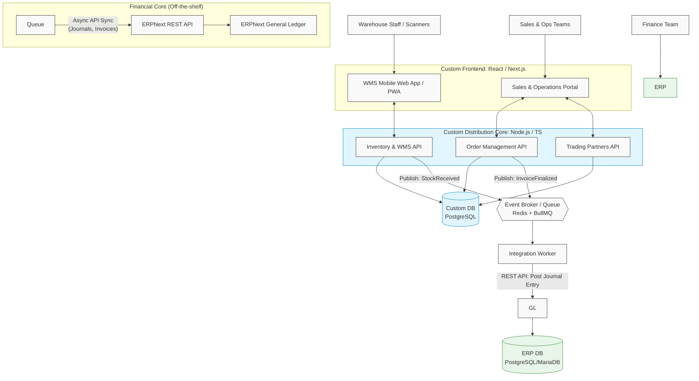
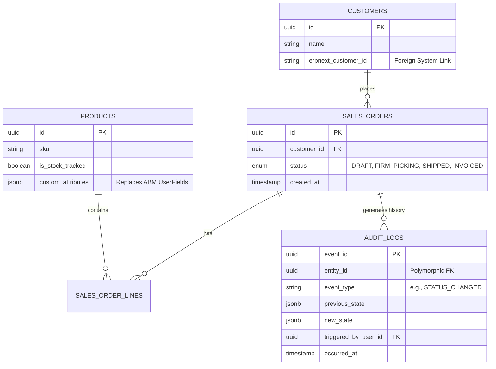
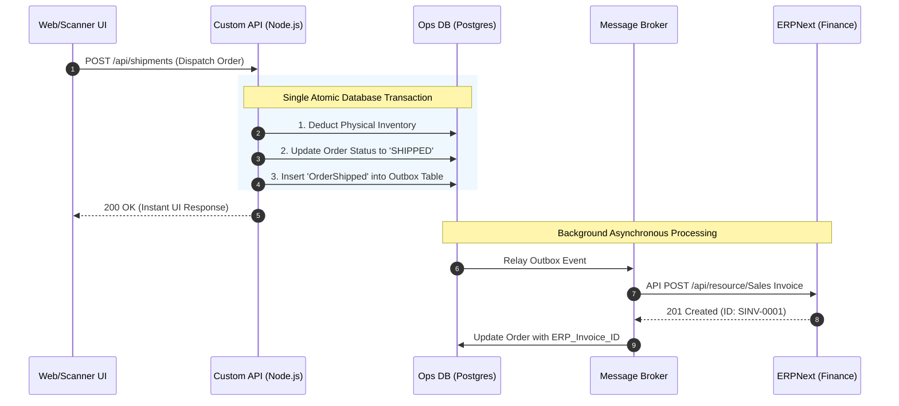

# Architecture Vision Document

This doc expands on system_overview.md to give more details about technical choices.

## 1. Architectural Strategy: The Composable ERP
The goal is to transition from a monolithic legacy system (ABM) to a modern, decoupled architecture. We are adopting a strict boundary based on domain capabilities:

- Adopt (Commodity): We will use ERPNext strictly as a "headless" financial engine (General Ledger, AP/AR, Tax, Chart of Accounts). Double-entry accounting is a highly regulated, commoditized domain; building it from scratch yields zero competitive advantage and carries immense risk.

- Build (Competitive Edge): We will custom-build the Order Management (OMS), Warehouse Management (WMS), complex Pricing, and CRM on a modern stack. Distribution businesses live and die by operational efficiency; this is where you own your proprietary workflows.

By decoupling these two "brains," your warehouse and sales teams are never bottlenecked by complex financial database locks, and your accounting team gets a standardized, compliant ledger.

## 2. High-Level System Architecture
The system transitions from ABM's traditional client-server model to a Decoupled, Event-Driven Architecture.

## 3. Technology Stack Selection
We are standardizing on a JavaScript/TypeScript and PostgreSQL ecosystem for the custom build to maximize developer velocity and ensure end-to-end type safety.

| Component | Technology Choice | Rationale & ABM Comparison |
| :--- | :--- | :--- |
| **Database** | **PostgreSQL 16+** | ABM relied entirely on application-layer logic for referential integrity. Postgres enforces strict Foreign Keys natively. Furthermore, Postgres’s JSONB support allows us to handle custom user-defined fields seamlessly, eliminating the need for ABM's clunky supplementary tables. |
| **Backend API** | **Node.js + NestJS (TypeScript)** | NestJS provides a heavily structured, enterprise-ready architecture (Modules, Dependency Injection) for Node.js. It forces a clean Model-Controller-Service pattern, preventing "spaghetti code." |
| **ORM / Data Access** | **Drizzle ORM** | Provides strictly typed database queries. This is a massive upgrade over ABM's historical reliance on opaque stored procedures and implicit linking. |
| **Frontend UI** | **Next.js (React) + Tailwind** | Next.js handles fast back-office portals and highly optimized Web Apps (PWAs) for warehouse scanners from the same codebase. Component libraries (like ag-Grid) will allow us to build the dense, complex data grids required for rapid order entry. |
| **Integration** | **Redis + BullMQ** | We must avoid tightly coupling the Custom App to ERPNext. If ERPNext goes down for maintenance, the warehouse must keep scanning. Queues ensure guaranteed, asynchronous delivery of financial data. |

## 4. Modernizing the Data Model
When migrating from ABM, we must explicitly abandon its legacy anti-patterns and model the database on modern RDBMS principles.

### 4.1. Replacing "Table-Hopping" with State Machines
The ABM Way: To change an order's status, ABM physically moved records between tables (e.g., from ZSALES_QUOTES to ZSALES_ORDERS to ZSALES_INVOICES). This made querying the lifecycle of a single order computationally expensive and complex.

The Modern Way: We will use a unified sales_orders table with a strictly enforced status enum.

### 4.2. Preserving the Audit Trail via Event Sourcing
ABM's table-hopping did provide a clear transactional state. To replicate and improve this, we will use an Append-Only Audit Log. Every time an order changes state, a lightweight snapshot is written to a history table.

### 4.3. Eliminating "Flat Polymorphism"
In ABM, linking columns (like AccountID or ContactID) could point to entirely different core entities depending on a secondary context flag. We will enforce strict typing: an order belongs to a customer_id which explicitly maps to a customers table with a DB-level constraint.

## 5. Integration Architecture: Order-to-Cash Workflow
A critical failure point in hybrid ERP builds is distributed transactions—what happens if the Custom App ships an order, but ERPNext's API is temporarily offline?

To guarantee absolute consistency without slowing down operations, we will implement the Transactional Outbox Pattern:

- Local Transaction: When a warehouse worker ships an order, the Node.js API updates physical stock and marks the order "Shipped" in the Postgres DB. In the exact same database transaction, it writes an event payload to an outbox table.

- Instant UI: The operation is instantly completed for the user. They are never blocked waiting for accounting ledgers to calculate.

- Message Relay: A background process reads the outbox and pushes the event to the Message Broker.

- ERPNext Ingestion: The Integration Worker picks up the message and pushes a "Sales Invoice" API call to ERPNext. If ERPNext is down, the queue safely retries until successful.

## 6. Domain Master Data Boundaries
To prevent "split-brain" scenarios, domains must have a single source of truth:

- Custom App Owns (Operations): Products/SKUs, Multi-location Inventory, Bins, Sales Orders, Purchase Orders, and Customer CRM data.

- ERPNext Owns (Finance): Chart of Accounts, Tax Rates, General Ledger Journals, AR/AP Balances.

- The Bridge: When a Customer is created in the Custom App and makes their first purchase, the Integration Worker automatically creates a lightweight "Debtor" profile in ERPNext purely so an invoice can be attached to them. ERPNext does not need to know the customer's CRM history, only their financial balance.

## 7. Security & Identity (IAM)

### 7.1. Authentication (AuthN)
We will initially handle authentication through a simple username and password verification mechanism, issuing secure sessions or tokens for authenticated users as the foundation before any complex SSO integration.

### 7.2. Authorization (AuthZ) & Data Access Service (DAS)
We will set up authorization using **Casbin**, which will serve as our centralized Data Access Service (DAS). Policies for data access (e.g., Role-Based Access Control and Attribute-Based Access Control) will be explicitly defined within Casbin.

**Interaction with the DAS:**
- **API Gateway / Middleware**: Every incoming request to our Custom Node.js APIs must pass through an authorization middleware. This middleware extracts the user identity and requested resource, then queries the DAS (Casbin enforcer) to verify access.
- **Frontend UI (Next.js)**: The UI will query the API for the current user's permissions derived from the DAS to gracefully hide or disable forbidden actions. However, the UI never makes authoritative access decisions.
- **Background Workers**: Integration workers interacting with ERPNext or outbox queues must operate under defined service roles, validated similarly via the DAS.

## 8. Infrastructure & Observability

### 8.1. Containerization
We will run all microservices, frontend applications, and background workers in **Docker containers**. This ensures environment parity across development, staging, and production, and simplifies local onboarding.

### 8.2. Observability (The PLG Stack)
To maintain the required "Always Output Observability" mandate, we will use the **PLG Stack**:
- **Prometheus**: Scrapes and stores time-series metrics from our Node.js APIs, BullMQ queues, and Postgres databases.
- **Promtail + Loki**: Promtail aggregates structured logs emitted by our Docker containers and forwards them to Loki for centralized, label-based log querying.
- **Grafana**: Serves as our "single pane of glass" to visualize Prometheus metrics and explore Loki logs side-by-side, enabling rapid troubleshooting of distributed async workflows.

## Areas for your review before V2:
Pricing Complexity: ABM is known for having incredibly complex, customer-specific pricing matrices (PRICEDETAILS, PSUBMATRIX). Do you want to replicate this exact logic in the custom app, or use this replatforming as an opportunity to simplify your pricing model?

Inventory Valuation: Does your current ABM setup use Standard Costing, FIFO, or Average Costing? This deeply affects the mathematical logic required when we map stock movement events to ERPNext's General Ledger.

Multi-Branching: How deeply did you use ABM's BranchID functionality? Will the new PostgreSQL database require strict Row-Level Security to prevent different branches/warehouses from seeing each other's data, or is application-level filtering sufficient?