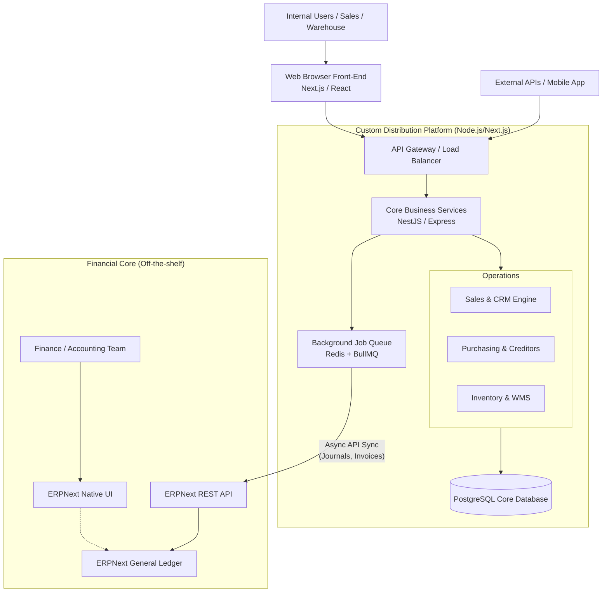

# Modern Distribution-Oriented Business Manager

## 1. Executive Summary

This document proposes a modern, scalable, and modular architecture to replace the legacy Advanced Business Manager (ABM) system. This is being built specifically for distribution companies.

The strategy adopts a **Hybrid Build/Buy Approach**:
* **Build:** Develop the core operational and distribution workflows (Sales, Purchasing, Inventory, and CRM) as a custom-built solution, enabling a tailored user experience and distinct competitive advantage.

Our foundational custom stack will be built on **PostgreSQL** and a modern **JavaScript/TypeScript ecosystem**.

---

## 2. Proposed Technology Stack

| Component | Technology | Justification |
| :--- | :--- | :--- |
| **Frontend Framework** | **Next.js (React) + TypeScript** | Industry standard for building robust, high-performance, enterprise-grade web applications. Excellent component ecosystem. |
| **Backend Framework** | **Node.js with NestJS (TypeScript)** | NestJS enforces a highly structured, modular architecture similar to Angular, making it ideal for maintaining complex ERP-level business logic. |
| **Primary Database** | **PostgreSQL** | Rock-solid relational database. Excellent JSON support for semi-structured data (like changing product attributes) while maintaining strict ACID compliance for transactions. |
| **Financial Core** | **ERPNext** | Open-source, widely adopted. Writing a General Ledger from scratch is heavily error-prone and offers low ROI. ERPNext has excellent API capabilities. |
| **Integration / Queue** | **Redis + BullMQ** | To handle resilient, asynchronous communication between our custom application and ERPNext. |
| **ORM / Data Access** | **Drizzle ORM** | Type-safe database access layer to dramatically speed up development and safely manage schema migrations. |

---

## 3. High-Level Architecture

The below diagram illustrates the proposed decoupling of operational modules from the financial ledger.

---

## 4. Domain & Data Breakdown

Breaking away from the monolithic ABM database (`TRANSHEADERS`/`TRANSDETAILS` containing everything), we will split the domain clearly.

### 4.1. Custom Database (PostgreSQL)
This is where 90% of the daily user interactions will happen.
* **Master Data:** Customers, Contacts, Suppliers, Products, BOMs, Pricing Matrices.
* **Transactions:** Quotes, Sales Orders, Purchase Orders, Packing Slips, Goods Receipts.
* **Warehousing:** Stock Locations, Bins, Serial Numbers, Stock Movements, Stocktakes.

### 4.2. ERPNext (Financial Ledger)
This system will act as the "Book of Record" for financial compliance.
* **Master Data:** Chart of Accounts, Tax Templates, Cost Centers.
* **Transactions:** Sales Invoices (AR), Purchase Invoices (AP), General Validations, Journal Entries, Payments & Bank Reconciliation.

---

## 5. Key Technical Decisions & Patterns

### 5.1. The "Thin Ledger" Integration Pattern
Instead of trying to keep customer balances or stock quantities stored simultaneously in both systems, the Custom App will handle all operational states. When a financial event occurs (e.g., *Goods Shipped* or *Invoice Approved*), the Custom App will generate a discrete API request to ERPNext to post the specific General Ledger impact (e.g., Dr Accounts Receivable, Cr Sales Revenue, Dr COGS, Cr Inventory).

### 5.2. Event-Driven & Anti-Corruption Layer
Directly coupling our code to ERPNext's API could make our app brittle. We will use an asynchronous queue (Redis/BullMQ) to ensure that we can guarantee message delivery.

### 5.3. Strict Relational Integrity 
Unlike ABM (which relied on implicit "Virtual Relationships" and flat character fields), our PostgreSQL schema will use **strict Foreign Keys** natively. This prevents orphaned records, guarantees data integrity at the database level, and makes future development significantly faster as ORMs can infer relationships automatically.

### 5.4. Preserving the "Stage" Workflow
ABM's concept of moving data through states (e.g., `ZSALES_QUOTES` → `ZSALES_ORDERS` → `ZSALES_INVOICES`) provided a great audit trail. In a modern schema, we might instead use a central `SalesOrders` table with a robust immutable `OrderEvents` or `OrderFulfillments` ledger to track exactly when and how the state changed over time.