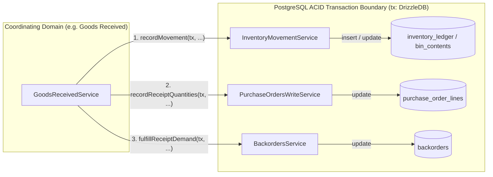

# Platform & Database Architecture

HeroBM is built on a resilient, typed relational PostgreSQL foundation designed to cleanly isolate raw legacy ingestion, analytical transformations, and the real-time operational transaction engine.

---

## 1. The Multi-Layer Pipeline & Core Database Architecture

```mermaid
flowchart TD
    subgraph "1. Ingestion Layer (dlt / ODBC Extractors)"
        Raw[(raw_abm / external)]
    end

    subgraph "2. Transformation Pipeline (dbt)"
        Raw -- "staging views" --> Staging[(staging)]
        Staging -- "business transforms" --> Intermediate[(intermediate)]
        Intermediate -- "incremental materialization" --> Import[(import models)]
    end

    subgraph "3. Operational Core Layer (Drizzle ORM)"
        Import -- "+schema: herobm_core" --> Core[(herobm_core)]
        App(NestJS API) -- "Reads & Writes" --> Core
        Core -- "Outbox Relay" --> Webhooks[Webhooks & Event Bus]
        Core -- "Native Double-Entry GL" --> Ledger[Cryptographic General Ledger]
    end
    
    classDef staging fill:#f3e5f5,stroke:#8e24aa
    classDef intermediate fill:#fff3e0,stroke:#f57c00
    classDef core fill:#e3f2fd,stroke:#1e88e5
    
    Staging class staging
    Intermediate class intermediate
    Core class core
```

### Schema & Pipeline Responsibilities

| Schema / Layer | Owner / Tool | Purpose | Strict Access Boundary |
| :--- | :--- | :--- | :--- |
| **`raw_abm`** (or raw landing) | `dlt` / ODBC extractors | Landing zone for raw legacy ERP data. | Raw mirror of external sources. No manual mutations. |
| **`staging`** | `dbt` (`pipelines/abm_transform/models/staging/`) | Cleanses column names to `snake_case`, coalesces NULLs, and safely casts numeric fields. | Materialized as views in the `staging` schema. No business joins. |
| **`intermediate`** | `dbt` (`pipelines/abm_transform/models/intermediate/`) | Normalizes and combines legacy data structures across domains (orders, customers, products). | Intermediate schema transformation models. |
| **`import`** (into **`herobm_core`**) | `dbt` (`pipelines/abm_transform/models/import/`) | Materializes cleaned, typed operational entities directly into `herobm_core` (`+schema: herobm_core`, incremental). | Populates initial and synced entities directly into core tables. |
| **`herobm_core`** | Drizzle ORM (`packages/db-schema/src/`) | The single source of truth for the live application. | **Exclusive live access**: All API reads, writes, transactions, GL journals, and outbox queues operate exclusively here. |

---

## 2. Drizzle ORM & Schema Single Source of Truth

The live application schema is defined strictly in TypeScript under `packages/db-schema/src/*.schema.ts`.

### Key Architectural Invariants
1. **UUID Primary Keys**: Every table uses a `uuid` primary key with `gen_random_uuid()` to prevent ID enumeration and enable distributed replication.
2. **Referential Integrity**: All relationships enforce Foreign Key constraints. Master entities use `RESTRICT` delete policies; dependent lines use cascade.
3. **Double-Entry Financial & Stock Ledgers**: Financial entries and stock movements are written to append-only ledgers. `DELETE` operations on financial tables are strictly blocked at the database trigger level (`prevent_financial_deletion`).

---

## 3. Strict Single-Writer Domain Ownership & Transaction Delegation

HeroBM enforces a strict bounded-context write architecture across its entire relational database:

> **The Single-Writer Principle:**
> *Any module in the system may read any table. Each table has exactly one domain module authorized to write to it.*



### Transaction Delegation Pattern (`tx: DrizzleDB`)
When a business operation spans multiple business domains (for example, receiving goods against a purchase order), the coordinating service does **not** execute direct SQL mutations against foreign tables. Instead, it creates an ACID transaction and passes the active Drizzle transaction instance (`tx: DrizzleDB`) to domain service methods:

```typescript
await this.db.transaction(async (tx) => {
  // 1. Owning domain writes its own entity
  const receipt = await this.createReceipt(tx, dto, actor);

  // 2. Delegate inventory movements to Inventory domain
  await this.inventoryMovementService.recordInventoryMovement(tx, { ... });

  // 3. Delegate purchase order line receipt & state recalculation to Purchase Orders domain
  await this.purchaseOrdersWriteService.recordReceiptQuantities(tx, receipt.lines, actor);

  // 4. Delegate demand fulfillment to Orders/Backorders domain
  await this.backordersService.fulfillReceiptDemand(tx, receipt.lines, actor);
});
```

### Canonical Domain Authority Map

| Domain / Owning Service | Owned Operational Tables | Delegated Write Capabilities |
| :--- | :--- | :--- |
| **`BackordersService`** (`apps/api/src/orders/`) | `backorders` | Demand shortfall creation, receipt fulfillment, work order allocation, unlinking, cancellation |
| **`PurchaseOrdersWriteService`** (`apps/api/src/purchase-orders/`) | `purchaseOrders`, `purchaseOrderLineItems` | Requisition generation, receipt adjustments (`recordReceiptQuantities`, `revertReceiptQuantities`), state machine synchronization |
| **`PurchaseReturnsService`** (`apps/api/src/purchase-orders/`) | `purchaseOrderReturns`, `purchaseOrderReturnLines`, `purchaseOrderReturnShipments` | Return staging, dispatch, unshipment, resolution without debit note |
| **`ReturnsWriteService`** (`apps/api/src/orders/`) | `salesOrderReturns`, `salesOrderReturnLines` | Return creation, putaway status tracking, credit note state transitions |
| **`WorkOrdersExecutionService`** (`apps/api/src/manufacturing/`) | `workOrders`, `workOrderComponents` | Work order issuance, component reservation, completion, scrap |
| **`OrdersService` / `OrderLinesService`** (`apps/api/src/orders/`) | `salesOrders`, `salesOrderLineItems` | Order creation, line updates, status transitions, direct counter-fulfillment |
| **`InventoryMovementService`** (`apps/api/src/inventory/`) | `inventoryEntries`, `inventoryLedger`, `binContents` | Double-entry stock movements, reservations, bin reallocations, stock adjustments |
| **`GlService`** (`apps/api/src/gl/`) | `glJournalEntries`, `glJournalLines` | Double-entry journal posting, cryptographic hash chaining |

### Structural Enforcement (Immune System)
This boundary is not merely a convention—it is statically enforced on every build by the AST scanner [`infra/tests/test_financial_table_write_boundaries.ts`](file:///c:/Users/Marcel/volz/modbm/modbm/infra/tests/test_financial_table_write_boundaries.ts). Any direct `insert`, `update`, or `delete` query targeting a table outside its authorized domain service immediately fails `make test-structural`.

---

## 4. Database Migrations & Ledger Linearity

Database migrations are tracked via a strict, sequential ledger managed by `drizzle-kit`:

- **Generating Migrations**: Always execute `make dev-db-generate NAME=<descriptive_name>`. This script guarantees pre- and post-generation linearity checks and updates `apps/api/migrations/meta/_journal.json`.
- **Applying Migrations**: Run `make migrate` to apply pending migrations idempotently (`IF NOT EXISTS`).
- **Conflict Resolution**: Never manually rename migration files or edit `_journal.json`. Delete conflicting local migrations and regenerate against the canonical schema.

---

## 5. System Initialization & Seeds

System initialization is split between core operational values and legacy migration anchors:

- **Core System Seeds (`make seed`)**: Managed by `apps/api/src/seeds/run.ts`. Inserts default admin credentials, tenant settings singletons, default currency definitions, document sequence counters, and baseline Chart of Accounts (COA) templates.
- **Legacy Import Anchors**: Fixed, deterministic fallback UUIDs (e.g. `00000000-0000-0000-0000-000000000001`) used by dbt pipelines to reconcile unmapped legacy data while preserving foreign key integrity.
