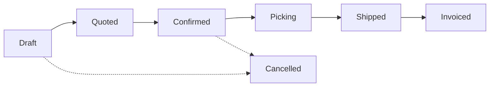

# Transactional Core Engines

HeroBM is driven by four runtime engines that enforce business invariants, data integrity, and real-time event distribution.

---

## 1. Double-Entry General Ledger Engine (`apps/api/src/gl/`)

The General Ledger module provides a native, double-entry financial accounting engine directly inside `herobm_core`:

```
herobm_core schema (PostgreSQL)
  │  Drizzle ORM (typed mutations)
  ▼
GlService.postJournalEntry(lines, meta, tx)
  ├─► Validates Debit/Credit Equality (Debits == Credits, tolerance <= 0.005)
  ├─► Computes SHA-256 Cryptographic Hash Chain (entry_hash -> prev_entry_hash)
  └─► Inserts gl_journal_entries & gl_journal_lines atomically
```

### Core Financial Invariants
1. **Double-Entry Balance Rule**: Every journal entry must contain at least two lines and total debits must equal total credits ($\sum \text{Debits} = \sum \text{Credits}$).
2. **Line Amount Invariants**: Individual lines must specify non-negative amounts (`debit >= 0`, `credit >= 0`), cannot have both debit and credit on the same line, and cannot be zero for both.
3. **Cryptographic Hash Chaining**: Every posted entry generates a SHA-256 digest binding the current transaction data and previous entry hash, forming an auditable ledger chain.
4. **Idempotent COA Seeding**: Ingests ERPNext-compatible Chart of Accounts templates during initialization and via upload.

---

## 2. Double-Entry Inventory Ledger Engine (`apps/api/src/inventory/`)

Stock never appears or disappears arbitrarily—all physical movements are recorded as double-entry ledger lines:

- **`inventory_entries`**: Header tracking transaction metadata (date, user, source document, generic memo).
- **`inventory_ledger`**: Line-item table storing stock movements between bins, warehouses, and external counterparties (suppliers/customers).

### Atomic Mutation Pathway
All writes must flow through `InventoryService.recordInventoryMovement`:

```typescript
await inventoryService.recordInventoryMovement(tx, {
  entryNumber: 'MV-2026-001',
  sourceType: 'SO_PICK',
  sourceId: orderId,
  userId: req.user.username,
  memo: 'Order picking allocation',
  lines: [
    { productId: 'P1', binId: 'bin-shelf-A', locationNo: 'L1', quantity: -10 },
    { productId: 'P1', binId: 'bin-shipping', locationNo: 'L1', quantity: 10 }
  ]
});
```

Within a single transaction, the engine:
1. Inserts the `inventory_entries` header.
2. Inserts balanced `inventory_ledger` lines.
3. Emits an `INVENTORY_ENTRY_CREATED` event to the transactional outbox.
4. Updates the fast read-cache (`quantityOnHand`) for rapid UI querying.

---

## 3. Document State Machine Engine (`packages/shared/src/state-machines.ts`)

Business documents (Sales Orders, Invoices, Shipments, Purchase Orders) are strictly governed by formal state machines:



### State Machine Principles
1. **Centralized Rule Definitions**: Defined in `@herobm/shared/state-machines` to guarantee UI rendering and API validation logic remain in lockstep.
2. **Deterministic State Codes**: Enforced by enum checks and database check constraints (`draft`, `confirmed`, `picking`, `shipped`, `invoiced`, `cancelled`).
3. **Compensating Actions**: Invoiced or shipped documents cannot be deleted. Adjustments require compensating transactions (credit notes, returns).

---

## 4. Transactional Outbox Relay Engine (`apps/worker/`)

The outbox relay provides reliable, at-least-once event streaming without distributed dual-write inconsistencies:

```
[NestJS API Mutation] ──(atomic DB tx)──► [herobm_core.outbox]
                                                 │
                                                 ▼ (polling worker)
                                          [Outbox Worker]
                                                 │
                     ┌───────────────────────────┴───────────────────────────┐
                     ▼                                                       ▼
           [Webhook Subscribers]                                      [BullMQ Jobs / Logs]
       (HMAC-SHA256 Signed HTTP POST)                              (Async Background Tasks)
```

- **Atomic Emission**: Domain events are written to `herobm_core.outbox` in the exact same database transaction as the business mutation.
- **Worker Polling & Backoff**: `apps/worker` polls pending outbox records and delivers notifications to external webhook subscribers.
- **Exponential Retries**: Failed deliveries retry up to 5 times with exponential backoff and are viewable in the Ops Portal Event Queue (`/admin/event-queue`).
