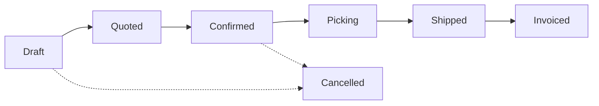
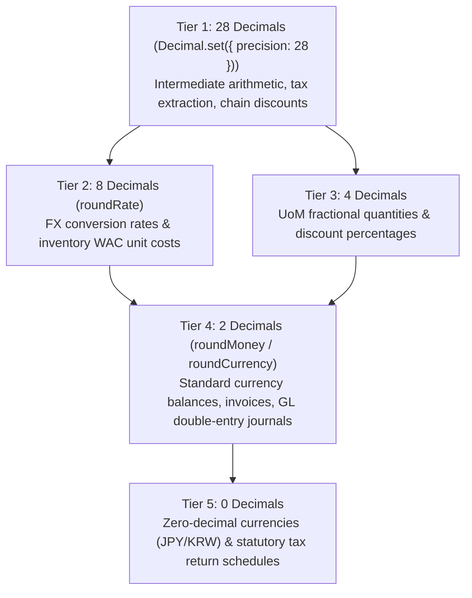

# Transactional Core Engines

HeroBM is driven by four runtime engines that enforce business invariants, data integrity, and real-time event distribution.

---

## 1. Double-Entry General Ledger Engine (`apps/api/src/gl/`)

The General Ledger module provides a native, double-entry financial accounting engine directly inside `herobm_core`:

```
herobm_core schema (PostgreSQL)
  │  Drizzle ORM (typed mutations)
  ▼
GlService.postJournalEntry(lines, meta, tx)
  ├─► Validates Debit/Credit Equality (Debits == Credits, tolerance <= 0.005)
  ├─► Computes SHA-256 Cryptographic Hash Chain (entry_hash -> prev_entry_hash)
  └─► Inserts gl_journal_entries & gl_journal_lines atomically
```

### Core Financial Invariants
1. **Double-Entry Balance Rule**: Every journal entry must contain at least two lines and total debits must equal total credits ($\sum \text{Debits} = \sum \text{Credits}$).
2. **Line Amount Invariants**: Individual lines must specify non-negative amounts (`debit >= 0`, `credit >= 0`), cannot have both debit and credit on the same line, and cannot be zero for both.
3. **Cryptographic Hash Chaining**: Every posted entry generates a SHA-256 digest binding the current transaction data and previous entry hash, forming an auditable ledger chain.
4. **Idempotent COA Seeding**: Ingests ERPNext-compatible Chart of Accounts templates during initialization and via upload.

---

## 2. Double-Entry Inventory Ledger Engine (`apps/api/src/inventory/`)

Stock never appears or disappears arbitrarily—all physical and valuation movements are recorded as double-entry ledger lines.

### Dual-Layer Inventory Architecture
HeroBM employs a strict separation between immutable historical accounting and fast operational querying:
1. **`inventory_ledger` (Immutable Financial Source of Truth)**:
   - Line-item ledger recording physical stock movements along with `unit_cost`, `total_value`, transaction UOM (`uom_id`), and `original_quantity`.
   - Strictly append-only; powers point-in-time inventory valuation, balance sheet audits, and historical COGS.
2. **`products` Valuation Cache (Read-Optimized Projection)**:
   - Maintains materialized `weightedAverageCost` and `standardCost` directly on the item master.
   - Provides instant $O(1)$ margin calculation for sales quotes, orders, and purchasing benchmarks without replaying historical ledger streams.
3. **`bin_contents` (Fast Physical Cache)**:
   - Fast cache tracking real-time `actualQuantity` per bin/product for warehouse operations.
4. **`inventory_levels` (Sparse Aggregated CTE View)**:
   - High-performance Postgres view computing location-level `quantityOnHand`, `quantityCommitted`, and `quantityOnOrder` using sparse aggregated Common Table Expressions (`active_pairs`) without Cartesian join overhead.

### Physical On-Hand vs. Pickable Bins
- **Physical On-Hand (`quantity_on_hand`)**: Encompasses all items physically located inside the facility: `storage`, `pick`, `bulk`, and `staging` (goods on the dock before carrier dispatch).
- **Pickable Whitelist (`isPickableBin`)**: General sales order picking is strictly whitelisted to active locations: `storage`, `pick`, and `bulk` (excluding quarantine, in-transit, bonded, consignment, and staged goods).

### Atomic Mutation Pathway
All writes must flow through `InventoryMovementService.recordInventoryMovement`:

```typescript
await inventoryMovementService.recordInventoryMovement(tx, {
  entryNumber: 'MV-2026-001',
  sourceType: 'SO_PICK',
  sourceId: orderId,
  userId: req.user.username,
  memo: 'Order picking allocation',
  lines: [
    { productId: 'P1', binId: 'bin-shelf-A', quantity: -10, uomCode: 'EA' },
    { productId: 'P1', binId: 'bin-shipping-stage', quantity: 10, uomCode: 'EA' }
  ]
});
```

Within a single transaction, the engine:
1. Inserts the `inventory_entries` header.
2. Inserts balanced `inventory_ledger` lines (with unit cost and UOM snapshots).
3. Emits an `ENTRY_POSTED` event (`entityType: INVENTORY_LEDGER`) to the transactional outbox.
4. Updates the fast read-cache (`bin_contents.actualQuantity`) and validates negative stock constraints.

---

## 3. Document State Machine Engine (`packages/shared/src/state-machines.ts`)

Business documents (Sales Orders, Invoices, Shipments, Purchase Orders) are strictly governed by formal state machines:


```mermaid
flowchart LR
    Draft --> Quoted --> Confirmed --> Picking --> Shipped --> Invoiced
    Draft -.-> Cancelled
    Confirmed -.-> Cancelled
```

### State Machine Principles
1. **Centralized Rule Definitions**: Defined in `@herobm/shared/state-machines` to guarantee UI rendering and API validation logic remain in lockstep.
2. **Deterministic State Codes**: Enforced by enum checks and database check constraints (`draft`, `confirmed`, `picking`, `shipped`, `invoiced`, `cancelled`).
3. **Compensating Actions**: Invoiced or shipped documents cannot be deleted. Adjustments require compensating transactions (credit notes, returns).

---

## 4. Transactional Outbox Relay Engine (`apps/worker/`)

The outbox relay provides reliable, at-least-once event streaming without distributed dual-write inconsistencies:

```
[NestJS API Mutation] ──(atomic DB tx)──► [herobm_core.outbox]
                                                 │
                                                 ▼ (polling worker)
                                          [Outbox Worker]
                                                 │
                     ┌───────────────────────────┴───────────────────────────┐
                     ▼                                                       ▼
           [Webhook Subscribers]                                      [BullMQ Jobs / Logs]
       (HMAC-SHA256 Signed HTTP POST)                              (Async Background Tasks)
```

- **Atomic Emission**: Domain events are written to `herobm_core.outbox` in the exact same database transaction as the business mutation.
- **Worker Polling & Backoff**: `apps/worker` polls pending outbox records and delivers notifications to external webhook subscribers.
- **Exponential Retries**: Failed deliveries retry up to 5 times with exponential backoff and are viewable in the Ops Portal Event Queue (`/admin/event-queue`).

---

## 5. Financial Calculation & Precision Engine (`packages/shared/src/pricing.ts`)

To eliminate IEEE-754 floating-point drift, compounding rounding errors, and sub-penny allocation leaks, HeroBM enforces a strict **5-Tier Precision Architecture** across shared math engines, backend services, and database persistence layers:


```mermaid
flowchart TD
    A["Tier 1: 28 Decimals (Decimal.set({ precision: 28 }))<br/>Intermediate arithmetic, tax extraction, chain discounts"] --> B["Tier 2: 8 Decimals (roundRate)<br/>FX conversion rates & inventory WAC unit costs"]
    A --> C["Tier 3: 4 Decimals<br/>UoM fractional quantities & discount percentages"]
    B --> D["Tier 4: 2 Decimals (roundMoney / roundCurrency)<br/>Standard currency balances, invoices, GL double-entry journals"]
    C --> D
    D --> E["Tier 5: 0 Decimals<br/>Zero-decimal currencies (JPY/KRW) & statutory tax return schedules"]
```

### Core Financial Rules & Invariants
1. **Zero Native Floating-Point Math**: Native JavaScript floating-point arithmetic (`parseFloat`, `Number()`, `+`, `-`, `*`, `/`) is strictly prohibited on monetary fields, unit costs, tax amounts, and exchange rates. All calculations must use `decimal.js` via `toFinancialDecimal()`, `roundMoney()`, and `roundRate()`.
2. **Intermediate Calculation Precision**: Global `Decimal.set({ precision: 28, rounding: Decimal.ROUND_HALF_UP })` executes all multi-step pricing, tax extractions, and compound discounts at 28 digits before rounding.
3. **Lump-Sum Proration (Hare-Niemeyer Algorithm)**: Prorating lump-sum deposits, payments, and discounts across multiple invoice allocations uses `distributeLumpSum(total, weights, decimals)`. The largest-remainder method ensures the sum of allocations matches the total payment with zero unallocated fractional cents.
4. **Automated AST Quality Gate**: Enforced continuously via `infra/tests/financial-math.spec.ts` (`make test-single TEST=infra/tests/financial-math.spec.ts`), which inspects backend TypeScript ASTs to guarantee zero float math violations and empty legacy exception lists.
