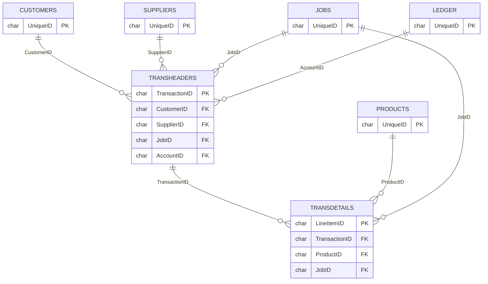

# ABM Database Schema & Modules Overview (`mpgtrial`)

Advanced Business Manager (ABM) is a comprehensive business management suite covering finance, operations, stock control, sales, CRM, and job costing.

> [!CAUTION]
> The Advanced Business Manager SQL Server backend uses **no native Foreign Key Constraints**. Linking is handled via implicit column name mappings in the application tier.

## Core Modules & Entities

### 1. General Ledger & Accounting (`L*`, `B*` tables)
The financial core handles the chart of accounts, banking, taxes, and ledgers.
- **`LEDGER`**: Core general ledger master records. Linked globally using `AccountID` (resolving to `UniqueID` across various ledger sub-tables).
- **`LBALANCES`**: Ongoing financial balance tracking.
- **`BANKRECIMPORT` & `BANKSTATEMENTS`**: Handles imported banking data and statement lines.
- **`BPPAYMENTDETAILS` / `BPBATCHPAYMENTS`**: Accounts payable operations and batches. Links to suppliers (`SupplierID`).

### 2. Trading Partners (`C*`, `S*` tables)
Manages the primary entities the business trades with.
- **`CUSTOMERS`**: Core master records for client businesses. Indexed heavily across the system via `CustomerID`. Contains extensive configuration (97 columns).
- **`SUPPLIERS`**: Core master records for vendors/purchasing. Linked throughout the system via `SupplierID`.
- **`CONTACTS`**: Individual human contacts, related to Companies, Customers, or independent (`ContactID`).
- **`COMPANY`**: The underlying tenant business master data.

### 3. CRM & Pipeline (`CRM*` tables)
A robust embedded Customer Relationship Management suite, tracking pre-sales and engagement.
- **`CRMPLIENIES` / `CRMPLINECONTACTS`**: Sales opportunity and pipeline tracking.
- **`CRMCAMPAIGNS` / `CRMCAMPTARGETS`**: Marketing and promotional campaign orchestration.
- **`CRMACTIVITIES` / `CRMNOTES` / `CRMDOCUMENTS`**: Interaction logs, tasks, and document attachments for entities throughout the system.

### 4. Inventory & Stock Control (`P*`, `STOCKTAKE*` tables)
Manages physical products, warehousing, kits, and stock valuation.
- **`PRODUCTS`**: The master item catalog (125 columns). Referenced globally as `ProductID`.
- **`PLOCATIONS` / `PBINS` / `PBINCONTENTS`**: Multi-location warehousing, down to bin-level tracking. Links items via `ProductID` to locations.
- **`PSERIALNUMBER` / `PSERIALTRACKING`**: Tracks serialized inventory through its lifecycle.
- **`STOCKTAKES` / `STOCKTAKEITEMS`**: Models the physical inventory auditing process.

### 5. Sales & Purchasing Operations (`Z*`, `TRANS*` tables)
This is where the transactional volume lives. Note the uniform structure separating headers, details, and workflow states.
- **Transaction Core**: `TRANSHEADERS` (Master) -> `TRANSDETAILS` (Lines). These tables link everything (`CustomerID`, `ProductID`, `JobID`, `AccountID`, `TransactionID`).
- **Workflow State Tables (`ZSales_*`, `ZPurchase_*`)**: Instead of giant status flags, transactions move between stage-specific tables:
  - **Sales**: `ZSALES_QUOTES` → `ZSALES_ORDERS` → `ZSALES_DELIVERIES` → `ZSALES_INVOICES`
  - **Purchasing**: `ZPURCHASE_REQUISITIONS` → `ZPURCHASE_ORDERS` → `ZPURCHASE_DELIVERIES` → `ZPURCHASE_INVOICES`

### 6. Job Costing & Project Management (`J*` tables)
Tracks project delivery, profitability, and time management.
- **`JOBS`**: Master project/job records (`JobID`). Linked to `CompanyID`, `BranchID`, `CustomerID`.
- **`JSTAGES` / `JCOSTCENTRES`**: Breaks jobs down into deliverable phases and cost tracking codes.
- **`JCONTRACTORS` / `JSTAFF`**: Resources allocated to complete job works.
- **`JCLAIMS` / `ZJOB_CLAIMS`**: Progressive invoicing/claims made against active jobs.

### 7. Core System Extension (Xtracta)
- **`Xtracta*`**: Tracks an integrated OCR / Automated data capture engine covering inbound vendor invoices and document workflows (`XtractaDocuments`, `XtractaWorkflow`).

---

## Universal / System References
These identifiers are ubiquitous config flags spanning almost all data tables.
- **`CompanyID`**: Defines the tenant or active company file. Found in `COMPANY`, `CSTORES`, `CUSTOMERS`, `JOBS`, `LEDGER`, `PRODUCTS`, `SUPPLIERS`.
- **`BranchID`**: Multi-location topology. Found in `BRANCHES`, `BRANCHINFO`, `BRANCHSTAFF`, `CUSTOMERS`, `JOBS`, `LEDGER`, `SUPPLIERS`.
- **`CostCentreNo`**: Allocation cost buckets. Found in `JCOSTCENTRES`, `JCLAIMLINES`, `JCONTRACTORS`, `PRODUCTS`, `TRANSDETAILS`.

## Detailed Master Entity Linkages

This outlines how master entities map to transactional/child tables across the system via their pseudo-primary keys.

### 1. Customers (`CUSTOMERS`)
The master CRM and Debtor Entity table.
- **Primary Identifier**: `UniqueID` (in `CUSTOMERS` table).
- **Referenced Throughout System As**: `CustomerID`

**Linked Tables (Has-Many/Belongs-To):**
- **Transactions**: `CSALES`, `CRECURRING`, `gAgedCustomerTrans`, `gPriceList`, `PRICEDETAILS`
- **Jobs**: `JOBS`, `JRETENTIONS`
- **CRM**: `CRMACTRELATEDTO`, `CRMNOTES`, `CRMPIPELINES`, `CRMTAGJOINS`
- **Stock**: `PBINS`, `PRESERVATIONS`
- **Shipping**: `CDELADDRESSES`

### 2. Suppliers (`SUPPLIERS`)
The master Creditor/Vendor Entity table.
- **Primary Identifier**: `UniqueID` (in `SUPPLIERS` table).
- **Referenced Throughout System As**: `SupplierID`

**Linked Tables:**
- **Creditor Trans**: `gAgedSupplierTrans`, `BPBATCHPAYMENTS`, `SPURCHASES`
- **Transactions**: `ZJOB_CLAIMS`, `SCONTRACTS`
- **Purchasing/Stock**: `PRESERVATIONS`, `PRODUCTS`, `PSUPPLIERS`, `SSUPPLIERDETAILS`
- **Costing/Resources**: `JCONTRACTORS`, `JESTIMATEQUOTES`

### 3. Products/Stock (`PRODUCTS`)
The master Catalog and Inventory entity.
- **Primary Identifier**: `UniqueID` (in `PRODUCTS` table).
- **Referenced Throughout System As**: `ProductID`
- **GST/Tax**: `tax_category` (e.g. `9% GST`, `Zero Rated Products`) and `tax_no` (integer: 1=GST, 2=other, 3=zero-rated). Surfaced as `gst_category` in `mart_products`.

**Linked Tables:**
- **Inventory/Locations**: `PAVAILABILITY`, `PBINCONTENTS`, `PLOCDETAILS`, `STOCKTAKEITEMS`, `TRANSFERITEMS`
- **Pricing & Config**: `gPriceList`, `PRICEDETAILS`, `PSUBMATRIX`, `PSUPPLIERS`
- **Stock Movements**: `PFIFODELIVERIES`, `PRESERVATIONS`, `gProductAsAtDate`, `gProductAverages`
- **Tracking**: `PSERIALNUMBER`, `PSERIALTRACKING`
- **Sales/History**: `PSALES`

### 4. Jobs / Projects (`JOBS`)
Project and costing masters.
- **Primary Identifier**: `UniqueID` (in `JOBS` table).
- **Referenced Throughout System As**: `JobID`

**Linked Tables:**
- **Costing/Stages**: `JSTAGES`, `JRETENTIONS`
- **Resources**: `JCONTRACTORS`
- **Job Financials**: `JCLAIMS`, `ZJOB_CLAIMS`

### 5. Ledger / Accounts (`LEDGER`)
The Chart of Accounts and General Ledger structure.
- **Primary Identifier**: `UniqueID` (in `LEDGER` table).
- **Referenced Throughout System As**: `AccountID`

**Linked Tables:**
- **Balances & History**: `LBALANCES`, `gOpeningBalance`
- **Postings/Journals**: `LAUTOJITEMS`, `LEDGERLINKS`, `TRANSHEADERS`, `TRANSOFFSETS`
- **Other Entities**: `CONTACTS`, `CRECURRING`

### 6. Document Transactions (`TRANSHEADERS` & `Z*` Tables)
Sales, Purchasing, and Journals utilize a two-tier mechanism. Header-level details govern state, line items hold deliverables.

**Transaction Master**
- **Table**: `TRANSHEADERS`
- **Primary Identifier**: `TransactionID`
- **Linked Tables**: `TRANSDETAILS`, `TRANSCURADJ`, `BPPAYMENTDETAILS`, `DSQUEUEITEMS`, `JESTIMATEQUOTES`, `PURCHASEREQUISITIONS`

**Transaction Lines**
- **Table**: `TRANSDETAILS`
- **Primary Identifier**: `LineItemID`
- **Linked Tables**: `JOBOFFSETS`, `PBINTRACKING`, `PSERIALTRACKING`
- **Workflow / Entity Tables mapping LineItemID**:
  - `ZJOB_CLAIMS`, `ZJOB_ESTIMATES`
  - `ZPURCHASE_CREDITS`, `ZPURCHASE_DELIVERIES`, `ZPURCHASE_INVOICES`, `ZPURCHASE_ORDERS`, `ZPURCHASE_REQUISITIONS`, `ZPURCHASE_RETURNS`
  - `ZSALES_CREDITS`, `ZSALES_DELIVERIES`, `ZSALES_INVOICES`, `ZSALES_ORDERS`, `ZSALES_QUOTES`, `ZSALES_RETURNS`

*Note: For complete table column layout, utilize the `get_links.sql` and `get_pks.sql` scripts located in the project tools directory, or review the full `.csv` extracts mapping exact column footprints.*
