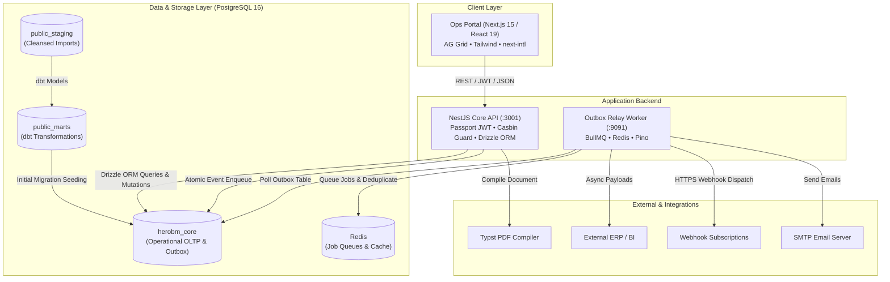
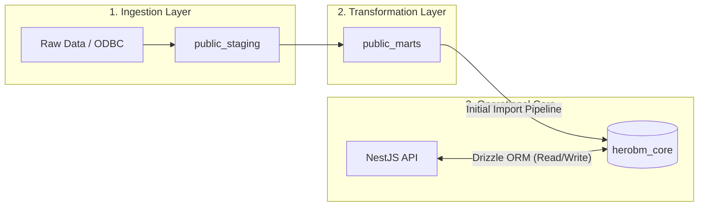
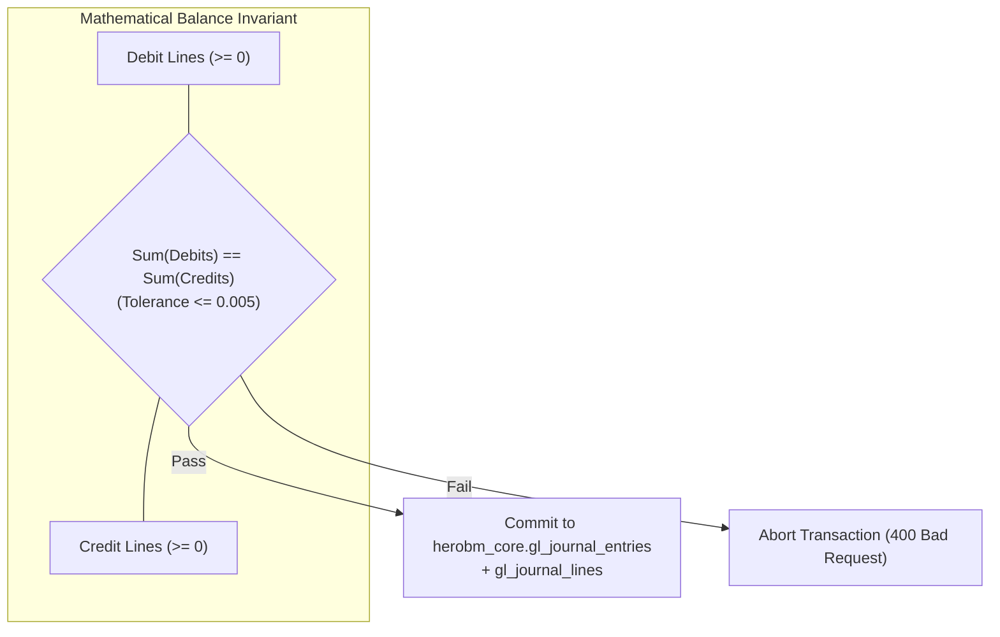
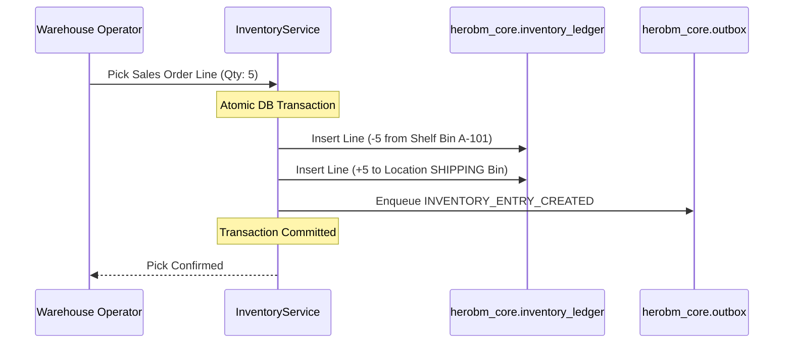
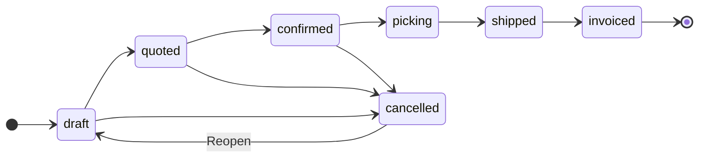
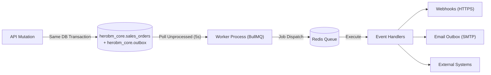
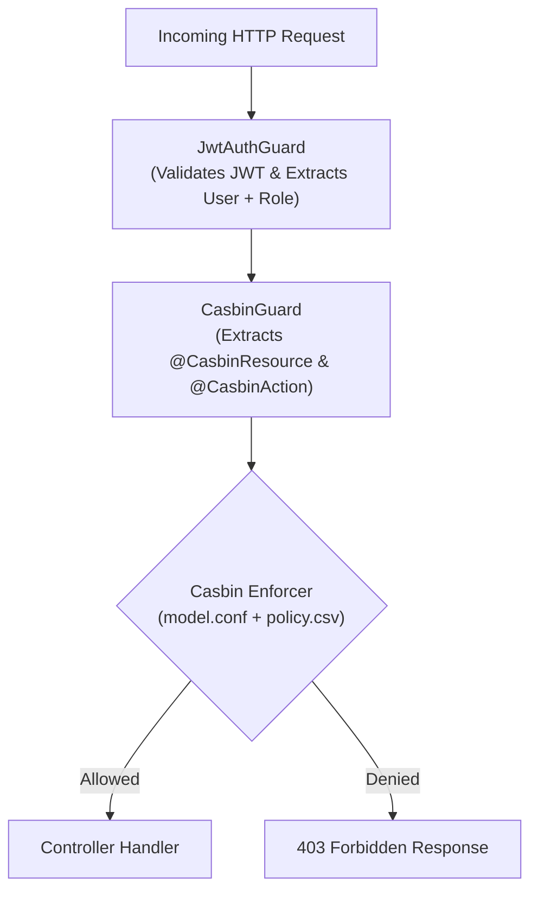
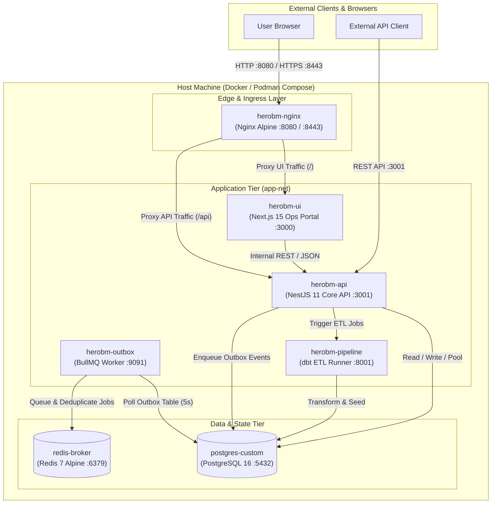

# System Architecture

HeroBM is a composable, modular Business Management and ERP platform engineered for reliability, transparency, and operational velocity. It unifies sales order fulfillment, perpetual warehouse inventory, procurement, manufacturing, CRM, and double-entry general ledger accounting into a single real-time transactional system.

This page provides Software Engineers, IT Professionals, and System Administrators with a comprehensive technical blueprint of the platform's architecture, key components, data flow, security model, and implementation patterns.

---

## 1. High-Level System Topology

The architecture follows a modular monolith approach for synchronous operations paired with an asynchronous background worker for event distribution and external integrations.

---

## 2. Monorepo Organization & Key Components

HeroBM is structured as a TypeScript monorepo using npm workspaces and Turborepo:

### Applications (`apps/`)

| Application | Technology Stack | Responsibility |
| :--- | :--- | :--- |
| **`apps/ops-portal`** | Next.js 15 (App Router), React 19, AG Grid Community, TailwindCSS, `next-intl` | High-density administrative and operational web UI. Employs a dense "Machine Shop" interface aesthetic, client-side data fetching (`apiFetch`/`apiMutate`), persisted table state (`localStorage`/`sessionStorage`), and contextual help drawers. |
| **`apps/api`** | NestJS 11, TypeScript, Drizzle ORM, Passport JWT, Casbin RBAC | Core transactional REST API listening on port `3001`. Enforces business logic, authentication, fine-grained authorization, database transactions, and document compilation. |
| **`apps/worker`** | Node.js, BullMQ, Redis, Pino Logger | Standalone background processor listening on port `9091`. Executes transactional outbox polling, external ERP syncing, webhook event dispatching, and asynchronous email delivery. |
| **`apps/mcp-server`** | Model Context Protocol (MCP) SDK | Dedicated MCP server exposing database schemas, API discovery, and documentation to AI agents and development assistants. |

### Shared Packages (`packages/`)

| Package | Responsibility |
| :--- | :--- |
| **`@herobm/db-schema`** | Canonical Drizzle ORM schema definitions (`herobm-core-schema.ts`), PostgreSQL migration files, and database relationship models. |
| **`@herobm/shared`** | Zero-dependency shared domain logic: state machine transition graphs, UI lifecycle ordinals, stock availability formulas (`calculateAvailableQuantity`), tax algorithms, and line price calculations. |
| **`@herobm/sdk`** | Strongly typed API client library, custom fetch wrappers (`customFetch`), and shared response interfaces for portal and external consumers. |

---

## 3. Database Architecture: The Tri-Schema Model

HeroBM uses PostgreSQL 16 with a clean **Tri-Schema** architecture. This separation ensures operational OLTP workflows remain strictly isolated from legacy data extraction and analytical transformations.

### 1. `public_staging` (Ingestion & Cleansing)
- **Owner:** dbt (`pipelines/abm_transform/models/staging/`)
- **Role:** Cleanses, casts, and normalizes raw legacy database extracts (e.g. ABM, ODBC, CSV).
- **Rule:** Contains no operational business logic; converts legacy names to `snake_case` and strings to strongly typed numeric and date fields.

### 2. `public_marts` (Transformation & Analytics)
- **Owner:** dbt (`pipelines/abm_transform/models/marts/`)
- **Role:** Denormalized, flattened reporting tables and dimensional models.
- **Rule:** The operational API **never** reads from or writes to `public_marts`. It is utilized strictly by data analysis pipelines and the initial migration seeding script.

### 3. `herobm_core` (Transactional Application Core)
- **Owner:** Drizzle ORM (`packages/db-schema` / `apps/api/src/drizzle/`)
- **Role:** The authoritative transactional source of truth for all operational data.
- **Characteristics:**
  - Highly normalized third normal form (3NF) relational design.
  - Every table uses `gen_random_uuid()` UUIDs as primary keys.
  - Enforces strict foreign keys (`ON DELETE RESTRICT`) and `CHECK` constraints (e.g., verifying status enums against state machine definitions).
  - Contains immutable subledger tables and the `outbox` table.
  - The NestJS API exclusively reads and writes to this schema.

---

## 4. Core Subsystem Implementations

### A. Double-Entry General Ledger (GL) Engine

HeroBM contains a native, ACID-compliant double-entry accounting engine (`apps/api/src/gl/`):

- **Mathematical Balance Invariant:** Every journal entry must have at least 2 lines and satisfy **Total Debits = Total Credits** within a strict `0.005` tolerance.
- **Leaf-Node Posting Only:** Transactions can only post to leaf accounts (`is_group = false`). Posting to parent summary accounts is blocked.
- **Atomic Subledger Integration:** When subledgers post financial events (such as Sales Invoices, Goods Received, or Payments), they pass their active database transaction (`tx`) to `GlService.postJournalEntry(lines, meta, tx)`. If the GL entry fails, the entire business operation rolls back atomically.
- **Immutable Ledger & Reversals:** Financial postings are immutable. Corrections are performed exclusively by posting linked reversal entries, maintaining complete audit continuity.
- **Fiscal Period Controls:** Postings automatically validate that the transaction date falls within an `Open` fiscal period, preventing retroactive tampering with locked financial periods.

---

### B. Double-Entry Perpetual Inventory Engine

The inventory engine (`apps/api/src/inventory/`) models stock with the physical principle of conservation: stock never spontaneously appears or disappears—it moves between warehouse bins and external entities.

- **Ledger Invariant:** Every movement creates an `inventory_entries` header and matching `inventory_ledger` lines recording changes against exact bin IDs and location numbers.
- **Valuation Cache (`quantityOnHand`):** While real-time stock balances are aggregated from the immutable ledger via database views (`inventory_levels`, `bin_contents`), `products.quantityOnHand` serves as a dedicated valuation cache updated during goods receipt to compute the Weighted Average Cost (WAC):
  `New WAC = ((Old Qty × Old WAC) + (Receipt Qty × Unit Cost)) / (Old Qty + Receipt Qty)`
- **Available Stock Formula:** Stock availability is computed uniformly across frontend and backend using the canonical shared formula:
  `Available = On Hand - Committed - Reserved`

---

### C. Deterministic State Machines

Business documents (Sales Orders, Purchase Orders, Shipments, Returns, and Invoices) progress through formal, deterministic state machines defined centrally in `@herobm/shared/state-machines`:

- **Dedicated State Routes:** State changes are executed strictly via `PATCH /api/{resource}/{id}/state` rather than arbitrary column patching.
- **Row Locking & Validation:** The API acquires a database row lock, verifies that the transition is permitted in the transition matrix (`TRANSITION_MAP[currentState]`), and applies the mutation.
- **UI Lifecycle Ordinals:** Transition actions in the Ops Portal are automatically styled using lifecycle ordinals (`LIFECYCLE_ORDINALS`): forward transitions render as primary buttons, backward reversions as warning buttons, and cancellations as danger buttons.

---

### D. Transactional Outbox & Event-Driven Relay

To prevent dual-write anomalies when notifying external systems, Webhooks, or email servers, HeroBM utilizes the **Transactional Outbox Pattern**:

1. **Atomic Write:** The NestJS API writes domain records and inserts an outbox event into `herobm_core.outbox` within the **exact same database transaction**.
2. **Asynchronous Polling:** The standalone worker polls for unprocessed outbox records every 5 seconds.
3. **BullMQ & Redis:** Events are enqueued into BullMQ with job-ID deduplication, exponential retry backoff, and IPv4 TCP keep-alives.
4. **Guaranteed Delivery:** Handlers map events to external payloads, dispatch HTTPS webhooks, and process SMTP email queues without blocking user requests.

---

### E. Authorization & Security Architecture (Casbin RBAC)

Authentication and Authorization operate as a centralized Data Access Service (DAS):

- **Authentication (AuthN):** Stateless JSON Web Tokens (JWT) signed with HMAC-SHA256, issued via `/api/auth/login`. Passwords and API keys are hashed using `bcrypt`.
- **Authorization (AuthZ):** The `CasbinGuard` inspects route metadata (`@CasbinResource`, `@CasbinAction`) and queries the in-memory Casbin Enforcer against `policy.csv`.
- **Role Hierarchy:** All authenticated users inherit the base `viewer` role (granting system-wide read access for operational transparency). Specific write roles (`sales`, `warehouse`, `procurement`, `finance`, `admin`) are granted explicit mutation permissions.
- **Default Deny:** Endpoints without an explicit Casbin policy rule automatically default to deny.

---

### F. High-Performance Document Compilation (Typst)

HeroBM replaces sluggish headless-browser PDF generators with **Typst**, an ultra-fast native markup-based typesetting engine:
- Programmable document layouts for Invoices, Purchase Orders, Picking Slips, Shipping Labels, and Financial Statements located in `tools/seeds/reports/`.
- Embedded barcode rendering (Code 128) and vector typography.
- Sub-100ms compilation times enabling instant in-app previews and binary streaming (`apiFetchBlob`).

---

## 5. Deployment, Observability & IT Operations

Designed specifically for predictable, low-maintenance deployment in on-premises or cloud environments using standard container orchestration:

### Container Infrastructure Topology

### Production Container Services & Workloads

The platform runs as a coordinated set of containerized services defined in `docker-compose.yml`:

| Container Name | Base Image / Dockerfile | Exposed Ports | Network | Application & Responsibility |
| :--- | :--- | :--- | :--- | :--- |
| **`herobm-nginx`** | `nginx:alpine` | `8080:80`, `8443:443` | `app-net` | **Reverse Proxy & Ingress**: Routes web traffic to `herobm-ui` (`/`) and API requests to `herobm-api` (`/api`), terminates SSL/TLS certificates, and enforces connection rate-limiting. |
| **`herobm-ui`** | `Dockerfile.portal` | `8000:3000` | `app-net` | **Ops Portal Web Application**: Next.js 15 (App Router), React 19 administrative portal with high-density AG Grid tables, client-side data fetching, and contextual help drawers. |
| **`herobm-api`** | `Dockerfile.api` | `3001:3001` | `app-net`, `monitoring-net` | **Core Transactional REST API**: NestJS 11 backend managing business logic, Passport JWT authentication, Casbin RBAC authorization, Drizzle ORM transactions, Typst PDF compilation, and transactional outbox event creation. |
| **`herobm-outbox`** | `Dockerfile.worker` | `9092:9091` | `app-net`, `monitoring-net` | **Asynchronous Background Worker**: Node.js background processor running BullMQ job queues, polling `herobm_core.outbox` every 5 seconds, dispatching HTTPS webhooks, syncing external ERP integrations, and processing SMTP email queues. |
| **`herobm-pipeline`** | `Dockerfile.pipeline` | `8001:8001` | `app-net` | **ETL & Data Pipeline Runner**: Isolated dbt + Python 3 service executing data extraction, cleansing into `public_staging`, analytical transformations into `public_marts`, and legacy migration import scripts. |
| **`postgres-custom`** | `postgres:16-alpine` | `5432:5432` | `app-net` | **Relational Database Engine**: PostgreSQL 16 server tuned with custom memory and WAL parameters (`shared_buffers=512MB`, `work_mem=32MB`, `max_wal_size=4GB`), hosting the Tri-Schema architecture (`public_staging`, `public_marts`, `herobm_core`). |
| **`redis-broker`** | `redis:7-alpine` | `6379:6379` | `app-net` | **In-Memory Cache & Message Broker**: Redis 7 service providing job queue persistence, deduplication, retry backoff state for BullMQ, and transient cache. |
| **`maildev`** *(Dev Profile)* | `maildev/maildev` | `1080:1080`, `1025:1025` | `app-net` | **Local SMTP & Webmail Inspector**: Development-only mock SMTP server and web interface (`http://localhost:1080`) for testing and previewing outgoing transactional emails without external relays. |

### Container Networking & Storage Volumes

- **`app-net`**: High-speed internal bridge network connecting application services (`herobm-ui`, `herobm-api`, `herobm-outbox`, `herobm-pipeline`) with data stores (`postgres-custom`, `redis-broker`).
- **`monitoring-net`**: Isolated network for metrics collection, health inspections, and log aggregation.
- **Persistent Volumes**:
  - `postgres_data`: Persistent storage for PostgreSQL data clusters (`/var/lib/postgresql/data`).
  - `redis_data`: Append-only file persistence for Redis queues (`/data`).
  - `./logs`: Shared host directory mounted to `/app/logs` across containers for structured audit and operational logs.
  - `./data/storage`: Document attachment and compiled report cache volume.

### Observability, Telemetry & Logging

HeroBM implements a multi-layered observability strategy designed for zero-overhead operation with instant pluggability into standard monitoring stacks (Prometheus, Grafana, OpenTelemetry Collector):

1. **OpenTelemetry Instrumentation (OTel)**:
   - Built-in `@opentelemetry/api` metrics and tracing sockets exported centrally via `@herobm/shared` (`getMeter()`, `getTracer()`).
   - **API Metrics**: `MetricsInterceptor` automatically records HTTP request counts (`http_requests_total`) and latency distribution histograms (`http_request_duration_seconds`) tagged by HTTP method, route pattern, and status code.
   - **Worker Metrics**: Tracks outbox polling cycles, relay latency, and BullMQ job processing rates (`herobm-worker`).
   - **Zero Overhead**: Operates as zero-overhead No-Op instruments by default; seamlessly exports metrics and spans when an external OpenTelemetry collector or exporter is configured.

2. **Client-Side Error Telemetry**:
   - The Next.js Ops Portal automatically captures unhandled exceptions, component crash stacks, and rejected promises, forwarding them asynchronously to `POST /api/telemetry/client-errors`.
   - The endpoint operates unauthenticated (`@Public()`, `@SkipCasbin()`) under strict rate-limiting (`TELEMETRY` tier) so diagnostic events are reliably collected even during session expiration or authentication outages.

3. **Structured Logging & Live In-Portal Diagnostics**:
   - **Dual Structured Logging**: Applications emit structured JSON to `stdout` (captured with Docker's `json-file` driver bounded to `20MB` max per file) and persist formatted operational logs to a mounted volume (`/app/logs/api.log`, `worker.log`, `postgres.log`).
   - **In-Portal Log Viewer**: System administrators can inspect live server logs securely at **Technical** → **System Logs** (`/admin/system-logs`) without requiring direct SSH access to the host.

### Database Migrations & The Drizzle Gate
Database schema evolution is strictly automated:
- Schema definitions in TypeScript (`packages/db-schema`) compile to idempotent DDL migrations.
- Direct ad-hoc database mutations are forbidden; all migrations are generated using `make dev-db-generate` and applied via `make migrate`.

### Tiered Quality Verification Hierarchy

Developers and CI/CD pipelines enforce code health through a strict tiered hierarchy:

| Tier | Make Target | Execution Time | Scope |
| :--- | :--- | :--- | :--- |
| **Tier 0** | `make check-types`, `make check-lint`, `make test-single` | < 5s | Active inner-loop feedback during development. |
| **Tier 1** | `make verify-fast` | < 25s | Fast pre-commit gate: static types, lints, in-memory PGlite unit tests, and schema drift checks. |
| **Tier 2** | `make verify-api`, `make verify-portal`, `make verify-pipeline` | 30–60s | Subsystem validation including PostgreSQL integration tests and Next.js production builds. |
| **Tier 3** | `make pre-push`, `make verify-all` | 2–3 min | Full repository verification and container image build validation. |
| **Tier 4** | `make test-heavy` | 5–10 min | Full isolated stack boot with end-to-end browser regression and fuzzing suites. |
