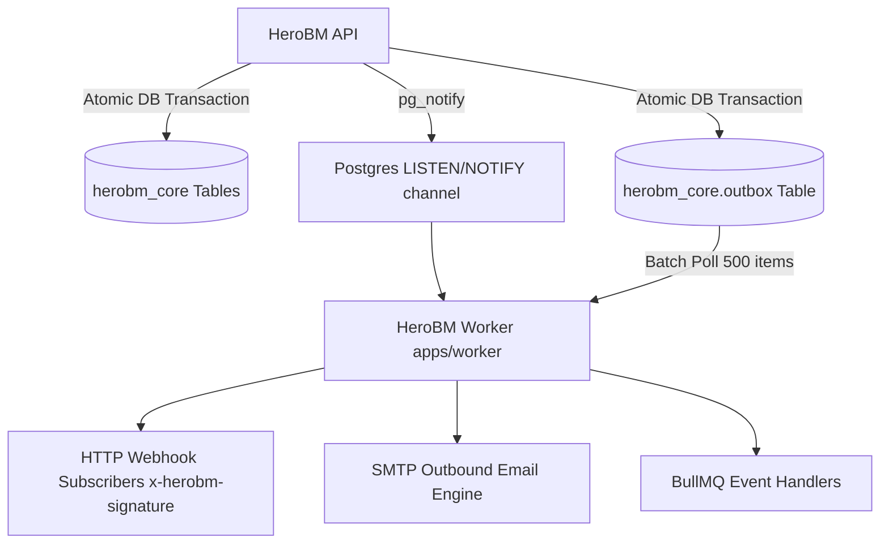

# Outbox Relay & Webhook Delivery Guide

The outbox relay (`apps/worker/`) is a high-throughput background worker process that streams domain events and webhook notifications from HeroBM to external systems and webhook subscribers. It implements the [Transactional Outbox pattern](https://microservices.io/patterns/data/transactional-outbox.html): the API writes domain events atomically to `herobm_core.outbox` inside the same database transaction as business mutations, and the worker asynchronously relays them to HTTP webhook subscribers and BullMQ queues.

---

## Architecture

---

## Core Relay Mechanics

1. **Transactional Outbox Event Emission**:
   * Every business mutation calls `emitEvent(tx, { entityType, entityId, action, payload, entityDisplayName })`.
   * This atomically inserts a row into `herobm_core.outbox` and triggers a PostgreSQL `NOTIFY herobm_outbox_events`.
2. **Instant Event-Driven Wakeup (`LISTEN/NOTIFY`)**:
   * The worker process maintains an active PostgreSQL listener connection.
   * Upon receiving a notification, it immediately executes `pollAndProcess()` without waiting for poll intervals.
3. **High-Volume Batch Fallback**:
   * If notifications are missed during connection restarts, a 5-second interval timer polls `herobm_core.outbox` in batches of 500 rows (`SELECT ... WHERE processed_at IS NULL ORDER BY created_at LIMIT 500`).
4. **HMAC-SHA256 Webhook Delivery**:
   * Webhook payloads are signed using the endpoint's secret key and dispatched with header `x-herobm-signature`.
   * Delivery failures are retried automatically with exponential backoff (up to 5 attempts).
5. **Observability**:
   * Exposes Prometheus metrics on port `9091` (`/metrics`) and structured JSON logs via Pino.

---

## Outbox Table Schema

The outbox table lives in the `herobm_core` schema:

| Column | Type | Description |
| :--- | :--- | :--- |
| `outbox_id` | `uuid` (PK) | Auto-generated event identifier (`gen_random_uuid()`). |
| `entity_type` | `text` | Domain entity classification (e.g. `sales_order`, `payment_entry`, `inventory_ledger`). |
| `entity_id` | `uuid` | Primary key ID of the affected domain object. |
| `event_type` | `text` | Canonical event identifier in `entity.action` format (e.g. `sales_order.created`, `payment.allocated`). |
| `payload` | `jsonb` | Structured domain event payload. |
| `entity_display_name` | `text` | Human-readable identifier (e.g. `SO-2026-00124`). |
| `created_at` | `timestamptz` | Row insertion timestamp. |
| `processed_at` | `timestamptz` | Set by worker upon successful relay dispatch (`NULL` = pending). |

---

## Supported Domain Events Matrix (181 Event Types)

HeroBM supports **181 outbox event types** across all 50 domain entity classifications (defined in `packages/shared/src/event-types.ts` and cataloged in [`docs/developers/webhooks.md`](../developers/webhooks.md)).
