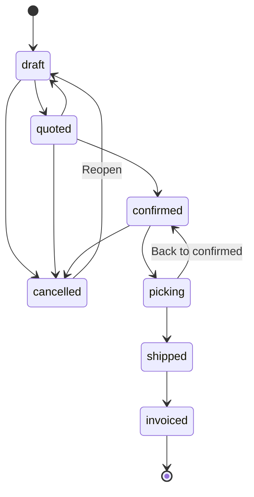
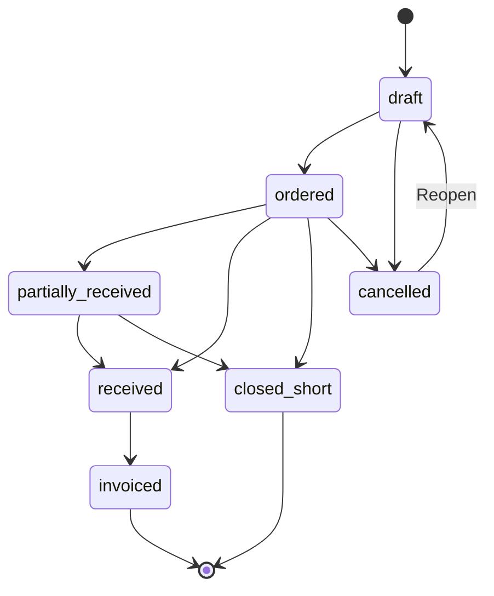
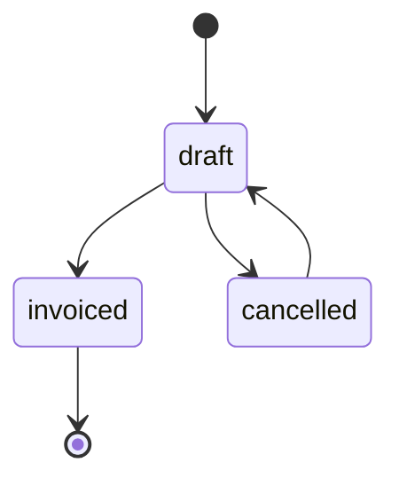

# State Machines & Business Lifecycles

This document outlines the core business lifecycles and state machine transitions used throughout the Composable ERP. 
The system enforces strict state transitions to prevent invalid business operations (e.g., cancelling an order that has already been shipped).

All state definitions and transition rules are centrally managed in `@herobm/shared/state-machines` (`packages/shared/src/state-machines.ts`), ensuring the API validation and UI rendering logic are always perfectly synchronized.

---

## 1. The State Machine Architecture

Instead of arbitrary `PATCH` payloads modifying a `status` text field, the API utilizes dedicated `PATCH /{resource}/{id}/state` endpoints. 

### The Transition Validation Flow:
1. **Frontend Request:** The UI determines available transitions by checking the current state against the shared transition map. It renders "forward" (primary) and "backward" (secondary) buttons using lifecycle ordinals.
2. **API Gatekeeper:** The NestJS controller receives `PATCH /{id}/state` with a target state.
3. **Database Lock & Check:** The service locks the entity row, reads the current state, and strictly validates if `targetState` exists in `TRANSITION_MAP[currentState]`. If invalid, it rejects with `400 Bad Request`.
4. **Side Effects:** If valid, the service updates the state and potentially triggers side effects (Outbox events, Ledger entries, child record creation).

---

## 2. Sales Order Lifecycle

Sales Orders manage the outbound flow of goods to customers, progressing from quotes through to final invoicing.

### Key Transitions & Side Effects
* **`draft` → `quoted`**: Marks the document as a formal quote.
* **`quoted` → `confirmed`**: Allocates required inventory (soft allocation) and prepares the order for the warehouse.
* **`confirmed` → `picking`**: Warehouse staff begin fulfilling the order. Generates picking slip.
* **`picking` → `shipped`**: **Critical Event**. 
  * Decrements physical `inventory_levels`.
  * Generates a `goods_dispatched` event in the Outbox Relay (triggers COGS sync in external systems).
  * Creates a formal `shipment` record.
* **`shipped` → `invoiced`**: **Critical Event**.
  * Generates a `sales_invoiced` event in the Outbox Relay (triggers AR sync in external systems).

---

## 3. Purchase Order Lifecycle

Purchase Orders govern the inbound supply chain, ordering stock from suppliers and reconciling receipts.

### Key Transitions & Side Effects
* **`ordered` → `received` (or `partially_received`)**: **Critical Event**.
  * Triggered by the creation of a Goods Received (GR) record.
  * Increments physical `inventory_levels` and writes to the `inventory_ledger`.
  * Generates a `goods_received` event in the Outbox Relay (triggers Asset/GRNI sync in external systems).
* **`*` → `closed_short`**: Manually terminates a partially fulfilled or unfulfilled PO when the supplier cannot deliver the remaining balance. This releases any pending backorder allocations and cleanly closes the PO without requiring a full receipt.
* **`received` → `invoiced`**: Occurs via the 3-way matching process when a Supplier Invoice is reconciled against the PO lines.

---

## 4. Invoice Lifecycles (Sales & Purchase)

Invoices are financial documents mapped directly to the native GL or external systems.

### Key Transitions & Side Effects
* **`draft` → `invoiced`**: Finalizes the document. For Purchase Invoices, this triggers the `purchase_invoiced` Outbox event to clear the GRNI liability and establish AP in the GL/External System.

---

## 5. UI Lifecycle Ordinals

The shared package also exports `LIFECYCLE` ordinals (e.g., `SALES_ORDER_LIFECYCLE`). 

These numeric values determine the visual rendering of transition buttons in the `ops-portal`:
* **Forward Transitions (Target Ordinal > Current Ordinal):** Rendered as prominent Primary buttons (e.g., `Confirm Order`, `Ship Goods`).
* **Backward Transitions (Target Ordinal < Current Ordinal):** Rendered as secondary/warning buttons with backward-pointing arrows (e.g., `← Revert to Draft`).
* **Cancellations (Target = `cancelled`):** Always treated as a destructive action, styled in red (`--danger`), regardless of ordinal logic.
