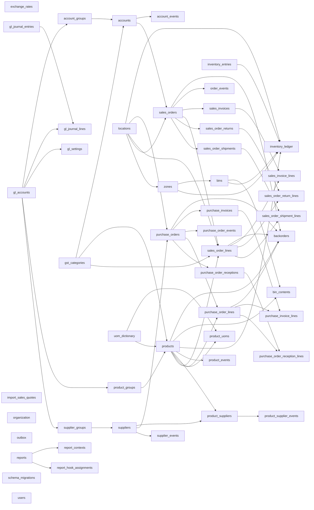

# Schema Reference — `modbm_core`

> Auto-generated from live Postgres introspection. Last generated: 2026-04-01 12:14 UTC
> Regenerate with: `make schema-ref`

**Postgres schema:** `modbm_core`

All tables are managed by Drizzle ORM with UUID primary keys and enforced FK constraints.

## Tables

| Table | Rows | PK | Description |
|-------|------|----|-------------|
| [`account_events`](#account_events) | 17 | `event_id` | |
| [`account_groups`](#account_groups) | 6 | `account_group_id` | |
| [`accounts`](#accounts) | 17 | `account_id` | |
| [`backorders`](#backorders) | 0 | `backorder_id` | |
| [`bin_contents`](#bin_contents) | 5,052 | `bin_content_id` | |
| [`bins`](#bins) | 4,732 | `bin_id` | |
| [`exchange_rates`](#exchange_rates) | 0 | `exchange_rate_id` | |
| [`gl_accounts`](#gl_accounts) | 0 | `gl_account_id` | |
| [`gl_journal_entries`](#gl_journal_entries) | 0 | `journal_entry_id` | |
| [`gl_journal_lines`](#gl_journal_lines) | 0 | `journal_line_id` | |
| [`gl_settings`](#gl_settings) | 0 | `settings_id` | |
| [`gst_categories`](#gst_categories) | 0 | `gst_category_id` | |
| [`import_sales_quotes`](#import_sales_quotes) | 251 | — | |
| [`inventory_entries`](#inventory_entries) | 4,945 | `entry_id` | |
| [`inventory_ledger`](#inventory_ledger) | 4,945 | `ledger_id` | |
| [`locations`](#locations) | 2 | `location_id` | |
| [`order_events`](#order_events) | 1,421 | `event_id` | |
| [`organization`](#organization) | 0 | `organization_id` | |
| [`outbox`](#outbox) | 0 | `outbox_id` | |
| [`product_events`](#product_events) | 14,896 | `event_id` | |
| [`product_groups`](#product_groups) | 29 | `product_group_id` | |
| [`product_supplier_events`](#product_supplier_events) | 0 | `event_id` | |
| [`product_suppliers`](#product_suppliers) | 9,294 | `product_supplier_id` | |
| [`product_uoms`](#product_uoms) | 15,511 | `product_uom_id` | |
| [`products`](#products) | 14,897 | `product_id` | |
| [`purchase_invoice_lines`](#purchase_invoice_lines) | 77,283 | `invoice_line_id` | |
| [`purchase_invoices`](#purchase_invoices) | 592 | `invoice_id` | |
| [`purchase_order_events`](#purchase_order_events) | 0 | `event_id` | |
| [`purchase_order_lines`](#purchase_order_lines) | 6,415 | `purchase_order_line_id` | |
| [`purchase_order_reception_lines`](#purchase_order_reception_lines) | 0 | `reception_line_id` | |
| [`purchase_order_receptions`](#purchase_order_receptions) | 0 | `reception_id` | |
| [`purchase_orders`](#purchase_orders) | 656 | `purchase_order_id` | |
| [`report_contexts`](#report_contexts) | 0 | `context`, `report_id` | |
| [`report_hook_assignments`](#report_hook_assignments) | 0 | `hook_slug` | |
| [`reports`](#reports) | 0 | `id` | |
| [`sales_invoice_lines`](#sales_invoice_lines) | 21,366 | `invoice_line_id` | |
| [`sales_invoices`](#sales_invoices) | 2,428 | `invoice_id` | |
| [`sales_order_lines`](#sales_order_lines) | 23,575 | `sales_order_line_id` | |
| [`sales_order_return_lines`](#sales_order_return_lines) | 0 | `return_line_id` | |
| [`sales_order_returns`](#sales_order_returns) | 0 | `return_id` | |
| [`sales_order_shipment_lines`](#sales_order_shipment_lines) | 0 | `shipment_line_id` | |
| [`sales_order_shipments`](#sales_order_shipments) | 0 | `shipment_id` | |
| [`sales_orders`](#sales_orders) | 1,673 | `sales_order_id` | |
| [`schema_migrations`](#schema_migrations) | 4 | `filename` | |
| [`supplier_events`](#supplier_events) | 54 | `event_id` | |
| [`supplier_groups`](#supplier_groups) | 2 | `supplier_group_id` | |
| [`suppliers`](#suppliers) | 54 | `vendor_id` | |
| [`uom_dictionary`](#uom_dictionary) | 22 | `uom_code` | |
| [`users`](#users) | 0 | `user_id` | |
| [`zones`](#zones) | 4 | `zone_id` | |

---

## Foreign Key Relationships

| From Table | Column | → To Table | Column |
|-----------|--------|-----------|--------|
| `account_events` | `account_id` | `accounts` | `account_id` |
| `account_groups` | `default_ar_account_id` | `gl_accounts` | `gl_account_id` |
| `account_groups` | `default_revenue_account_id` | `gl_accounts` | `gl_account_id` |
| `accounts` | `account_group_id` | `account_groups` | `account_group_id` |
| `accounts` | `gst_category_id` | `gst_categories` | `gst_category_id` |
| `backorders` | `product_id` | `products` | `product_id` |
| `backorders` | `purchase_order_id` | `purchase_orders` | `purchase_order_id` |
| `backorders` | `purchase_order_line_id` | `purchase_order_lines` | `purchase_order_line_id` |
| `backorders` | `sales_order_id` | `sales_orders` | `sales_order_id` |
| `backorders` | `sales_order_line_id` | `sales_order_lines` | `sales_order_line_id` |
| `bin_contents` | `bin_id` | `bins` | `bin_id` |
| `bin_contents` | `product_id` | `products` | `product_id` |
| `bins` | `zone_id` | `zones` | `zone_id` |
| `gl_journal_lines` | `gl_account_id` | `gl_accounts` | `gl_account_id` |
| `gl_journal_lines` | `journal_entry_id` | `gl_journal_entries` | `journal_entry_id` |
| `gl_settings` | `default_ap_account_id` | `gl_accounts` | `gl_account_id` |
| `gl_settings` | `default_ar_account_id` | `gl_accounts` | `gl_account_id` |
| `gl_settings` | `default_cogs_account_id` | `gl_accounts` | `gl_account_id` |
| `gl_settings` | `default_expense_account_id` | `gl_accounts` | `gl_account_id` |
| `gl_settings` | `default_revenue_account_id` | `gl_accounts` | `gl_account_id` |
| `gl_settings` | `default_tax_account_id` | `gl_accounts` | `gl_account_id` |
| `inventory_ledger` | `bin_id` | `bins` | `bin_id` |
| `inventory_ledger` | `entry_id` | `inventory_entries` | `entry_id` |
| `inventory_ledger` | `location_id` | `locations` | `location_id` |
| `inventory_ledger` | `product_id` | `products` | `product_id` |
| `inventory_ledger` | `zone_id` | `zones` | `zone_id` |
| `order_events` | `sales_order_id` | `sales_orders` | `sales_order_id` |
| `product_events` | `product_id` | `products` | `product_id` |
| `product_groups` | `default_expense_account_id` | `gl_accounts` | `gl_account_id` |
| `product_groups` | `default_revenue_account_id` | `gl_accounts` | `gl_account_id` |
| `product_supplier_events` | `product_supplier_id` | `product_suppliers` | `product_supplier_id` |
| `product_suppliers` | `product_id` | `products` | `product_id` |
| `product_suppliers` | `vendor_id` | `suppliers` | `vendor_id` |
| `product_uoms` | `product_id` | `products` | `product_id` |
| `product_uoms` | `uom_code` | `uom_dictionary` | `uom_code` |
| `products` | `base_uom` | `uom_dictionary` | `uom_code` |
| `products` | `gst_category_id` | `gst_categories` | `gst_category_id` |
| `products` | `product_group_id` | `product_groups` | `product_group_id` |
| `purchase_invoice_lines` | `invoice_id` | `purchase_invoices` | `invoice_id` |
| `purchase_invoice_lines` | `purchase_order_line_id` | `purchase_order_lines` | `purchase_order_line_id` |
| `purchase_invoices` | `purchase_order_id` | `purchase_orders` | `purchase_order_id` |
| `purchase_order_events` | `purchase_order_id` | `purchase_orders` | `purchase_order_id` |
| `purchase_order_lines` | `product_id` | `products` | `product_id` |
| `purchase_order_lines` | `purchase_order_id` | `purchase_orders` | `purchase_order_id` |
| `purchase_order_reception_lines` | `purchase_order_line_id` | `purchase_order_lines` | `purchase_order_line_id` |
| `purchase_order_reception_lines` | `reception_id` | `purchase_order_receptions` | `reception_id` |
| `purchase_order_receptions` | `purchase_order_id` | `purchase_orders` | `purchase_order_id` |
| `purchase_orders` | `delivery_location_id` | `locations` | `location_id` |
| `purchase_orders` | `vendor_id` | `suppliers` | `vendor_id` |
| `report_contexts` | `report_id` | `reports` | `id` |
| `report_hook_assignments` | `report_id` | `reports` | `id` |
| `sales_invoice_lines` | `invoice_id` | `sales_invoices` | `invoice_id` |
| `sales_invoice_lines` | `sales_order_line_id` | `sales_order_lines` | `sales_order_line_id` |
| `sales_invoices` | `sales_order_id` | `sales_orders` | `sales_order_id` |
| `sales_order_lines` | `fulfillment_location_id` | `locations` | `location_id` |
| `sales_order_lines` | `gst_category_id` | `gst_categories` | `gst_category_id` |
| `sales_order_lines` | `product_id` | `products` | `product_id` |
| `sales_order_lines` | `sales_order_id` | `sales_orders` | `sales_order_id` |
| `sales_order_return_lines` | `return_id` | `sales_order_returns` | `return_id` |
| `sales_order_return_lines` | `sales_order_line_id` | `sales_order_lines` | `sales_order_line_id` |
| `sales_order_returns` | `sales_order_id` | `sales_orders` | `sales_order_id` |
| `sales_order_shipment_lines` | `sales_order_line_id` | `sales_order_lines` | `sales_order_line_id` |
| `sales_order_shipment_lines` | `shipment_id` | `sales_order_shipments` | `shipment_id` |
| `sales_order_shipments` | `sales_order_id` | `sales_orders` | `sales_order_id` |
| `sales_orders` | `customer_id` | `accounts` | `account_id` |
| `sales_orders` | `fulfillment_location_id` | `locations` | `location_id` |
| `supplier_events` | `vendor_id` | `suppliers` | `vendor_id` |
| `supplier_groups` | `default_ap_account_id` | `gl_accounts` | `gl_account_id` |
| `supplier_groups` | `default_expense_account_id` | `gl_accounts` | `gl_account_id` |
| `suppliers` | `supplier_group_id` | `supplier_groups` | `supplier_group_id` |
| `zones` | `location_id` | `locations` | `location_id` |

---

## Lineage

---

### `modbm_core.account_events` (17 rows)

| # | Column | Type | Nullable | Default | Constraints |
|---|--------|------|----------|---------|------------|
| 1 | `event_id` | `uuid` |  | gen_random_uuid() | 🔑 PK |
| 2 | `account_id` | `uuid` |  |  | FK → accounts.account_id |
| 3 | `event_type` | `text` |  |  |  |
| 4 | `payload` | `jsonb` | ✓ |  |  |
| 5 | `actor` | `text` | ✓ |  |  |
| 6 | `created_on` | `timestamptz` | ✓ | now() |  |

### `modbm_core.account_groups` (6 rows)

| # | Column | Type | Nullable | Default | Constraints |
|---|--------|------|----------|---------|------------|
| 1 | `account_group_id` | `uuid` |  | gen_random_uuid() | 🔑 PK |
| 2 | `group_code` | `text` |  |  | UNIQUE |
| 3 | `name` | `text` |  |  |  |
| 4 | `default_discount_percentage` | `numeric` | ✓ | '0'::numeric |  |
| 5 | `default_ar_account_id` | `uuid` | ✓ |  | FK → gl_accounts.gl_account_id |
| 6 | `default_revenue_account_id` | `uuid` | ✓ |  | FK → gl_accounts.gl_account_id |

### `modbm_core.accounts` (17 rows)

| # | Column | Type | Nullable | Default | Constraints |
|---|--------|------|----------|---------|------------|
| 1 | `account_id` | `uuid` |  | gen_random_uuid() | 🔑 PK |
| 2 | `account_number` | `text` |  |  | UNIQUE |
| 3 | `name` | `text` |  |  |  |
| 4 | `address1_line1` | `text` | ✓ |  |  |
| 5 | `address1_line2` | `text` | ✓ |  |  |
| 6 | `address1_city` | `text` | ✓ |  |  |
| 7 | `address1_state_or_province` | `text` | ✓ |  |  |
| 8 | `address1_postal_code` | `text` | ✓ |  |  |
| 9 | `address1_country` | `text` | ✓ |  |  |
| 10 | `telephone1` | `text` | ✓ |  |  |
| 11 | `fax` | `text` | ✓ |  |  |
| 12 | `email_address1` | `text` | ✓ |  |  |
| 13 | `primary_contact_name` | `text` | ✓ |  |  |
| 14 | `primary_contact_email` | `text` | ✓ |  |  |
| 15 | `primary_contact_phone` | `text` | ✓ |  |  |
| 16 | `account_group_id` | `uuid` | ✓ |  | FK → account_groups.account_group_id |
| 17 | `state_code` | `text` |  | 'active'::text |  |
| 18 | `gst_category_id` | `uuid` | ✓ |  | FK → gst_categories.gst_category_id |
| 19 | `currency_code` | `text` |  | 'EUR'::text |  |
| 20 | `customer_discount` | `numeric` | ✓ | '0'::numeric |  |
| 21 | `erpnext_id` | `text` | ✓ |  |  |
| 22 | `source_id` | `text` | ✓ |  | UNIQUE |
| 23 | `source` | `text` |  | 'app'::text |  |
| 24 | `price_tier` | `text` | ✓ |  |  |
| 25 | `notes` | `text` | ✓ |  |  |
| 26 | `created_by` | `text` | ✓ |  |  |
| 27 | `created_on` | `timestamptz` | ✓ | now() |  |
| 28 | `modified_on` | `timestamptz` | ✓ | now() |  |

### `modbm_core.backorders` (0 rows)

| # | Column | Type | Nullable | Default | Constraints |
|---|--------|------|----------|---------|------------|
| 1 | `backorder_id` | `uuid` |  | gen_random_uuid() | 🔑 PK |
| 2 | `sales_order_id` | `uuid` |  |  | FK → sales_orders.sales_order_id |
| 3 | `sales_order_line_id` | `uuid` |  |  | FK → sales_order_lines.sales_order_line_id |
| 4 | `product_id` | `uuid` |  |  | FK → products.product_id |
| 5 | `purchase_order_id` | `uuid` | ✓ |  | FK → purchase_orders.purchase_order_id |
| 6 | `purchase_order_line_id` | `uuid` | ✓ |  | FK → purchase_order_lines.purchase_order_line_id |
| 7 | `quantity` | `numeric` |  |  |  |
| 8 | `state_code` | `text` |  | 'pending_supply'::text |  |
| 9 | `created_on` | `timestamptz` | ✓ | now() |  |

### `modbm_core.bin_contents` (5,052 rows)

| # | Column | Type | Nullable | Default | Constraints |
|---|--------|------|----------|---------|------------|
| 1 | `bin_content_id` | `uuid` |  | gen_random_uuid() | 🔑 PK |
| 2 | `bin_id` | `uuid` |  |  | FK → bins.bin_id, UNIQUE, UNIQUE |
| 3 | `product_id` | `uuid` |  |  | FK → products.product_id, UNIQUE, UNIQUE |
| 4 | `actual_quantity` | `numeric` |  | '0'::numeric |  |
| 5 | `modified_on` | `timestamptz` | ✓ | now() |  |

### `modbm_core.bins` (4,732 rows)

| # | Column | Type | Nullable | Default | Constraints |
|---|--------|------|----------|---------|------------|
| 1 | `bin_id` | `uuid` |  | gen_random_uuid() | 🔑 PK |
| 2 | `bin_number` | `text` |  |  | UNIQUE, UNIQUE |
| 3 | `zone_id` | `uuid` |  |  | FK → zones.zone_id, UNIQUE, UNIQUE |
| 4 | `bin_type` | `text` | ✓ |  |  |
| 5 | `is_consignment` | `bool` | ✓ | false |  |
| 6 | `is_bonded` | `bool` | ✓ | false |  |
| 7 | `is_unavailable` | `bool` | ✓ | false |  |
| 8 | `source_id` | `text` | ✓ |  | UNIQUE |
| 9 | `source` | `text` |  | 'app'::text |  |
| 10 | `created_by` | `text` | ✓ |  |  |
| 11 | `created_on` | `timestamptz` | ✓ | now() |  |
| 12 | `modified_on` | `timestamptz` | ✓ | now() |  |

### `modbm_core.exchange_rates` (0 rows)

| # | Column | Type | Nullable | Default | Constraints |
|---|--------|------|----------|---------|------------|
| 1 | `exchange_rate_id` | `uuid` |  | gen_random_uuid() | 🔑 PK |
| 2 | `currency_code` | `text` |  |  | UNIQUE |
| 3 | `currency_name` | `text` |  |  |  |
| 4 | `buy_rate` | `numeric` |  |  |  |
| 5 | `sell_rate` | `numeric` |  |  |  |
| 6 | `effective_date` | `timestamp` | ✓ | now() |  |
| 7 | `updated_on` | `timestamp` | ✓ | now() |  |

### `modbm_core.gl_accounts` (0 rows)

| # | Column | Type | Nullable | Default | Constraints |
|---|--------|------|----------|---------|------------|
| 1 | `gl_account_id` | `uuid` |  | gen_random_uuid() | 🔑 PK |
| 2 | `account_code` | `text` |  |  | UNIQUE |
| 3 | `name` | `text` |  |  |  |
| 4 | `account_type` | `text` |  |  |  |
| 5 | `parent_account_id` | `uuid` | ✓ |  |  |
| 6 | `is_group` | `bool` |  | false |  |
| 7 | `is_system` | `bool` |  | false |  |
| 8 | `currency_code` | `text` |  | 'AUD'::text |  |
| 9 | `is_active` | `bool` |  | true |  |
| 10 | `created_on` | `timestamptz` | ✓ | now() |  |

### `modbm_core.gl_journal_entries` (0 rows)

| # | Column | Type | Nullable | Default | Constraints |
|---|--------|------|----------|---------|------------|
| 1 | `journal_entry_id` | `uuid` |  | gen_random_uuid() | 🔑 PK |
| 2 | `entry_number` | `text` |  |  | UNIQUE |
| 3 | `entry_date` | `date` |  |  |  |
| 4 | `memo` | `text` | ✓ |  |  |
| 5 | `source_type` | `text` |  |  |  |
| 6 | `source_id` | `uuid` | ✓ |  |  |
| 7 | `is_reversed` | `bool` |  | false |  |
| 8 | `reversed_by` | `uuid` | ✓ |  |  |
| 9 | `created_by` | `text` | ✓ |  |  |
| 10 | `created_on` | `timestamptz` | ✓ | now() |  |

### `modbm_core.gl_journal_lines` (0 rows)

| # | Column | Type | Nullable | Default | Constraints |
|---|--------|------|----------|---------|------------|
| 1 | `journal_line_id` | `uuid` |  | gen_random_uuid() | 🔑 PK |
| 2 | `journal_entry_id` | `uuid` |  |  | FK → gl_journal_entries.journal_entry_id |
| 3 | `gl_account_id` | `uuid` |  |  | FK → gl_accounts.gl_account_id |
| 4 | `party_type` | `text` | ✓ |  |  |
| 5 | `party_id` | `text` | ✓ |  |  |
| 6 | `debit` | `numeric` |  | '0'::numeric |  |
| 7 | `credit` | `numeric` |  | '0'::numeric |  |
| 8 | `memo` | `text` | ✓ |  |  |

### `modbm_core.gl_settings` (0 rows)

| # | Column | Type | Nullable | Default | Constraints |
|---|--------|------|----------|---------|------------|
| 1 | `settings_id` | `uuid` |  | gen_random_uuid() | 🔑 PK |
| 2 | `fiscal_year_start_month` | `int4` |  | 7 |  |
| 3 | `default_ar_account_id` | `uuid` | ✓ |  | FK → gl_accounts.gl_account_id |
| 4 | `default_ap_account_id` | `uuid` | ✓ |  | FK → gl_accounts.gl_account_id |
| 5 | `default_revenue_account_id` | `uuid` | ✓ |  | FK → gl_accounts.gl_account_id |
| 6 | `default_cogs_account_id` | `uuid` | ✓ |  | FK → gl_accounts.gl_account_id |
| 7 | `default_tax_account_id` | `uuid` | ✓ |  | FK → gl_accounts.gl_account_id |
| 8 | `default_expense_account_id` | `uuid` | ✓ |  | FK → gl_accounts.gl_account_id |
| 9 | `base_currency` | `text` |  | 'AUD'::text |  |

### `modbm_core.gst_categories` (0 rows)

| # | Column | Type | Nullable | Default | Constraints |
|---|--------|------|----------|---------|------------|
| 1 | `gst_category_id` | `uuid` |  | gen_random_uuid() | 🔑 PK |
| 2 | `code` | `text` |  |  | UNIQUE |
| 3 | `title` | `text` |  |  |  |
| 4 | `type` | `text` |  |  |  |
| 5 | `rate` | `numeric` | ✓ | '0'::numeric |  |
| 6 | `is_default` | `bool` | ✓ | false |  |

### `modbm_core.import_sales_quotes` (251 rows)

| # | Column | Type | Nullable | Default | Constraints |
|---|--------|------|----------|---------|------------|
| 1 | `sales_order_id` | `text` | ✓ |  |  |
| 2 | `customer_id` | `uuid` | ✓ |  |  |
| 3 | `currency_code` | `text` | ✓ |  |  |
| 4 | `issue_date` | `timestamptz` | ✓ |  |  |
| 5 | `quote_number` | `text` | ✓ |  |  |
| 6 | `state_code` | `text` | ✓ |  |  |
| 7 | `shipping_address` | `text` | ✓ |  |  |
| 8 | `fulfillment_location_id` | `uuid` | ✓ |  |  |
| 9 | `source` | `text` | ✓ |  |  |
| 10 | `source_id` | `text` | ✓ |  |  |
| 11 | `created_by` | `text` | ✓ |  |  |

### `modbm_core.inventory_entries` (4,945 rows)

| # | Column | Type | Nullable | Default | Constraints |
|---|--------|------|----------|---------|------------|
| 1 | `entry_id` | `uuid` |  | gen_random_uuid() | 🔑 PK |
| 2 | `entry_number` | `text` |  |  | UNIQUE |
| 3 | `entry_date` | `timestamptz` |  | now() |  |
| 4 | `memo` | `text` | ✓ |  |  |
| 5 | `source_type` | `text` |  |  |  |
| 6 | `source_id` | `uuid` | ✓ |  |  |
| 7 | `is_reversed` | `bool` |  | false |  |
| 8 | `reversed_by` | `uuid` | ✓ |  |  |
| 9 | `created_by` | `text` | ✓ |  |  |
| 10 | `created_on` | `timestamptz` | ✓ | now() |  |

### `modbm_core.inventory_ledger` (4,945 rows)

| # | Column | Type | Nullable | Default | Constraints |
|---|--------|------|----------|---------|------------|
| 1 | `ledger_id` | `uuid` |  | gen_random_uuid() | 🔑 PK |
| 2 | `entry_id` | `uuid` |  |  | FK → inventory_entries.entry_id |
| 3 | `product_id` | `uuid` |  |  | FK → products.product_id |
| 4 | `bin_id` | `uuid` |  |  | FK → bins.bin_id |
| 5 | `location_id` | `uuid` |  |  | FK → locations.location_id |
| 6 | `zone_id` | `uuid` |  |  | FK → zones.zone_id |
| 7 | `quantity` | `numeric` |  |  |  |

### `modbm_core.locations` (2 rows)

| # | Column | Type | Nullable | Default | Constraints |
|---|--------|------|----------|---------|------------|
| 1 | `location_id` | `uuid` |  | gen_random_uuid() | 🔑 PK |
| 2 | `code` | `text` |  |  | UNIQUE |
| 3 | `name` | `text` |  |  |  |
| 4 | `address_line_1` | `text` | ✓ |  |  |
| 5 | `city` | `text` | ✓ |  |  |
| 6 | `state` | `text` | ✓ |  |  |
| 7 | `country` | `text` | ✓ |  |  |
| 8 | `post_code` | `text` | ✓ |  |  |
| 9 | `source_id` | `text` | ✓ |  | UNIQUE |
| 10 | `source` | `text` |  | 'app'::text |  |
| 11 | `created_by` | `text` | ✓ |  |  |
| 12 | `created_on` | `timestamptz` | ✓ | now() |  |
| 13 | `modified_on` | `timestamptz` | ✓ | now() |  |

### `modbm_core.order_events` (1,421 rows)

| # | Column | Type | Nullable | Default | Constraints |
|---|--------|------|----------|---------|------------|
| 1 | `event_id` | `uuid` |  | gen_random_uuid() | 🔑 PK |
| 2 | `sales_order_id` | `uuid` |  |  | FK → sales_orders.sales_order_id |
| 3 | `event_type` | `text` |  |  |  |
| 4 | `payload` | `jsonb` | ✓ |  |  |
| 5 | `actor` | `text` | ✓ |  |  |
| 6 | `created_on` | `timestamptz` | ✓ | now() |  |

### `modbm_core.organization` (0 rows)

| # | Column | Type | Nullable | Default | Constraints |
|---|--------|------|----------|---------|------------|
| 1 | `organization_id` | `uuid` |  | gen_random_uuid() | 🔑 PK |
| 2 | `name` | `text` |  |  |  |
| 3 | `address_line_1` | `text` | ✓ |  |  |
| 4 | `address_line_2` | `text` | ✓ |  |  |
| 5 | `city` | `text` | ✓ |  |  |
| 6 | `state` | `text` | ✓ |  |  |
| 7 | `country` | `text` | ✓ |  |  |
| 8 | `post_code` | `text` | ✓ |  |  |
| 9 | `email` | `text` | ✓ |  |  |
| 10 | `phone` | `text` | ✓ |  |  |
| 11 | `website` | `text` | ✓ |  |  |
| 12 | `company_number` | `text` | ✓ |  |  |
| 13 | `tax_number` | `text` | ✓ |  |  |
| 14 | `logo_url` | `text` | ✓ |  |  |
| 15 | `bank_name` | `text` | ✓ |  |  |
| 16 | `bank_account_name` | `text` | ✓ |  |  |
| 17 | `bank_account_number` | `text` | ✓ |  |  |
| 18 | `bank_swift_bic` | `text` | ✓ |  |  |
| 19 | `bank_iban` | `text` | ✓ |  |  |

### `modbm_core.outbox` (0 rows)

| # | Column | Type | Nullable | Default | Constraints |
|---|--------|------|----------|---------|------------|
| 1 | `outbox_id` | `uuid` |  | gen_random_uuid() | 🔑 PK |
| 2 | `aggregate_type` | `text` |  |  |  |
| 3 | `aggregate_id` | `uuid` |  |  |  |
| 4 | `event_type` | `text` |  |  |  |
| 5 | `payload` | `jsonb` | ✓ |  |  |
| 6 | `created_on` | `timestamptz` | ✓ | now() |  |
| 7 | `processed_at` | `timestamptz` | ✓ |  |  |
| 8 | `locked_until` | `timestamptz` | ✓ |  |  |
| 9 | `last_error` | `text` | ✓ |  |  |

### `modbm_core.product_events` (14,896 rows)

| # | Column | Type | Nullable | Default | Constraints |
|---|--------|------|----------|---------|------------|
| 1 | `event_id` | `uuid` |  | gen_random_uuid() | 🔑 PK |
| 2 | `product_id` | `uuid` |  |  | FK → products.product_id |
| 3 | `event_type` | `text` |  |  |  |
| 4 | `payload` | `jsonb` | ✓ |  |  |
| 5 | `actor` | `text` | ✓ |  |  |
| 6 | `created_on` | `timestamptz` | ✓ | now() |  |

### `modbm_core.product_groups` (29 rows)

| # | Column | Type | Nullable | Default | Constraints |
|---|--------|------|----------|---------|------------|
| 1 | `product_group_id` | `uuid` |  | gen_random_uuid() | 🔑 PK |
| 2 | `group_code` | `text` |  |  | UNIQUE |
| 3 | `name` | `text` |  |  |  |
| 4 | `default_revenue_account_id` | `uuid` | ✓ |  | FK → gl_accounts.gl_account_id |
| 5 | `default_expense_account_id` | `uuid` | ✓ |  | FK → gl_accounts.gl_account_id |

### `modbm_core.product_supplier_events` (0 rows)

| # | Column | Type | Nullable | Default | Constraints |
|---|--------|------|----------|---------|------------|
| 1 | `event_id` | `uuid` |  | gen_random_uuid() | 🔑 PK |
| 2 | `product_supplier_id` | `uuid` |  |  | FK → product_suppliers.product_supplier_id |
| 3 | `event_type` | `text` |  |  |  |
| 4 | `payload` | `jsonb` | ✓ |  |  |
| 5 | `actor` | `text` | ✓ |  |  |
| 6 | `created_on` | `timestamptz` | ✓ | now() |  |

### `modbm_core.product_suppliers` (9,294 rows)

| # | Column | Type | Nullable | Default | Constraints |
|---|--------|------|----------|---------|------------|
| 1 | `product_supplier_id` | `uuid` |  | gen_random_uuid() | 🔑 PK |
| 2 | `product_id` | `uuid` |  |  | FK → products.product_id, UNIQUE, UNIQUE |
| 3 | `vendor_id` | `uuid` |  |  | FK → suppliers.vendor_id, UNIQUE, UNIQUE |
| 4 | `supplier_part_number` | `text` | ✓ |  |  |
| 5 | `cost_price` | `numeric` | ✓ | '0'::numeric |  |
| 6 | `discount_percent` | `numeric` | ✓ | '0'::numeric |  |
| 7 | `price_break_quantity` | `numeric` | ✓ |  |  |
| 8 | `is_preferred` | `bool` |  | false |  |
| 9 | `min_purchase_qty` | `numeric` | ✓ |  |  |
| 10 | `purchase_unit` | `text` | ✓ |  |  |
| 11 | `effective_from` | `timestamptz` | ✓ |  |  |
| 12 | `effective_to` | `timestamptz` | ✓ |  |  |
| 13 | `state_code` | `text` |  | 'active'::text |  |
| 14 | `source_id` | `text` | ✓ |  | UNIQUE |
| 15 | `source` | `text` |  | 'app'::text |  |
| 16 | `created_by` | `text` | ✓ |  |  |
| 17 | `created_on` | `timestamptz` | ✓ | now() |  |
| 18 | `modified_on` | `timestamptz` | ✓ | now() |  |

### `modbm_core.product_uoms` (15,511 rows)

| # | Column | Type | Nullable | Default | Constraints |
|---|--------|------|----------|---------|------------|
| 1 | `product_uom_id` | `uuid` |  | gen_random_uuid() | 🔑 PK |
| 2 | `product_id` | `uuid` |  |  | FK → products.product_id, UNIQUE, UNIQUE |
| 3 | `uom_code` | `text` |  |  | FK → uom_dictionary.uom_code, UNIQUE, UNIQUE |
| 4 | `ratio` | `numeric` |  |  |  |
| 5 | `barcode` | `text` | ✓ |  |  |
| 6 | `is_sales_default` | `bool` | ✓ | false |  |
| 7 | `is_purchase_default` | `bool` | ✓ | false |  |

### `modbm_core.products` (14,897 rows)

| # | Column | Type | Nullable | Default | Constraints |
|---|--------|------|----------|---------|------------|
| 1 | `product_id` | `uuid` |  | gen_random_uuid() | 🔑 PK |
| 2 | `product_number` | `text` |  |  | UNIQUE |
| 3 | `name` | `text` |  |  |  |
| 4 | `product_type` | `text` |  | 'inventory'::text |  |
| 5 | `product_group_id` | `uuid` | ✓ |  | FK → product_groups.product_group_id |
| 6 | `barcode` | `text` | ✓ |  |  |
| 7 | `list_price` | `numeric` | ✓ | '0'::numeric |  |
| 8 | `standard_cost` | `numeric` | ✓ | '0'::numeric |  |
| 9 | `trade_price` | `numeric` | ✓ | '0'::numeric |  |
| 10 | `price_level_3` | `numeric` | ✓ | '0'::numeric |  |
| 11 | `price_level_4` | `numeric` | ✓ | '0'::numeric |  |
| 12 | `weighted_average_cost` | `numeric` | ✓ | '0'::numeric |  |
| 13 | `quantity_on_hand` | `numeric` | ✓ | '0'::numeric |  |
| 14 | `base_uom` | `text` |  | 'EA'::text | FK → uom_dictionary.uom_code |
| 15 | `default_sales_uom_id` | `uuid` | ✓ |  |  |
| 16 | `default_purchase_uom_id` | `uuid` | ✓ |  |  |
| 17 | `gst_category_id` | `uuid` | ✓ |  | FK → gst_categories.gst_category_id |
| 18 | `sc_number` | `text` | ✓ |  |  |
| 19 | `state_code` | `text` |  | 'active'::text |  |
| 20 | `notes` | `text` | ✓ |  |  |
| 21 | `source_id` | `text` | ✓ |  | UNIQUE |
| 22 | `source` | `text` |  | 'app'::text |  |
| 23 | `created_by` | `text` | ✓ |  |  |
| 24 | `created_on` | `timestamptz` | ✓ | now() |  |
| 25 | `modified_on` | `timestamptz` | ✓ | now() |  |

### `modbm_core.purchase_invoice_lines` (77,283 rows)

| # | Column | Type | Nullable | Default | Constraints |
|---|--------|------|----------|---------|------------|
| 1 | `invoice_line_id` | `uuid` |  | gen_random_uuid() | 🔑 PK |
| 2 | `invoice_id` | `uuid` |  |  | FK → purchase_invoices.invoice_id |
| 3 | `purchase_order_line_id` | `uuid` |  |  | FK → purchase_order_lines.purchase_order_line_id |
| 4 | `quantity_invoiced` | `numeric` |  |  |  |
| 5 | `price_per_unit` | `numeric` |  |  |  |
| 6 | `amount` | `numeric` |  |  |  |

### `modbm_core.purchase_invoices` (592 rows)

| # | Column | Type | Nullable | Default | Constraints |
|---|--------|------|----------|---------|------------|
| 1 | `invoice_id` | `uuid` |  | gen_random_uuid() | 🔑 PK |
| 2 | `invoice_number` | `text` |  |  | UNIQUE |
| 3 | `purchase_order_id` | `uuid` |  |  | FK → purchase_orders.purchase_order_id |
| 4 | `supplier_invoice_number` | `text` | ✓ |  |  |
| 5 | `total_amount` | `numeric` |  |  |  |
| 6 | `tax_amount` | `numeric` | ✓ | '0'::numeric |  |
| 7 | `currency_code` | `text` |  | 'EUR'::text |  |
| 8 | `state_code` | `text` |  | 'draft'::text |  |
| 9 | `notes` | `text` | ✓ |  |  |
| 10 | `created_by` | `text` | ✓ |  |  |
| 11 | `created_on` | `timestamptz` | ✓ | now() |  |
| 12 | `modified_on` | `timestamptz` | ✓ | now() |  |

### `modbm_core.purchase_order_events` (0 rows)

| # | Column | Type | Nullable | Default | Constraints |
|---|--------|------|----------|---------|------------|
| 1 | `event_id` | `uuid` |  | gen_random_uuid() | 🔑 PK |
| 2 | `purchase_order_id` | `uuid` |  |  | FK → purchase_orders.purchase_order_id |
| 3 | `event_type` | `text` |  |  |  |
| 4 | `payload` | `jsonb` | ✓ |  |  |
| 5 | `actor` | `text` | ✓ |  |  |
| 6 | `created_on` | `timestamptz` | ✓ | now() |  |

### `modbm_core.purchase_order_lines` (6,415 rows)

| # | Column | Type | Nullable | Default | Constraints |
|---|--------|------|----------|---------|------------|
| 1 | `purchase_order_line_id` | `uuid` |  | gen_random_uuid() | 🔑 PK |
| 2 | `purchase_order_id` | `uuid` |  |  | FK → purchase_orders.purchase_order_id |
| 3 | `line_number` | `int4` |  |  |  |
| 4 | `product_id` | `uuid` | ✓ |  | FK → products.product_id |
| 5 | `product_description` | `text` | ✓ |  |  |
| 6 | `quantity` | `numeric` |  |  |  |
| 7 | `price_per_unit` | `numeric` |  |  |  |
| 8 | `discount_percentage` | `numeric` | ✓ | '0'::numeric |  |
| 9 | `amount` | `numeric` | ✓ |  |  |
| 10 | `tax` | `numeric` | ✓ | '0'::numeric |  |
| 11 | `total_amount` | `numeric` | ✓ |  |  |
| 12 | `unit_of_measure` | `text` | ✓ |  |  |
| 13 | `quantity_received` | `numeric` | ✓ | '0'::numeric |  |

### `modbm_core.purchase_order_reception_lines` (0 rows)

| # | Column | Type | Nullable | Default | Constraints |
|---|--------|------|----------|---------|------------|
| 1 | `reception_line_id` | `uuid` |  | gen_random_uuid() | 🔑 PK |
| 2 | `reception_id` | `uuid` |  |  | FK → purchase_order_receptions.reception_id |
| 3 | `purchase_order_line_id` | `uuid` |  |  | FK → purchase_order_lines.purchase_order_line_id |
| 4 | `quantity_received` | `numeric` |  |  |  |

### `modbm_core.purchase_order_receptions` (0 rows)

| # | Column | Type | Nullable | Default | Constraints |
|---|--------|------|----------|---------|------------|
| 1 | `reception_id` | `uuid` |  | gen_random_uuid() | 🔑 PK |
| 2 | `reception_number` | `text` |  |  | UNIQUE |
| 3 | `purchase_order_id` | `uuid` |  |  | FK → purchase_orders.purchase_order_id |
| 4 | `state_code` | `text` |  | 'draft'::text |  |
| 5 | `notes` | `text` | ✓ |  |  |
| 6 | `packing_slip_number` | `text` | ✓ |  |  |
| 7 | `created_by` | `text` | ✓ |  |  |
| 8 | `created_on` | `timestamptz` | ✓ | now() |  |
| 9 | `modified_on` | `timestamptz` | ✓ | now() |  |

### `modbm_core.purchase_orders` (656 rows)

| # | Column | Type | Nullable | Default | Constraints |
|---|--------|------|----------|---------|------------|
| 1 | `purchase_order_id` | `uuid` |  | gen_random_uuid() | 🔑 PK |
| 2 | `order_number` | `text` |  |  | UNIQUE |
| 3 | `name` | `text` | ✓ |  |  |
| 4 | `vendor_id` | `uuid` | ✓ |  | FK → suppliers.vendor_id |
| 5 | `delivery_location_id` | `uuid` | ✓ |  | FK → locations.location_id |
| 6 | `invoice_number` | `text` | ✓ |  |  |
| 7 | `state_code` | `text` |  | 'draft'::text |  |
| 8 | `currency_code` | `text` |  | 'EUR'::text |  |
| 9 | `notes` | `text` | ✓ |  |  |
| 10 | `custom_fields` | `jsonb` | ✓ |  |  |
| 11 | `created_by` | `text` | ✓ |  |  |
| 12 | `created_on` | `timestamptz` | ✓ | now() |  |
| 13 | `modified_on` | `timestamptz` | ✓ | now() |  |

### `modbm_core.report_contexts` (0 rows)

| # | Column | Type | Nullable | Default | Constraints |
|---|--------|------|----------|---------|------------|
| 1 | `report_id` | `uuid` |  |  | FK → reports.id, 🔑 PK, 🔑 PK |
| 2 | `context` | `text` |  |  | 🔑 PK, 🔑 PK |

### `modbm_core.report_hook_assignments` (0 rows)

| # | Column | Type | Nullable | Default | Constraints |
|---|--------|------|----------|---------|------------|
| 1 | `hook_slug` | `text` |  |  | 🔑 PK |
| 2 | `report_id` | `uuid` |  |  | FK → reports.id |
| 3 | `updated_at` | `timestamptz` |  | now() |  |
| 4 | `context_slug` | `text` | ✓ |  |  |

### `modbm_core.reports` (0 rows)

| # | Column | Type | Nullable | Default | Constraints |
|---|--------|------|----------|---------|------------|
| 1 | `id` | `uuid` |  | gen_random_uuid() | 🔑 PK |
| 2 | `slug` | `text` |  |  | UNIQUE |
| 3 | `name` | `text` |  |  |  |
| 4 | `template` | `text` |  |  |  |
| 5 | `mock_data` | `jsonb` | ✓ |  |  |
| 6 | `output_name_pattern` | `text` | ✓ | 'Report.pdf'::text |  |
| 7 | `created_at` | `timestamptz` |  | now() |  |

### `modbm_core.sales_invoice_lines` (21,366 rows)

| # | Column | Type | Nullable | Default | Constraints |
|---|--------|------|----------|---------|------------|
| 1 | `invoice_line_id` | `uuid` |  | gen_random_uuid() | 🔑 PK |
| 2 | `invoice_id` | `uuid` |  |  | FK → sales_invoices.invoice_id |
| 3 | `sales_order_line_id` | `uuid` |  |  | FK → sales_order_lines.sales_order_line_id |
| 4 | `quantity_invoiced` | `numeric` |  |  |  |
| 5 | `price_per_unit` | `numeric` |  |  |  |
| 6 | `amount` | `numeric` |  |  |  |

### `modbm_core.sales_invoices` (2,428 rows)

| # | Column | Type | Nullable | Default | Constraints |
|---|--------|------|----------|---------|------------|
| 1 | `invoice_id` | `uuid` |  | gen_random_uuid() | 🔑 PK |
| 2 | `invoice_number` | `text` |  |  | UNIQUE |
| 3 | `sales_order_id` | `uuid` |  |  | FK → sales_orders.sales_order_id |
| 4 | `total_amount` | `numeric` |  |  |  |
| 5 | `tax_amount` | `numeric` | ✓ | '0'::numeric |  |
| 6 | `currency_code` | `text` |  | 'EUR'::text |  |
| 7 | `state_code` | `text` |  | 'draft'::text |  |
| 8 | `notes` | `text` | ✓ |  |  |
| 9 | `created_by` | `text` | ✓ |  |  |
| 10 | `created_on` | `timestamptz` | ✓ | now() |  |
| 11 | `modified_on` | `timestamptz` | ✓ | now() |  |

### `modbm_core.sales_order_lines` (23,575 rows)

| # | Column | Type | Nullable | Default | Constraints |
|---|--------|------|----------|---------|------------|
| 1 | `sales_order_line_id` | `uuid` |  | gen_random_uuid() | 🔑 PK |
| 2 | `sales_order_id` | `uuid` |  |  | FK → sales_orders.sales_order_id |
| 3 | `line_number` | `int4` |  |  |  |
| 4 | `product_id` | `uuid` | ✓ |  | FK → products.product_id |
| 5 | `product_description` | `text` | ✓ |  |  |
| 6 | `quantity` | `numeric` |  |  |  |
| 7 | `price_per_unit` | `numeric` |  |  |  |
| 8 | `discount_percentage` | `numeric` | ✓ | '0'::numeric |  |
| 9 | `amount` | `numeric` | ✓ |  |  |
| 10 | `gst_category_id` | `uuid` | ✓ |  | FK → gst_categories.gst_category_id |
| 11 | `tax` | `numeric` | ✓ | '0'::numeric |  |
| 12 | `total_amount` | `numeric` | ✓ |  |  |
| 13 | `unit_of_measure` | `text` | ✓ |  |  |
| 14 | `quantity_picked` | `numeric` | ✓ | '0'::numeric |  |
| 15 | `fulfillment_location_id` | `uuid` |  |  | FK → locations.location_id |
| 16 | `is_post_confirmation` | `bool` | ✓ | false |  |

### `modbm_core.sales_order_return_lines` (0 rows)

| # | Column | Type | Nullable | Default | Constraints |
|---|--------|------|----------|---------|------------|
| 1 | `return_line_id` | `uuid` |  | gen_random_uuid() | 🔑 PK |
| 2 | `return_id` | `uuid` |  |  | FK → sales_order_returns.return_id |
| 3 | `sales_order_line_id` | `uuid` |  |  | FK → sales_order_lines.sales_order_line_id |
| 4 | `quantity_returned` | `numeric` |  |  |  |
| 5 | `reason` | `text` | ✓ |  |  |
| 6 | `return_fee` | `numeric` | ✓ | '0'::numeric |  |

### `modbm_core.sales_order_returns` (0 rows)

| # | Column | Type | Nullable | Default | Constraints |
|---|--------|------|----------|---------|------------|
| 1 | `return_id` | `uuid` |  | gen_random_uuid() | 🔑 PK |
| 2 | `return_number` | `text` |  |  | UNIQUE |
| 3 | `sales_order_id` | `uuid` |  |  | FK → sales_orders.sales_order_id |
| 4 | `state_code` | `text` |  | 'draft'::text |  |
| 5 | `notes` | `text` | ✓ |  |  |
| 6 | `created_by` | `text` | ✓ |  |  |
| 7 | `created_on` | `timestamptz` | ✓ | now() |  |
| 8 | `modified_on` | `timestamptz` | ✓ | now() |  |

### `modbm_core.sales_order_shipment_lines` (0 rows)

| # | Column | Type | Nullable | Default | Constraints |
|---|--------|------|----------|---------|------------|
| 1 | `shipment_line_id` | `uuid` |  | gen_random_uuid() | 🔑 PK |
| 2 | `shipment_id` | `uuid` |  |  | FK → sales_order_shipments.shipment_id |
| 3 | `sales_order_line_id` | `uuid` |  |  | FK → sales_order_lines.sales_order_line_id |
| 4 | `quantity_shipped` | `numeric` |  |  |  |

### `modbm_core.sales_order_shipments` (0 rows)

| # | Column | Type | Nullable | Default | Constraints |
|---|--------|------|----------|---------|------------|
| 1 | `shipment_id` | `uuid` |  | gen_random_uuid() | 🔑 PK |
| 2 | `shipment_number` | `text` |  |  | UNIQUE |
| 3 | `sales_order_id` | `uuid` |  |  | FK → sales_orders.sales_order_id |
| 4 | `state_code` | `text` |  | 'draft'::text |  |
| 5 | `notes` | `text` | ✓ |  |  |
| 6 | `tracking_number` | `text` | ✓ |  |  |
| 7 | `created_by` | `text` | ✓ |  |  |
| 8 | `created_on` | `timestamptz` | ✓ | now() |  |
| 9 | `modified_on` | `timestamptz` | ✓ | now() |  |

### `modbm_core.sales_orders` (1,673 rows)

| # | Column | Type | Nullable | Default | Constraints |
|---|--------|------|----------|---------|------------|
| 1 | `sales_order_id` | `uuid` |  | gen_random_uuid() | 🔑 PK |
| 2 | `order_number` | `text` |  |  | UNIQUE |
| 3 | `name` | `text` | ✓ |  |  |
| 4 | `customer_id` | `uuid` | ✓ |  | FK → accounts.account_id |
| 5 | `customer_order_number` | `text` | ✓ |  |  |
| 6 | `fulfillment_location_id` | `uuid` |  |  | FK → locations.location_id |
| 7 | `state_code` | `text` |  | 'draft'::text |  |
| 8 | `currency_code` | `text` |  | 'EUR'::text |  |
| 9 | `notes` | `text` | ✓ |  |  |
| 10 | `custom_fields` | `jsonb` | ✓ |  |  |
| 11 | `source_id` | `text` | ✓ |  | UNIQUE |
| 12 | `source` | `text` |  | 'app'::text |  |
| 13 | `created_by` | `text` | ✓ |  |  |
| 14 | `created_on` | `timestamptz` | ✓ | now() |  |
| 15 | `modified_on` | `timestamptz` | ✓ | now() |  |

### `modbm_core.schema_migrations` (4 rows)

| # | Column | Type | Nullable | Default | Constraints |
|---|--------|------|----------|---------|------------|
| 1 | `filename` | `text` |  |  | 🔑 PK |
| 2 | `applied_at` | `timestamptz` | ✓ | now() |  |

### `modbm_core.supplier_events` (54 rows)

| # | Column | Type | Nullable | Default | Constraints |
|---|--------|------|----------|---------|------------|
| 1 | `event_id` | `uuid` |  | gen_random_uuid() | 🔑 PK |
| 2 | `vendor_id` | `uuid` |  |  | FK → suppliers.vendor_id |
| 3 | `event_type` | `text` |  |  |  |
| 4 | `payload` | `jsonb` | ✓ |  |  |
| 5 | `actor` | `text` | ✓ |  |  |
| 6 | `created_on` | `timestamptz` | ✓ | now() |  |

### `modbm_core.supplier_groups` (2 rows)

| # | Column | Type | Nullable | Default | Constraints |
|---|--------|------|----------|---------|------------|
| 1 | `supplier_group_id` | `uuid` |  | gen_random_uuid() | 🔑 PK |
| 2 | `group_code` | `text` |  |  | UNIQUE |
| 3 | `name` | `text` |  |  |  |
| 4 | `default_ap_account_id` | `uuid` | ✓ |  | FK → gl_accounts.gl_account_id |
| 5 | `default_expense_account_id` | `uuid` | ✓ |  | FK → gl_accounts.gl_account_id |

### `modbm_core.suppliers` (54 rows)

| # | Column | Type | Nullable | Default | Constraints |
|---|--------|------|----------|---------|------------|
| 1 | `vendor_id` | `uuid` |  | gen_random_uuid() | 🔑 PK |
| 2 | `vendor_number` | `text` |  |  | UNIQUE |
| 3 | `name` | `text` |  |  |  |
| 4 | `supplier_group_id` | `uuid` | ✓ |  | FK → supplier_groups.supplier_group_id |
| 5 | `address1_line1` | `text` | ✓ |  |  |
| 6 | `address1_line2` | `text` | ✓ |  |  |
| 7 | `address1_city` | `text` | ✓ |  |  |
| 8 | `address1_state_or_province` | `text` | ✓ |  |  |
| 9 | `address1_postal_code` | `text` | ✓ |  |  |
| 10 | `address1_country` | `text` | ✓ |  |  |
| 11 | `telephone1` | `text` | ✓ |  |  |
| 12 | `fax` | `text` | ✓ |  |  |
| 13 | `email_address1` | `text` | ✓ |  |  |
| 14 | `payment_terms` | `text` | ✓ |  |  |
| 15 | `currency_code` | `text` |  | 'EUR'::text |  |
| 16 | `state_code` | `text` |  | 'active'::text |  |
| 17 | `erpnext_id` | `text` | ✓ |  |  |
| 18 | `notes` | `text` | ✓ |  |  |
| 19 | `source_id` | `text` | ✓ |  | UNIQUE |
| 20 | `source` | `text` |  | 'app'::text |  |
| 21 | `created_by` | `text` | ✓ |  |  |
| 22 | `created_on` | `timestamptz` | ✓ | now() |  |
| 23 | `modified_on` | `timestamptz` | ✓ | now() |  |

### `modbm_core.uom_dictionary` (22 rows)

| # | Column | Type | Nullable | Default | Constraints |
|---|--------|------|----------|---------|------------|
| 1 | `uom_code` | `text` |  |  | 🔑 PK |
| 2 | `description` | `text` |  |  |  |
| 3 | `created_on` | `timestamptz` | ✓ | now() |  |

### `modbm_core.users` (0 rows)

| # | Column | Type | Nullable | Default | Constraints |
|---|--------|------|----------|---------|------------|
| 1 | `user_id` | `uuid` |  | gen_random_uuid() | 🔑 PK |
| 2 | `username` | `text` |  |  | UNIQUE |
| 3 | `password_hash` | `text` |  |  |  |
| 4 | `role` | `text` |  |  |  |
| 5 | `is_active` | `bool` |  | true |  |
| 6 | `created_at` | `timestamptz` |  | now() |  |

### `modbm_core.zones` (4 rows)

| # | Column | Type | Nullable | Default | Constraints |
|---|--------|------|----------|---------|------------|
| 1 | `zone_id` | `uuid` |  | gen_random_uuid() | 🔑 PK |
| 2 | `location_id` | `uuid` |  |  | FK → locations.location_id, UNIQUE, UNIQUE |
| 3 | `code` | `text` |  |  | UNIQUE, UNIQUE |
| 4 | `name` | `text` |  |  |  |
| 5 | `source_id` | `text` | ✓ |  | UNIQUE |
| 6 | `source` | `text` |  | 'app'::text |  |
| 7 | `created_by` | `text` | ✓ |  |  |
| 8 | `created_on` | `timestamptz` | ✓ | now() |  |
| 9 | `modified_on` | `timestamptz` | ✓ | now() |  |
