# Schema Reference — `modbm_core`

> Auto-generated from live Postgres introspection. Last generated: 2026-05-23 18:45 UTC
> Regenerate with: `make schema-ref`

**Postgres schema:** `modbm_core`

All tables are managed by Drizzle ORM with UUID primary keys and enforced FK constraints.

## Tables

| Table | Rows | PK | Description |
|-------|------|----|-------------|
| [`activities`](#activities) | 76 | `activity_id` | |
| [`app_settings`](#app_settings) | 1 | `settings_id` | |
| [`backorders`](#backorders) | 0 | `backorder_id` | |
| [`bin_contents`](#bin_contents) | 803 | `bin_content_id` | |
| [`bins`](#bins) | 12,483 | `bin_id` | |
| [`cost_centers`](#cost_centers) | 37 | `cost_center_id` | |
| [`customer_events`](#customer_events) | 1,392 | `event_id` | |
| [`customer_groups`](#customer_groups) | 14 | `customer_group_id` | |
| [`customers`](#customers) | 1,393 | `customer_id` | |
| [`discount_matrix`](#discount_matrix) | 0 | `discount_matrix_id` | |
| [`exchange_rates`](#exchange_rates) | 1 | `exchange_rate_id` | |
| [`gl_accounts`](#gl_accounts) | 99 | `gl_account_id` | |
| [`gl_journal_entries`](#gl_journal_entries) | 0 | `journal_entry_id` | |
| [`gl_journal_lines`](#gl_journal_lines) | 0 | `journal_line_id` | |
| [`gl_reconciliations`](#gl_reconciliations) | 0 | `reconciliation_id` | |
| [`gl_settings`](#gl_settings) | 1 | `settings_id` | |
| [`goods_received`](#goods_received) | 0 | `goods_received_id` | |
| [`goods_received_lines`](#goods_received_lines) | 0 | `goods_received_line_id` | |
| [`import_sales_quotes`](#import_sales_quotes) | 8,093 | — | |
| [`inventory_entries`](#inventory_entries) | 799 | `entry_id` | |
| [`inventory_ledger`](#inventory_ledger) | 768 | `ledger_id` | |
| [`locations`](#locations) | 4 | `location_id` | |
| [`macros`](#macros) | 0 | `macro_id` | |
| [`order_events`](#order_events) | 9,789 | `event_id` | |
| [`organization`](#organization) | 1 | `organization_id` | |
| [`outbox`](#outbox) | 0 | `outbox_id` | |
| [`payment_allocations`](#payment_allocations) | 0 | `allocation_id` | |
| [`payment_entries`](#payment_entries) | 0 | `payment_id` | |
| [`payment_events`](#payment_events) | 0 | `event_id` | |
| [`product_components`](#product_components) | 12,368 | `component_id` | |
| [`product_default_bins`](#product_default_bins) | 12,600 | `product_default_bin_id` | |
| [`product_events`](#product_events) | 22,028 | `event_id` | |
| [`product_groups`](#product_groups) | 19 | `product_group_id` | |
| [`product_supplier_events`](#product_supplier_events) | 0 | `event_id` | |
| [`product_suppliers`](#product_suppliers) | 18,564 | `product_supplier_id` | |
| [`product_uoms`](#product_uoms) | 22,029 | `product_uom_id` | |
| [`products`](#products) | 22,029 | `product_id` | |
| [`purchase_invoice_lines`](#purchase_invoice_lines) | 416 | `invoice_line_id` | |
| [`purchase_invoice_receipts`](#purchase_invoice_receipts) | 0 | `invoice_receipt_id` | |
| [`purchase_invoices`](#purchase_invoices) | 131 | `invoice_id` | |
| [`purchase_order_events`](#purchase_order_events) | 0 | `event_id` | |
| [`purchase_order_lines`](#purchase_order_lines) | 1,681 | `purchase_order_line_id` | |
| [`purchase_order_return_lines`](#purchase_order_return_lines) | 0 | `return_line_id` | |
| [`purchase_order_returns`](#purchase_order_returns) | 0 | `return_id` | |
| [`purchase_orders`](#purchase_orders) | 1,316 | `purchase_order_id` | |
| [`report_contexts`](#report_contexts) | 7 | `context`, `report_id` | |
| [`report_hook_assignments`](#report_hook_assignments) | 5 | `hook_slug` | |
| [`reports`](#reports) | 7 | `id` | |
| [`sales_credit_note_lines`](#sales_credit_note_lines) | 0 | `credit_note_line_id` | |
| [`sales_credit_notes`](#sales_credit_notes) | 0 | `credit_note_id` | |
| [`sales_invoice_lines`](#sales_invoice_lines) | 93,432 | `invoice_line_id` | |
| [`sales_invoices`](#sales_invoices) | 11,295 | `invoice_id` | |
| [`sales_order_lines`](#sales_order_lines) | 271,561 | `sales_order_line_id` | |
| [`sales_order_picks`](#sales_order_picks) | 0 | `pick_id` | |
| [`sales_order_return_lines`](#sales_order_return_lines) | 0 | `return_line_id` | |
| [`sales_order_returns`](#sales_order_returns) | 0 | `return_id` | |
| [`sales_order_shipment_lines`](#sales_order_shipment_lines) | 0 | `shipment_line_id` | |
| [`sales_order_shipments`](#sales_order_shipments) | 0 | `shipment_id` | |
| [`sales_orders`](#sales_orders) | 17,883 | `sales_order_id` | |
| [`schema_migrations`](#schema_migrations) | 70 | `filename` | |
| [`shipment_events`](#shipment_events) | 0 | `event_id` | |
| [`supplier_events`](#supplier_events) | 323 | `event_id` | |
| [`supplier_expiries`](#supplier_expiries) | 0 | `expiry_id` | |
| [`supplier_groups`](#supplier_groups) | 3 | `supplier_group_id` | |
| [`suppliers`](#suppliers) | 324 | `vendor_id` | |
| [`system_events`](#system_events) | 0 | `event_id` | |
| [`tax_categories`](#tax_categories) | 9 | `tax_category_id` | |
| [`trading_terms`](#trading_terms) | 0 | `trading_terms_id` | |
| [`transfer_order_events`](#transfer_order_events) | 0 | `event_id` | |
| [`transfer_order_lines`](#transfer_order_lines) | 0 | `transfer_order_line_id` | |
| [`transfer_order_picks`](#transfer_order_picks) | 0 | `pick_id` | |
| [`transfer_order_receipt_lines`](#transfer_order_receipt_lines) | 0 | `receipt_line_id` | |
| [`transfer_order_receipts`](#transfer_order_receipts) | 0 | `receipt_id` | |
| [`transfer_order_shipment_lines`](#transfer_order_shipment_lines) | 0 | `shipment_line_id` | |
| [`transfer_order_shipments`](#transfer_order_shipments) | 0 | `shipment_id` | |
| [`transfer_orders`](#transfer_orders) | 0 | `transfer_order_id` | |
| [`uom_dictionary`](#uom_dictionary) | 2 | `uom_code` | |
| [`user_events`](#user_events) | 0 | `event_id` | |
| [`users`](#users) | 6 | `user_id` | |
| [`zones`](#zones) | 8 | `zone_id` | |

---

## Foreign Key Relationships

| From Table | Column | → To Table | Column |
|-----------|--------|-----------|--------|
| `app_settings` | `default_fulfillment_location_id` | `locations` | `location_id` |
| `backorders` | `product_id` | `products` | `product_id` |
| `backorders` | `purchase_order_id` | `purchase_orders` | `purchase_order_id` |
| `backorders` | `purchase_order_line_id` | `purchase_order_lines` | `purchase_order_line_id` |
| `backorders` | `sales_order_id` | `sales_orders` | `sales_order_id` |
| `backorders` | `sales_order_line_id` | `sales_order_lines` | `sales_order_line_id` |
| `backorders` | `transfer_order_id` | `transfer_orders` | `transfer_order_id` |
| `backorders` | `transfer_order_line_id` | `transfer_order_lines` | `transfer_order_line_id` |
| `bin_contents` | `bin_id` | `bins` | `bin_id` |
| `bin_contents` | `product_id` | `products` | `product_id` |
| `bins` | `zone_id` | `zones` | `zone_id` |
| `customer_events` | `customer_id` | `customers` | `customer_id` |
| `customer_groups` | `default_activity_id` | `activities` | `activity_id` |
| `customer_groups` | `default_ar_account_id` | `gl_accounts` | `gl_account_id` |
| `customer_groups` | `default_cost_center_id` | `cost_centers` | `cost_center_id` |
| `customer_groups` | `default_revenue_account_id` | `gl_accounts` | `gl_account_id` |
| `customer_groups` | `trading_terms_id` | `trading_terms` | `trading_terms_id` |
| `customers` | `customer_group_id` | `customer_groups` | `customer_group_id` |
| `customers` | `parent_customer_id` | `customers` | `customer_id` |
| `customers` | `tax_category_id` | `tax_categories` | `tax_category_id` |
| `customers` | `trading_terms_id` | `trading_terms` | `trading_terms_id` |
| `discount_matrix` | `customer_group_id` | `customer_groups` | `customer_group_id` |
| `discount_matrix` | `customer_id` | `customers` | `customer_id` |
| `discount_matrix` | `product_group_id` | `product_groups` | `product_group_id` |
| `gl_journal_lines` | `activity_id` | `activities` | `activity_id` |
| `gl_journal_lines` | `cost_center_id` | `cost_centers` | `cost_center_id` |
| `gl_journal_lines` | `gl_account_id` | `gl_accounts` | `gl_account_id` |
| `gl_journal_lines` | `journal_entry_id` | `gl_journal_entries` | `journal_entry_id` |
| `gl_journal_lines` | `reconciliation_id` | `gl_reconciliations` | `reconciliation_id` |
| `gl_reconciliations` | `gl_account_id` | `gl_accounts` | `gl_account_id` |
| `gl_settings` | `default_ap_account_id` | `gl_accounts` | `gl_account_id` |
| `gl_settings` | `default_ar_account_id` | `gl_accounts` | `gl_account_id` |
| `gl_settings` | `default_cogs_account_id` | `gl_accounts` | `gl_account_id` |
| `gl_settings` | `default_expense_account_id` | `gl_accounts` | `gl_account_id` |
| `gl_settings` | `default_fee_revenue_account_id` | `gl_accounts` | `gl_account_id` |
| `gl_settings` | `default_grni_account_id` | `gl_accounts` | `gl_account_id` |
| `gl_settings` | `default_inventory_account_id` | `gl_accounts` | `gl_account_id` |
| `gl_settings` | `default_revenue_account_id` | `gl_accounts` | `gl_account_id` |
| `gl_settings` | `default_shrinkage_account_id` | `gl_accounts` | `gl_account_id` |
| `gl_settings` | `default_tax_account_id` | `gl_accounts` | `gl_account_id` |
| `goods_received` | `location_id` | `locations` | `location_id` |
| `goods_received` | `vendor_id` | `suppliers` | `vendor_id` |
| `goods_received_lines` | `goods_received_id` | `goods_received` | `goods_received_id` |
| `goods_received_lines` | `product_id` | `products` | `product_id` |
| `goods_received_lines` | `purchase_order_id` | `purchase_orders` | `purchase_order_id` |
| `goods_received_lines` | `purchase_order_line_id` | `purchase_order_lines` | `purchase_order_line_id` |
| `inventory_ledger` | `bin_id` | `bins` | `bin_id` |
| `inventory_ledger` | `entry_id` | `inventory_entries` | `entry_id` |
| `inventory_ledger` | `location_id` | `locations` | `location_id` |
| `inventory_ledger` | `product_id` | `products` | `product_id` |
| `inventory_ledger` | `zone_id` | `zones` | `zone_id` |
| `order_events` | `sales_order_id` | `sales_orders` | `sales_order_id` |
| `payment_allocations` | `payment_id` | `payment_entries` | `payment_id` |
| `payment_entries` | `gl_account_bank` | `gl_accounts` | `gl_account_id` |
| `payment_events` | `payment_id` | `payment_entries` | `payment_id` |
| `product_components` | `child_product_id` | `products` | `product_id` |
| `product_components` | `parent_product_id` | `products` | `product_id` |
| `product_default_bins` | `bin_id` | `bins` | `bin_id` |
| `product_default_bins` | `location_id` | `locations` | `location_id` |
| `product_default_bins` | `product_id` | `products` | `product_id` |
| `product_events` | `product_id` | `products` | `product_id` |
| `product_groups` | `default_activity_id` | `activities` | `activity_id` |
| `product_groups` | `default_cost_center_id` | `cost_centers` | `cost_center_id` |
| `product_groups` | `default_expense_account_id` | `gl_accounts` | `gl_account_id` |
| `product_groups` | `default_revenue_account_id` | `gl_accounts` | `gl_account_id` |
| `product_supplier_events` | `product_supplier_id` | `product_suppliers` | `product_supplier_id` |
| `product_suppliers` | `product_id` | `products` | `product_id` |
| `product_suppliers` | `vendor_id` | `suppliers` | `vendor_id` |
| `product_uoms` | `product_id` | `products` | `product_id` |
| `product_uoms` | `uom_code` | `uom_dictionary` | `uom_code` |
| `products` | `base_uom` | `uom_dictionary` | `uom_code` |
| `products` | `product_group_id` | `product_groups` | `product_group_id` |
| `products` | `purchase_tax_category_id` | `tax_categories` | `tax_category_id` |
| `products` | `sales_tax_category_id` | `tax_categories` | `tax_category_id` |
| `purchase_invoice_lines` | `gl_account_id` | `gl_accounts` | `gl_account_id` |
| `purchase_invoice_lines` | `invoice_id` | `purchase_invoices` | `invoice_id` |
| `purchase_invoice_lines` | `product_id` | `products` | `product_id` |
| `purchase_invoice_lines` | `purchase_order_line_id` | `purchase_order_lines` | `purchase_order_line_id` |
| `purchase_invoice_receipts` | `goods_received_line_id` | `goods_received_lines` | `goods_received_line_id` |
| `purchase_invoice_receipts` | `invoice_line_id` | `purchase_invoice_lines` | `invoice_line_id` |
| `purchase_invoices` | `purchase_order_id` | `purchase_orders` | `purchase_order_id` |
| `purchase_invoices` | `vendor_id` | `suppliers` | `vendor_id` |
| `purchase_order_events` | `purchase_order_id` | `purchase_orders` | `purchase_order_id` |
| `purchase_order_lines` | `tax_category_id` | `tax_categories` | `tax_category_id` |
| `purchase_order_lines` | `product_id` | `products` | `product_id` |
| `purchase_order_lines` | `purchase_order_id` | `purchase_orders` | `purchase_order_id` |
| `purchase_order_return_lines` | `purchase_order_line_id` | `purchase_order_lines` | `purchase_order_line_id` |
| `purchase_order_return_lines` | `return_id` | `purchase_order_returns` | `return_id` |
| `purchase_order_returns` | `purchase_order_id` | `purchase_orders` | `purchase_order_id` |
| `purchase_orders` | `delivery_location_id` | `locations` | `location_id` |
| `purchase_orders` | `vendor_id` | `suppliers` | `vendor_id` |
| `report_contexts` | `report_id` | `reports` | `id` |
| `report_hook_assignments` | `report_id` | `reports` | `id` |
| `sales_credit_note_lines` | `credit_note_id` | `sales_credit_notes` | `credit_note_id` |
| `sales_credit_note_lines` | `sales_order_line_id` | `sales_order_lines` | `sales_order_line_id` |
| `sales_credit_notes` | `invoice_id` | `sales_invoices` | `invoice_id` |
| `sales_credit_notes` | `return_id` | `sales_order_returns` | `return_id` |
| `sales_credit_notes` | `sales_order_id` | `sales_orders` | `sales_order_id` |
| `sales_invoice_lines` | `invoice_id` | `sales_invoices` | `invoice_id` |
| `sales_invoice_lines` | `sales_order_line_id` | `sales_order_lines` | `sales_order_line_id` |
| `sales_invoices` | `sales_order_id` | `sales_orders` | `sales_order_id` |
| `sales_order_lines` | `fulfillment_location_id` | `locations` | `location_id` |
| `sales_order_lines` | `tax_category_id` | `tax_categories` | `tax_category_id` |
| `sales_order_lines` | `parent_line_id` | `sales_order_lines` | `sales_order_line_id` |
| `sales_order_lines` | `product_id` | `products` | `product_id` |
| `sales_order_lines` | `sales_order_id` | `sales_orders` | `sales_order_id` |
| `sales_order_picks` | `bin_id` | `bins` | `bin_id` |
| `sales_order_picks` | `product_id` | `products` | `product_id` |
| `sales_order_picks` | `sales_order_id` | `sales_orders` | `sales_order_id` |
| `sales_order_picks` | `sales_order_line_id` | `sales_order_lines` | `sales_order_line_id` |
| `sales_order_return_lines` | `return_id` | `sales_order_returns` | `return_id` |
| `sales_order_return_lines` | `sales_order_line_id` | `sales_order_lines` | `sales_order_line_id` |
| `sales_order_returns` | `sales_order_id` | `sales_orders` | `sales_order_id` |
| `sales_order_shipment_lines` | `sales_order_line_id` | `sales_order_lines` | `sales_order_line_id` |
| `sales_order_shipment_lines` | `shipment_id` | `sales_order_shipments` | `shipment_id` |
| `sales_order_shipments` | `fulfillment_location_id` | `locations` | `location_id` |
| `sales_order_shipments` | `sales_order_id` | `sales_orders` | `sales_order_id` |
| `sales_orders` | `customer_id` | `customers` | `customer_id` |
| `sales_orders` | `fulfillment_location_id` | `locations` | `location_id` |
| `shipment_events` | `shipment_id` | `sales_order_shipments` | `shipment_id` |
| `supplier_events` | `vendor_id` | `suppliers` | `vendor_id` |
| `supplier_expiries` | `vendor_id` | `suppliers` | `vendor_id` |
| `supplier_groups` | `default_activity_id` | `activities` | `activity_id` |
| `supplier_groups` | `default_ap_account_id` | `gl_accounts` | `gl_account_id` |
| `supplier_groups` | `default_cost_center_id` | `cost_centers` | `cost_center_id` |
| `supplier_groups` | `default_expense_account_id` | `gl_accounts` | `gl_account_id` |
| `supplier_groups` | `trading_terms_id` | `trading_terms` | `trading_terms_id` |
| `suppliers` | `supplier_group_id` | `supplier_groups` | `supplier_group_id` |
| `suppliers` | `trading_terms_id` | `trading_terms` | `trading_terms_id` |
| `transfer_order_events` | `transfer_order_id` | `transfer_orders` | `transfer_order_id` |
| `transfer_order_lines` | `product_id` | `products` | `product_id` |
| `transfer_order_lines` | `transfer_order_id` | `transfer_orders` | `transfer_order_id` |
| `transfer_order_picks` | `bin_id` | `bins` | `bin_id` |
| `transfer_order_picks` | `product_id` | `products` | `product_id` |
| `transfer_order_picks` | `transfer_order_id` | `transfer_orders` | `transfer_order_id` |
| `transfer_order_picks` | `transfer_order_line_id` | `transfer_order_lines` | `transfer_order_line_id` |
| `transfer_order_receipt_lines` | `bin_id` | `bins` | `bin_id` |
| `transfer_order_receipt_lines` | `product_id` | `products` | `product_id` |
| `transfer_order_receipt_lines` | `receipt_id` | `transfer_order_receipts` | `receipt_id` |
| `transfer_order_receipt_lines` | `transfer_order_line_id` | `transfer_order_lines` | `transfer_order_line_id` |
| `transfer_order_receipts` | `transfer_order_id` | `transfer_orders` | `transfer_order_id` |
| `transfer_order_shipment_lines` | `pick_id` | `transfer_order_picks` | `pick_id` |
| `transfer_order_shipment_lines` | `product_id` | `products` | `product_id` |
| `transfer_order_shipment_lines` | `shipment_id` | `transfer_order_shipments` | `shipment_id` |
| `transfer_order_shipment_lines` | `transfer_order_line_id` | `transfer_order_lines` | `transfer_order_line_id` |
| `transfer_order_shipments` | `transfer_order_id` | `transfer_orders` | `transfer_order_id` |
| `transfer_orders` | `destination_location_id` | `locations` | `location_id` |
| `transfer_orders` | `source_location_id` | `locations` | `location_id` |
| `user_events` | `user_id` | `users` | `user_id` |
| `zones` | `location_id` | `locations` | `location_id` |

---

## Lineage

```mermaid
graph LR
    activities["activities"]
    app_settings["app_settings"]
    backorders["backorders"]
    bin_contents["bin_contents"]
    bins["bins"]
    cost_centers["cost_centers"]
    customer_events["customer_events"]
    customer_groups["customer_groups"]
    customers["customers"]
    discount_matrix["discount_matrix"]
    exchange_rates["exchange_rates"]
    gl_accounts["gl_accounts"]
    gl_journal_entries["gl_journal_entries"]
    gl_journal_lines["gl_journal_lines"]
    gl_reconciliations["gl_reconciliations"]
    gl_settings["gl_settings"]
    goods_received["goods_received"]
    goods_received_lines["goods_received_lines"]
    import_sales_quotes["import_sales_quotes"]
    inventory_entries["inventory_entries"]
    inventory_ledger["inventory_ledger"]
    locations["locations"]
    macros["macros"]
    order_events["order_events"]
    organization["organization"]
    outbox["outbox"]
    payment_allocations["payment_allocations"]
    payment_entries["payment_entries"]
    payment_events["payment_events"]
    product_components["product_components"]
    product_default_bins["product_default_bins"]
    product_events["product_events"]
    product_groups["product_groups"]
    product_supplier_events["product_supplier_events"]
    product_suppliers["product_suppliers"]
    product_uoms["product_uoms"]
    products["products"]
    purchase_invoice_lines["purchase_invoice_lines"]
    purchase_invoice_receipts["purchase_invoice_receipts"]
    purchase_invoices["purchase_invoices"]
    purchase_order_events["purchase_order_events"]
    purchase_order_lines["purchase_order_lines"]
    purchase_order_return_lines["purchase_order_return_lines"]
    purchase_order_returns["purchase_order_returns"]
    purchase_orders["purchase_orders"]
    report_contexts["report_contexts"]
    report_hook_assignments["report_hook_assignments"]
    reports["reports"]
    sales_credit_note_lines["sales_credit_note_lines"]
    sales_credit_notes["sales_credit_notes"]
    sales_invoice_lines["sales_invoice_lines"]
    sales_invoices["sales_invoices"]
    sales_order_lines["sales_order_lines"]
    sales_order_picks["sales_order_picks"]
    sales_order_return_lines["sales_order_return_lines"]
    sales_order_returns["sales_order_returns"]
    sales_order_shipment_lines["sales_order_shipment_lines"]
    sales_order_shipments["sales_order_shipments"]
    sales_orders["sales_orders"]
    schema_migrations["schema_migrations"]
    shipment_events["shipment_events"]
    supplier_events["supplier_events"]
    supplier_expiries["supplier_expiries"]
    supplier_groups["supplier_groups"]
    suppliers["suppliers"]
    system_events["system_events"]
    tax_categories["tax_categories"]
    trading_terms["trading_terms"]
    transfer_order_events["transfer_order_events"]
    transfer_order_lines["transfer_order_lines"]
    transfer_order_picks["transfer_order_picks"]
    transfer_order_receipt_lines["transfer_order_receipt_lines"]
    transfer_order_receipts["transfer_order_receipts"]
    transfer_order_shipment_lines["transfer_order_shipment_lines"]
    transfer_order_shipments["transfer_order_shipments"]
    transfer_orders["transfer_orders"]
    uom_dictionary["uom_dictionary"]
    user_events["user_events"]
    users["users"]
    zones["zones"]
    locations --> app_settings
    products --> backorders
    purchase_orders --> backorders
    purchase_order_lines --> backorders
    sales_orders --> backorders
    sales_order_lines --> backorders
    transfer_orders --> backorders
    transfer_order_lines --> backorders
    bins --> bin_contents
    products --> bin_contents
    zones --> bins
    customers --> customer_events
    activities --> customer_groups
    gl_accounts --> customer_groups
    cost_centers --> customer_groups
    trading_terms --> customer_groups
    customer_groups --> customers
    customers --> customers
    tax_categories --> customers
    trading_terms --> customers
    customer_groups --> discount_matrix
    customers --> discount_matrix
    product_groups --> discount_matrix
    activities --> gl_journal_lines
    cost_centers --> gl_journal_lines
    gl_accounts --> gl_journal_lines
    gl_journal_entries --> gl_journal_lines
    gl_reconciliations --> gl_journal_lines
    gl_accounts --> gl_reconciliations
    gl_accounts --> gl_settings
    locations --> goods_received
    suppliers --> goods_received
    goods_received --> goods_received_lines
    products --> goods_received_lines
    purchase_orders --> goods_received_lines
    purchase_order_lines --> goods_received_lines
    bins --> inventory_ledger
    inventory_entries --> inventory_ledger
    locations --> inventory_ledger
    products --> inventory_ledger
    zones --> inventory_ledger
    sales_orders --> order_events
    payment_entries --> payment_allocations
    gl_accounts --> payment_entries
    payment_entries --> payment_events
    products --> product_components
    bins --> product_default_bins
    locations --> product_default_bins
    products --> product_default_bins
    products --> product_events
    activities --> product_groups
    cost_centers --> product_groups
    gl_accounts --> product_groups
    product_suppliers --> product_supplier_events
    products --> product_suppliers
    suppliers --> product_suppliers
    products --> product_uoms
    uom_dictionary --> product_uoms
    uom_dictionary --> products
    product_groups --> products
    tax_categories --> products
    gl_accounts --> purchase_invoice_lines
    purchase_invoices --> purchase_invoice_lines
    products --> purchase_invoice_lines
    purchase_order_lines --> purchase_invoice_lines
    goods_received_lines --> purchase_invoice_receipts
    purchase_invoice_lines --> purchase_invoice_receipts
    purchase_orders --> purchase_invoices
    suppliers --> purchase_invoices
    purchase_orders --> purchase_order_events
    tax_categories --> purchase_order_lines
    products --> purchase_order_lines
    purchase_orders --> purchase_order_lines
    purchase_order_lines --> purchase_order_return_lines
    purchase_order_returns --> purchase_order_return_lines
    purchase_orders --> purchase_order_returns
    locations --> purchase_orders
    suppliers --> purchase_orders
    reports --> report_contexts
    reports --> report_hook_assignments
    sales_credit_notes --> sales_credit_note_lines
    sales_order_lines --> sales_credit_note_lines
    sales_invoices --> sales_credit_notes
    sales_order_returns --> sales_credit_notes
    sales_orders --> sales_credit_notes
    sales_invoices --> sales_invoice_lines
    sales_order_lines --> sales_invoice_lines
    sales_orders --> sales_invoices
    locations --> sales_order_lines
    tax_categories --> sales_order_lines
    sales_order_lines --> sales_order_lines
    products --> sales_order_lines
    sales_orders --> sales_order_lines
    bins --> sales_order_picks
    products --> sales_order_picks
    sales_orders --> sales_order_picks
    sales_order_lines --> sales_order_picks
    sales_order_returns --> sales_order_return_lines
    sales_order_lines --> sales_order_return_lines
    sales_orders --> sales_order_returns
    sales_order_lines --> sales_order_shipment_lines
    sales_order_shipments --> sales_order_shipment_lines
    locations --> sales_order_shipments
    sales_orders --> sales_order_shipments
    customers --> sales_orders
    locations --> sales_orders
    sales_order_shipments --> shipment_events
    suppliers --> supplier_events
    suppliers --> supplier_expiries
    activities --> supplier_groups
    gl_accounts --> supplier_groups
    cost_centers --> supplier_groups
    trading_terms --> supplier_groups
    supplier_groups --> suppliers
    trading_terms --> suppliers
    transfer_orders --> transfer_order_events
    products --> transfer_order_lines
    transfer_orders --> transfer_order_lines
    bins --> transfer_order_picks
    products --> transfer_order_picks
    transfer_orders --> transfer_order_picks
    transfer_order_lines --> transfer_order_picks
    bins --> transfer_order_receipt_lines
    products --> transfer_order_receipt_lines
    transfer_order_receipts --> transfer_order_receipt_lines
    transfer_order_lines --> transfer_order_receipt_lines
    transfer_orders --> transfer_order_receipts
    transfer_order_picks --> transfer_order_shipment_lines
    products --> transfer_order_shipment_lines
    transfer_order_shipments --> transfer_order_shipment_lines
    transfer_order_lines --> transfer_order_shipment_lines
    transfer_orders --> transfer_order_shipments
    locations --> transfer_orders
    users --> user_events
    locations --> zones
```

---

### `modbm_core.activities` (76 rows)

| # | Column | Type | Nullable | Default | Constraints |
|---|--------|------|----------|---------|------------|
| 1 | `activity_id` | `uuid` |  | gen_random_uuid() | 🔑 PK |
| 2 | `code` | `text` |  |  | UNIQUE |
| 3 | `name` | `text` |  |  |  |
| 4 | `is_system` | `bool` |  | false |  |
| 5 | `is_active` | `bool` |  | true |  |
| 6 | `created_on` | `timestamptz` | ✓ | now() |  |
| 7 | `modified_on` | `timestamptz` | ✓ | now() |  |

### `modbm_core.app_settings` (1 rows)

| # | Column | Type | Nullable | Default | Constraints |
|---|--------|------|----------|---------|------------|
| 1 | `settings_id` | `uuid` |  | gen_random_uuid() | 🔑 PK |
| 2 | `default_fulfillment_location_id` | `uuid` | ✓ |  | FK → locations.location_id |
| 3 | `inventory_valuation_method` | `text` |  | 'weighted_average'::text |  |
| 4 | `non_stock_billing_mode` | `text` |  | 'per_shipment'::text |  |
| 5 | `setup_completed_at` | `timestamptz` | ✓ |  |  |
| 6 | `credit_limit_behavior` | `text` |  | 'soft'::text |  |
| 7 | `inventory_accounting_mode` | `text` |  | 'periodic'::text |  |

### `modbm_core.backorders` (0 rows)

| # | Column | Type | Nullable | Default | Constraints |
|---|--------|------|----------|---------|------------|
| 1 | `backorder_id` | `uuid` |  | gen_random_uuid() | 🔑 PK |
| 2 | `sales_order_id` | `uuid` |  |  | FK → sales_orders.sales_order_id |
| 3 | `sales_order_line_id` | `uuid` |  |  | FK → sales_order_lines.sales_order_line_id |
| 4 | `product_id` | `uuid` |  |  | FK → products.product_id |
| 5 | `purchase_order_id` | `uuid` | ✓ |  | FK → purchase_orders.purchase_order_id |
| 6 | `purchase_order_line_id` | `uuid` | ✓ |  | FK → purchase_order_lines.purchase_order_line_id |
| 7 | `quantity` | `numeric` |  |  |  |
| 8 | `state_code` | `text` |  | 'pending_supply'::text |  |
| 9 | `created_on` | `timestamptz` | ✓ | now() |  |
| 10 | `modified_on` | `timestamptz` | ✓ | now() |  |
| 11 | `transfer_order_id` | `uuid` | ✓ |  | FK → transfer_orders.transfer_order_id |
| 12 | `transfer_order_line_id` | `uuid` | ✓ |  | FK → transfer_order_lines.transfer_order_line_id |

### `modbm_core.bin_contents` (803 rows)

| # | Column | Type | Nullable | Default | Constraints |
|---|--------|------|----------|---------|------------|
| 1 | `bin_content_id` | `uuid` |  | gen_random_uuid() | 🔑 PK |
| 2 | `bin_id` | `uuid` |  |  | FK → bins.bin_id, UNIQUE, UNIQUE |
| 3 | `product_id` | `uuid` |  |  | FK → products.product_id, UNIQUE, UNIQUE |
| 4 | `actual_quantity` | `numeric` |  | '0'::numeric |  |
| 5 | `modified_on` | `timestamptz` | ✓ | now() |  |

### `modbm_core.bins` (12,483 rows)

| # | Column | Type | Nullable | Default | Constraints |
|---|--------|------|----------|---------|------------|
| 1 | `bin_id` | `uuid` |  | gen_random_uuid() | 🔑 PK |
| 2 | `bin_number` | `text` |  |  | UNIQUE, UNIQUE |
| 3 | `zone_id` | `uuid` |  |  | FK → zones.zone_id, UNIQUE, UNIQUE |
| 4 | `bin_type` | `bin_type_enum` |  | 'storage'::modbm_core.bin_type_enum |  |
| 5 | `is_consignment` | `bool` | ✓ | false |  |
| 6 | `is_bonded` | `bool` | ✓ | false |  |
| 7 | `is_unavailable` | `bool` | ✓ | false |  |
| 8 | `source_id` | `text` | ✓ |  | UNIQUE |
| 9 | `source` | `text` |  | 'app'::text |  |
| 10 | `created_by` | `text` | ✓ |  |  |
| 11 | `created_on` | `timestamptz` | ✓ | now() |  |
| 12 | `modified_on` | `timestamptz` | ✓ | now() |  |

### `modbm_core.cost_centers` (37 rows)

| # | Column | Type | Nullable | Default | Constraints |
|---|--------|------|----------|---------|------------|
| 1 | `cost_center_id` | `uuid` |  | gen_random_uuid() | 🔑 PK |
| 2 | `code` | `text` |  |  | UNIQUE |
| 3 | `name` | `text` |  |  |  |
| 4 | `is_system` | `bool` |  | false |  |
| 5 | `is_active` | `bool` |  | true |  |
| 6 | `created_on` | `timestamptz` | ✓ | now() |  |
| 7 | `modified_on` | `timestamptz` | ✓ | now() |  |

### `modbm_core.customer_events` (1,392 rows)

| # | Column | Type | Nullable | Default | Constraints |
|---|--------|------|----------|---------|------------|
| 1 | `event_id` | `uuid` |  | gen_random_uuid() | 🔑 PK |
| 2 | `customer_id` | `uuid` |  |  | FK → customers.customer_id |
| 3 | `event_type` | `text` |  |  |  |
| 4 | `payload` | `jsonb` | ✓ |  |  |
| 5 | `actor` | `text` | ✓ |  |  |
| 6 | `created_on` | `timestamptz` | ✓ | now() |  |

### `modbm_core.customer_groups` (14 rows)

| # | Column | Type | Nullable | Default | Constraints |
|---|--------|------|----------|---------|------------|
| 1 | `customer_group_id` | `uuid` |  | gen_random_uuid() | 🔑 PK |
| 2 | `group_code` | `text` |  |  | UNIQUE |
| 3 | `name` | `text` |  |  |  |
| 4 | `default_ar_account_id` | `uuid` | ✓ |  | FK → gl_accounts.gl_account_id |
| 5 | `default_revenue_account_id` | `uuid` | ✓ |  | FK → gl_accounts.gl_account_id |
| 6 | `trading_terms_id` | `uuid` | ✓ |  | FK → trading_terms.trading_terms_id |
| 7 | `credit_limit` | `numeric` | ✓ | '0'::numeric |  |
| 8 | `is_on_credit_hold` | `bool` |  | false |  |
| 9 | `default_cost_center_id` | `uuid` | ✓ |  | FK → cost_centers.cost_center_id |
| 10 | `default_activity_id` | `uuid` | ✓ |  | FK → activities.activity_id |

### `modbm_core.customers` (1,393 rows)

| # | Column | Type | Nullable | Default | Constraints |
|---|--------|------|----------|---------|------------|
| 1 | `customer_id` | `uuid` |  | gen_random_uuid() | 🔑 PK |
| 2 | `customer_number` | `text` |  |  | UNIQUE |
| 3 | `name` | `text` |  |  |  |
| 4 | `address1_line1` | `text` | ✓ |  |  |
| 5 | `address1_line2` | `text` | ✓ |  |  |
| 6 | `address1_city` | `text` | ✓ |  |  |
| 7 | `address1_state_or_province` | `text` | ✓ |  |  |
| 8 | `address1_postal_code` | `text` | ✓ |  |  |
| 9 | `address1_country` | `text` | ✓ |  |  |
| 10 | `telephone1` | `text` | ✓ |  |  |
| 11 | `fax` | `text` | ✓ |  |  |
| 12 | `email_address1` | `text` | ✓ |  |  |
| 13 | `primary_contact_name` | `text` | ✓ |  |  |
| 14 | `primary_contact_email` | `text` | ✓ |  |  |
| 15 | `primary_contact_phone` | `text` | ✓ |  |  |
| 16 | `customer_group_id` | `uuid` | ✓ |  | FK → customer_groups.customer_group_id |
| 17 | `state_code` | `text` |  | 'active'::text |  |
| 18 | `tax_category_id` | `uuid` | ✓ |  | FK → tax_categories.tax_category_id |
| 19 | `currency_code` | `text` |  |  |  |
| 20 | `external_id` | `text` | ✓ |  |  |
| 21 | `source_id` | `text` | ✓ |  | UNIQUE |
| 22 | `source` | `text` |  | 'app'::text |  |
| 23 | `price_tier` | `text` | ✓ |  |  |
| 24 | `notes` | `text` | ✓ |  |  |
| 25 | `created_by` | `text` | ✓ |  |  |
| 26 | `created_on` | `timestamptz` | ✓ | now() |  |
| 27 | `modified_on` | `timestamptz` | ✓ | now() |  |
| 28 | `trading_terms_id` | `uuid` | ✓ |  | FK → trading_terms.trading_terms_id |
| 29 | `credit_limit` | `numeric` | ✓ |  |  |
| 30 | `is_on_credit_hold` | `bool` |  | false |  |
| 31 | `parent_customer_id` | `uuid` | ✓ |  | FK → customers.customer_id |
| 32 | `bank_account_name` | `text` | ✓ |  |  |
| 33 | `bank_bsb` | `text` | ✓ |  |  |
| 34 | `bank_account_number` | `text` | ✓ |  |  |

### `modbm_core.discount_matrix` (0 rows)

| # | Column | Type | Nullable | Default | Constraints |
|---|--------|------|----------|---------|------------|
| 1 | `discount_matrix_id` | `uuid` |  | gen_random_uuid() | 🔑 PK |
| 2 | `customer_group_id` | `uuid` | ✓ |  | FK → customer_groups.customer_group_id, UNIQUE, UNIQUE |
| 3 | `customer_id` | `uuid` | ✓ |  | FK → customers.customer_id, UNIQUE, UNIQUE |
| 4 | `product_group_id` | `uuid` | ✓ |  | FK → product_groups.product_group_id, UNIQUE, UNIQUE, UNIQUE, UNIQUE |
| 5 | `discount_percentage` | `numeric` |  | '0'::numeric |  |
| 6 | `created_on` | `timestamptz` | ✓ | now() |  |
| 7 | `modified_on` | `timestamptz` | ✓ | now() |  |

### `modbm_core.exchange_rates` (1 rows)

| # | Column | Type | Nullable | Default | Constraints |
|---|--------|------|----------|---------|------------|
| 1 | `exchange_rate_id` | `uuid` |  | gen_random_uuid() | 🔑 PK |
| 2 | `currency_code` | `text` |  |  | UNIQUE |
| 3 | `currency_name` | `text` |  |  |  |
| 4 | `buy_rate` | `numeric` |  |  |  |
| 5 | `sell_rate` | `numeric` |  |  |  |
| 6 | `effective_date` | `timestamp` | ✓ | now() |  |
| 7 | `updated_on` | `timestamp` | ✓ | now() |  |

### `modbm_core.gl_accounts` (99 rows)

| # | Column | Type | Nullable | Default | Constraints |
|---|--------|------|----------|---------|------------|
| 1 | `gl_account_id` | `uuid` |  | gen_random_uuid() | 🔑 PK |
| 2 | `account_code` | `text` |  |  | UNIQUE |
| 3 | `name` | `text` |  |  |  |
| 4 | `account_type` | `text` |  |  |  |
| 5 | `parent_account_id` | `uuid` | ✓ |  |  |
| 6 | `is_group` | `bool` |  | false |  |
| 7 | `is_system` | `bool` |  | false |  |
| 8 | `currency_code` | `text` |  |  |  |
| 9 | `is_active` | `bool` |  | true |  |
| 10 | `created_on` | `timestamptz` | ✓ | now() |  |
| 11 | `is_bank_account` | `bool` |  | false |  |
| 12 | `metadata` | `jsonb` | ✓ | '{}'::jsonb |  |

### `modbm_core.gl_journal_entries` (0 rows)

| # | Column | Type | Nullable | Default | Constraints |
|---|--------|------|----------|---------|------------|
| 1 | `journal_entry_id` | `uuid` |  | gen_random_uuid() | 🔑 PK |
| 2 | `entry_number` | `text` |  |  | UNIQUE |
| 3 | `entry_date` | `date` |  |  |  |
| 4 | `memo` | `text` | ✓ |  |  |
| 5 | `source_type` | `text` |  |  |  |
| 6 | `source_id` | `uuid` | ✓ |  |  |
| 7 | `is_reversed` | `bool` |  | false |  |
| 8 | `reversed_by` | `uuid` | ✓ |  |  |
| 9 | `created_by` | `text` | ✓ |  |  |
| 10 | `created_on` | `timestamptz` | ✓ | now() |  |

### `modbm_core.gl_journal_lines` (0 rows)

| # | Column | Type | Nullable | Default | Constraints |
|---|--------|------|----------|---------|------------|
| 1 | `journal_line_id` | `uuid` |  | gen_random_uuid() | 🔑 PK |
| 2 | `journal_entry_id` | `uuid` |  |  | FK → gl_journal_entries.journal_entry_id |
| 3 | `gl_account_id` | `uuid` |  |  | FK → gl_accounts.gl_account_id |
| 4 | `party_type` | `text` | ✓ |  |  |
| 5 | `party_id` | `text` | ✓ |  |  |
| 6 | `debit` | `numeric` |  | '0'::numeric |  |
| 7 | `credit` | `numeric` |  | '0'::numeric |  |
| 8 | `memo` | `text` | ✓ |  |  |
| 9 | `is_reconciled` | `bool` |  | false |  |
| 10 | `reconciliation_id` | `uuid` | ✓ |  | FK → gl_reconciliations.reconciliation_id |
| 11 | `cost_center_id` | `uuid` | ✓ |  | FK → cost_centers.cost_center_id |
| 12 | `activity_id` | `uuid` | ✓ |  | FK → activities.activity_id |

### `modbm_core.gl_reconciliations` (0 rows)

| # | Column | Type | Nullable | Default | Constraints |
|---|--------|------|----------|---------|------------|
| 1 | `reconciliation_id` | `uuid` |  | gen_random_uuid() | 🔑 PK |
| 2 | `gl_account_id` | `uuid` |  |  | FK → gl_accounts.gl_account_id |
| 3 | `statement_date` | `date` |  |  |  |
| 4 | `statement_balance` | `numeric` |  |  |  |
| 5 | `status` | `text` |  | 'draft'::text |  |
| 6 | `created_by` | `text` | ✓ |  |  |
| 7 | `created_on` | `timestamptz` | ✓ | now() |  |
| 8 | `posted_on` | `timestamptz` | ✓ |  |  |

### `modbm_core.gl_settings` (1 rows)

| # | Column | Type | Nullable | Default | Constraints |
|---|--------|------|----------|---------|------------|
| 1 | `settings_id` | `uuid` |  | gen_random_uuid() | 🔑 PK |
| 2 | `fiscal_year_start_month` | `int4` |  |  |  |
| 3 | `default_ar_account_id` | `uuid` | ✓ |  | FK → gl_accounts.gl_account_id |
| 4 | `default_ap_account_id` | `uuid` | ✓ |  | FK → gl_accounts.gl_account_id |
| 5 | `default_revenue_account_id` | `uuid` | ✓ |  | FK → gl_accounts.gl_account_id |
| 6 | `default_cogs_account_id` | `uuid` | ✓ |  | FK → gl_accounts.gl_account_id |
| 7 | `default_tax_account_id` | `uuid` | ✓ |  | FK → gl_accounts.gl_account_id |
| 8 | `default_expense_account_id` | `uuid` | ✓ |  | FK → gl_accounts.gl_account_id |
| 9 | `base_currency` | `text` |  |  |  |
| 10 | `revenue_routing_precedence` | `text` |  | 'product_first'::text |  |
| 11 | `expense_routing_precedence` | `text` |  | 'product_first'::text |  |
| 12 | `default_inventory_account_id` | `uuid` | ✓ |  | FK → gl_accounts.gl_account_id |
| 13 | `default_grni_account_id` | `uuid` | ✓ |  | FK → gl_accounts.gl_account_id |
| 14 | `default_shrinkage_account_id` | `uuid` | ✓ |  | FK → gl_accounts.gl_account_id |
| 15 | `default_fee_revenue_account_id` | `uuid` | ✓ |  | FK → gl_accounts.gl_account_id |
| 16 | `account_metadata_schema` | `jsonb` | ✓ | '[]'::jsonb |  |

### `modbm_core.goods_received` (0 rows)

| # | Column | Type | Nullable | Default | Constraints |
|---|--------|------|----------|---------|------------|
| 1 | `goods_received_id` | `uuid` |  | gen_random_uuid() | 🔑 PK |
| 2 | `receipt_number` | `text` |  |  | UNIQUE |
| 3 | `vendor_id` | `uuid` |  |  | FK → suppliers.vendor_id |
| 4 | `location_id` | `uuid` |  |  | FK → locations.location_id |
| 5 | `packing_slip_number` | `text` | ✓ |  |  |
| 6 | `notes` | `text` | ✓ |  |  |
| 7 | `state_code` | `text` |  | 'received'::text |  |
| 8 | `created_by` | `text` | ✓ |  |  |
| 9 | `created_on` | `timestamptz` | ✓ | now() |  |
| 10 | `modified_on` | `timestamptz` | ✓ | now() |  |

### `modbm_core.goods_received_lines` (0 rows)

| # | Column | Type | Nullable | Default | Constraints |
|---|--------|------|----------|---------|------------|
| 1 | `goods_received_line_id` | `uuid` |  | gen_random_uuid() | 🔑 PK |
| 2 | `goods_received_id` | `uuid` |  |  | FK → goods_received.goods_received_id |
| 3 | `product_id` | `uuid` |  |  | FK → products.product_id |
| 4 | `quantity_received` | `numeric` |  |  |  |
| 5 | `match_status` | `text` |  | 'unmatched'::text |  |
| 6 | `purchase_order_line_id` | `uuid` | ✓ |  | FK → purchase_order_lines.purchase_order_line_id |
| 7 | `purchase_order_id` | `uuid` | ✓ |  | FK → purchase_orders.purchase_order_id |
| 8 | `putaway_status` | `text` |  | 'pending_putaway'::text |  |

### `modbm_core.import_sales_quotes` (8,093 rows)

| # | Column | Type | Nullable | Default | Constraints |
|---|--------|------|----------|---------|------------|
| 1 | `sales_order_id` | `text` | ✓ |  |  |
| 2 | `customer_id` | `uuid` | ✓ |  |  |
| 3 | `currency_code` | `text` | ✓ |  |  |
| 4 | `issue_date` | `timestamptz` | ✓ |  |  |
| 5 | `quote_number` | `text` | ✓ |  |  |
| 6 | `state_code` | `text` | ✓ |  |  |
| 7 | `shipping_address` | `text` | ✓ |  |  |
| 8 | `fulfillment_location_id` | `uuid` | ✓ |  |  |
| 9 | `source` | `text` | ✓ |  |  |
| 10 | `source_id` | `text` | ✓ |  |  |
| 11 | `created_by` | `text` | ✓ |  |  |

### `modbm_core.inventory_entries` (799 rows)

| # | Column | Type | Nullable | Default | Constraints |
|---|--------|------|----------|---------|------------|
| 1 | `entry_id` | `uuid` |  | gen_random_uuid() | 🔑 PK |
| 2 | `entry_number` | `text` |  |  | UNIQUE |
| 3 | `entry_date` | `timestamptz` |  | now() |  |
| 4 | `memo` | `text` | ✓ |  |  |
| 5 | `source_type` | `text` |  |  |  |
| 6 | `source_id` | `uuid` | ✓ |  |  |
| 7 | `is_reversed` | `bool` |  | false |  |
| 8 | `reversed_by` | `uuid` | ✓ |  |  |
| 9 | `created_by` | `text` | ✓ |  |  |
| 10 | `created_on` | `timestamptz` | ✓ | now() |  |

### `modbm_core.inventory_ledger` (768 rows)

| # | Column | Type | Nullable | Default | Constraints |
|---|--------|------|----------|---------|------------|
| 1 | `ledger_id` | `uuid` |  | gen_random_uuid() | 🔑 PK |
| 2 | `entry_id` | `uuid` |  |  | FK → inventory_entries.entry_id |
| 3 | `product_id` | `uuid` |  |  | FK → products.product_id |
| 4 | `bin_id` | `uuid` |  |  | FK → bins.bin_id |
| 5 | `location_id` | `uuid` |  |  | FK → locations.location_id |
| 6 | `zone_id` | `uuid` |  |  | FK → zones.zone_id |
| 7 | `quantity` | `numeric` |  |  |  |

### `modbm_core.locations` (4 rows)

| # | Column | Type | Nullable | Default | Constraints |
|---|--------|------|----------|---------|------------|
| 1 | `location_id` | `uuid` |  | gen_random_uuid() | 🔑 PK |
| 2 | `code` | `text` |  |  | UNIQUE |
| 3 | `name` | `text` |  |  |  |
| 4 | `address_line_1` | `text` | ✓ |  |  |
| 5 | `city` | `text` | ✓ |  |  |
| 6 | `state` | `text` | ✓ |  |  |
| 7 | `country` | `text` | ✓ |  |  |
| 8 | `post_code` | `text` | ✓ |  |  |
| 9 | `source_id` | `text` | ✓ |  | UNIQUE |
| 10 | `source` | `text` |  | 'app'::text |  |
| 11 | `created_by` | `text` | ✓ |  |  |
| 12 | `created_on` | `timestamptz` | ✓ | now() |  |
| 13 | `modified_on` | `timestamptz` | ✓ | now() |  |

### `modbm_core.macros` (0 rows)

| # | Column | Type | Nullable | Default | Constraints |
|---|--------|------|----------|---------|------------|
| 1 | `macro_id` | `uuid` |  | gen_random_uuid() | 🔑 PK |
| 2 | `name` | `text` |  |  | UNIQUE |
| 3 | `macro_type` | `text` |  | 'text_template'::text |  |
| 4 | `content` | `text` |  |  |  |
| 5 | `created_on` | `timestamptz` | ✓ | now() |  |
| 6 | `modified_on` | `timestamptz` | ✓ | now() |  |

### `modbm_core.order_events` (9,789 rows)

| # | Column | Type | Nullable | Default | Constraints |
|---|--------|------|----------|---------|------------|
| 1 | `event_id` | `uuid` |  | gen_random_uuid() | 🔑 PK |
| 2 | `sales_order_id` | `uuid` |  |  | FK → sales_orders.sales_order_id |
| 3 | `event_type` | `text` |  |  |  |
| 4 | `payload` | `jsonb` | ✓ |  |  |
| 5 | `actor` | `text` | ✓ |  |  |
| 6 | `created_on` | `timestamptz` | ✓ | now() |  |

### `modbm_core.organization` (1 rows)

| # | Column | Type | Nullable | Default | Constraints |
|---|--------|------|----------|---------|------------|
| 1 | `organization_id` | `uuid` |  | gen_random_uuid() | 🔑 PK |
| 2 | `name` | `text` |  |  |  |
| 3 | `address_line_1` | `text` | ✓ |  |  |
| 4 | `address_line_2` | `text` | ✓ |  |  |
| 5 | `city` | `text` | ✓ |  |  |
| 6 | `state` | `text` | ✓ |  |  |
| 7 | `country` | `text` | ✓ |  |  |
| 8 | `post_code` | `text` | ✓ |  |  |
| 9 | `email` | `text` | ✓ |  |  |
| 10 | `phone` | `text` | ✓ |  |  |
| 11 | `website` | `text` | ✓ |  |  |
| 12 | `company_number` | `text` | ✓ |  |  |
| 13 | `tax_number` | `text` | ✓ |  |  |
| 14 | `logo_url` | `text` | ✓ |  |  |
| 15 | `bank_name` | `text` | ✓ |  |  |
| 16 | `bank_account_name` | `text` | ✓ |  |  |
| 17 | `bank_account_number` | `text` | ✓ |  |  |
| 18 | `bank_swift_bic` | `text` | ✓ |  |  |
| 19 | `bank_iban` | `text` | ✓ |  |  |

### `modbm_core.outbox` (0 rows)

| # | Column | Type | Nullable | Default | Constraints |
|---|--------|------|----------|---------|------------|
| 1 | `outbox_id` | `uuid` |  | gen_random_uuid() | 🔑 PK |
| 2 | `aggregate_type` | `text` |  |  |  |
| 3 | `aggregate_id` | `uuid` |  |  |  |
| 4 | `event_type` | `text` |  |  |  |
| 5 | `payload` | `jsonb` | ✓ |  |  |
| 6 | `created_on` | `timestamptz` | ✓ | now() |  |
| 7 | `processed_at` | `timestamptz` | ✓ |  |  |
| 8 | `locked_until` | `timestamptz` | ✓ |  |  |
| 9 | `last_error` | `text` | ✓ |  |  |

### `modbm_core.payment_allocations` (0 rows)

| # | Column | Type | Nullable | Default | Constraints |
|---|--------|------|----------|---------|------------|
| 1 | `allocation_id` | `uuid` |  | gen_random_uuid() | 🔑 PK |
| 2 | `payment_id` | `uuid` |  |  | FK → payment_entries.payment_id |
| 3 | `reference_type` | `text` |  |  |  |
| 4 | `reference_id` | `uuid` |  |  |  |
| 5 | `allocated_amount` | `numeric` |  |  |  |
| 6 | `created_on` | `timestamptz` | ✓ | now() |  |

### `modbm_core.payment_entries` (0 rows)

| # | Column | Type | Nullable | Default | Constraints |
|---|--------|------|----------|---------|------------|
| 1 | `payment_id` | `uuid` |  | gen_random_uuid() | 🔑 PK |
| 2 | `payment_number` | `text` |  |  | UNIQUE |
| 3 | `payment_type` | `text` |  |  |  |
| 4 | `party_type` | `text` |  |  |  |
| 5 | `party_id` | `uuid` |  |  |  |
| 6 | `payment_date` | `timestamptz` |  |  |  |
| 7 | `mode_of_payment` | `text` |  |  |  |
| 8 | `total_amount` | `numeric` |  |  |  |
| 9 | `unallocated_amount` | `numeric` |  |  |  |
| 10 | `gl_account_bank` | `uuid` |  |  | FK → gl_accounts.gl_account_id |
| 11 | `reference_number` | `text` | ✓ |  |  |
| 12 | `state_code` | `text` |  | 'draft'::text |  |
| 13 | `currency_code` | `text` |  |  |  |
| 14 | `created_by` | `text` | ✓ |  |  |
| 15 | `created_on` | `timestamptz` | ✓ | now() |  |
| 16 | `modified_on` | `timestamptz` | ✓ | now() |  |
| 17 | `aba_exported_at` | `timestamptz` | ✓ |  |  |

### `modbm_core.payment_events` (0 rows)

| # | Column | Type | Nullable | Default | Constraints |
|---|--------|------|----------|---------|------------|
| 1 | `event_id` | `uuid` |  | gen_random_uuid() | 🔑 PK |
| 2 | `payment_id` | `uuid` |  |  | FK → payment_entries.payment_id |
| 3 | `event_type` | `text` |  |  |  |
| 4 | `payload` | `jsonb` | ✓ |  |  |
| 5 | `actor` | `text` | ✓ |  |  |
| 6 | `created_on` | `timestamptz` | ✓ | now() |  |

### `modbm_core.product_components` (12,368 rows)

| # | Column | Type | Nullable | Default | Constraints |
|---|--------|------|----------|---------|------------|
| 1 | `component_id` | `uuid` |  | gen_random_uuid() | 🔑 PK |
| 2 | `parent_product_id` | `uuid` |  |  | FK → products.product_id |
| 3 | `child_product_id` | `uuid` |  |  | FK → products.product_id |
| 4 | `quantity` | `numeric` |  |  |  |
| 5 | `sequence_number` | `int4` | ✓ | 0 |  |
| 6 | `fractional_behavior` | `fractional_behavior` |  | 'allow_fractional'::modbm_core.fracti... |  |
| 7 | `parent_quantity` | `numeric` |  | '1'::numeric |  |

### `modbm_core.product_default_bins` (12,600 rows)

| # | Column | Type | Nullable | Default | Constraints |
|---|--------|------|----------|---------|------------|
| 1 | `product_default_bin_id` | `uuid` |  | gen_random_uuid() | 🔑 PK |
| 2 | `product_id` | `uuid` |  |  | FK → products.product_id, UNIQUE, UNIQUE, UNIQUE |
| 3 | `location_id` | `uuid` |  |  | FK → locations.location_id, UNIQUE, UNIQUE, UNIQUE |
| 4 | `bin_id` | `uuid` |  |  | FK → bins.bin_id, UNIQUE, UNIQUE, UNIQUE |
| 5 | `min_quantity` | `numeric` | ✓ | '0'::numeric |  |
| 6 | `max_quantity` | `numeric` | ✓ |  |  |
| 7 | `created_on` | `timestamptz` | ✓ | now() |  |
| 8 | `modified_on` | `timestamptz` | ✓ | now() |  |
| 9 | `is_primary_per_loc` | `bool` |  | true |  |

### `modbm_core.product_events` (22,028 rows)

| # | Column | Type | Nullable | Default | Constraints |
|---|--------|------|----------|---------|------------|
| 1 | `event_id` | `uuid` |  | gen_random_uuid() | 🔑 PK |
| 2 | `product_id` | `uuid` |  |  | FK → products.product_id |
| 3 | `event_type` | `text` |  |  |  |
| 4 | `payload` | `jsonb` | ✓ |  |  |
| 5 | `actor` | `text` | ✓ |  |  |
| 6 | `created_on` | `timestamptz` | ✓ | now() |  |

### `modbm_core.product_groups` (19 rows)

| # | Column | Type | Nullable | Default | Constraints |
|---|--------|------|----------|---------|------------|
| 1 | `product_group_id` | `uuid` |  | gen_random_uuid() | 🔑 PK |
| 2 | `group_code` | `text` |  |  | UNIQUE |
| 3 | `name` | `text` |  |  |  |
| 4 | `default_revenue_account_id` | `uuid` | ✓ |  | FK → gl_accounts.gl_account_id |
| 5 | `default_expense_account_id` | `uuid` | ✓ |  | FK → gl_accounts.gl_account_id |
| 6 | `default_cost_center_id` | `uuid` | ✓ |  | FK → cost_centers.cost_center_id |
| 7 | `default_activity_id` | `uuid` | ✓ |  | FK → activities.activity_id |

### `modbm_core.product_supplier_events` (0 rows)

| # | Column | Type | Nullable | Default | Constraints |
|---|--------|------|----------|---------|------------|
| 1 | `event_id` | `uuid` |  | gen_random_uuid() | 🔑 PK |
| 2 | `product_supplier_id` | `uuid` |  |  | FK → product_suppliers.product_supplier_id |
| 3 | `event_type` | `text` |  |  |  |
| 4 | `payload` | `jsonb` | ✓ |  |  |
| 5 | `actor` | `text` | ✓ |  |  |
| 6 | `created_on` | `timestamptz` | ✓ | now() |  |

### `modbm_core.product_suppliers` (18,564 rows)

| # | Column | Type | Nullable | Default | Constraints |
|---|--------|------|----------|---------|------------|
| 1 | `product_supplier_id` | `uuid` |  | gen_random_uuid() | 🔑 PK |
| 2 | `product_id` | `uuid` |  |  | FK → products.product_id, UNIQUE, UNIQUE |
| 3 | `vendor_id` | `uuid` |  |  | FK → suppliers.vendor_id, UNIQUE, UNIQUE |
| 4 | `supplier_part_number` | `text` | ✓ |  |  |
| 5 | `cost_price` | `numeric` | ✓ | '0'::numeric |  |
| 6 | `discount_percent` | `numeric` | ✓ | '0'::numeric |  |
| 7 | `price_break_quantity` | `numeric` | ✓ |  |  |
| 8 | `is_preferred` | `bool` |  | false |  |
| 9 | `min_purchase_qty` | `numeric` | ✓ |  |  |
| 10 | `purchase_unit` | `text` | ✓ |  |  |
| 11 | `effective_from` | `timestamptz` | ✓ |  |  |
| 12 | `effective_to` | `timestamptz` | ✓ |  |  |
| 13 | `state_code` | `text` |  | 'active'::text |  |
| 14 | `source_id` | `text` | ✓ |  | UNIQUE |
| 15 | `source` | `text` |  | 'app'::text |  |
| 16 | `created_by` | `text` | ✓ |  |  |
| 17 | `created_on` | `timestamptz` | ✓ | now() |  |
| 18 | `modified_on` | `timestamptz` | ✓ | now() |  |

### `modbm_core.product_uoms` (22,029 rows)

| # | Column | Type | Nullable | Default | Constraints |
|---|--------|------|----------|---------|------------|
| 1 | `product_uom_id` | `uuid` |  | gen_random_uuid() | 🔑 PK |
| 2 | `product_id` | `uuid` |  |  | FK → products.product_id, UNIQUE, UNIQUE |
| 3 | `uom_code` | `text` |  |  | FK → uom_dictionary.uom_code, UNIQUE, UNIQUE |
| 4 | `ratio` | `numeric` |  |  |  |
| 5 | `barcode` | `text` | ✓ |  |  |
| 6 | `is_sales_default` | `bool` | ✓ | false |  |
| 7 | `is_purchase_default` | `bool` | ✓ | false |  |

### `modbm_core.products` (22,029 rows)

| # | Column | Type | Nullable | Default | Constraints |
|---|--------|------|----------|---------|------------|
| 1 | `product_id` | `uuid` |  | gen_random_uuid() | 🔑 PK |
| 2 | `product_number` | `text` |  |  | UNIQUE |
| 3 | `name` | `text` |  |  |  |
| 4 | `product_type` | `product_type` |  | 'inventory'::product_type |  |
| 5 | `product_group_id` | `uuid` | ✓ |  | FK → product_groups.product_group_id |
| 6 | `barcode` | `text` | ✓ |  |  |
| 7 | `list_price` | `numeric` | ✓ | '0'::numeric |  |
| 8 | `standard_cost` | `numeric` | ✓ | '0'::numeric |  |
| 9 | `trade_price` | `numeric` | ✓ | '0'::numeric |  |
| 10 | `price_level_3` | `numeric` | ✓ | '0'::numeric |  |
| 11 | `price_level_4` | `numeric` | ✓ | '0'::numeric |  |
| 12 | `weighted_average_cost` | `numeric` | ✓ | '0'::numeric |  |
| 13 | `base_uom` | `text` |  | 'EA'::text | FK → uom_dictionary.uom_code |
| 14 | `default_sales_uom_id` | `uuid` | ✓ |  |  |
| 15 | `default_purchase_uom_id` | `uuid` | ✓ |  |  |
| 16 | `alternate_product_number` | `text` | ✓ |  |  |
| 17 | `state_code` | `text` |  | 'active'::text |  |
| 18 | `notes` | `text` | ✓ |  |  |
| 19 | `source_id` | `text` | ✓ |  | UNIQUE |
| 20 | `source` | `text` |  | 'app'::text |  |
| 21 | `created_by` | `text` | ✓ |  |  |
| 22 | `created_on` | `timestamptz` | ✓ | now() |  |
| 23 | `modified_on` | `timestamptz` | ✓ | now() |  |
| 24 | `alternate_invoice_description` | `text` | ✓ |  |  |
| 25 | `box_quantity` | `numeric` | ✓ | '1'::numeric |  |
| 26 | `purchase_tax_category_id` | `uuid` | ✓ |  | FK → tax_categories.tax_category_id |
| 27 | `sales_tax_category_id` | `uuid` | ✓ |  | FK → tax_categories.tax_category_id |
| 28 | `structure_type` | `product_structure` |  | 'standard'::product_structure |  |

### `modbm_core.purchase_invoice_lines` (416 rows)

| # | Column | Type | Nullable | Default | Constraints |
|---|--------|------|----------|---------|------------|
| 1 | `invoice_line_id` | `uuid` |  | gen_random_uuid() | 🔑 PK |
| 2 | `invoice_id` | `uuid` |  |  | FK → purchase_invoices.invoice_id |
| 3 | `purchase_order_line_id` | `uuid` | ✓ |  | FK → purchase_order_lines.purchase_order_line_id |
| 4 | `quantity_invoiced` | `numeric` |  |  |  |
| 5 | `price_per_unit` | `numeric` |  |  |  |
| 6 | `amount` | `numeric` |  |  |  |
| 7 | `product_id` | `uuid` | ✓ |  | FK → products.product_id |
| 8 | `gl_account_id` | `uuid` | ✓ |  | FK → gl_accounts.gl_account_id |
| 9 | `description` | `text` | ✓ |  |  |
| 10 | `match_status` | `text` |  | 'unmatched'::text |  |

### `modbm_core.purchase_invoice_receipts` (0 rows)

| # | Column | Type | Nullable | Default | Constraints |
|---|--------|------|----------|---------|------------|
| 1 | `invoice_receipt_id` | `uuid` |  | gen_random_uuid() | 🔑 PK |
| 2 | `invoice_line_id` | `uuid` |  |  | FK → purchase_invoice_lines.invoice_line_id |
| 3 | `goods_received_line_id` | `uuid` |  |  | FK → goods_received_lines.goods_received_line_id |
| 4 | `quantity_billed` | `numeric` |  |  |  |

### `modbm_core.purchase_invoices` (131 rows)

| # | Column | Type | Nullable | Default | Constraints |
|---|--------|------|----------|---------|------------|
| 1 | `invoice_id` | `uuid` |  | gen_random_uuid() | 🔑 PK |
| 2 | `invoice_number` | `text` |  |  | UNIQUE |
| 3 | `purchase_order_id` | `uuid` | ✓ |  | FK → purchase_orders.purchase_order_id |
| 4 | `supplier_invoice_number` | `text` | ✓ |  |  |
| 5 | `total_amount` | `numeric` |  |  |  |
| 6 | `tax_amount` | `numeric` | ✓ | '0'::numeric |  |
| 7 | `currency_code` | `text` |  |  |  |
| 8 | `state_code` | `text` |  | 'draft'::text |  |
| 9 | `notes` | `text` | ✓ |  |  |
| 10 | `created_by` | `text` | ✓ |  |  |
| 11 | `created_on` | `timestamptz` | ✓ | now() |  |
| 12 | `modified_on` | `timestamptz` | ✓ | now() |  |
| 13 | `receipt_filename` | `text` | ✓ |  |  |
| 14 | `vendor_id` | `uuid` |  |  | FK → suppliers.vendor_id |

### `modbm_core.purchase_order_events` (0 rows)

| # | Column | Type | Nullable | Default | Constraints |
|---|--------|------|----------|---------|------------|
| 1 | `event_id` | `uuid` |  | gen_random_uuid() | 🔑 PK |
| 2 | `purchase_order_id` | `uuid` |  |  | FK → purchase_orders.purchase_order_id |
| 3 | `event_type` | `text` |  |  |  |
| 4 | `payload` | `jsonb` | ✓ |  |  |
| 5 | `actor` | `text` | ✓ |  |  |
| 6 | `created_on` | `timestamptz` | ✓ | now() |  |

### `modbm_core.purchase_order_lines` (1,681 rows)

| # | Column | Type | Nullable | Default | Constraints |
|---|--------|------|----------|---------|------------|
| 1 | `purchase_order_line_id` | `uuid` |  | gen_random_uuid() | 🔑 PK |
| 2 | `purchase_order_id` | `uuid` |  |  | FK → purchase_orders.purchase_order_id |
| 3 | `line_number` | `int4` |  |  |  |
| 4 | `product_id` | `uuid` | ✓ |  | FK → products.product_id |
| 5 | `product_description` | `text` | ✓ |  |  |
| 6 | `quantity` | `numeric` |  |  |  |
| 7 | `price_per_unit` | `numeric` |  |  |  |
| 8 | `discount_percentage` | `numeric` | ✓ | '0'::numeric |  |
| 9 | `amount` | `numeric` | ✓ |  |  |
| 10 | `tax` | `numeric` | ✓ | '0'::numeric |  |
| 11 | `total_amount` | `numeric` | ✓ |  |  |
| 12 | `unit_of_measure` | `text` | ✓ |  |  |
| 13 | `quantity_received` | `numeric` | ✓ | '0'::numeric |  |
| 14 | `tax_category_id` | `uuid` |  |  | FK → tax_categories.tax_category_id |

### `modbm_core.purchase_order_return_lines` (0 rows)

| # | Column | Type | Nullable | Default | Constraints |
|---|--------|------|----------|---------|------------|
| 1 | `return_line_id` | `uuid` |  | gen_random_uuid() | 🔑 PK |
| 2 | `return_id` | `uuid` |  |  | FK → purchase_order_returns.return_id |
| 3 | `purchase_order_line_id` | `uuid` |  |  | FK → purchase_order_lines.purchase_order_line_id |
| 4 | `quantity_returned` | `numeric` |  |  |  |
| 5 | `reason` | `text` | ✓ |  |  |
| 6 | `return_fee` | `numeric` | ✓ | '0'::numeric |  |

### `modbm_core.purchase_order_returns` (0 rows)

| # | Column | Type | Nullable | Default | Constraints |
|---|--------|------|----------|---------|------------|
| 1 | `return_id` | `uuid` |  | gen_random_uuid() | 🔑 PK |
| 2 | `return_number` | `text` |  |  | UNIQUE |
| 3 | `purchase_order_id` | `uuid` |  |  | FK → purchase_orders.purchase_order_id |
| 4 | `state_code` | `text` |  | 'draft'::text |  |
| 5 | `notes` | `text` | ✓ |  |  |
| 6 | `created_by` | `text` | ✓ |  |  |
| 7 | `created_on` | `timestamptz` | ✓ | now() |  |
| 8 | `modified_on` | `timestamptz` | ✓ | now() |  |

### `modbm_core.purchase_orders` (1,316 rows)

| # | Column | Type | Nullable | Default | Constraints |
|---|--------|------|----------|---------|------------|
| 1 | `purchase_order_id` | `uuid` |  | gen_random_uuid() | 🔑 PK |
| 2 | `order_number` | `text` |  |  | UNIQUE |
| 3 | `name` | `text` | ✓ |  |  |
| 4 | `vendor_id` | `uuid` | ✓ |  | FK → suppliers.vendor_id |
| 5 | `delivery_location_id` | `uuid` |  |  | FK → locations.location_id |
| 6 | `reference_number` | `text` | ✓ |  |  |
| 7 | `state_code` | `text` |  | 'draft'::text |  |
| 8 | `currency_code` | `text` |  |  |  |
| 9 | `notes` | `text` | ✓ |  |  |
| 10 | `custom_fields` | `jsonb` | ✓ |  |  |
| 11 | `created_by` | `text` | ✓ |  |  |
| 12 | `created_on` | `timestamptz` | ✓ | now() |  |
| 13 | `modified_on` | `timestamptz` | ✓ | now() |  |

### `modbm_core.report_contexts` (7 rows)

| # | Column | Type | Nullable | Default | Constraints |
|---|--------|------|----------|---------|------------|
| 1 | `report_id` | `uuid` |  |  | FK → reports.id, 🔑 PK, 🔑 PK |
| 2 | `context` | `text` |  |  | 🔑 PK, 🔑 PK |

### `modbm_core.report_hook_assignments` (5 rows)

| # | Column | Type | Nullable | Default | Constraints |
|---|--------|------|----------|---------|------------|
| 1 | `hook_slug` | `text` |  |  | 🔑 PK |
| 2 | `report_id` | `uuid` |  |  | FK → reports.id |
| 3 | `updated_at` | `timestamptz` |  | now() |  |
| 4 | `context_slug` | `text` |  |  |  |

### `modbm_core.reports` (7 rows)

| # | Column | Type | Nullable | Default | Constraints |
|---|--------|------|----------|---------|------------|
| 1 | `id` | `uuid` |  | gen_random_uuid() | 🔑 PK |
| 2 | `slug` | `text` |  |  | UNIQUE |
| 3 | `name` | `text` |  |  |  |
| 4 | `template` | `text` |  |  |  |
| 5 | `mock_data` | `jsonb` | ✓ |  |  |
| 6 | `output_name_pattern` | `text` | ✓ | 'Report.pdf'::text |  |
| 7 | `created_at` | `timestamptz` |  | now() |  |

### `modbm_core.sales_credit_note_lines` (0 rows)

| # | Column | Type | Nullable | Default | Constraints |
|---|--------|------|----------|---------|------------|
| 1 | `credit_note_line_id` | `uuid` |  | gen_random_uuid() | 🔑 PK |
| 2 | `credit_note_id` | `uuid` |  |  | FK → sales_credit_notes.credit_note_id |
| 3 | `sales_order_line_id` | `uuid` |  |  | FK → sales_order_lines.sales_order_line_id |
| 4 | `quantity_credited` | `numeric` |  |  |  |
| 5 | `price_per_unit` | `numeric` |  |  |  |
| 6 | `amount` | `numeric` |  |  |  |
| 7 | `tax_amount` | `numeric` | ✓ | '0'::numeric |  |

### `modbm_core.sales_credit_notes` (0 rows)

| # | Column | Type | Nullable | Default | Constraints |
|---|--------|------|----------|---------|------------|
| 1 | `credit_note_id` | `uuid` |  | gen_random_uuid() | 🔑 PK |
| 2 | `credit_note_number` | `text` |  |  | UNIQUE |
| 3 | `return_id` | `uuid` |  |  | FK → sales_order_returns.return_id |
| 4 | `sales_order_id` | `uuid` |  |  | FK → sales_orders.sales_order_id |
| 5 | `invoice_id` | `uuid` | ✓ |  | FK → sales_invoices.invoice_id |
| 6 | `total_amount` | `numeric` |  |  |  |
| 7 | `tax_amount` | `numeric` | ✓ | '0'::numeric |  |
| 8 | `fee_amount` | `numeric` | ✓ | '0'::numeric |  |
| 9 | `outstanding_amount` | `numeric` |  | '0'::numeric |  |
| 10 | `currency_code` | `text` |  |  |  |
| 11 | `state_code` | `text` |  | 'draft'::text |  |
| 12 | `notes` | `text` | ✓ |  |  |
| 13 | `created_by` | `text` | ✓ |  |  |
| 14 | `created_on` | `timestamptz` | ✓ | now() |  |
| 15 | `modified_on` | `timestamptz` | ✓ | now() |  |

### `modbm_core.sales_invoice_lines` (93,432 rows)

| # | Column | Type | Nullable | Default | Constraints |
|---|--------|------|----------|---------|------------|
| 1 | `invoice_line_id` | `uuid` |  | gen_random_uuid() | 🔑 PK |
| 2 | `invoice_id` | `uuid` |  |  | FK → sales_invoices.invoice_id |
| 3 | `sales_order_line_id` | `uuid` |  |  | FK → sales_order_lines.sales_order_line_id |
| 4 | `quantity_invoiced` | `numeric` |  |  |  |
| 5 | `price_per_unit` | `numeric` |  |  |  |
| 6 | `amount` | `numeric` |  |  |  |

### `modbm_core.sales_invoices` (11,295 rows)

| # | Column | Type | Nullable | Default | Constraints |
|---|--------|------|----------|---------|------------|
| 1 | `invoice_id` | `uuid` |  | gen_random_uuid() | 🔑 PK |
| 2 | `invoice_number` | `text` |  |  | UNIQUE |
| 3 | `sales_order_id` | `uuid` |  |  | FK → sales_orders.sales_order_id |
| 4 | `total_amount` | `numeric` |  |  |  |
| 5 | `tax_amount` | `numeric` | ✓ | '0'::numeric |  |
| 6 | `currency_code` | `text` |  |  |  |
| 7 | `state_code` | `text` |  | 'draft'::text |  |
| 8 | `notes` | `text` | ✓ |  |  |
| 9 | `created_by` | `text` | ✓ |  |  |
| 10 | `created_on` | `timestamptz` | ✓ | now() |  |
| 11 | `modified_on` | `timestamptz` | ✓ | now() |  |

### `modbm_core.sales_order_lines` (271,561 rows)

| # | Column | Type | Nullable | Default | Constraints |
|---|--------|------|----------|---------|------------|
| 1 | `sales_order_line_id` | `uuid` |  | gen_random_uuid() | 🔑 PK |
| 2 | `sales_order_id` | `uuid` |  |  | FK → sales_orders.sales_order_id |
| 3 | `line_number` | `int4` |  |  |  |
| 4 | `product_id` | `uuid` | ✓ |  | FK → products.product_id |
| 5 | `product_description` | `text` | ✓ |  |  |
| 6 | `quantity` | `numeric` |  |  |  |
| 7 | `price_per_unit` | `numeric` |  |  |  |
| 8 | `discount_percentage` | `numeric` | ✓ | '0'::numeric |  |
| 9 | `amount` | `numeric` | ✓ |  |  |
| 10 | `tax_category_id` | `uuid` |  |  | FK → tax_categories.tax_category_id |
| 11 | `tax` | `numeric` | ✓ | '0'::numeric |  |
| 12 | `total_amount` | `numeric` | ✓ |  |  |
| 13 | `unit_of_measure` | `text` | ✓ |  |  |
| 14 | `quantity_picked` | `numeric` | ✓ | '0'::numeric |  |
| 15 | `fulfillment_location_id` | `uuid` |  |  | FK → locations.location_id |
| 16 | `is_post_confirmation` | `bool` | ✓ | false |  |
| 17 | `parent_line_id` | `uuid` | ✓ |  | FK → sales_order_lines.sales_order_line_id |

### `modbm_core.sales_order_picks` (0 rows)

| # | Column | Type | Nullable | Default | Constraints |
|---|--------|------|----------|---------|------------|
| 1 | `pick_id` | `uuid` |  | gen_random_uuid() | 🔑 PK |
| 2 | `sales_order_id` | `uuid` |  |  | FK → sales_orders.sales_order_id |
| 3 | `sales_order_line_id` | `uuid` |  |  | FK → sales_order_lines.sales_order_line_id |
| 4 | `product_id` | `uuid` |  |  | FK → products.product_id |
| 5 | `bin_id` | `uuid` | ✓ |  | FK → bins.bin_id |
| 6 | `quantity` | `numeric` |  |  |  |
| 7 | `state_code` | `text` |  | 'picked'::text |  |
| 8 | `created_by` | `text` | ✓ |  |  |
| 9 | `created_on` | `timestamptz` | ✓ | now() |  |
| 10 | `modified_on` | `timestamptz` | ✓ | now() |  |

### `modbm_core.sales_order_return_lines` (0 rows)

| # | Column | Type | Nullable | Default | Constraints |
|---|--------|------|----------|---------|------------|
| 1 | `return_line_id` | `uuid` |  | gen_random_uuid() | 🔑 PK |
| 2 | `return_id` | `uuid` |  |  | FK → sales_order_returns.return_id |
| 3 | `sales_order_line_id` | `uuid` |  |  | FK → sales_order_lines.sales_order_line_id |
| 4 | `quantity_returned` | `numeric` |  |  |  |
| 5 | `reason` | `text` | ✓ |  |  |
| 6 | `return_fee` | `numeric` | ✓ | '0'::numeric |  |
| 7 | `putaway_status` | `text` |  | 'pending_putaway'::text |  |
| 8 | `quantity_received` | `numeric` | ✓ | '0'::numeric |  |

### `modbm_core.sales_order_returns` (0 rows)

| # | Column | Type | Nullable | Default | Constraints |
|---|--------|------|----------|---------|------------|
| 1 | `return_id` | `uuid` |  | gen_random_uuid() | 🔑 PK |
| 2 | `return_number` | `text` |  |  | UNIQUE |
| 3 | `sales_order_id` | `uuid` |  |  | FK → sales_orders.sales_order_id |
| 4 | `state_code` | `text` |  | 'draft'::text |  |
| 5 | `notes` | `text` | ✓ |  |  |
| 6 | `created_by` | `text` | ✓ |  |  |
| 7 | `created_on` | `timestamptz` | ✓ | now() |  |
| 8 | `modified_on` | `timestamptz` | ✓ | now() |  |

### `modbm_core.sales_order_shipment_lines` (0 rows)

| # | Column | Type | Nullable | Default | Constraints |
|---|--------|------|----------|---------|------------|
| 1 | `shipment_line_id` | `uuid` |  | gen_random_uuid() | 🔑 PK |
| 2 | `shipment_id` | `uuid` |  |  | FK → sales_order_shipments.shipment_id |
| 3 | `sales_order_line_id` | `uuid` |  |  | FK → sales_order_lines.sales_order_line_id |
| 4 | `quantity_shipped` | `numeric` |  |  |  |

### `modbm_core.sales_order_shipments` (0 rows)

| # | Column | Type | Nullable | Default | Constraints |
|---|--------|------|----------|---------|------------|
| 1 | `shipment_id` | `uuid` |  | gen_random_uuid() | 🔑 PK |
| 2 | `shipment_number` | `text` |  |  | UNIQUE |
| 3 | `sales_order_id` | `uuid` |  |  | FK → sales_orders.sales_order_id |
| 4 | `state_code` | `text` |  | 'dispatched'::text |  |
| 5 | `notes` | `text` | ✓ |  |  |
| 6 | `tracking_number` | `text` | ✓ |  |  |
| 7 | `created_by` | `text` | ✓ |  |  |
| 8 | `created_on` | `timestamptz` | ✓ | now() |  |
| 9 | `modified_on` | `timestamptz` | ✓ | now() |  |
| 10 | `fulfillment_location_id` | `uuid` | ✓ |  | FK → locations.location_id |

### `modbm_core.sales_orders` (17,883 rows)

| # | Column | Type | Nullable | Default | Constraints |
|---|--------|------|----------|---------|------------|
| 1 | `sales_order_id` | `uuid` |  | gen_random_uuid() | 🔑 PK |
| 2 | `order_number` | `text` |  |  | UNIQUE |
| 3 | `name` | `text` | ✓ |  |  |
| 4 | `customer_id` | `uuid` | ✓ |  | FK → customers.customer_id |
| 5 | `customer_order_number` | `text` | ✓ |  |  |
| 6 | `fulfillment_location_id` | `uuid` |  |  | FK → locations.location_id |
| 7 | `state_code` | `text` |  | 'draft'::text |  |
| 8 | `currency_code` | `text` |  |  |  |
| 9 | `notes` | `text` | ✓ |  |  |
| 10 | `custom_fields` | `jsonb` | ✓ |  |  |
| 11 | `source_id` | `text` | ✓ |  | UNIQUE |
| 12 | `source` | `text` |  | 'app'::text |  |
| 13 | `created_by` | `text` | ✓ |  |  |
| 14 | `created_on` | `timestamptz` | ✓ | now() |  |
| 15 | `modified_on` | `timestamptz` | ✓ | now() |  |
| 16 | `discrepancies_acknowledged` | `bool` |  | false |  |

### `modbm_core.schema_migrations` (70 rows)

| # | Column | Type | Nullable | Default | Constraints |
|---|--------|------|----------|---------|------------|
| 1 | `filename` | `text` |  |  | 🔑 PK |
| 2 | `applied_at` | `timestamptz` | ✓ | now() |  |

### `modbm_core.shipment_events` (0 rows)

| # | Column | Type | Nullable | Default | Constraints |
|---|--------|------|----------|---------|------------|
| 1 | `event_id` | `uuid` |  | gen_random_uuid() | 🔑 PK |
| 2 | `shipment_id` | `uuid` |  |  | FK → sales_order_shipments.shipment_id |
| 3 | `event_type` | `text` |  |  |  |
| 4 | `payload` | `jsonb` | ✓ |  |  |
| 5 | `actor` | `text` | ✓ |  |  |
| 6 | `created_on` | `timestamptz` | ✓ | now() |  |

### `modbm_core.supplier_events` (323 rows)

| # | Column | Type | Nullable | Default | Constraints |
|---|--------|------|----------|---------|------------|
| 1 | `event_id` | `uuid` |  | gen_random_uuid() | 🔑 PK |
| 2 | `vendor_id` | `uuid` |  |  | FK → suppliers.vendor_id |
| 3 | `event_type` | `text` |  |  |  |
| 4 | `payload` | `jsonb` | ✓ |  |  |
| 5 | `actor` | `text` | ✓ |  |  |
| 6 | `created_on` | `timestamptz` | ✓ | now() |  |

### `modbm_core.supplier_expiries` (0 rows)

| # | Column | Type | Nullable | Default | Constraints |
|---|--------|------|----------|---------|------------|
| 1 | `expiry_id` | `uuid` |  | gen_random_uuid() | 🔑 PK |
| 2 | `vendor_id` | `uuid` |  |  | FK → suppliers.vendor_id |
| 3 | `expiry_type` | `text` |  |  |  |
| 4 | `expiry_date` | `date` |  |  |  |
| 5 | `notes` | `text` | ✓ |  |  |
| 6 | `created_by` | `text` | ✓ |  |  |
| 7 | `created_on` | `timestamptz` | ✓ | now() |  |
| 8 | `modified_on` | `timestamptz` | ✓ | now() |  |

### `modbm_core.supplier_groups` (3 rows)

| # | Column | Type | Nullable | Default | Constraints |
|---|--------|------|----------|---------|------------|
| 1 | `supplier_group_id` | `uuid` |  | gen_random_uuid() | 🔑 PK |
| 2 | `group_code` | `text` |  |  | UNIQUE |
| 3 | `name` | `text` |  |  |  |
| 4 | `default_ap_account_id` | `uuid` | ✓ |  | FK → gl_accounts.gl_account_id |
| 5 | `default_expense_account_id` | `uuid` | ✓ |  | FK → gl_accounts.gl_account_id |
| 6 | `trading_terms_id` | `uuid` | ✓ |  | FK → trading_terms.trading_terms_id |
| 7 | `early_payment_discount` | `numeric` | ✓ | '0'::numeric |  |
| 8 | `credit_limit` | `numeric` | ✓ | '0'::numeric |  |
| 9 | `is_purchasing_blocked` | `bool` |  | false |  |
| 10 | `purchasing_block_reason` | `text` | ✓ |  |  |
| 11 | `is_payment_blocked` | `bool` |  | false |  |
| 12 | `payment_block_reason` | `text` | ✓ |  |  |
| 13 | `block_notes` | `text` | ✓ |  |  |
| 14 | `default_cost_center_id` | `uuid` | ✓ |  | FK → cost_centers.cost_center_id |
| 15 | `default_activity_id` | `uuid` | ✓ |  | FK → activities.activity_id |

### `modbm_core.suppliers` (324 rows)

| # | Column | Type | Nullable | Default | Constraints |
|---|--------|------|----------|---------|------------|
| 1 | `vendor_id` | `uuid` |  | gen_random_uuid() | 🔑 PK |
| 2 | `vendor_number` | `text` |  |  | UNIQUE |
| 3 | `name` | `text` |  |  |  |
| 4 | `supplier_group_id` | `uuid` | ✓ |  | FK → supplier_groups.supplier_group_id |
| 5 | `address1_line1` | `text` | ✓ |  |  |
| 6 | `address1_line2` | `text` | ✓ |  |  |
| 7 | `address1_city` | `text` | ✓ |  |  |
| 8 | `address1_state_or_province` | `text` | ✓ |  |  |
| 9 | `address1_postal_code` | `text` | ✓ |  |  |
| 10 | `address1_country` | `text` | ✓ |  |  |
| 11 | `telephone1` | `text` | ✓ |  |  |
| 12 | `fax` | `text` | ✓ |  |  |
| 13 | `email_address1` | `text` | ✓ |  |  |
| 14 | `currency_code` | `text` |  |  |  |
| 15 | `state_code` | `text` |  | 'active'::text |  |
| 16 | `external_id` | `text` | ✓ |  |  |
| 17 | `notes` | `text` | ✓ |  |  |
| 18 | `source_id` | `text` | ✓ |  | UNIQUE |
| 19 | `source` | `text` |  | 'app'::text |  |
| 20 | `created_by` | `text` | ✓ |  |  |
| 21 | `created_on` | `timestamptz` | ✓ | now() |  |
| 22 | `modified_on` | `timestamptz` | ✓ | now() |  |
| 23 | `trading_terms_id` | `uuid` | ✓ |  | FK → trading_terms.trading_terms_id |
| 24 | `early_payment_discount` | `numeric` | ✓ |  |  |
| 25 | `credit_limit` | `numeric` | ✓ |  |  |
| 26 | `is_purchasing_blocked` | `bool` |  | false |  |
| 27 | `purchasing_block_reason` | `text` | ✓ |  |  |
| 28 | `is_payment_blocked` | `bool` |  | false |  |
| 29 | `payment_block_reason` | `text` | ✓ |  |  |
| 30 | `block_notes` | `text` | ✓ |  |  |
| 31 | `bank_account_name` | `text` | ✓ |  |  |
| 32 | `bank_bsb` | `text` | ✓ |  |  |
| 33 | `bank_account_number` | `text` | ✓ |  |  |

### `modbm_core.system_events` (0 rows)

| # | Column | Type | Nullable | Default | Constraints |
|---|--------|------|----------|---------|------------|
| 1 | `event_id` | `uuid` |  | gen_random_uuid() | 🔑 PK |
| 2 | `aggregate_type` | `text` |  |  |  |
| 3 | `aggregate_id` | `uuid` |  |  |  |
| 4 | `event_type` | `text` |  |  |  |
| 5 | `payload` | `jsonb` | ✓ |  |  |
| 6 | `actor` | `text` | ✓ |  |  |
| 7 | `created_on` | `timestamptz` | ✓ | now() |  |

### `modbm_core.tax_categories` (9 rows)

| # | Column | Type | Nullable | Default | Constraints |
|---|--------|------|----------|---------|------------|
| 1 | `tax_category_id` | `uuid` |  | gen_random_uuid() | 🔑 PK |
| 2 | `code` | `text` |  |  | UNIQUE |
| 3 | `title` | `text` |  |  |  |
| 4 | `type` | `text` |  |  |  |
| 5 | `rate` | `numeric` | ✓ | '0'::numeric |  |
| 6 | `is_default` | `bool` | ✓ | false |  |

### `modbm_core.trading_terms` (0 rows)

| # | Column | Type | Nullable | Default | Constraints |
|---|--------|------|----------|---------|------------|
| 1 | `trading_terms_id` | `uuid` |  | gen_random_uuid() | 🔑 PK |
| 2 | `code` | `text` |  |  | UNIQUE |
| 3 | `description` | `text` |  |  |  |
| 4 | `days` | `int4` |  |  |  |
| 5 | `type` | `text` |  |  |  |
| 6 | `created_on` | `timestamptz` | ✓ | now() |  |

### `modbm_core.transfer_order_events` (0 rows)

| # | Column | Type | Nullable | Default | Constraints |
|---|--------|------|----------|---------|------------|
| 1 | `event_id` | `uuid` |  | gen_random_uuid() | 🔑 PK |
| 2 | `transfer_order_id` | `uuid` |  |  | FK → transfer_orders.transfer_order_id |
| 3 | `event_type` | `text` |  |  |  |
| 4 | `payload` | `jsonb` | ✓ |  |  |
| 5 | `actor` | `text` | ✓ |  |  |
| 6 | `created_on` | `timestamptz` | ✓ | now() |  |

### `modbm_core.transfer_order_lines` (0 rows)

| # | Column | Type | Nullable | Default | Constraints |
|---|--------|------|----------|---------|------------|
| 1 | `transfer_order_line_id` | `uuid` |  | gen_random_uuid() | 🔑 PK |
| 2 | `transfer_order_id` | `uuid` |  |  | FK → transfer_orders.transfer_order_id |
| 3 | `product_id` | `uuid` |  |  | FK → products.product_id |
| 4 | `quantity` | `numeric` |  |  |  |
| 5 | `quantity_shipped` | `numeric` | ✓ | '0'::numeric |  |
| 6 | `quantity_received` | `numeric` | ✓ | '0'::numeric |  |

### `modbm_core.transfer_order_picks` (0 rows)

| # | Column | Type | Nullable | Default | Constraints |
|---|--------|------|----------|---------|------------|
| 1 | `pick_id` | `uuid` |  | gen_random_uuid() | 🔑 PK |
| 2 | `transfer_order_id` | `uuid` |  |  | FK → transfer_orders.transfer_order_id |
| 3 | `transfer_order_line_id` | `uuid` |  |  | FK → transfer_order_lines.transfer_order_line_id |
| 4 | `product_id` | `uuid` |  |  | FK → products.product_id |
| 5 | `bin_id` | `uuid` | ✓ |  | FK → bins.bin_id |
| 6 | `quantity` | `numeric` |  |  |  |
| 7 | `state_code` | `text` |  | 'picked'::text |  |
| 8 | `created_by` | `text` | ✓ |  |  |
| 9 | `created_on` | `timestamptz` | ✓ | now() |  |
| 10 | `modified_on` | `timestamptz` | ✓ | now() |  |

### `modbm_core.transfer_order_receipt_lines` (0 rows)

| # | Column | Type | Nullable | Default | Constraints |
|---|--------|------|----------|---------|------------|
| 1 | `receipt_line_id` | `uuid` |  | gen_random_uuid() | 🔑 PK |
| 2 | `receipt_id` | `uuid` |  |  | FK → transfer_order_receipts.receipt_id |
| 3 | `transfer_order_line_id` | `uuid` |  |  | FK → transfer_order_lines.transfer_order_line_id |
| 4 | `product_id` | `uuid` |  |  | FK → products.product_id |
| 5 | `bin_id` | `uuid` |  |  | FK → bins.bin_id |
| 6 | `quantity` | `numeric` |  |  |  |

### `modbm_core.transfer_order_receipts` (0 rows)

| # | Column | Type | Nullable | Default | Constraints |
|---|--------|------|----------|---------|------------|
| 1 | `receipt_id` | `uuid` |  | gen_random_uuid() | 🔑 PK |
| 2 | `transfer_order_id` | `uuid` |  |  | FK → transfer_orders.transfer_order_id |
| 3 | `receipt_number` | `text` |  |  | UNIQUE |
| 4 | `state_code` | `text` |  | 'received'::text |  |
| 5 | `received_by` | `text` | ✓ |  |  |
| 6 | `received_on` | `timestamptz` | ✓ | now() |  |
| 7 | `created_on` | `timestamptz` | ✓ | now() |  |

### `modbm_core.transfer_order_shipment_lines` (0 rows)

| # | Column | Type | Nullable | Default | Constraints |
|---|--------|------|----------|---------|------------|
| 1 | `shipment_line_id` | `uuid` |  | gen_random_uuid() | 🔑 PK |
| 2 | `shipment_id` | `uuid` |  |  | FK → transfer_order_shipments.shipment_id |
| 3 | `transfer_order_line_id` | `uuid` |  |  | FK → transfer_order_lines.transfer_order_line_id |
| 4 | `pick_id` | `uuid` | ✓ |  | FK → transfer_order_picks.pick_id |
| 5 | `product_id` | `uuid` |  |  | FK → products.product_id |
| 6 | `quantity` | `numeric` |  |  |  |

### `modbm_core.transfer_order_shipments` (0 rows)

| # | Column | Type | Nullable | Default | Constraints |
|---|--------|------|----------|---------|------------|
| 1 | `shipment_id` | `uuid` |  | gen_random_uuid() | 🔑 PK |
| 2 | `transfer_order_id` | `uuid` |  |  | FK → transfer_orders.transfer_order_id |
| 3 | `shipment_number` | `text` |  |  | UNIQUE |
| 4 | `tracking_number` | `text` | ✓ |  |  |
| 5 | `carrier_id` | `uuid` | ✓ |  |  |
| 6 | `state_code` | `text` |  | 'dispatched'::text |  |
| 7 | `shipped_by` | `text` | ✓ |  |  |
| 8 | `shipped_on` | `timestamptz` | ✓ | now() |  |
| 9 | `created_on` | `timestamptz` | ✓ | now() |  |

### `modbm_core.transfer_orders` (0 rows)

| # | Column | Type | Nullable | Default | Constraints |
|---|--------|------|----------|---------|------------|
| 1 | `transfer_order_id` | `uuid` |  | gen_random_uuid() | 🔑 PK |
| 2 | `order_number` | `text` |  |  | UNIQUE |
| 3 | `source_location_id` | `uuid` |  |  | FK → locations.location_id |
| 4 | `destination_location_id` | `uuid` |  |  | FK → locations.location_id |
| 5 | `state_code` | `text` |  | 'confirmed'::text |  |
| 6 | `notes` | `text` | ✓ |  |  |
| 7 | `created_by` | `text` | ✓ |  |  |
| 8 | `created_on` | `timestamptz` | ✓ | now() |  |
| 9 | `modified_on` | `timestamptz` | ✓ | now() |  |

### `modbm_core.uom_dictionary` (2 rows)

| # | Column | Type | Nullable | Default | Constraints |
|---|--------|------|----------|---------|------------|
| 1 | `uom_code` | `text` |  |  | 🔑 PK |
| 2 | `description` | `text` |  |  |  |
| 3 | `created_on` | `timestamptz` | ✓ | now() |  |

### `modbm_core.user_events` (0 rows)

| # | Column | Type | Nullable | Default | Constraints |
|---|--------|------|----------|---------|------------|
| 1 | `event_id` | `uuid` |  | gen_random_uuid() | 🔑 PK |
| 2 | `user_id` | `uuid` |  |  | FK → users.user_id |
| 3 | `event_type` | `text` |  |  |  |
| 4 | `payload` | `jsonb` | ✓ |  |  |
| 5 | `actor` | `text` | ✓ |  |  |
| 6 | `created_on` | `timestamptz` | ✓ | now() |  |

### `modbm_core.users` (6 rows)

| # | Column | Type | Nullable | Default | Constraints |
|---|--------|------|----------|---------|------------|
| 1 | `user_id` | `uuid` |  | gen_random_uuid() | 🔑 PK |
| 2 | `username` | `text` |  |  | UNIQUE |
| 3 | `password_hash` | `text` |  |  |  |
| 4 | `role` | `text` |  |  |  |
| 5 | `is_active` | `bool` |  | true |  |
| 6 | `created_at` | `timestamptz` |  | now() |  |
| 7 | `display_name` | `text` | ✓ |  |  |
| 8 | `email` | `text` | ✓ |  |  |

### `modbm_core.zones` (8 rows)

| # | Column | Type | Nullable | Default | Constraints |
|---|--------|------|----------|---------|------------|
| 1 | `zone_id` | `uuid` |  | gen_random_uuid() | 🔑 PK |
| 2 | `location_id` | `uuid` |  |  | FK → locations.location_id, UNIQUE, UNIQUE |
| 3 | `code` | `text` |  |  | UNIQUE, UNIQUE |
| 4 | `name` | `text` |  |  |  |
| 5 | `source_id` | `text` | ✓ |  | UNIQUE |
| 6 | `source` | `text` |  | 'app'::text |  |
| 7 | `created_by` | `text` | ✓ |  |  |
| 8 | `created_on` | `timestamptz` | ✓ | now() |  |
| 9 | `modified_on` | `timestamptz` | ✓ | now() |  |
