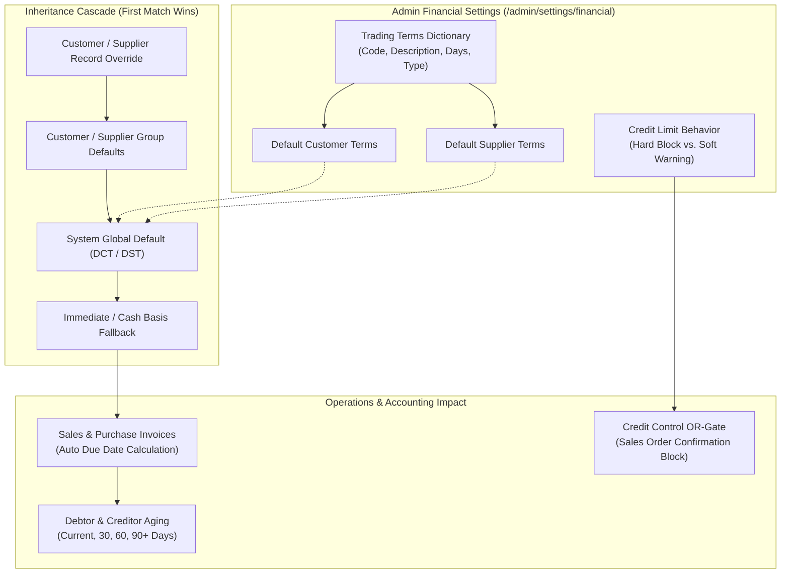

# Groups & System Settings

The **Groups & System Settings** module provides centralized configuration across commercial pricing structures, trading terms, credit risk policies, accounting control accounts, automated email delivery, and Typst PDF printing templates.

---

## Configuration Areas

### 1. Group Management & Analysis Codes
* **Customer Groups** (`/admin/customer-groups`): Segment clients by trade type (e.g. Retail, Wholesale, Key Accounts) and assign default Price Scales (1 to 4), default Accounts Receivable control accounts, group credit limits, and default trading terms.
* **Supplier Groups** (`/admin/supplier-groups`): Categorize vendors (e.g. Domestic Freight, Raw Material Vendors, Overseas Mills) and assign default Accounts Payable control accounts, payment terms, and spend analytics tags.
* **Product Groups** (`/admin/product-groups`): Hierarchical catalogue classifications defining default Sales Income, Cost of Goods Sold (COGS), and Inventory Asset accounts.
* **Analysis Codes** (`/admin/settings/system#sales-analysis-codes-section`): Configurable multidimensional reporting codes applied to operational transactions for segmental reporting.

---

### 2. Credit Policy & Trading Terms (`/admin/settings/financial#credit-policy`)

The **Credit Policy & Trading Terms** configuration section establishes the commercial settlement rules, due date calculation engines, credit exposure thresholds, and global default terms for all sales and procurement activities.

#### A. Trading Terms Dictionary

The Trading Terms table defines the standardized payment schedules available across customer accounts, customer groups, supplier profiles, supplier groups, sales invoices, and vendor bills:

| Setting / Column | Type | Description |
| :--- | :--- | :--- |
| **Code** | Text (Unique) | Short alphanumeric identifier (e.g. `NET30`, `NET7`, `NET14`, `NET60`, `COD`, `EOM30`, `EOM0`, `D3`, `D4`). Entries are sorted in **natural alphanumeric order** (e.g. `D3` is followed by `D4`, then `D10`, then `D30`). |
| **Description** | Text | Clear human-readable description displayed in dropdowns and printed on customer/supplier documents (e.g. *30 Days from Invoice Date*, *Cash on Delivery / Immediate*, *30 Days following End of Invoice Month*). |
| **Days** | Integer | The numeric calendar day offset used in the due date calculation formula (e.g. `0`, `3`, `7`, `14`, `30`, `60`, `90`). |
| **Calculation Type** | Dropdown | The calculation algorithm used to compute the settlement due date from the invoice date. |

#### B. Calculation Types & Due Date Formulas

The system provides three distinct calculation types:

1. **`Net (Days from Invoice)` (`net`)**:
   * **Definition**: Full payment is due exactly `Days` calendar days following the statutory invoice date.
   * **Formula**: `Due Date = Invoice Date + Days`
   * **Examples**:
     * `NET30` (`days = 30`): Invoice dated May 10 -> Due Date is **June 9**.
     * `NET14` (`days = 14`): Invoice dated May 10 -> Due Date is **May 24**.
     * `NET7` (`days = 7`): Invoice dated May 10 -> Due Date is **May 17**.
     * `NET60` (`days = 60`): Invoice dated May 10 -> Due Date is **July 9**.

2. **`End of Month (EOM)` (`end_of_month`)**:
   * **Definition**: Payment is due after the close of the calendar month in which the invoice was issued, plus the specified number of additional `Days`.
   * **Formula**: `Due Date = Last Day of Invoice Month + Days`
   * **Examples**:
     * `EOM30` or `30EOM` (`days = 30`): Invoice dated May 12 -> Last day of May is May 31 -> Due Date is **June 30**.
     * `EOM0` or `EOM` (`days = 0`): Invoice dated May 12 -> Last day of May is May 31 -> Due Date is **May 31** (settlement due at the end of the current billing month).
     * `EOM15` (`days = 15`): Invoice dated May 12 -> Month end is May 31 -> Due Date is **June 15**.
     * `EOM60` (`days = 60`): Invoice dated May 12 -> Month end is May 31 -> Due Date is **July 30**.

3. **`Cash on Delivery (COD)` (`cash_on_delivery`)**:
   * **Definition**: Payment is due immediately upon order delivery or invoice generation. No credit period is extended (`days = 0`).
   * **Formula**: `Due Date = Invoice Date`
   * **Example**:
     * `COD` (`days = 0`): Invoice dated May 10 -> Due Date is **May 10**. Orders on COD terms require immediate cash, card, or cleared electronic funds transfer before or upon delivery.

#### C. Credit Limit Behavior Options

Controls how the system responds when a customer's total financial exposure (unpaid posted invoices + open confirmed/picking/shipped orders) exceeds their approved credit limit:

* **`Hard Limit Block (hard)` (Recommended)**:
  * Strictly prevents sales operators from moving sales orders to **Quoted** or **Confirmed** state if the order causes total financial exposure to exceed the customer's effective credit limit.
  * An order can only proceed if a credit manager grants a formal, time-limited **Credit Hold Override** with a mandatory business justification reason.
* **`Soft Warning (soft)`**:
  * Displays an amber warning banner alerting the operator that the customer has exceeded their credit limit, but allows order progression without requiring a managerial override.

#### D. Global Fallback Defaults

* **Default Customer Trading Terms (`defaultCustomerTermsId`)**:
  * The system-wide fallback trading terms automatically assigned to new customers and applied during invoice generation when neither the individual customer record nor their customer group has specific terms configured.
* **Default Supplier Trading Terms (`defaultSupplierTermsId`)**:
  * The system-wide fallback trading terms automatically assigned to new vendors and applied to purchase orders and supplier bills when neither the vendor profile nor their supplier group has specific terms configured.

---

### 3. Financial Settings (`/admin/settings/financial`)
* **Base Currency & Multi-Currency**: Sets the primary operating currency (`baseCurrency`) and exchange rate revaluation parameters.
* **Control Accounts**: Default AR, AP, GRNI Clearing, Inventory Asset, Tax clearing, and Expense accounts.
* **Chart of Accounts Import**: Upload and deploy standard ERPNext JSON Chart of Accounts definitions.
* **Cost Centers & Activities**: Multidimensional cost allocation hierarchies.
* **FX Revaluation**: Period-end unrealized exchange rate adjustments executed via the GL engine (`POST /api/gl/fx-revaluation/commit`).

### 4. Email Outbox & SMTP Settings
* **Email Settings** (`/admin/email/settings`): Configure outbound SMTP servers (Host, Port, TLS, Username, Password, From Address).
* **Email Outbox** (`/admin/email/outbox`): Queue tracking all sent and pending emails with automated exponential retry.

### 5. PDF Document Templates & Hooks
* **PDF Templates** (`/admin/settings/pdf-templates`): Customize modern Typst layouts for Sales Orders, Quotes, Invoices, Pick Slips, Delivery Dockets, and Debit Notes.
* **PDF Hooks** (`/admin/settings/pdf-hooks`): Connect system event triggers to specific PDF template renderings.

### 6. CRM Pipeline & Opportunity Settings (`/admin/settings/crm`)
* **Pipeline Stages (`projectStatuses`)**: Define ordered stages representing the sales journey (e.g. Discovery, Proposal, Negotiation, Won, Lost) that populate the CRM Opportunities Kanban board.
* **Opportunity Types (`projectTypes`)**: Configure classification categories for deals (e.g. New Business, Renewal, Expansion, Consulting).

---

## Step-by-Step Workflows

### 1. Creating and Managing Trading Terms
1. Go to **Administration** → **Settings** → **Financial** (`/admin/settings/financial`).
2. Switch to the **Operations & Compliance** tab and scroll to **Credit Policy & Trading Terms** (`#credit-policy`).
3. Under the **Trading Terms** table, click **Add Row** (or edit an existing entry).
4. Enter the **Code** (e.g. `NET30`, `EOM30`, `COD`).
5. Enter the **Description** (e.g. `30 Days from Invoice Date`).
6. Enter the **Days** (e.g. `30` for Net 30, `0` for COD).
7. Select the **Type** (`Net (Days from Invoice)`, `End of Month (EOM)`, or `Cash on Delivery (COD)`).
8. Click **Save** to commit the new trading term.
9. In the dropdowns above the table, optionally select the new term as the **Default Customer Terms** or **Default Supplier Terms**.
10. Choose your desired **Credit Limit Behavior** (`Hard Block` or `Soft Warning`).

### 2. Creating a Customer Group with Terms and Price Scale
1. Go to **Administration** → **Customer Groups** (`/admin/customer-groups`).
2. Click **New Group**.
3. Enter the **Group Name** and select the default **Price Scale (1–4)**.
4. Select the default **AR Control Account** and **Trading Terms**.
5. (Optional) Set group-level **Credit Limit**, **Early Payment Discount %**, and **Early Payment Window (Days)**.
6. Click **Save Group**.

### 3. Configuring Outbound SMTP Email
1. Go to **Administration** → **Email** → **Settings** (`/admin/email/settings`).
2. Enter your SMTP Host, Port, and authentication credentials.
3. Send a test email to verify server connectivity.
4. Click **Save Settings**.

---

## Field Reference

| Field | Description |
| :--- | :--- |
| **Customer Group** | Segment determining default price scale (1–4), default AR account, group credit limits, and group trading terms. |
| **Supplier Group** | Procurement category setting default AP account, payment terms, and spend analytics tags. |
| **Product Group** | Inventory category setting revenue and COGS accounts. |
| **Trading Terms Code** | Alphanumeric identifier sorted naturally (e.g. `D3`, `D4`, `D30`, `NET30`, `EOM30`). |
| **Trading Terms Days** | Integer numeric day count applied in settlement date calculations. |
| **Trading Terms Type** | Calculation mode (`net` = Invoice Date + Days; `end_of_month` = Month End + Days; `cash_on_delivery` = Invoice Date). |
| **Credit Limit Behavior** | Enforcement policy when limits are exceeded (`hard` = strict block requiring managerial override; `soft` = warning). |
| **Default Customer Terms** | Global system fallback trading terms for customer billing when no profile or group term is defined. |
| **Default Supplier Terms** | Global system fallback trading terms for vendor procurement when no profile or group term is defined. |
| **Analysis Codes** | Financial tags for multidimensional reporting. |
| **Pipeline Stages** | Configurable stages for sales opportunities in the CRM Kanban board. |

