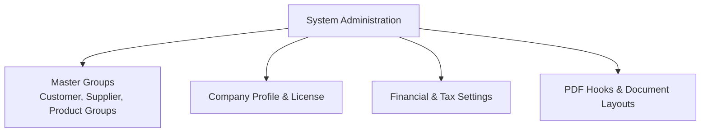

# Master Groups & System Settings

The **Administration: Settings** section configures classification groups, company profile details, default General Ledger accounts, and global application options.

---

## Group Configurations & Settings Sections

### 1. Customer, Supplier & Product Groups
- **Customer Groups**: Set group-level price scales (1–4), default trading terms, and percentage discounts.
- **Supplier Groups**: Categorize vendors for spend reporting and default expense accounts.
- **Product Groups**: Group items for inventory accounting, margin analysis, and catalog navigation.

### 2. Financial & System Settings
- **Financial Settings** (`/admin/settings/financial`): Configure standard chart of account linkages (Accounts Receivable, Accounts Payable, Sales Tax Liability, Rounding, Retained Earnings).
- **System Settings** (`/admin/settings/system`): Manage global defaults, timezones, and number sequence generators for orders, quotes, and invoices.

---

## Step-by-Step Workflows

### 1. Creating a Customer Group
1. Go to **Admin** → **Groups** → **Customer Groups** (`/admin/customer-groups`).
2. Click **New Customer Group**.
3. Enter the **Group Name** (e.g. Wholesale Tier 2).
4. Select the default **Price Scale** (e.g. Scale 3) and **Group Discount %**.
5. Select the default **Payment Terms** (e.g. Net 30).
6. Click **Save Group**.

---

## Field Reference

| Field | Description |
| :--- | :--- |
| **Company Profile** | Legal name, tax registration number, logo, and address. |
| **Price Scale** | Default pricing tier (1–4) assigned to customer groups. |
| **Default AR/AP Accounts** | Control accounts in General Ledger for automated postings. |
| **System Numbering** | Prefixes and next sequence numbers for invoices and orders. |
