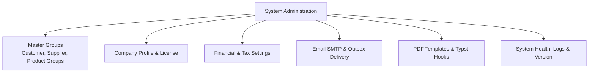

# Master Groups & System Settings

The **Administration: Settings** section configures classification groups, company profile details, default General Ledger accounts, outbound email services, and global application options.

---

## Group Configurations & Settings Sections

### 1. Customer, Supplier & Product Groups
- **Customer Groups** (`/admin/customer-groups`): Set group-level price scales (1–4), default trading terms, and percentage discounts.
- **Supplier Groups** (`/admin/supplier-groups`): Categorize vendors for spend reporting, default expense accounts, and tax positions.
- **Product Groups** (`/admin/product-groups`): Group items for inventory accounting, margin analysis, and catalog navigation.

#### Active vs. Inactive Groups
- **Existing records keep their settings**: Making a group inactive does not deactivate its customers, suppliers, or products. Existing members continue using all group defaults (prices, terms, and accounts).
- **Prevents new use**: Inactive groups cannot be chosen for new records.
- **Safe retirement**: Groups linked to records cannot be deleted; set them to Inactive to retire them safely.

### 2. Financial & System Settings
- **Financial Settings** (`/admin/settings/financial`): Configure standard Chart of Accounts control linkages (AR, AP, Revenue, Expense, Inventory, COGS, GRNI, Tax, Shrinkage), manage the hierarchical Chart of Accounts tree, define Cost Centers and Activities, establish Credit Policies and Trading Terms, manage Multi-Currency Exchange Rates, and configure Tax Categories and Fiscal Tax Positions.
- **System Settings** (`/admin/settings/system`): Manage global defaults, timezones, number sequence generators, and structured **Sales Order Analysis Codes**.

#### Financial Settings Architecture & Navigation
Financial Settings is split into two primary operational tabs:
1. **General Ledger Tab**:
   - **Defaults (`#gl-section`)**: Core General Ledger account linkages for sales, purchasing, inventory valuation, accruals, foreign exchange gain/loss, and Over-The-Counter (OTC) cash/card accounts. Also defines Revenue and Expense routing strategies (`product_first` vs. `customer_first` / `supplier_first`).
   - **Chart of Accounts (`#coa-section`)**: Hierarchical account tree explorer, root account creation, dynamic metadata schema editor, and **Import CoA** dialog.
   - **Cost Centers (`#cc-section`)**: Departmental or divisional cost allocation nodes.
   - **Activities (`#activity-section`)**: Project, campaign, or activity tracking codes.
2. **Operations Tab**:
   - **Credit Policy & Trading Terms (`#credit-policy`)**: Credit limit enforcement behavior (**Hard Block** vs. **Soft Warning**), Default Customer Terms, Default Supplier Terms, and inline trading terms editor (Net days, End of Month, Cash on Delivery).
   - **Currencies & Exchange Rates (`#rates-section`)**: Base Operating Currency selector and multi-currency buy/sell exchange rate table with historical audit tracking.
   - **Tax Codes (`#tax-section`)**: Default Sales Tax Category, Default Purchase Tax Category, and inline tax category rate table.
   - **Tax Positions (`#tax-positions-section`)**: Default Customer Tax Position, Default Supplier Tax Position, and fiscal tax mapping rules (e.g., domestic taxable vs. export zero-rated).

#### Configuration Required Warning Banner
If any critical required financial settings are missing, a **Configuration Required** warning banner automatically renders at the top of the Financial Settings page. 
- Each missing setting is explicitly itemized with its target tab, section, and the operational impact if left unconfigured.
- Clicking any missing item in the banner automatically switches to the appropriate tab (`General Ledger` or `Operations`) and smoothly scrolls directly to the setting input.

#### Required Financial Settings Reference Matrix

| Setting | Location in UI | Operational Workflow Impact |
| :--- | :--- | :--- |
| **Default Accounts Receivable (AR)** | General Ledger → Defaults (`#gl-section`) | Control account required for posting customer sales invoices, credit notes, and customer payment receipts. |
| **Default Accounts Payable (AP)** | General Ledger → Defaults (`#gl-section`) | Control account required for posting supplier bills, debit notes, and payment settlements. |
| **Default Sales Revenue** | General Ledger → Defaults (`#gl-section`) | Fallback income account used when sales order invoice lines do not have an item- or customer-specific revenue account assigned. |
| **Default Expense** | General Ledger → Defaults (`#gl-section`) | Fallback expense account used when purchase orders or vendor bill lines do not have an item- or supplier-specific expense account assigned. |
| **Default Inventory Asset** | General Ledger → Defaults (`#gl-section`) | Balance sheet asset account required for perpetual inventory valuation, goods receipts (GRN), and stock movements. |
| **Default Cost of Goods Sold (COGS)** | General Ledger → Defaults (`#gl-section`) | Expense account required for cost recognition upon sales order fulfillment and dispatch. |
| **Default Goods Received Not Invoiced (GRNI)** | General Ledger → Defaults (`#gl-section`) | Accrual clearing account required for valuing inventory received prior to receiving vendor bills (3-way matching). |
| **Default Sales Tax Account** | General Ledger → Defaults (`#gl-section`) | Current liability account required for posting output tax (GST/VAT) collected on customer sales. |
| **Default Purchase Tax Account** | General Ledger → Defaults (`#gl-section`) | Current asset account required for posting input tax credits (GST/VAT) claimable on supplier purchases. |
| **Default Inventory Shrinkage** | General Ledger → Defaults (`#gl-section`) | Expense account required for posting stock count variances, write-offs, and damage adjustments. |
| **Base Operating Currency** | Operations → Currencies (`#rates-section`) | System-wide base currency (e.g. AUD, USD, EUR) required for exchange rate conversion, unrealized FX revaluations, and ledger consolidation. |
| **Default Customer Trading Terms** | Operations → Credit (`#credit-policy`) | Fallback payment term (e.g. Net 30, COD) automatically applied when creating new customers or sales orders. |
| **Default Supplier Trading Terms** | Operations → Credit (`#credit-policy`) | Fallback payment term (e.g. Net 30, EOM) automatically applied when creating new vendors or purchase orders. |
| **Default Sales Tax Category** | Operations → Tax Codes (`#tax-section`) | Fallback tax rate category (e.g. GST 10% Standard) applied to customer sales quotes, orders, and invoices. |
| **Default Purchase Tax Category** | Operations → Tax Codes (`#tax-section`) | Fallback tax rate category (e.g. GST 10% Input Taxed) applied to purchase orders and vendor bills. |
| **Default Customer Tax Position** | Operations → Tax Positions (`#tax-positions-section`) | Fiscal position determining automatic tax overrides (e.g. Domestic Taxable vs. International Export) for customers. |
| **Default Supplier Tax Position** | Operations → Tax Positions (`#tax-positions-section`) | Fiscal position determining automatic tax overrides (e.g. Domestic vs. Import/Reverse Charge) for suppliers. |

#### Optional & Feature-Specific GL Settings (Fallback Behavior)

The remaining settings in **Financial Settings** are optional during initial setup because they govern specialized business operations (multi-currency, retail POS, early settlement discounts, or dimensional cost accounting). If your business does not utilize these specific workflows, they do not need to be configured.

| Optional Setting | Purpose | Behavior / Fallback If Not Set |
| :--- | :--- | :--- |
| **Realised FX Gain / Loss Accounts** | Captures exchange rate variances realized between invoice booking and payment settlement dates. | If not set, standard single-currency payments post normally. If a foreign currency payment is settled with an exchange difference and no FX accounts are configured, payment posting halts with an error requiring FX accounts to be mapped. |
| **Unrealised FX Gain / Loss Accounts** | Used by the end-of-period Foreign Exchange Revaluation process for revaluing open foreign currency AR/AP balances. | If not set, the **Run FX Revaluation** action (`/general-ledger/fx-revaluation`) will throw a validation error indicating that Unrealised FX Gain/Loss accounts must be configured prior to generating revaluation journal entries. |
| **Purchase Price Variance (PPV)** | Captures differences between purchase order standard/estimated costs and final vendor bill unit prices during 3-way matching. | If not set and standard costing is not strictly enforced, price variances are absorbed into inventory asset / COGS lines or require account assignment during invoice matching. |
| **Default Fee Revenue Account** | Dedicated income account for ad-hoc order fees, restocking fees, and freight surcharges on credit notes. | If not set, fee line items automatically fall back to the **Default Sales Revenue** account. |
| **Early Payment Discounts (Given / Received)** | Captures prompt payment settlement discounts (e.g., 2% 10 Net 30) taken on payments or vendor bills. | If not set, automated discount settlement in batch payment runs is bypassed. If a discount is explicitly taken on a payment run without these accounts configured, the payment run generator halts with a configuration error. |
| **Default OTC Cash & Card Accounts** | Clearing accounts for physical cash drawers and EFTPOS card terminals in retail/trade counter environments. | If not set, wholesale, B2B, and standard dispatch orders operate unaffected. If an operator attempts to fulfill an Over-The-Counter order via POS cash/card settlement without these accounts, POS fulfillment prompts for account configuration. |
| **Default Cost Center & Activity** | Default dimensional accounting breakdown tags applied to automated journal lines. | If not set, journal lines post without default dimension tags (or inherit tags directly from the customer, supplier, or product record if defined there). |

### 3. Email Outbox & SMTP Settings
- **Email Settings** (`/admin/email/settings`): Configure outbound SMTP servers (Host, Port, Secure TLS, Username, Password, Default From Address).
- **Email Outbox** (`/admin/email/outbox`): Operational queue tracking all sent and pending emails (Invoices, Purchase Orders, Shipping Dockets) with automated retry mechanisms for failed deliveries.

### 4. PDF Templates & Typst Rendering
- **PDF Templates** (`/admin/settings/pdf-templates`): Manage modern Typst document layouts (Sales Orders, Invoices, Shipping Labels, Packing Slips, Purchase Debit Notes).
- **PDF Hooks** (`/admin/settings/pdf-hooks`): Connect system event triggers to specific PDF template renderings.

### 5. System Health, Logs & Version
- **Event Queue** (`/admin/event-queue`): Monitor Redis BullMQ transactional outbox event streams.
- **System Logs** (`/admin/system-logs`): Filter and search application runtime diagnostics.
- **Version & Build** (`/admin/version`): View active Git commit hash, container build timestamp, and API version.

---

## Step-by-Step Workflows

### 1. Creating a Customer Group
1. Go to **Admin** → **Groups** → **Customer Groups** (`/admin/customer-groups`).
2. Click **New Customer Group**.
3. Enter the **Group Name** (e.g. Wholesale Tier 2).
4. Select the default **Price Scale** (e.g. Scale 3) and **Group Discount %** (must be between 0% and 100%).
5. Select the default **Payment Terms** (e.g. Net 30).
6. Click **Save Group**.

### 2. Configuring Email Delivery
1. Go to **Admin** → **Email** → **Email Settings** (`/admin/email/settings`).
2. Enter your mail server details (**SMTP Host**, **Port**, **Sender Email**).
3. Click **Send Test Email** to verify SMTP connectivity.
4. Save configuration. All PDF email buttons across orders and shipments will route through this gateway.

### 3. Importing a Chart of Accounts (Upload or Preset)
1. Go to **Admin** → **Settings** → **Financial Settings** (`/admin/settings/financial`).
2. In the **General Ledger** tab, scroll to the **Chart of Accounts** section and click **Import CoA**.
3. The import slide-over presents two distinct sections:
   - **Upload JSON File**: Drag & drop or click to browse for any ERPNext-compatible `.json` Chart of Accounts file from your computer. Once selected, the preview displays the chart name, country code, and total account count. Click **Import CoA** in the upload section to load the accounts.
   - **Predefined Presets**: Select from available server-side template files (such as Australia Standard or custom templates placed in `apps/api/src/gl/charts/`). Click **Import CoA** in the preset section to populate the chart.
4. After import completes, the accounts appear in the hierarchical tree and can be assigned as default GL accounts in the **Defaults** section.

### 4. Resolving Missing Financial Configuration
1. Navigate to **Financial Settings** (`/admin/settings/financial`).
2. If the yellow **Configuration Required** warning banner is displayed, review the list of missing settings.
3. Click any missing setting name in the warning banner to instantly jump to the corresponding tab and section.
4. Select the appropriate account, currency, term, or tax code from the dropdown.
5. The warning banner updates in real time and disappears once all mandatory parameters are satisfied.

---

## Field Reference

| Field | Description |
| :--- | :--- |
| **Company Profile** | Legal name, tax registration number, logo, and address. |
| **Price Scale** | Default pricing tier (1–4) assigned to customer groups. |
| **Default AR/AP Accounts** | Control accounts in General Ledger for automated postings. |
| **System Numbering** | Prefixes and next sequence numbers for invoices and orders. |
| **SMTP Host / Port** | Outbound mail server connection settings. |
| **Analysis Codes** | Structured dropdown codes for reporting on sales orders. |
