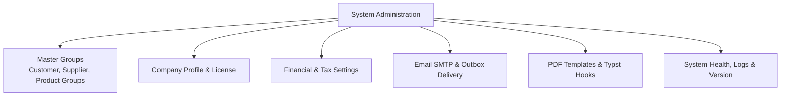

# Master Groups & System Settings

The **Administration: Settings** section configures classification groups, company profile details, default General Ledger accounts, outbound email services, and global application options.

---

## Group Configurations & Settings Sections

### 1. Customer, Supplier & Product Groups
- **Customer Groups** (`/admin/customer-groups`): Set group-level price scales (1–4), default trading terms, and percentage discounts.
- **Supplier Groups** (`/admin/supplier-groups`): Categorize vendors for spend reporting, default expense accounts, and tax positions.
- **Product Groups** (`/admin/product-groups`): Group items for inventory accounting, margin analysis, and catalog navigation.

#### Active vs. Inactive Groups
- **Existing records keep their settings**: Making a group inactive does not deactivate its customers, suppliers, or products. Existing members continue using all group defaults (prices, terms, and accounts).
- **Prevents new use**: Inactive groups cannot be chosen for new records.
- **Safe retirement**: Groups linked to records cannot be deleted; set them to Inactive to retire them safely.

### 2. Financial & System Settings
- **Financial Settings** (`/admin/settings/financial`): Configure standard chart of account linkages (Accounts Receivable, Accounts Payable, Sales Tax Liability, Rounding, Retained Earnings), manage the hierarchical Chart of Accounts tree, and import Chart of Accounts templates using the ERPNext JSON format (with pre-packaged presets or official [ERPNext Verified Chart of Accounts](https://github.com/frappe/erpnext/tree/develop/erpnext/accounts/doctype/account/chart_of_accounts/verified) files).
- **System Settings** (`/admin/settings/system`): Manage global defaults, timezones, number sequence generators, and structured **Sales Order Analysis Codes**.

### 3. Email Outbox & SMTP Settings
- **Email Settings** (`/admin/email/settings`): Configure outbound SMTP servers (Host, Port, Secure TLS, Username, Password, Default From Address).
- **Email Outbox** (`/admin/email/outbox`): Operational queue tracking all sent and pending emails (Invoices, Purchase Orders, Shipping Dockets) with automated retry mechanisms for failed deliveries.

### 4. PDF Templates & Typst Rendering
- **PDF Templates** (`/admin/settings/pdf-templates`): Manage modern Typst document layouts (Sales Orders, Invoices, Shipping Labels, Packing Slips, Purchase Debit Notes).
- **PDF Hooks** (`/admin/settings/pdf-hooks`): Connect system event triggers to specific PDF template renderings.

### 5. System Health, Logs & Version
- **Event Queue** (`/admin/event-queue`): Monitor Redis BullMQ transactional outbox event streams.
- **System Logs** (`/admin/system-logs`): Filter and search application runtime diagnostics.
- **Version & Build** (`/admin/version`): View active Git commit hash, container build timestamp, and API version.

---

## Step-by-Step Workflows

### 1. Creating a Customer Group
1. Go to **Admin** → **Groups** → **Customer Groups** (`/admin/customer-groups`).
2. Click **New Customer Group**.
3. Enter the **Group Name** (e.g. Wholesale Tier 2).
4. Select the default **Price Scale** (e.g. Scale 3) and **Group Discount %** (must be between 0% and 100%).
5. Select the default **Payment Terms** (e.g. Net 30).
6. Click **Save Group**.

### 2. Configuring Email Delivery
1. Go to **Admin** → **Email** → **Email Settings** (`/admin/email/settings`).
2. Enter your mail server details (**SMTP Host**, **Port**, **Sender Email**).
3. Click **Send Test Email** to verify SMTP connectivity.
4. Save configuration. All PDF email buttons across orders and shipments will route through this gateway.

### 3. Importing a Chart of Accounts Preset
1. Go to **Admin** → **Settings** → **Financial Settings** (`/admin/settings/financial`).
2. Scroll to the **Chart of Accounts** section.
3. Click **Import Preset**.
4. Select the desired template preset (e.g. Australia Standard or US Standard) or an ERPNext-compatible JSON file.
5. Click **Import** to populate the chart of accounts tree.

---

## Field Reference

| Field | Description |
| :--- | :--- |
| **Company Profile** | Legal name, tax registration number, logo, and address. |
| **Price Scale** | Default pricing tier (1–4) assigned to customer groups. |
| **Default AR/AP Accounts** | Control accounts in General Ledger for automated postings. |
| **System Numbering** | Prefixes and next sequence numbers for invoices and orders. |
| **SMTP Host / Port** | Outbound mail server connection settings. |
| **Analysis Codes** | Structured dropdown codes for reporting on sales orders. |
