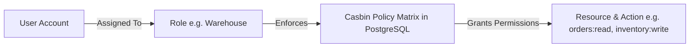

# Users, Roles & Permissions

The **Users & Roles** module manages operator accounts, authentication security, and granular Role-Based Access Control (RBAC) powered by Casbin.

---

## Access Control Model (RBAC)

### 1. Casbin 4-Tuple Model
HeroBM utilizes a 4-tuple Casbin policy model (`sub, obj, act, eft`) with **Deny-Override** resolution:
- **`sub` (Subject / Role)**: User identifier or assigned role.
- **`obj` (Object / Resource)**: Target system resource (e.g. `sales-orders`, `purchase-orders`, `inventory`, `gl`, `reports`).
- **`act` (Action)**: Standardized authorization action: `read`, `write`, `archive`, `handle`, `invoice`, or `delete`.
- **`eft` (Effect)**: Explicit authorization effect (`allow` or `deny`).

### 2. Standard Predefined Roles
- **Administrator**: Full administrative access across all modules, configurations, and developer tools.
- **Sales Representative**: Quotes, Sales Orders, Customer profiles, and Counter Sales.
- **Warehouse Operator**: Inbound Receiving, Putaway, Bin movements, Picking, and Shipping dispatch.
- **Finance / Accountant**: Sales/Supplier Invoices, Credit Notes, General Ledger, Balances, and Bank Reconciliations.
- **Read-Only Auditor**: Read-only inspection across all operational and financial records.

---

## Step-by-Step Workflows

### 1. Inviting a New User
1. Go to **Admin** → **Users** (`/admin/users`).
2. Click **Invite User**.
3. Enter the **Display Name**, **Email Address**, and **Username**.
4. Assign one or more **Roles** (e.g. Sales, Warehouse).
5. Click **Send Invitation**.

### 2. Modifying Role Permissions
1. Go to **Admin** → **Users** → **Roles & Permissions** (`/admin/users/roles`).
2. Select the target role.
3. Toggle permissions on the resource grid across standard actions (`read`, `write`, `archive`, `handle`, `invoice`, `delete`).
4. Click **Save Permissions**. Policies update live in PostgreSQL without requiring an application restart.

---

## Field Reference

| Field | Description |
| :--- | :--- |
| **Username** | User login identity. |
| **Email** | Notifications and account email. |
| **Role** | Access tier determining permission policies. |
| **Resource** | System module (e.g. `sales-orders`, `inventory`, `gl`, `reports`). |
| **Action** | Allowed verb (`read`, `write`, `archive`, `handle`, `invoice`, `delete`). |
