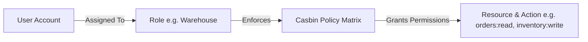

# Users, Roles & Permissions

The **Users & Roles** module manages operator accounts, authentication security, and granular Role-Based Access Control (RBAC) powered by Casbin.

---

## Access Control Model (RBAC)

### 1. Standard Predefined Roles
- **Administrator**: Unrestricted access across all modules, configuration, and developer tools.
- **Sales Representative**: Quotes, Sales Orders, Customer profiles, and Shipments.
- **Warehouse Operator**: Receiving, Putaway, Bin movements, Picking, and Shipping dispatch.
- **Finance / Accountant**: Invoices, Credit Notes, General Ledger, Balances, and Bank Reconciliations.
- **Read-Only Auditor**: Read-only inspection across all operational and financial records.

---

## Step-by-Step Workflows

### 1. Inviting a New User
1. Go to **Admin** → **Users** (`/admin/users`).
2. Click **+ Invite User**.
3. Enter the **Display Name**, **Email Address**, and **Username**.
4. Assign one or more **Roles** (e.g. Sales, Warehouse).
5. Click **Send Invitation**.

### 2. Modifying Role Permissions
1. Go to **Admin** → **Users** → **Roles & Permissions** (`/admin/users/roles`).
2. Select the target role.
3. Toggle permissions on the resource grid (Create, Read, Update, Delete per resource).
4. Click **Save Permissions**. Changes take effect immediately.

---

## Field Reference

| Field | Description |
| :--- | :--- |
| **Username** | User login identity. |
| **Email** | Notifications and account email. |
| **Role** | Access tier determining permission policies. |
| **Resource** | System module (e.g. `orders`, `inventory`, `finance`). |
| **Action** | Allowed verb (`read`, `write`, `delete`, `admin`). |
