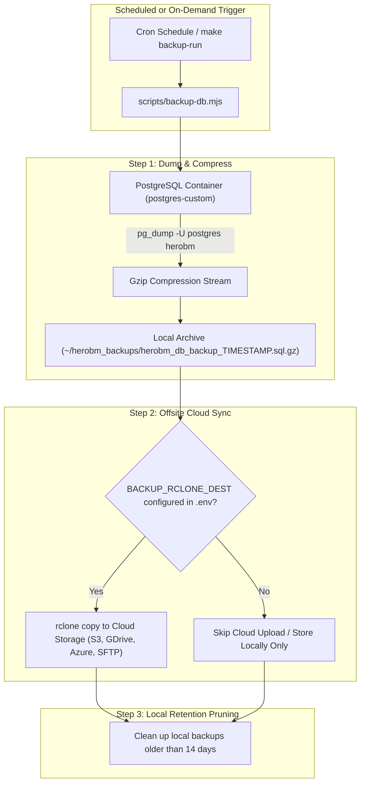

# Database Backup & Recovery

HeroBM includes built-in tooling for automated database archiving, local retention management, offsite cloud storage synchronization, and disaster recovery restoration.

---

> [!CAUTION]
> ### Critical Operational Disclaimer & Operator Responsibility
> **HeroBM and its maintainers accept NO RESPONSIBILITY for the creation, integrity, retention, security, or recoverability of your backups.**
>
> Automated backup scripts, cloud upload routines, and storage remotes can fail due to external factors such as network outages, expired cloud credentials, disk exhaustion, or system permission changes.
>
> **As a system operator or administrator, you MUST:**
> 1. **Regularly verify** that backup archive files are actively being generated at your scheduled intervals in `~/herobm_backups/` and in your remote cloud storage.
> 2. **Regularly review** the backup logs in `logs/backup.log` or configure automated email alert notifications.
> 3. **Conduct periodic restore drills** by restoring backup archives into an isolated test/staging environment to verify that your data can be completely and correctly recovered in the event of a disaster.

---

## Architecture & Lifecycle



---

## 1. Quick Reference: Make Targets & CLI Commands

HeroBM provides unified `make backup-*` targets and direct CLI flags for all backup operations:

| Task | Make Target | Direct Script Command |
| :--- | :--- | :--- |
| **Set Up Cloud Destination** | `make backup-destination` | `node scripts/setup-backup.mjs --destination` |
| **Set Up Backup Schedule** | `make backup-setup` | `node scripts/setup-backup.mjs --backup` |
| **Run Manual Backup Now** | `make backup-run` | `node scripts/backup-db.mjs` |
| **Restore from a Backup** | `make backup-restore FILE=<path>` | `node scripts/restore-db.mjs <path>` |

---

## 2. Setting Up Cloud Storage Destinations (`rclone`)

To prevent catastrophic data loss from local hardware failure, configure an offsite cloud storage destination using [rclone](https://rclone.org/).

### Interactive Setup
Run the destination configuration target:
```bash
make backup-destination
```

This utility will:
1. Detect whether `rclone` is installed on your host system (and provide OS-specific installation commands if missing).
2. List your currently configured `rclone` cloud remotes.
3. Allow you to launch `rclone config` interactively to connect new cloud storage providers (Google Drive, AWS S3, Azure Blob, Backblaze B2, Dropbox, SFTP, WebDAV, etc.).
4. Prompt for your destination target path (e.g. `gdrive:herobm_backups` or `s3:company-backups/herobm`).
5. Test connectivity to the remote to verify write permissions.
6. Persist `BACKUP_RCLONE_DEST=<destination>` in your active `.env` configuration file.

### Non-Interactive / Scripted Setup
You can configure or update your destination non-interactively using CLI flags or Make parameters:
```bash
# Using Make
make backup-destination DEST="gdrive:my_company_backups"

# Using Node directly
node scripts/setup-backup.mjs --destination --dest "s3:my-bucket/backups" --profile production
```

---

## 3. Setting Up Automated Backup Scheduling (`cron`)

On Linux and macOS hosts, automated recurring backups are scheduled via the system `crontab`.

### Interactive Setup
Run the backup scheduling target:
```bash
make backup-setup
```

The wizard will prompt you for:
1. **Frequency**: Daily at 2:00 AM, Weekly (Sunday at 2:00 AM), or a custom cron expression.
2. **Email Alerts (Optional)**: Provide an email address to receive execution logs via `scripts/send-email.py` after each run.
3. **Crontab Installation**: Automatically and idempotently installs the scheduled job into your user crontab without disturbing existing jobs.
4. **Immediate Test Run**: Optionally runs an immediate test backup to verify end-to-end execution.

### Non-Interactive / Scripted Scheduling
```bash
# Schedule daily backup with email notification
make backup-setup DAILY=1 EMAIL="admin@example.com"

# Schedule with custom cron expression (e.g. daily at 3:30 AM)
make backup-setup CRON="30 3 * * *"

# Preview crontab command without installing (Dry Run)
make backup-setup DAILY=1 DRY_RUN=1
```

### Windows Host Scheduling
On Windows systems, crontab is not available natively. Configure a **Windows Scheduled Task** to execute:
```powershell
node scripts/backup-db.mjs
```

---

## 4. Running an On-Demand Backup

To create an immediate database backup archive (e.g. before performing software upgrades or migrations):

```bash
make backup-run
```

Output:
```text
=========================================
 HEROBM PostgreSQL Database Backup Worker 
=========================================

Target container : postgres-custom
Target database  : herobm
Target user      : postgres
Export file      : /home/user/herobm_backups/herobm_db_backup_2026-09-18_103000.sql.gz

Executing pg_dump via Podman and compressing...
Backup completed successfully and saved to /home/user/herobm_backups/herobm_db_backup_2026-09-18_103000.sql.gz!
Uploading to external storage via rclone (gdrive:herobm_backups)...
Upload to external storage complete.
Cleaning up local backups older than 14 days...
Done.
```

---

## 5. Restoring the Database from a Backup

> [!WARNING]
> Restoring a database archive will **completely overwrite** all existing application data and tables inside the database container. Ensure all users are logged out before initiating a restore.

### Restoration Procedure

1. Identify the backup file path (either from local `~/herobm_backups/` or downloaded from your cloud remote):
   ```bash
   ls -lh ~/herobm_backups/
   ```
2. Run the restoration command:
   ```bash
   make backup-restore FILE=/home/user/herobm_backups/herobm_db_backup_2026-09-18_103000.sql.gz
   ```
3. Type `Y` to confirm the restoration prompt.
4. The worker will decompress the SQL archive and pipe the clean SQL dump into `psql` within the database container.
5. Once complete, restart application services if necessary:
   ```bash
   make restart
   ```

---

## 6. Verification Checklist & Best Practices

To ensure business continuity and disaster resilience, establish the following operational routines:

- [ ] **Verify Backup Output**: Regularly inspect `~/herobm_backups/` to confirm that new `.sql.gz` archives are being created on schedule with non-zero file sizes.
- [ ] **Verify Cloud Storage**: Log in to your cloud storage console (Google Drive, AWS S3, etc.) and check that recent backup files match local timestamps.
- [ ] **Inspect Log Files**: Review `logs/backup.log` for any connection timeouts, authentication errors, or `rclone` upload warnings.
- [ ] **Test Restore Drills**: At least once per quarter, restore a recent backup file into a temporary staging instance or local development environment to ensure table data, user credentials, and general ledger records are fully intact.
- [ ] **Monitor Storage Space**: Ensure the host disk has sufficient free capacity to hold the 14-day rolling local archive window.
