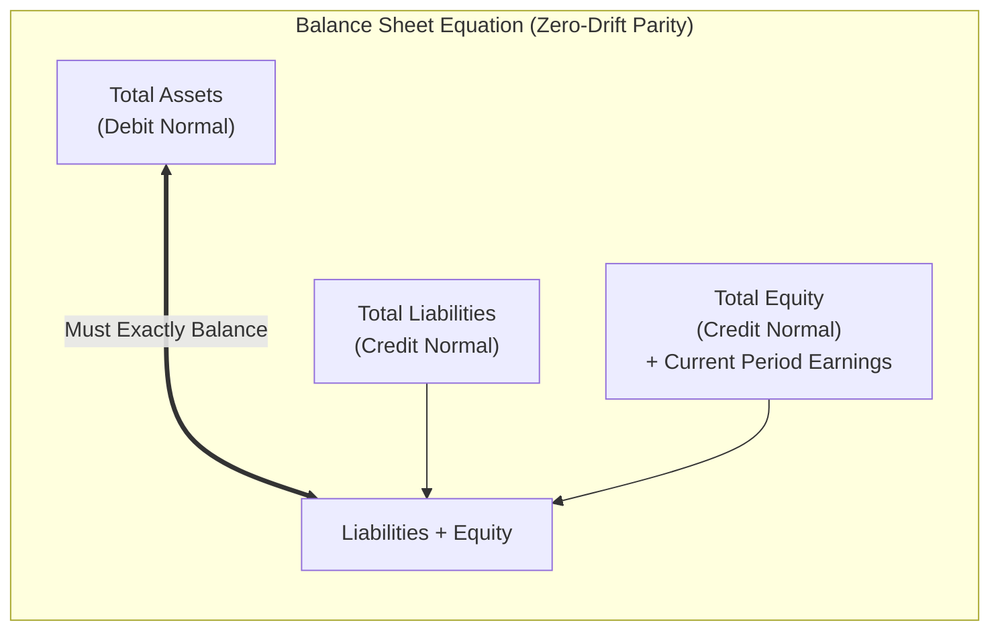

# Balance Sheet & Financial Position

The **Balance Sheet** (`/general-ledger/balance-sheet`) provides a formal statement of financial condition, summarizing total **Assets**, **Liabilities**, and **Equity** as of any selected cutoff date (`asOfDate`).

In addition to cumulative ending balances, HeroBM calculates period-over-period **Movement MTD**, **Movement YTD**, and **Movement Last YTD** to provide immediate visibility into working capital dynamics, capital expenditure, debt reduction, and retained earnings growth.



---

## Structure & Root Classifications

1. **Assets (Debit Normal)**:
   - Economic resources owned or controlled by the enterprise.
   - Includes Cash and Bank accounts, Accounts Receivable, Inventory Assets, Prepaid Expenses, and Fixed Assets.
2. **Liabilities (Credit Normal)**:
   - Present obligations arising from past events.
   - Includes Accounts Payable, Accrued Expenses, Output Tax (GST/VAT) Payable, and Long-Term Borrowings.
3. **Equity (Credit Normal)**:
   - Residual interest in the assets after deducting all liabilities.
   - Includes Share Capital, Retained Earnings from prior closed fiscal years, and dynamic **Current Period Earnings / Net Income**.

### Dynamic Current Period Earnings (Net Income)
To ensure the Balance Sheet is mathematically balanced at any arbitrary point in time without requiring manual closing journal entries, HeroBM dynamically aggregates unclosed income statement activity:

```
Net Income = Total Revenue - Total Expense
```

This net earnings figure is presented in the Equity section, guaranteeing that the fundamental accounting equation holds for any date.

---

## Mathematical Formulas & Movement Calculations

The Balance Sheet report presents four monetary columns for every line item, section subtotal, and grand total:

```
+---------------+---------------------+--------------------+--------------------+-------------------------+
| Column        | Ending Balance      | Movement MTD       | Movement YTD       | Movement Last YTD       |
+---------------+---------------------+--------------------+--------------------+-------------------------+
| Effective     | Inception to As-Of  | Month-to-Date      | Fiscal Year-to-Date| Prior Fiscal YTD        |
| Date Range    | (<= asOfDate)       | (YYYY-MM-01..As-Of)| (FY Start..As-Of)  | (Prior FY Start..Prior) |
+---------------+---------------------+--------------------+--------------------+-------------------------+
```

### 1. Cumulative Ending Balance (Amount)
The cumulative position of the account from the inception of the ledger up to the end of the `asOfDate`:
- **Asset Accounts**:
  ```
  Ending Balance = Cumulative Debits - Cumulative Credits
  ```
- **Liability & Equity Accounts**:
  ```
  Ending Balance = Cumulative Credits - Cumulative Debits
  ```
- **Current Period Net Income (Equity)**:
  ```
  Cumulative Net Income = Cumulative Revenue - Cumulative Expense
  ```

### 2. Movement MTD (Month-to-Date)
The net monetary change posted within the calendar month of the `asOfDate` (from `YYYY-MM-01` through `asOfDate`):
- **Asset Movement MTD**: `Period Debits - Period Credits`
- **Liability & Equity Movement MTD**: `Period Credits - Period Debits`
- **Current Period Net Income MTD**: `MTD Revenue Movement - MTD Expense Movement`

### 3. Movement YTD (Fiscal Year-to-Date)
The net monetary change posted from the start of the active fiscal year through `asOfDate`:
- **Date Range**: Determined dynamically from the organization's `fiscalYearStartMonth` (e.g. Month 7 / July 1 for Australian fiscal years, Month 1 / January 1 for calendar fiscal years).
- **Asset Movement YTD**: `Period Debits - Period Credits`
- **Liability & Equity Movement YTD**: `Period Credits - Period Debits`
- **Current Period Net Income YTD**: `YTD Revenue Movement - YTD Expense Movement`

### 4. Movement Last YTD (Comparative Prior Fiscal Year-to-Date)
The net monetary change posted during the equivalent comparative period in the *prior* fiscal year:
- **Date Range**: From the prior fiscal year start date (`fiscalYearStart - 1 year`) through the comparative prior cutoff date (`asOfDate - 1 year`).
- **Purpose**: Enables apples-to-apples comparative analysis of balance sheet trajectory against the previous year's performance at the exact same point in time.
- **Asset Movement Last YTD**: `Period Debits - Period Credits`
- **Liability & Equity Movement Last YTD**: `Period Credits - Period Debits`
- **Current Period Net Income Last YTD**: `Last YTD Revenue Movement - Last YTD Expense Movement`

---

## Balance Sheet Invariants & Validation

HeroBM computes and validates strict double-entry invariants across all four metrics:

1. **Cumulative Balance Invariant**:
   ```
   Total Assets = Total Liabilities + Total Equity (Tolerance: <= 0.005)
   ```
2. **Movement Invariants (MTD, YTD, Last YTD)**:
   ```
   Total Assets Movement = Total Liabilities Movement + Total Equity Movement (Tolerance: <= 0.005)
   ```

When the report is generated, the header displays a **Balanced** status banner. If any discrepancy exceeds the half-cent tolerance, an **Out of Balance** warning banner is rendered, showing the exact variance amount for immediate audit investigation.

---

## Step-by-Step Workflows

### 1. Generating and Reviewing the Balance Sheet
1. Navigate to **Finance** → **General Ledger** → **Balance Sheet** (`/general-ledger/balance-sheet`).
2. Select the **As Of Date** using the calendar picker or quick preset buttons (e.g. Today, Month End, Year End).
3. Review the top KPI cards summarizing **Total Assets**, **Total Liabilities**, and **Total Equity**.
4. Inspect the green **Balanced** status badge confirming zero drift.

### 2. Inspecting Periodic Movements
1. Expand group header nodes in the table to view individual leaf accounts.
2. Compare **Movement MTD** and **Movement YTD** against the cumulative ending **Balance** to analyze working capital velocity.
3. Compare **Movement YTD** against **Movement Last YTD** to benchmark growth, asset accumulation, and debt reduction year-over-year.

---

## Field Reference

| Field | Description |
| :--- | :--- |
| **Account Code** | Unique numerical GL identifier (e.g. `1000 Bank`, `2000 AP`). |
| **Account Name** | Descriptive label of the ledger account. |
| **Account Classification** | Root category (`Asset`, `Liability`, or `Equity`). |
| **As Of Date** | Point-in-time cutoff date for cumulative balances and movement intervals. |
| **Balance (Amount)** | Cumulative ending balance posted up to the `asOfDate` (DR - CR for Assets, CR - DR for Liabilities/Equity). |
| **Movement MTD** | Net monetary change posted from the start of the calendar month to `asOfDate`. |
| **Movement YTD** | Net monetary change posted from the start of the current fiscal year to `asOfDate`. |
| **Movement Last YTD** | Net monetary change posted during the comparative prior fiscal year period. |
| **Zero-Sum Variance** | Difference check ensuring Total Assets equal Total Liabilities plus Total Equity (`<= 0.005`). |
