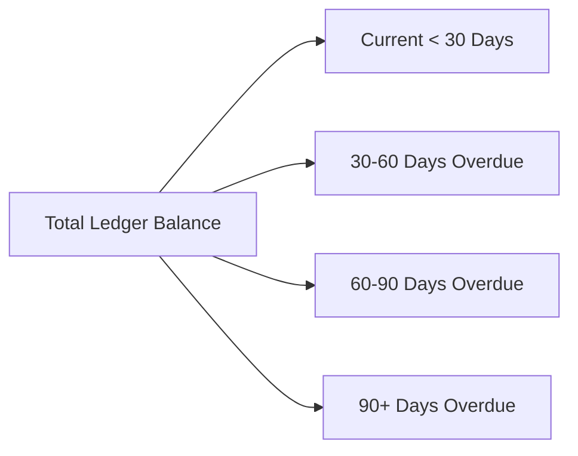

# Customer, Supplier & Tax Balances

The **Balances** module provides debtor and creditor aging reports, allowing credit controllers and finance teams to track cash flow, overdue balances, and net tax liabilities.

---

## Aging Buckets & Tax Summaries

### 1. Customer Aging (Accounts Receivable)
Breaks down all unpaid customer invoices into standard 30-day buckets based on invoice due dates. Helps credit teams identify delinquent accounts before issuing new orders.

### 2. Supplier Aging (Accounts Payable)
Displays upcoming payment commitments owed to vendors, helping finance plan weekly cash disbursements.

### 3. Tax Balances
Summarizes output tax (GST/VAT collected on sales) against input tax (GST/VAT paid on purchases) to calculate the net tax payment or refund due for the period.

---

## Step-by-Step Workflows

### 1. Generating a Customer Statement
1. Go to **Finance** → **Balances** → **Customers** (`/balances/customers`).
2. Search for the customer name.
3. Review their aging breakdown and total outstanding exposure.
4. Click **Export Statement PDF** or **Email Statement** to send a formal statement of account to the debtor.

---

## Field Reference

| Field | Description |
| :--- | :--- |
| **Total Balance** | Total unpaid ledger balance. |
| **Current** | Within agreed payment terms. |
| **30 / 60 / 90+ Days** | Overdue aging buckets. |
| **Net Tax Position** | Output Tax minus Input Tax. |
