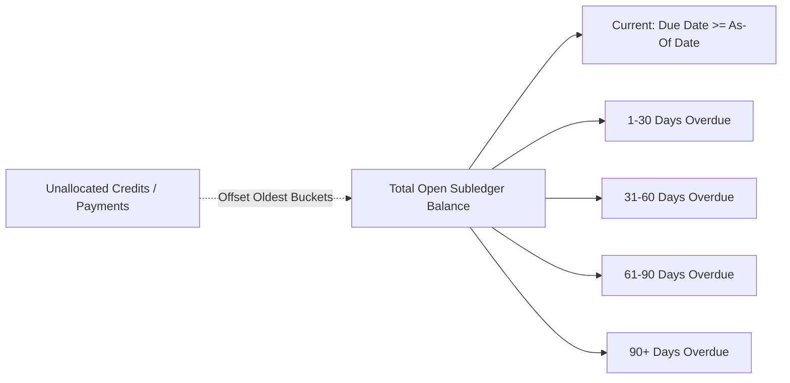

# Customer, Supplier & Tax Balances

The **Balances** module provides debtor and creditor aging reports, allowing credit controllers and finance teams to audit cash flow, overdue balances, and net statutory tax liabilities.

---

## Aging Buckets & Tax Position Calculations



### 1. The Aging Bucket Classification Algorithm
For every open invoice in Accounts Receivable and Accounts Payable:

```
Days Overdue = max(0, asOfDate - invoiceDueDate)
```

* **Current**: `invoiceDueDate >= asOfDate` (within agreed commercial payment terms).
* **1–30 Days**: `1 <= Days Overdue <= 30`
* **31–60 Days**: `31 <= Days Overdue <= 60`
* **61–90 Days**: `61 <= Days Overdue <= 90`
* **90+ Days**: `Days Overdue > 90` (triggers strict credit hold warnings).

### 2. Treatment of Unallocated Credits & Prepayments
* Unapplied customer payment deposits and unallocated credit notes are credited against the account's total exposure.
* In standard aged debtors reports, unallocated credits offset the **oldest aging buckets first**, ensuring overdue flags reflect genuine delinquency.

### 3. Net Tax Liability Equation
The tax balance summary aggregates all posted GST / VAT tax groups over the active reporting period:

```
Net Tax Payable / (Refund) = Total Output Tax (Sales Invoices) - Total Input Tax (Supplier Bills)
```

* If `Output Tax > Input Tax`, a net liability is owed to the revenue authority.
* If `Input Tax > Output Tax`, a net refund is claimable.

---

## Step-by-Step Workflows

### 1. Generating and Emailing a Customer Statement
1. Go to **Finance** → **Balances** → **Customers** (`/balances/customers`).
2. Search for the debtor account.
3. Review their aging breakdown, open invoices, and unallocated credits.
4. Click **Statement PDF** to generate an official branded PDF statement or click **Email Statement** to send it directly to the customer's billing contact.

### 2. Auditing Supplier Aging
1. Go to **Finance** → **Balances** → **Suppliers** (`/balances/suppliers`).
2. Review upcoming payment obligations by due date bucket to schedule weekly payment batches.

### 3. Reviewing Tax Balances and Statutory Reports
1. Go to **Finance** → **Balances** → **Tax** (`/balances/tax`).
2. Select your desired **Report Template** from the dropdown:
   - **Generic Tax Summary (Global)**: International VAT/GST balances with Output Tax, Input Tax, Net Position, Turnover breakdown, and Tax Category schedule.
   - **Australia (ATO BAS)**: Australian Business Activity Statement boxes (G1, 1A, 1B, 8A, 8B, 9).
   - **United Kingdom (HMRC VAT Return)**: VAT 100 Return boxes (Boxes 1–9).
   - **Singapore (IRAS GST Form 5)**: GST F5 return boxes (Boxes 1–8).
   - **New Zealand (Inland Revenue GST 101)**: GST 101 return boxes (Boxes 5, 6, 7, 8, 9, 11, 12).
   - **Germany / EU (USt-VA)**: Umsatzsteuer-Voranmeldung lines (Zg 81, 86, 41, 66, 83).
   - **United States (Sales & Use Tax)**: State and local sales & use tax summary.
3. Set `From Date` and `To Date` filters to calculate period liabilities. Your chosen template is automatically remembered across sessions.
4. Click on any statutory box value in country views to copy it directly to your clipboard for easy online portal lodgement.

---

## Field Reference

| Field | Description |
| :--- | :--- |
| **Total Balance** | Total net ledger balance across all open documents. |
| **Current** | Unpaid balance within agreed payment terms. |
| **1–30 / 31–60 / 61–90 / 90+ Days** | Standard overdue aging columns. |
| **Unallocated Credits** | Open credit notes and prepayments not yet allocated to specific bills. |
| **Net Tax Position** | Statutory tax liability (`Output Tax - Input Tax`). |
