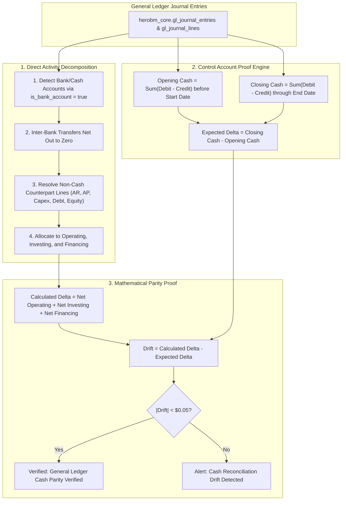

# Statement of Cash Flows

The **Statement of Cash Flows** (`/general-ledger/cash-flow`) provides a direct, mathematically reconciled view of how cash moves through HeroBM over any selected fiscal period or custom date range.

While the Income Statement (P&L) tracks revenue and expenses on an **accrual basis**, the Statement of Cash Flows tracks actual **liquidity movements** (cash in and cash out of bank accounts).

---

## Direct Method Decomposition & Dual-Verification Engine

HeroBM implements a **Direct Activity Classification** engine paired with an **Independent Control Account Proof Engine**:

---

## Financial Classification Rules

### 1. Operating Activities
Cash flows directly related to running the business and delivering products:
* **Cash Receipts from Customers & Sales**: Payments received from customers against sales invoices (`party_type = 'customer'`, `default_ar_account_id`, revenue accounts).
* **Cash Paid to Suppliers & Inventory**: Disbursements to vendors for raw materials, inventory, and operating expenses (`party_type = 'supplier'`, `default_ap_account_id`, COGS, inventory assets).
* **Cash Paid to Employees & Payroll**: Wage and salary payments, superannuation, and payroll liabilities.
* **Income Tax & GST/VAT Payments (Net)**: Net tax remittances and input credit refunds (`default_sales_tax_account_id`, `default_purchase_tax_account_id`, GST/VAT clearing accounts).
* **Interest & Finance Charges Paid**: Bank service charges and borrowing interest.

### 2. Investing Activities
Capital investments in long-term operational infrastructure:
* **Purchase of Property, Plant & Equipment (Capex)**: Cash outflows for machinery, vehicles, tooling, and facility improvements.
* **Proceeds from Sale of Fixed Assets**: Cash inflows from selling or disposing of capital assets.

### 3. Financing Activities
Capital structure and debt financing transactions:
* **Proceeds from Issuance of Share Capital**: Equity injections and owner contributions.
* **Proceeds from Borrowings & Facilities**: Loan drawdowns and credit facility receipts.
* **Repayment of Borrowings & Leases**: Principal payments reducing loan and lease liabilities.
* **Dividends & Capital Distributions Paid**: Cash returns distributed to shareholders.

---

## Universal & Multi-Standard Compatibility

HeroBM is engineered to work universally across regional and international accounting standards:
* **Schema-Native Bank Account Identification**: Identifies bank and cash accounts using the `gl_accounts.is_bank_account = true` flag rather than relying on brittle account numbering prefixes.
* **International Standards Support**: Works out-of-the-box with **Anglo-Saxon/US GAAP** (4-digit numbering), **French PCG / OHADA** (Class 5 Bank, Class 4 AR/AP, Class 2 Capex), **German DATEV SKR03/SKR04** (`1200`/`1800` Bank, `0400`/`0600` Fixed Assets), and custom enterprise alphanumeric account codes (`BANK-USD-01`).
* **Inter-Bank Transfer Neutrality**: Moving funds between internal bank accounts (e.g. Operating to Savings) is recognized as an internal liquidity transfer and netted out to zero so operating cash flows remain undistorted.

---

## Step-by-Step Workflows

### 1. Reviewing the Statement of Cash Flows
1. Navigate to **Finance** → **General Ledger** → **Cash Flow** (`/general-ledger/cash-flow`).
2. Select your reporting view:
   * **Fiscal Period**: Select an accounting period (e.g. `2026-08 (hard closed)`).
   * **Custom Date Range**: Pick arbitrary Start and End dates.
3. Check the **Parity Verification Banner**:
   * A green banner confirms that calculated operational flows exactly match ledger bank account movements.
4. Review the KPI cards and four detailed schedules for Operating, Investing, Financing, and the Cash Reconciliation Schedule.

### 2. Exporting Statement PDFs
1. On the Cash Flow page, click **Statement PDF**.
2. The report service formats the statement using the official Typst report engine (`cash-flow-statement.typ`), embedding:
   * Company name, tax registration number, and address.
   * Full breakdown of all four financial schedules in the base currency.
   * Formal verification and sign-off block for controller, CFO, and auditor review.
   * Cryptographic SHA-256 snapshot hash ensuring document integrity.
3. The generated PDF opens in a new tab for saving, printing, or distribution to board members and auditors.
