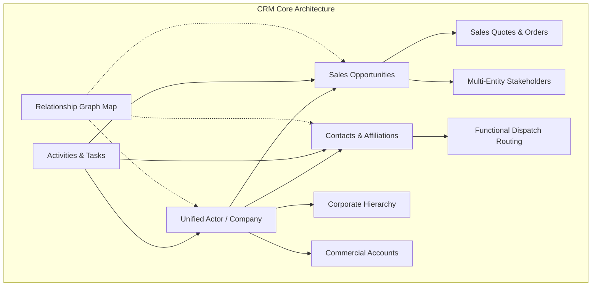
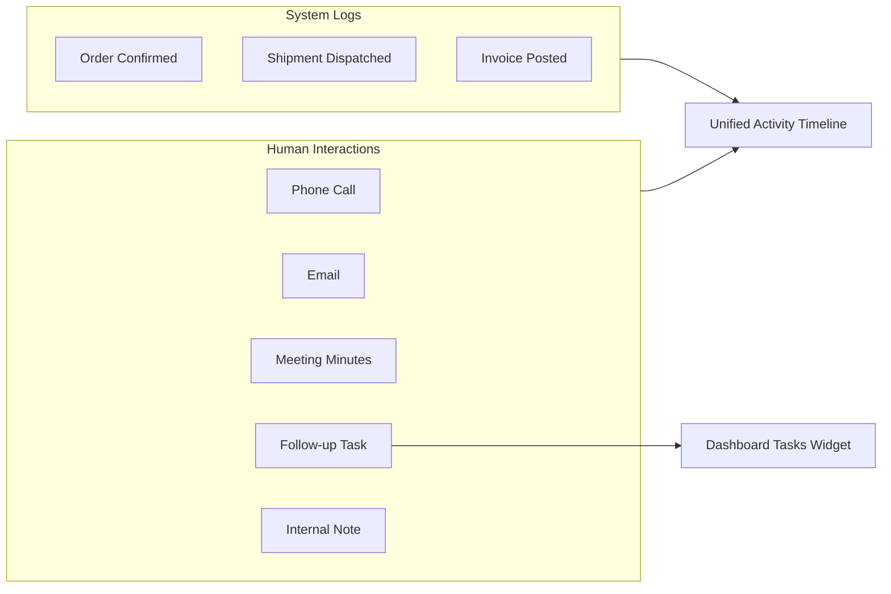

# CRM: Actors, Opportunities, Contacts & Activities

The **CRM** module provides an integrated environment for managing commercial relationships, sales pipeline funnels, corporate group hierarchies, functional document dispatch routing, human communication logs, and visual network graphs.

---

## Architecture & Core Concepts

### 1. The Unified Actor Model

Traditional enterprise systems often isolate customer databases from supplier catalogs, creating duplicate records when a business partner acts as both a buyer and a vendor.

In HeroBM, an **Actor** represents a single legal or business entity profile:
- **Multi-Role Capability**: An Actor can simultaneously serve as a customer, a supplier, a prospect, and a strategic partner while maintaining a single address book, tax registration profile, and document history.
- **Account Ownership**: Each Actor can be assigned an **Account Owner** (`owner_id`) from active system users. This establishes clear internal accountability for account management.
- **Ownership Views & Filtering**: The Actors directory (`/crm/actors`) includes an **Owner Filter** allowing team members to view **My Accounts**, inspect **All Owners**, or identify **Unassigned** accounts needing outreach.

---

### 2. Dual Commercial Accounts View

On every Actor detail screen (`/crm/actors/:id`), the **Commercial Accounts** tab bridges CRM relationships with ERP trading ledgers:

- **Customer Profile Integration**:
  - Displays linked Customer Number, Trading Currency, Credit Limit, and active Credit Hold status.
  - Features an embedded interactive grid of all recent **Sales Orders** placed by this entity, with order numbers, statuses, total values, and creation dates.
  - Includes a direct shortcut to generate a new Sales Order.
- **Supplier Profile Integration**:
  - Displays linked Vendor Number, Operating Currency, and Purchasing Status (Active vs. Blocked).
  - Features an embedded interactive grid of all recent **Purchase Orders** raised with this vendor.
  - Includes a direct shortcut to raise a new Purchase Order.
- **1-Click Commercial Account Creation**:
  - When viewing an Actor that has not yet traded commercially, operators can provision a dedicated Customer or Supplier account with a single click, instantly inheriting company details without manual re-entry.

---

### 3. Corporate Hierarchy & Group Trees

Modern enterprise clients often operate through parent holding companies, subsidiaries, branch offices, and joint ventures. The **Corporate Hierarchy** tab (`/crm/actors/:id` -> Corporate Hierarchy) manages these inter-corporate linkages:

- **Structural Link Types**:
  - `parent_company`: Designates the controlling holding company or corporate headquarters.
  - `subsidiary`: Designates an operating division, regional branch, or subsidiary entity.
  - `partner`: Designates a strategic alliance, consortium member, or channel distribution partner.
- **Reciprocal Perspective Mapping**:
  - Relationship symmetry is maintained automatically. When an operator designates Company B as a `subsidiary` of Company A, viewing Company B automatically catalogs Company A as its `parent_company`.
- **Relationship Management**:
  - Search and link external Actors with dedicated roles, or unlink relationships when organizational restructurings occur.

---

### 4. Sales Opportunities & Pipeline Management

The CRM Opportunity engine (`/crm/opportunities`) provides end-to-end management of sales deals, revenue forecasting, and quotation conversions.

> [!NOTE]
> **Evolution from Projects**: The Opportunity engine replaces legacy basic project trackers with a full commercial deal workflow. All historical project routes (`/crm/projects`) automatically redirect to `/crm/opportunities`.

#### A. Configurable Pipeline Stages
Opportunities progress through configurable stages defined in system settings (`/admin/settings/crm`), such as `Discovery`, `Qualification`, `Proposal`, `Negotiation`, `Won`, and `Lost`.

#### B. Interactive Kanban Board & List Views
- **Kanban Board**: The primary view organizes deal cards by pipeline stage. Sales reps can drag and drop cards or click stage advancement buttons to progress deals forward. Cards display deal value, currency, win probability, close date, and linked client name.
- **DataGrid List View**: Provides a high-density tabular view with column sorting, advanced filtering, quick search, and CSV export.

#### C. Deal Valuation & Forecasting Metrics
Each opportunity captures vital commercial metrics:
- **Estimated Deal Value**: Projected contract revenue in the deal's trading currency (`USD`, `EUR`, `GBP`, `CAD`, `AUD`).
- **Win Probability**: Slider-controlled probability percentage (0% to 100%) indicating deal confidence.
- **Target Close Date**: Projected closing calendar date used in rolling revenue forecasts.
- **Actual Won Value**: Confirmed final revenue figure recorded upon closing.
- **Description & Deal Scope**: Contextual drivers, competitive differentiators, and scope requirements.

#### D. Live Deal Revenue & Commercial Quotes Tab
Under the **Commercial & Quotes** tab of an Opportunity:
- **Live Deal Revenue Rollup**: Dynamically calculates total booked revenue across all associated quotes and confirmed sales orders in real-time.
- **Embedded Quotes & Orders Grid**: Lists all quotes and sales orders connected to the deal, including order numbers, line descriptions, customer accounts, and progression states.
- **Direct Deal Conversion Actions**:
  - **Convert to Order**: Launches `/sales-orders/new?opportunityId=<id>` pre-populating the opportunity link.
  - **Create Quote**: Launches `/sales-quotes/new?opportunityId=<id>` to issue commercial proposals.

#### E. Stakeholders & Contacts
- **Stakeholders Tab**: Links multiple Actor organizations to the deal (e.g. Lead Contractor, Architectural Firm, Engineering Consultant, Financing Partner) with customized role tags.
- **Contacts Tab**: Links individual decision-makers and influencers to the opportunity with explicit project roles.

#### F. Deal Notes & Collaboration
- Dedicated internal notes stream supporting team discussion, negotiation logs, and strategic handover notes, complete with author attribution and timestamps.

#### G. Lifecycle State Machine
Opportunities adhere to formal lifecycle states: `Active`, `Inactive`, and `Archived`. Team members with appropriate permissions can archive completed or abandoned opportunities, or restore archived deals when negotiations resume.

---

### 5. Contacts & Multi-Company Affiliations

Contacts represent individual human representatives (`/crm/contacts`).

#### A. Multi-Company Affiliations
A single individual can be affiliated with multiple Actor organizations simultaneously (for example, an external legal counsel, a fractional CFO, or an executive board member serving multiple corporate entities).
- The **Affiliated Companies** tab (`/crm/contacts/:id` -> Affiliated Companies) allows operators to link a contact to several companies.
- For each affiliated company, operators can specify the structural link type (`employee`, `advisor`, `board_member`) and specific dispatch responsibilities.

#### B. Functional Dispatch Routing Tags (`primary_for`)
Contacts can be assigned functional dispatch tags that govern automated document transmission:
- `billing`: Automatically targeted when emailing Sales Invoices, Credit Notes, or Customer Statements.
- `shipping`: Automatically targeted when transmitting Shipping Dockets and Carrier Tracking notifications.
- `purchasing`: Automatically targeted when dispatching Purchase Orders to vendors.
- `sales`: Targeted for commercial proposals and sales quotations.
- `general`: Default contact point for general correspondence.

#### C. Quick Contact Slide-Over
The slide-over contact drawer (`ContactSlideOver`) is accessible throughout the Ops Portal across customer profiles, supplier pages, sales orders, and shipment screens. Operators can inspect or add contacts without navigating away from their current task.

---

### 6. Human Activities & Task Management

HeroBM captures both human touchpoints and automated system events in a unified timeline.

#### A. Unified Activity Timeline
Displayed on Actor, Contact, and Opportunity pages, the **Activity Timeline** presents a comprehensive chronological history combining:
- **Human Interactions**: Logged calls, outgoing emails, meeting minutes, notes, and tasks.
- **System Audit Logs**: Automated ERP transactions (orders placed, status changes, invoice generation).

#### B. Quick Action Interaction Logging
Using the action buttons on the timeline, operators can open the **Log Activity** modal to quickly record:
- **Phone Call**: Log call summaries, outcomes, and participant notes.
- **Email**: Record correspondence details and discussions.
- **Meeting**: Capture meeting minutes, attendees, and agreed deliverables.
- **Follow-up Task**: Schedule an action item with priority (`Low`, `Medium`, `High`, `Urgent`), target due date, and user assignment (`assignedToUserId`).
- **Note**: Log ad-hoc intelligence or operational comments.

#### C. Multi-Contact Association & Meeting Attendees
Real-world sales meetings and discovery calls rarely involve only one person. HeroBM supports associating **multiple contacts** with a single interaction:
- **Multi-Attendee Tagging**: Operators can tag multiple client representatives or external stakeholders (`contactIds`) when logging an activity or scheduling a task.
- **Automatic Deal Stakeholder Sync**: When an activity is associated with an Opportunity and includes contacts, HeroBM automatically registers those contacts into the Opportunity's stakeholder directory (`opportunity_contacts`) if they are not already linked. This ensures deal teams maintain a complete stakeholder roster without duplicate manual entry.
- **Contact Timeline Traversal**: Filtering the activity timeline by a specific contact (`contactId`) immediately retrieves all interactions involving that person, regardless of the organization or opportunity under which the meeting occurred.

#### D. Timeline View Filtering
The timeline includes an instant filter switch:
- **All Activity**: Displays both human interactions and automated system audit logs.
- **Interactions & Tasks**: Filters exclusively for human communication and scheduled tasks.
- **System Logs**: Displays only background ERP system event logs.

#### E. In-Line Task Completion
Tasks rendered on the activity timeline feature an interactive status checkbox. Operators can mark tasks as completed directly from the timeline, or reopen them if additional follow-up is required.

#### F. Operations Dashboard Tasks Widget
The homepage dashboard (`/`) includes the **My Tasks** widget (`DashboardTasksWidget`):
- **Filter Switch**: Toggle between **My Tasks** (assigned specifically to the logged-in user) and **All Open Tasks** across the team.
- **Due Date & Overdue Indicators**: Visually highlights tasks that are overdue, due today, or upcoming.
- **Priority Badging**: Distinct badges for `Urgent`, `High`, `Medium`, and `Low` tasks.
- **1-Click Completion**: Checking off a task immediately marks it complete and updates backend records.
- **Fast Task Creation**: Create new follow-up tasks directly from the dashboard.

---

### 7. Interactive Relationship Graph & Network Map

The **Relationship Map** (`/crm/map`) renders an interactive visual graph powered by ReactFlow, illustrating complex networks between companies, people, and commercial initiatives.

- **Visual Entity Nodes**:
  - **Actors (Blue)**: Company profiles with business details and direct links.
  - **Contacts (Green)**: Individual representatives with direct phone and email links.
  - **Opportunities (Purple)**: Active sales deals and commercial projects.
- **Focal Actor Selection**:
  - Search for any Actor using the autocomplete selector to center the map on that entity.
  - URL parameter support (`/crm/map?actorId=<uuid>`) allows direct navigation from an Actor profile into the graph.
- **Dynamic Node Expansion**:
  - Each node features an expansion button (`+`). Clicking it dynamically loads and displays all connected corporate links, affiliated contacts, and active opportunities without refreshing the page.
- **Navigation & Controls**:
  - Full pan, smooth zoom, interactive minimap overview, and clickable links to open the respective entity's detail page.

---

## Step-by-Step Workflows

### 1. Creating an Actor Account with Ownership
1. Navigate to **CRM** → **Actors** (`/crm/actors`).
2. Click **New Actor** (`/crm/actors/new`).
3. Enter the **Company Name**, **Headquarters Address**, **Email**, **Telephone**, and **Tax Registration** details.
4. Select the responsible team member in the **Account Owner** dropdown.
5. Click **Create Actor**.
6. On the Actor detail page, open the **Commercial Accounts** tab to provision Customer or Supplier trading profiles if applicable.

### 2. Establishing Corporate Group Hierarchies
1. Open an existing Actor record (`/crm/actors/:id`).
2. Select the **Corporate Hierarchy** tab in the navigation bar.
3. Click **Link Company**.
4. Search for the target organization using the Actor search field.
5. Select the **Relationship Type**:
   - `Parent Company` (if the target holds ownership of this entity).
   - `Subsidiary` (if this entity holds ownership of the target).
   - `Strategic Partner` (for joint ventures or commercial alliances).
6. Click **Save Link**. The reciprocal relationship will immediately reflect on the partner's profile.

### 3. Adding a Contact with Multi-Company Roles & Dispatch Tags
1. Navigate to **CRM** → **Contacts** (`/crm/contacts`) and click **New Contact** (`/crm/contacts/new`).
2. Enter the contact's **First Name**, **Last Name**, **Email**, and **Mobile Phone**.
3. Select the primary **Affiliated Company** and specify their structural relationship (`Employee`, `Advisor`, `Board Member`).
4. Select the applicable **Dispatch Tags** (e.g. `billing` for accounting reps, `shipping` for logistics contacts).
5. Click **Save Contact**.
6. To affiliate the contact with additional companies, open their detail page (`/crm/contacts/:id`), navigate to **Affiliated Companies**, click **Link Company**, and configure additional dispatch roles.

### 4. Managing Opportunities in the Kanban Board & Converting to Orders
1. Navigate to **CRM** → **Opportunities** (`/crm/opportunities`).
2. Click **New Opportunity** (`/crm/opportunities/new`).
3. Enter the **Opportunity Name**, select the **Pipeline Stage**, **Opportunity Type**, and assign an **Opportunity Owner**.
4. Set the **Estimated Deal Value**, select the **Currency**, and assign the **Win Probability %** and **Target Close Date**.
5. Click **Save Opportunity**.
6. On the Opportunity detail page:
   - Use the **Stakeholders** tab to associate partner companies, architects, or consultants.
   - Use the **Commercial & Quotes** tab to view real-time deal revenue rollups.
7. To convert the deal, click **Convert to Order** in the header actions. This opens the sales order creation form pre-linked to the opportunity.

### 5. Logging Interactions & Follow-Up Tasks
1. Open any Actor, Contact, or Opportunity detail page.
2. Scroll to the **Activity Timeline** section.
3. Click one of the quick logging buttons:
   - **Log Call**: Record phone conversation takeaways.
   - **Log Email**: Record correspondence history.
   - **Log Meeting**: Document meeting agendas and decisions.
   - **New Task**: Schedule a follow-up action item.
4. Configure interaction details:
   - Provide a clear **Subject** and detailed notes or minutes in the **Description**.
   - Tag one or more **Contacts / Attendees** (`contactIds`) involved in the interaction. For client meetings or group calls with multiple stakeholders, select all attending participants.
   - If linked to an Opportunity, any tagged contacts will automatically be synchronized into the Opportunity's stakeholder contact list.
   - When creating a task, set the **Priority** (`Low`, `Medium`, `High`, `Urgent`), target **Due Date**, and select the assigned team member (`assignedToUserId`).
5. Click **Save Activity**.
6. View and complete the task from the entity timeline or from the **My Tasks** widget on the Operations Dashboard.

### 6. Exploring Networks in the Relationship Map
1. Navigate to **CRM** → **Map** (`/crm/map`).
2. Use the search bar in the top-left corner to search for a company Actor.
3. The graph centers on the selected Actor, revealing linked contacts and opportunities.
4. Hover over any node and click the `+` button to expand additional connections.
5. Click on any node's title link to open its full profile page in a new view.

---

## Field Reference

| Field | Context | Description |
| :--- | :--- | :--- |
| **Actor Name** | Actor / Account | Official trading or legal business name. |
| **Account Owner** | Actor / Account | System user responsible for maintaining the business relationship. |
| **Industry** | Actor / Account | Industry vertical classification (e.g. Manufacturing, Retail, Construction). |
| **Is Tax Registered** | Actor / Account | Boolean indicator confirming registered corporate tax status. |
| **Corporate Link Type** | Actor / Hierarchy | Classification of corporate link: `parent_company`, `subsidiary`, `partner`. |
| **Opportunity Name** | Opportunity | Commercial deal name or client initiative tracker. |
| **Opportunity Owner** | Opportunity | Sales representative or account manager driving deal execution. |
| **Pipeline Stage** | Opportunity | Configurable sales stage (e.g. Discovery, Proposal, Negotiation, Won, Lost). |
| **Estimated Deal Value** | Opportunity | Projected total contract value in selected operating currency. |
| **Deal Currency** | Opportunity | ISO currency code (`USD`, `EUR`, `GBP`, `CAD`, `AUD`) used for valuation. |
| **Win Probability** | Opportunity | Estimated percentage likelihood of deal success (0% to 100%). |
| **Target Close Date** | Opportunity | Expected contract execution date for pipeline forecasting. |
| **Actual Won Value** | Opportunity | Final booked revenue amount achieved upon deal victory. |
| **Live Deal Revenue** | Opportunity | Calculated aggregate total across all associated quotes and confirmed orders. |
| **Contact Name** | Contact | First and last name of the individual representative. |
| **Email & Phone** | Contact | Direct electronic contact endpoints for correspondence. |
| **Affiliation Link Type** | Contact / Affiliation | Structural relationship to an Actor: `employee`, `advisor`, `board_member`. |
| **Dispatch Tags** | Contact / Dispatch | Automated document dispatch routing: `billing`, `shipping`, `purchasing`, `sales`, `general`. |
| **Primary Flag** | Contact / Dispatch | Designates the primary contact person for default correspondence. |
| **Activity Type** | Activity / Task | Classification of interaction: `call`, `email`, `meeting`, `task`, `note`. |
| **Linked Contacts / Attendees** | Activity / Task | Array of one or more contacts associated with the interaction (e.g. meeting participants, call attendees, task collaborators). |
| **Activity Priority** | Activity / Task | Priority urgency level: `low`, `medium`, `high`, `urgent`. |
| **Activity Status** | Activity / Task | Operational task status: `open`, `completed`, `cancelled`, `scheduled`. |
| **Due Date** | Activity / Task | Calendar deadline for task execution with overdue highlighting. |
| **Assignee** | Activity / Task | Internal system user assigned to complete the follow-up task. |

---

## Event Logging & Webhooks

All CRM state mutations are recorded to the central audit log (`master_data_events`) and relayed via the Transactional Outbox for real-time webhook subscriptions.

### Supported Webhook Events

| Domain Entity | Event Identifier | Trigger Condition |
| :--- | :--- | :--- |
| **Opportunity** | `opportunity.created` | New commercial opportunity created via UI or API. Payload includes `opportunityId`, `opportunityName`. |
| | `opportunity.updated` | Opportunity attributes, stage, value, linked actors, contacts, notes, or activities updated. |
| | `opportunity.deleted` | Opportunity permanently removed. |
| **CRM Activity** | `crm_activity.created` | New interaction (Call, Meeting, Email, Note) or follow-up task logged. Payload includes `activityType`, `subject`, `status`, `priority`, `actorId`, `contactIds`, `projectId`, `dueDate`, `assignedToUserId`. |
| | `crm_activity.updated` | Activity subject, description, due date, assignee, or priority edited. |
| | `crm_activity.status_changed`| Task marked as completed or reopened. Payload includes `previousStatus` and `newStatus`. |
| | `crm_activity.deleted` | Activity or task deleted. |
| **Actor** | `actor.created` | New business entity profile registered. |
| | `actor.updated` | Profile, tax details, corporate relationships, or owner changed. |
| | `actor.deleted` | Actor record removed. |
| **Contact** | `contact.created` | Individual contact person created and linked to actor/opportunity. |
| | `contact.updated` | Contact details, job title, or dispatch roles updated. |
| | `contact.deleted` | Contact record removed. |

### Cross-Entity Audit Trails
When an activity or task is logged:
1. A primary audit event is emitted under `crm_activity.created`.
2. If linked to an Actor, an update event (`actor.updated`) is emitted against the Actor with activity summary metadata.
3. If contacts are linked (`contactIds`), an update event (`contact.updated`) is emitted against each participating Contact.
4. If linked to an Opportunity (`projectId`), an update event (`opportunity.updated`) is emitted against the Opportunity, and any new contacts are automatically linked to the deal.

For webhook subscription configuration, signature verification headers, and payload schemas, refer to the [Webhooks API Reference](/admin/developers#webhooks-api).

