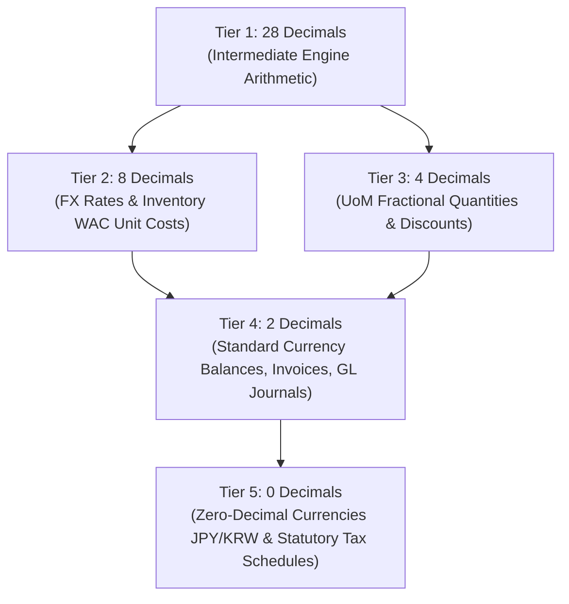

# Currency, Pricing & Rounding Rules

HeroBM is engineered to provide mathematical certainty across global commerce. From sub-cent bill-of-materials components and volatile foreign exchange rates to statutory tax filings and double-entry general ledger books, financial calculations are governed by a strict **5-Tier Precision Architecture**.

---

## The 5-Tier Precision Architecture

To eliminate floating-point drift, compounding rounding errors, and sub-penny leaks, HeroBM standardizes numbers into five distinct tiers:



| Tier | Decimal Precision | Target Domains & Operations | Business Rationale |
| :--- | :--- | :--- | :--- |
| **Tier 1** | **28 d.p.** | Intermediate math, tax extraction, chain discounts | High-precision scratchpad preventing floating-point drift during multi-step formulas. |
| **Tier 2** | **8 d.p.** | FX spot & forward rates, inventory WAC unit costs | Prevents rounding loss on bulk sub-cent parts (e.g. 0.00354125 per screw) and currency triangulation. |
| **Tier 3** | **4 d.p.** | Unit of Measure (UoM) fractions, pack conversion ratios, discount % | Supports non-integer physical measurements (e.g., `0.1250 KG`, `1.7500 M`) and fractional contract discounts. |
| **Tier 4** | **2 d.p.** | Standard fiat currencies (USD, EUR, GBP, AUD), GL journals, AR/AP | Legal and commercial standard for invoicing, payment files (ABA/NACHA), and double-entry books. |
| **Tier 5** | **0 d.p.** | Zero-decimal currencies (JPY, KRW, IDR), Tax Returns (ATO/HMRC/IRAS) | Handles currencies without minor units and statutory whole-currency reporting schedules. |

---

## 1. Rounding Mode Standard: Round Half-Up

Unless statutory tax laws dictate otherwise, all commercial financial calculations in HeroBM use **Half-Up Rounding** (`Decimal.ROUND_HALF_UP`):

```
If the next digit is >= 5, round away from zero; otherwise, round down.
```

```
Example: 10.555 rounds to 10.56
Example: 10.554 rounds to 10.55
```

Intermediate operations maintain full 28-decimal precision and are only rounded when crossing a storage or document boundary (such as saving an invoice line or posting a general ledger debit/credit).

---

## 2. Multi-Currency & FX Triangulation

HeroBM supports seamless multi-currency purchasing and sales:

1. **Base Currency**: The functional currency of the company (e.g., `AUD`, `USD`, `EUR`). All General Ledger journals and Balance Sheet statements are maintained in the Base Currency.
2. **Transaction Currency**: The currency agreed upon with the customer or supplier on quotes, sales orders, purchase orders, and invoices.
3. **8-Decimal Exchange Rate Precision**:
   - Exchange rates are entered, stored, and applied with **8 decimal places** of precision (e.g., `0.65412000`).
   - When converting between two non-base currencies (triangulation), the rate calculation maintains 28 decimal places internally before rounding the resulting base-equivalent amount to the target currency's native minor unit.
4. **Zero-Decimal Currencies**:
   - For currencies such as Japanese Yen (`JPY`), South Korean Won (`KRW`), and Indonesian Rupiah (`IDR`), the system automatically disables minor fractions, formatting and rounding all document totals directly to whole integers (0 decimal places).

---

## 3. Pricing, Compound Discounts & Tax Calculation

### A. Line Item Pricing
* **Unit Price**: Derived from customer price scales, quantity break matrices, or promotional price lists.
* **Compound Line Discounts**: Multi-tier discounts (e.g. 10% + 5%) are evaluated multiplicatively rather than additively:

```
Net Price = Unit Price * (1 - Discount1) * (1 - Discount2)
```

* **Discount Bounds**: All percentage inputs are strictly bounded between 0% and 100% (`0 <= discount <= 100`) to prevent negative order totals.

### B. Tax-Inclusive vs. Tax-Exclusive Extraction

```
Tax Exclusive Pricing:
Tax Amount  = RoundMoney(Line Subtotal * Tax Rate)
Gross Total = Line Subtotal + Tax Amount

Tax Inclusive Pricing:
Line Subtotal = RoundMoney(Line Gross / (1 + Tax Rate))
Tax Amount    = Line Gross - Line Subtotal
```

---

## 4. Payment Allocation & Remainder Distribution (Hare-Niemeyer)

When applying lump-sum deposits, customer prepayments, or bulk settlement discounts across multiple open invoices, standard proportional rounding can leave orphaned fractions of a cent (e.g., three invoices each allocated 33.33 from a 100.00 payment, leaving 0.01 unallocated).

HeroBM solves this using the **Hare-Niemeyer (Largest Remainder) Method**:
1. Computes the exact fractional allocation for each invoice at 28 decimal places.
2. Allocates the integer floor (whole cents) to each invoice.
3. Computes the remaining unallocated cents.
4. Distributes the leftover cents one-by-one to the invoices with the largest fractional remainders.

**Result**: The sum of allocated amounts is mathematically guaranteed to equal 100.00% of the payment amount, with zero orphaned sub-pennies.

---

## 5. Double-Entry General Ledger Invariants

Every financial transaction posted to the General Ledger obeys strict mathematical invariants:

1. **Zero-Sum Balance Invariant**:

```
|Total Debits - Total Credits| <= 0.005
```

   If total debits do not equal total credits within half a cent, the transaction is rejected and rolled back atomically.

2. **Line Item Polarity**:
   - Debits and credits on an individual line must be non-negative (`Debit >= 0`, `Credit >= 0`).
   - A line cannot contain both a debit and a credit.
   - A line cannot have 0.00 for both debit and credit.

3. **Cryptographic SHA-256 Hash Chaining**:
   - Journal lines are serialized to exactly two decimal places (`toFixed(2)`) before hashing to guarantee deterministic, platform-independent cryptographic verification.

---

## 6. Statutory Tax Return Schedules

Statutory tax authorities often require specific rounding rules on tax return schedules that differ from operational accounting:

* **ATO BAS (Australia)**:
  - Total Sales (Box G1), GST on Sales (Box 1A), and GST on Purchases (Box 1B) are rounded to the nearest whole Australian Dollar on the official schedule.
  - The actual net tax liability payable remains exact to the cent on the General Ledger balance sheet.
* **HMRC VAT (UK)**:
  - Box 6 and Box 7 (Total value of sales and purchases excluding VAT) are truncated or rounded to the nearest whole pound.
  - VAT due and reclaimed (Boxes 1 to 5) remain exact to two decimal places.
* **IRAS GST (Singapore)**:
  - Form 5 Box 1 to 5 supplies and taxable purchases are rounded to whole Singapore Dollars, with tax amounts recorded to 2 decimal places.

---

## Frequently Asked Questions

### Why does an inventory item show an 8-decimal unit cost on the receipt?
High-volume manufacturing and fastener components (e.g., screws, washers, electronic components) are frequently purchased in bulk boxes of 10,000 for 35.41. Storing the unit cost at `0.00354100` prevents severe inventory valuation drift when items are issued individually or in small kit quantities.

### How does HeroBM handle penny discrepancies caused by customer payment rounding?
If a customer short-pays or over-pays by a minor fractional cent due to external bank rounding, the difference can be allocated to the **Small Balance / Penny Rounding Expense Account** configured in **Admin** → **Settings** → **Financial Settings**.
