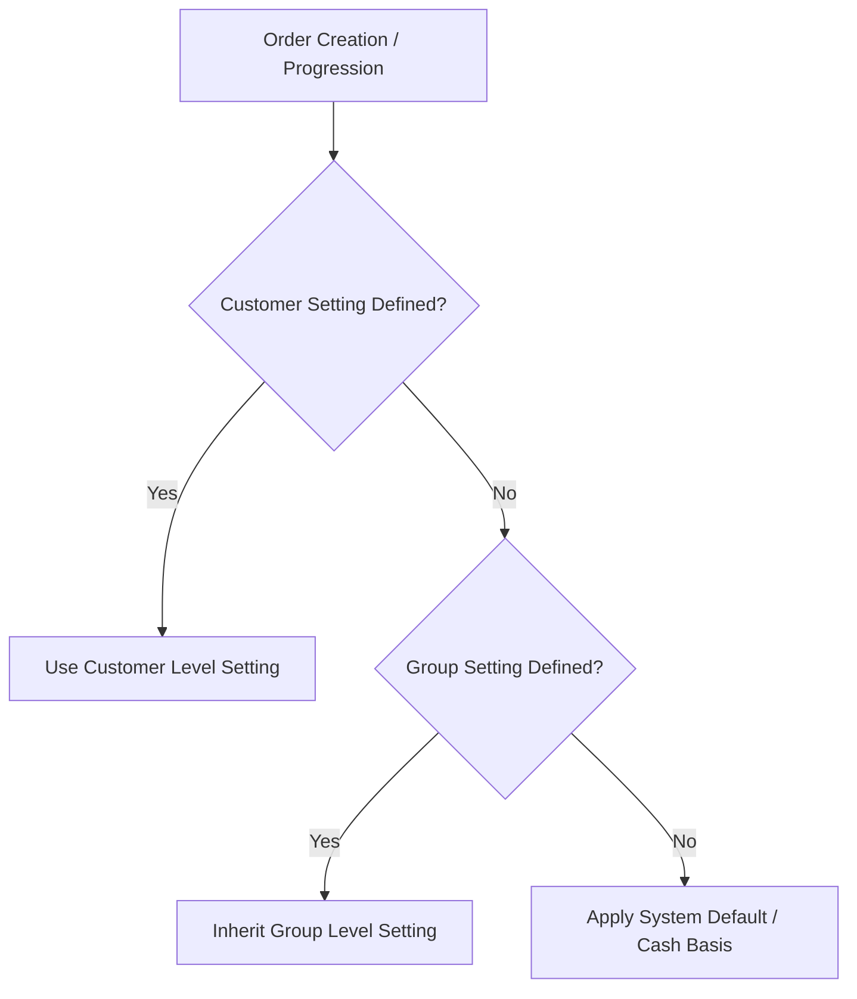

# Customer Accounts

The **Customers** module manages commercial accounts, credit controls, pricing scales, payment terms, and delivery addresses.

---

## Business Logic & Inheritance Cascades

### 1. Data Inheritance Hierarchy
When creating or updating customer orders, the system automatically resolves commercial defaults through a strict order of precedence:

| Commercial Setting | Resolution Cascade (First Match Wins) | Default / Fallback |
| :--- | :--- | :--- |
| **Credit Limit** | `1. Customer Record` → `2. Customer Group` | `0.00` (Cash Basis only) |
| **Payment Terms** | `1. Customer Record` → `2. Customer Group` → `3. System Default` | `None` (Immediate / Cash) |
| **Early Payment Discount** | `1. Customer Record` → `2. Customer Group` | `0%` (No discount) |
| **Early Payment Days** | `1. Customer Record` → `2. Customer Group` | `None` |
| **Price Scale (1–4)** | `1. Customer Group Price Scale` | `Scale 1` (Retail List Price) |



### 2. Credit Exposure & Assessment Formula
The system evaluates customer financial risk whenever an order is moved to **Quoted** or **Confirmed**:

```
Total Financial Exposure = Total Unpaid Invoice Balance + Additional Open Order Exposure
```
* **Unpaid Invoice Balance**: Sum of all posted, non-cancelled Sales Invoices minus credited amounts and unallocated customer receipts.
* **Additional Open Order Exposure**: Gross total value of open Sales Orders in `Confirmed`, `Picking`, or `Shipped` states that have not yet been fully invoiced.

### 3. Credit Hold Evaluation (Logical OR-Gate)
An account's effective credit hold status is evaluated as a logical OR-gate:

```
Is Sales Blocked = (Customer is on Credit Hold) OR (Customer Group is on Credit Hold) OR (Overdue Balance > 0) OR (Total Exposure > Effective Credit Limit)
```

* **Active Override**: If an authorized user has granted a **Credit Hold Override**, the block is bypassed until `overrideCreditHoldUntil` timestamp expires (`overrideCreditHoldUntil > Current Time`).
* **Hard vs. Soft Limit Behavior**: Under `hard` limit configuration (default), exceeding credit limits strictly prevents confirming or quoting orders. Under `soft` limit mode, operators receive a non-blocking financial warning.

---

## Step-by-Step Workflows

### 1. Creating a New Customer
1. Go to **Sales** → **Customers** (`/customers`).
2. Click **New Customer**.
3. Enter the **Company Name**, **Customer Group**, and **Currency**.
4. Select the **Trading / Payment Terms** and set the **Credit Limit**.
5. Add the primary **Billing Address** and at least one **Delivery Address**.
6. (Optional) Add primary and billing **Contact Persons** with email and phone details.
7. Click **Save Customer**.

### 2. Managing Credit Holds & Overrides
1. Open the customer details page (`/customers/:id`).
2. In the **Financial Standing** section, review total outstanding receivables, open order exposure, and remaining credit headroom.
3. To manually suspend ordering, toggle **Credit Hold: ON**.
4. To authorize a temporary override for a blocked account:
   - Click **Apply Credit Override**.
   - Select an expiry date/time and enter a mandatory **Business Justification Reason**.
   - Confirm the override to allow order confirmation within the authorized window.

---

## Field Reference

| Field | Description |
| :--- | :--- |
| **Customer Name** | Trading business name. |
| **Customer Group** | Classification tier setting default price scale (1–4), terms, and group limits. |
| **Currency** | Transaction currency for all sales orders and invoices. |
| **Credit Limit** | Maximum approved exposure in customer currency (inherits from group if null). |
| **Credit Hold** | Manual or automated flag blocking new sales order confirmations. |
| **Payment Terms** | Standard settlement timeline (e.g. Net 30, COD). |
| **Early Payment Discount** | Discount percentage for early settlement before due date. |
| **Early Payment Days** | Days from invoice date eligible for early payment discount. |
| **Tax Position** | Relational link defining tax rules and exemptions. |
| **Delivery Addresses** | Destination addresses for physical shipments. |
