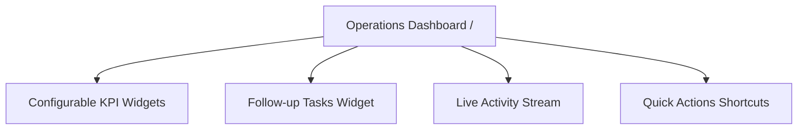

# Operations Dashboard

The **Operations Dashboard** is the daily operational cockpit. It provides real-time visibility across sales performance, warehouse deliveries, stock shortages, pending CRM tasks, and recent team activity through configurable widgets.

---

## Key Dashboard Widgets

### 1. KPI Summary Cards
The dashboard uses a dynamic, configurable `PinnedReportWidget` system. Users can pin different metrics to their dashboard tailored to their specific roles, such as sales volume, pending deliveries, or stock demand queues.

### 2. Follow-up Tasks Widget
The **My Tasks** widget keeps daily action items and scheduled client touchpoints front and center:
- **Filter Switch**: Toggle between **My Tasks** (filtered specifically for the current logged-in user) and **All Open Tasks** (team-wide backlog).
- **Priorities & Due Dates**: Displays urgency badges (`Urgent`, `High`, `Medium`, `Low`) and visually flags tasks that are overdue or due today.
- **Inline Completion**: Check off completed tasks with a single click to instantly close them.
- **Quick Task Creation**: Click **New Task** to schedule client calls, emails, or operational follow-ups without leaving the dashboard.

### 3. Live Activity Stream
Displays real-time events across all departments:
- Newly confirmed sales orders.
- Dispatched customer shipments.
- Completed supplier receipts and stock putaways.
- Posted sales and supplier invoices.

### 4. Quick Actions
Direct shortcuts to common daily workflows:
- **New Sales Order**: Create a draft quotation or sales order.
- **New Purchase Order**: Raise a supplier purchase order.

---

## Daily Operator Workflow

1. Review your **Pinned Report Widgets** for relevant queues or required actions.
2. Check your **Follow-up Tasks** to complete or schedule calls, emails, and follow-ups.
3. Use the **Activity Stream** to monitor order status changes and invoice postings.
4. Utilize **Quick Actions** to quickly generate new sales or purchase orders.

