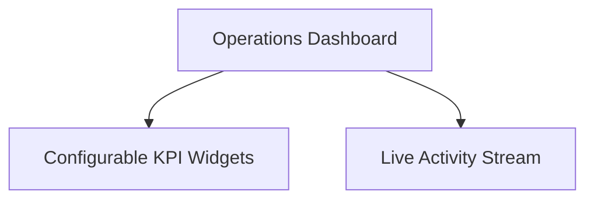

# Operations Dashboard

The **Operations Dashboard** is the daily operational cockpit. It provides real-time visibility across sales performance, warehouse deliveries, stock shortages, and recent team activity through configurable widgets.

---

## Key Dashboard Widgets

### 1. KPI Summary Cards
The dashboard uses a dynamic, configurable `PinnedReportWidget` system. Users can pin different metrics to their dashboard tailored to their specific roles, such as sales volume, pending deliveries, or stock demand queues.

### 2. Live Activity Stream
Displays real-time events across all departments:
- Newly confirmed sales orders.
- Dispatched customer shipments.
- Completed supplier receipts and stock putaways.
- Posted sales and supplier invoices.

### 3. Quick Actions
Direct shortcuts to common daily workflows:
- **New Sales Order**: Create a draft quotation or sales order.
- **New Purchase Order**: Raise a supplier purchase order.

---

## Daily Operator Workflow

1. Review your **Pinned Report Widgets** for relevant queues or required actions.
2. Use the **Activity Stream** to follow up on order status changes and invoice postings.
3. Utilize the **Quick Actions** to quickly generate new sales or purchase orders.
