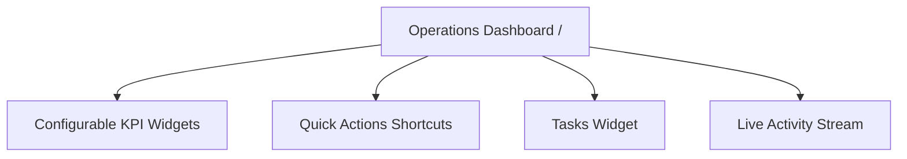

# Operations Dashboard

The **Operations Dashboard** is the daily operational cockpit. It provides real-time visibility across sales performance, warehouse deliveries, stock shortages, pending CRM tasks, and recent team activity through configurable widgets.

---

## Key Dashboard Widgets

### 1. KPI Summary Cards
Dynamic `PinnedReportWidget` cards showing live metrics tailored to your role (e.g. sales volume, pending deliveries, stock demand queues).

### 2. Quick Actions
Configurable one-click shortcuts to launch frequent creation flows, such as new sales orders or purchase orders.

### 3. Tasks Widget
The **Tasks** widget (`DashboardTasksWidget`) keeps daily action items and client touchpoints front and center:
- **My Open Tasks**: Lists your active CRM follow-ups with overdue dates flagged in red.
- **Priorities**: Visual badges for `Urgent`, `High`, `Medium`, and `Low`.
- **Linked Records**: Direct links to related accounts, contacts, and opportunities.
- **1-Click Completion**: Check off completed tasks to immediately close them.
- **Quick Creation**: Click **New Task** to schedule a call, email, or meeting without leaving the dashboard.

### 4. Live Activity Stream
Real-time chronological feed of events across departments:
- Confirmed sales orders and customer shipments.
- Completed supplier receipts and stock putaways.
- Posted sales and supplier invoices.

---

## Daily Operator Workflow

1. Review **Pinned Report Widgets** for relevant queues and critical metrics.
2. Check **Tasks** to complete due action items or schedule new follow-ups.
3. Monitor the **Activity Stream** for order transitions and invoice postings.
4. Use **Quick Actions** to rapidly create new sales or purchase orders.

