# Database Schema Reference

The **HeroBM** application core database (`herobm_core`) is a fully typed, relational PostgreSQL database managed via **Drizzle ORM**. It enforces strict referential integrity, domain state machines, event sourcing audit logs, and transactional outbox queuing.

---

## Architectural Principles & Standards

> [!NOTE]
> **1. UUID Primary Keys**: Every operational table uses a `uuid` primary key with `gen_random_uuid()` to prevent auto-increment enumeration vulnerabilities and facilitate safe distributed ingestion.

> [!IMPORTANT]
> **2. Enforced Foreign Keys & Referential Integrity**: Inter-entity relationships strictly enforce foreign keys. Cascading deletes are restricted to dependent line items (e.g., order lines, bin contents), while master dimension records use `RESTRICT` rules.

> [!TIP]
> **3. Microsoft CDM & Schema.org Conventions**: Column names follow snake_case naming aligned with common enterprise standards (`account_number`, `currency_code`, `state_code`, `created_on`, `modified_on`).

> [!WARNING]
> **4. Explicit State & No Magic Defaults**: Entity lifecycle states are strictly governed by application state machines and check constraints. No default values are used for critical financial states.

---

## Core Lineage & Entity Relationships

The following entity-relationship diagram illustrates the operational dependencies between CRM, Catalog, Sales, Purchasing, Warehouse, and General Ledger domains:

```mermaid
flowchart TD
    subgraph CRM ["CRM & Stakeholders"]
        actors["actors"]
        contacts["contacts"]
        customers["customers"]
        suppliers["suppliers"]
    end

    subgraph Catalog ["Catalog"]
        products["products"]
    end

    subgraph Sales ["Sales & Fulfilment"]
        sales_orders["sales_orders"]
        sales_order_line_items["sales_order_lines"]
        sales_order_shipments["sales_shipments"]
        sales_invoices["sales_invoices"]
    end

    subgraph Procurement ["Purchasing & Receiving"]
        purchase_orders["purchase_orders"]
        purchase_order_line_items["purchase_order_lines"]
        goods_received["goods_received"]
        purchase_invoices["purchase_invoices"]
    end

    subgraph Inventory ["Warehouse & Ledger"]
        locations["locations"]
        bins["bins"]
        inventory_entries["inventory_entries"]
        inventory_ledger["inventory_ledger"]
    end

    subgraph GL ["General Ledger"]
        gl_accounts["gl_accounts"]
        gl_journal_entries["gl_journal_entries"]
        gl_journal_lines["gl_journal_lines"]
        payment_entries["payment_entries"]
    end

    actors -->|referred_by_actor_id| actors
    contacts -->|referred_by_contact_id| actors
    actors -->|referred_by_actor_id| contacts
    contacts -->|referred_by_contact_id| contacts
    actors -->|actor_id| customers
    gl_journal_entries -->|reversed_by| gl_journal_entries
    gl_accounts -->|gl_account_id| gl_journal_lines
    gl_journal_entries -->|journal_entry_id| gl_journal_lines
    locations -->|location_id| goods_received
    suppliers -->|vendor_id| goods_received
    bins -->|bin_id| inventory_ledger
    inventory_entries -->|entry_id| inventory_ledger
    locations -->|location_id| inventory_ledger
    products -->|product_id| inventory_ledger
    gl_accounts -->|gl_account_bank| payment_entries
    purchase_orders -->|purchase_order_id| purchase_invoices
    suppliers -->|vendor_id| purchase_invoices
    locations -->|delivery_location_id| purchase_orders
    suppliers -->|vendor_id| purchase_orders
    customers -->|customer_id| sales_invoices
    sales_orders -->|sales_order_id| sales_invoices
    locations -->|fulfillment_location_id| sales_order_shipments
    sales_orders -->|sales_order_id| sales_order_shipments
    customers -->|customer_id| sales_orders
    locations -->|fulfillment_location_id| sales_orders
    actors -->|actor_id| suppliers
    locations -->|location_id| work_orders
    bins -->|output_bin_id| work_orders
    products -->|product_id| work_orders
    bins -->|wip_bin_id| work_orders
```

---

## Schema Summary & Table Directory

The `herobm_core` schema contains **116 tables**, **1233 columns**, and **234 foreign key relationships** across **8 business domains**:

| Table | Domain | Primary Key | Columns | Foreign Keys | Live Rows |
| :--- | :--- | :--- | :--- | :--- | :--- |
| [actor_actor_links](#table-actor-actor-links) | CRM & Stakeholders | `link_id` | 5 | 2 | — |
| [actor_contact_links](#table-actor-contact-links) | CRM & Stakeholders | `link_id` | 6 | 2 | — |
| [actor_notes](#table-actor-notes) | CRM & Stakeholders | `note_id` | 5 | 2 | — |
| [actors](#table-actors) | CRM & Stakeholders | `actor_id` | 24 | 2 | — |
| [contacts](#table-contacts) | CRM & Stakeholders | `contact_id` | 14 | 2 | — |
| [customer_delivery_addresses](#table-customer-delivery-addresses) | CRM & Stakeholders | `id` | 17 | 1 | — |
| [customer_groups](#table-customer-groups) | CRM & Stakeholders | `customer_group_id` | 14 | 6 | — |
| [customers](#table-customers) | CRM & Stakeholders | `customer_id` | 24 | 4 | — |
| [project_actors](#table-project-actors) | CRM & Stakeholders | `project_actor_id` | 5 | 2 | — |
| [project_contacts](#table-project-contacts) | CRM & Stakeholders | `project_contact_id` | 5 | 2 | — |
| [project_notes](#table-project-notes) | CRM & Stakeholders | `note_id` | 5 | 2 | — |
| [projects](#table-projects) | CRM & Stakeholders | `project_id` | 8 | 1 | — |
| [trading_terms](#table-trading-terms) | CRM & Stakeholders | `trading_terms_id` | 10 | 0 | — |
| [discount_matrix](#table-discount-matrix) | Products & Catalog | `discount_matrix_id` | 7 | 3 | — |
| [product_components](#table-product-components) | Products & Catalog | `component_id` | 7 | 2 | — |
| [product_default_bins](#table-product-default-bins) | Products & Catalog | `product_default_bin_id` | 9 | 3 | — |
| [product_groups](#table-product-groups) | Products & Catalog | `product_group_id` | 9 | 6 | — |
| [product_images](#table-product-images) | Products & Catalog | `image_id` | 10 | 1 | — |
| [product_suppliers](#table-product-suppliers) | Products & Catalog | `product_supplier_id` | 18 | 2 | — |
| [product_uoms](#table-product-uoms) | Products & Catalog | `product_uom_id` | 7 | 2 | — |
| [products](#table-products) | Products & Catalog | `product_id` | 31 | 6 | — |
| [uom_dictionary](#table-uom-dictionary) | Products & Catalog | `uom_code` | 3 | 0 | — |
| [backorders](#table-backorders) | Sales & Distribution | `backorder_id` | 15 | 10 | — |
| [sales_credit_note_lines](#table-sales-credit-note-lines) | Sales & Distribution | `credit_note_line_id` | 13 | 4 | — |
| [sales_credit_notes](#table-sales-credit-notes) | Sales & Distribution | `credit_note_id` | 19 | 4 | — |
| [sales_events](#table-sales-events) | Sales & Distribution | `event_id` | 8 | 0 | — |
| [sales_invoice_lines](#table-sales-invoice-lines) | Sales & Distribution | `invoice_line_id` | 6 | 2 | — |
| [sales_invoices](#table-sales-invoices) | Sales & Distribution | `invoice_id` | 23 | 2 | — |
| [sales_order_lines](#table-sales-order-lines) | Sales & Distribution | `sales_order_line_id` | 19 | 5 | — |
| [sales_order_picks](#table-sales-order-picks) | Sales & Distribution | `pick_id` | 10 | 4 | — |
| [sales_order_return_lines](#table-sales-order-return-lines) | Sales & Distribution | `return_line_id` | 14 | 3 | — |
| [sales_order_returns](#table-sales-order-returns) | Sales & Distribution | `return_id` | 9 | 2 | — |
| [sales_order_shipment_lines](#table-sales-order-shipment-lines) | Sales & Distribution | `shipment_line_id` | 4 | 2 | — |
| [sales_order_shipments](#table-sales-order-shipments) | Sales & Distribution | `shipment_id` | 11 | 2 | — |
| [sales_orders](#table-sales-orders) | Sales & Distribution | `sales_order_id` | 32 | 2 | — |
| [goods_received](#table-goods-received) | Purchasing & Procurement | `goods_received_id` | 10 | 2 | — |
| [goods_received_lines](#table-goods-received-lines) | Purchasing & Procurement | `goods_received_line_id` | 9 | 4 | — |
| [procurement_events](#table-procurement-events) | Purchasing & Procurement | `event_id` | 8 | 0 | — |
| [purchase_debit_note_lines](#table-purchase-debit-note-lines) | Purchasing & Procurement | `debit_note_line_id` | 10 | 4 | — |
| [purchase_debit_note_shipments](#table-purchase-debit-note-shipments) | Purchasing & Procurement | `debit_note_shipment_id` | 4 | 2 | — |
| [purchase_debit_notes](#table-purchase-debit-notes) | Purchasing & Procurement | `debit_note_id` | 19 | 3 | — |
| [purchase_invoice_lines](#table-purchase-invoice-lines) | Purchasing & Procurement | `invoice_line_id` | 10 | 4 | — |
| [purchase_invoice_receipts](#table-purchase-invoice-receipts) | Purchasing & Procurement | `invoice_receipt_id` | 4 | 2 | — |
| [purchase_invoices](#table-purchase-invoices) | Purchasing & Procurement | `invoice_id` | 23 | 2 | — |
| [purchase_order_lines](#table-purchase-order-lines) | Purchasing & Procurement | `purchase_order_line_id` | 15 | 3 | — |
| [purchase_order_return_lines](#table-purchase-order-return-lines) | Purchasing & Procurement | `return_line_id` | 7 | 3 | — |
| [purchase_order_return_shipment_lines](#table-purchase-order-return-shipment-lines) | Purchasing & Procurement | `shipment_line_id` | 4 | 2 | — |
| [purchase_order_return_shipments](#table-purchase-order-return-shipments) | Purchasing & Procurement | `shipment_id` | 10 | 2 | — |
| [purchase_order_returns](#table-purchase-order-returns) | Purchasing & Procurement | `return_id` | 8 | 1 | — |
| [purchase_orders](#table-purchase-orders) | Purchasing & Procurement | `purchase_order_id` | 17 | 2 | — |
| [supplier_expiries](#table-supplier-expiries) | Purchasing & Procurement | `expiry_id` | 8 | 1 | — |
| [supplier_groups](#table-supplier-groups) | Purchasing & Procurement | `supplier_group_id` | 17 | 6 | — |
| [suppliers](#table-suppliers) | Purchasing & Procurement | `vendor_id` | 26 | 4 | — |
| [bin_contents](#table-bin-contents) | Warehouse & Inventory | `bin_content_id` | 5 | 2 | — |
| [bins](#table-bins) | Warehouse & Inventory | `bin_id` | 12 | 1 | — |
| [inventory_entries](#table-inventory-entries) | Warehouse & Inventory | `entry_id` | 10 | 0 | — |
| [inventory_events](#table-inventory-events) | Warehouse & Inventory | `event_id` | 8 | 0 | — |
| [inventory_ledger](#table-inventory-ledger) | Warehouse & Inventory | `ledger_id` | 7 | 5 | — |
| [locations](#table-locations) | Warehouse & Inventory | `location_id` | 14 | 0 | — |
| [transfer_order_lines](#table-transfer-order-lines) | Warehouse & Inventory | `transfer_order_line_id` | 6 | 2 | — |
| [transfer_order_picks](#table-transfer-order-picks) | Warehouse & Inventory | `pick_id` | 10 | 4 | — |
| [transfer_order_receipt_lines](#table-transfer-order-receipt-lines) | Warehouse & Inventory | `receipt_line_id` | 7 | 4 | — |
| [transfer_order_receipts](#table-transfer-order-receipts) | Warehouse & Inventory | `receipt_id` | 7 | 1 | — |
| [transfer_order_shipment_lines](#table-transfer-order-shipment-lines) | Warehouse & Inventory | `shipment_line_id` | 6 | 4 | — |
| [transfer_order_shipments](#table-transfer-order-shipments) | Warehouse & Inventory | `shipment_id` | 10 | 1 | — |
| [transfer_orders](#table-transfer-orders) | Warehouse & Inventory | `transfer_order_id` | 10 | 2 | — |
| [warehouse_events](#table-warehouse-events) | Warehouse & Inventory | `event_id` | 8 | 0 | — |
| [zones](#table-zones) | Warehouse & Inventory | `zone_id` | 9 | 1 | — |
| [activities](#table-activities) | Financials & General Ledger | `activity_id` | 7 | 0 | — |
| [bank_statement_lines](#table-bank-statement-lines) | Financials & General Ledger | `line_id` | 13 | 4 | — |
| [cost_centers](#table-cost-centers) | Financials & General Ledger | `cost_center_id` | 7 | 0 | — |
| [csv_mapping_profiles](#table-csv-mapping-profiles) | Financials & General Ledger | `profile_id` | 12 | 0 | — |
| [exchange_rates](#table-exchange-rates) | Financials & General Ledger | `exchange_rate_id` | 7 | 0 | — |
| [financial_events](#table-financial-events) | Financials & General Ledger | `event_id` | 8 | 0 | — |
| [gl_accounts](#table-gl-accounts) | Financials & General Ledger | `gl_account_id` | 12 | 0 | — |
| [gl_fiscal_periods](#table-gl-fiscal-periods) | Financials & General Ledger | `period_id` | 14 | 0 | — |
| [gl_journal_entries](#table-gl-journal-entries) | Financials & General Ledger | `journal_entry_id` | 13 | 1 | — |
| [gl_journal_lines](#table-gl-journal-lines) | Financials & General Ledger | `journal_line_id` | 17 | 6 | — |
| [gl_match_groups](#table-gl-match-groups) | Financials & General Ledger | `match_group_id` | 5 | 1 | — |
| [gl_reconciliations](#table-gl-reconciliations) | Financials & General Ledger | `reconciliation_id` | 8 | 1 | — |
| [gl_settings](#table-gl-settings) | Financials & General Ledger | `settings_id` | 30 | 22 | — |
| [payment_allocations](#table-payment-allocations) | Financials & General Ledger | `allocation_id` | 7 | 1 | — |
| [payment_entries](#table-payment-entries) | Financials & General Ledger | `payment_id` | 19 | 1 | — |
| [payment_lines](#table-payment-lines) | Financials & General Ledger | `payment_line_id` | 5 | 2 | — |
| [reconciliation_events](#table-reconciliation-events) | Financials & General Ledger | `event_id` | 8 | 0 | — |
| [reconciliation_rules](#table-reconciliation-rules) | Financials & General Ledger | `rule_id` | 17 | 3 | — |
| [tax_categories](#table-tax-categories) | Financials & General Ledger | `tax_category_id` | 7 | 0 | — |
| [tax_position_mappings](#table-tax-position-mappings) | Financials & General Ledger | `mapping_id` | 4 | 3 | — |
| [tax_positions](#table-tax-positions) | Financials & General Ledger | `tax_position_id` | 3 | 0 | — |
| [work_order_components](#table-work-order-components) | Manufacturing & Work Orders | `work_order_component_id` | 5 | 2 | — |
| [work_order_picks](#table-work-order-picks) | Manufacturing & Work Orders | `pick_id` | 9 | 3 | — |
| [work_orders](#table-work-orders) | Manufacturing & Work Orders | `work_order_id` | 16 | 4 | — |
| [_pipeline_jobs](#table--pipeline-jobs) | System, Security & Telemetry | `job_id` | 8 | 0 | — |
| [api_keys](#table-api-keys) | System, Security & Telemetry | `api_key_id` | 8 | 0 | — |
| [app_settings](#table-app-settings) | System, Security & Telemetry | `settings_id` | 31 | 7 | — |
| [business_report_events](#table-business-report-events) | System, Security & Telemetry | `event_id` | 8 | 0 | — |
| [business_reports](#table-business-reports) | System, Security & Telemetry | `id` | 8 | 0 | — |
| [casbin_rule](#table-casbin-rule) | System, Security & Telemetry | `id` | 8 | 0 | — |
| [email_events](#table-email-events) | System, Security & Telemetry | `event_id` | 8 | 0 | — |
| [email_outbox](#table-email-outbox) | System, Security & Telemetry | `id` | 14 | 0 | — |
| [group_events](#table-group-events) | System, Security & Telemetry | `event_id` | 8 | 0 | — |
| [integration_events](#table-integration-events) | System, Security & Telemetry | `event_id` | 8 | 0 | — |
| [integrations](#table-integrations) | System, Security & Telemetry | `integration_id` | 6 | 0 | — |
| [macros](#table-macros) | System, Security & Telemetry | `macro_id` | 6 | 0 | — |
| [master_data_events](#table-master-data-events) | System, Security & Telemetry | `event_id` | 8 | 0 | — |
| [organization](#table-organization) | System, Security & Telemetry | `organization_id` | 19 | 0 | — |
| [outbox](#table-outbox) | System, Security & Telemetry | `outbox_id` | 10 | 0 | — |
| [pdf_template_contexts](#table-pdf-template-contexts) | System, Security & Telemetry | — | 2 | 1 | — |
| [pdf_template_hooks](#table-pdf-template-hooks) | System, Security & Telemetry | `id` | 5 | 1 | — |
| [pdf_templates](#table-pdf-templates) | System, Security & Telemetry | `id` | 9 | 0 | — |
| [system_events](#table-system-events) | System, Security & Telemetry | `event_id` | 8 | 0 | — |
| [user_events](#table-user-events) | System, Security & Telemetry | `event_id` | 7 | 0 | — |
| [user_settings](#table-user-settings) | System, Security & Telemetry | `user_id` | 6 | 1 | — |
| [user_two_factor](#table-user-two-factor) | System, Security & Telemetry | `user_id` | 7 | 1 | — |
| [users](#table-users) | System, Security & Telemetry | `user_id` | 8 | 0 | — |
| [webhooks](#table-webhooks) | System, Security & Telemetry | `webhook_id` | 6 | 0 | — |

---

## Foreign Key Relationships Catalog

The table below catalogs all referential constraints across the application database:

| From Table | Column | To Table | Target Column | On Delete Action |
| :--- | :--- | :--- | :--- | :--- |
| `actor_actor_links` | `source_actor_id` | `actors` | `actor_id` | `RESTRICT` |
| `actor_actor_links` | `target_actor_id` | `actors` | `actor_id` | `RESTRICT` |
| `actor_contact_links` | `actor_id` | `actors` | `actor_id` | `RESTRICT` |
| `actor_contact_links` | `contact_id` | `contacts` | `contact_id` | `RESTRICT` |
| `actor_notes` | `actor_id` | `actors` | `actor_id` | `RESTRICT` |
| `actor_notes` | `created_by_id` | `users` | `user_id` | `RESTRICT` |
| `actors` | `referred_by_actor_id` | `actors` | `actor_id` | `RESTRICT` |
| `actors` | `referred_by_contact_id` | `contacts` | `contact_id` | `RESTRICT` |
| `app_settings` | `default_customer_tax_position_id` | `tax_positions` | `tax_position_id` | `RESTRICT` |
| `app_settings` | `default_customer_terms_id` | `trading_terms` | `trading_terms_id` | `RESTRICT` |
| `app_settings` | `default_fulfillment_location_id` | `locations` | `location_id` | `RESTRICT` |
| `app_settings` | `default_purchase_tax_category_id` | `tax_categories` | `tax_category_id` | `RESTRICT` |
| `app_settings` | `default_sales_tax_category_id` | `tax_categories` | `tax_category_id` | `RESTRICT` |
| `app_settings` | `default_supplier_tax_position_id` | `tax_positions` | `tax_position_id` | `RESTRICT` |
| `app_settings` | `default_supplier_terms_id` | `trading_terms` | `trading_terms_id` | `RESTRICT` |
| `backorders` | `demand_work_order_id` | `work_orders` | `work_order_id` | `RESTRICT` |
| `backorders` | `product_id` | `products` | `product_id` | `RESTRICT` |
| `backorders` | `purchase_order_id` | `purchase_orders` | `purchase_order_id` | `RESTRICT` |
| `backorders` | `purchase_order_line_id` | `purchase_order_lines` | `purchase_order_line_id` | `RESTRICT` |
| `backorders` | `sales_order_id` | `sales_orders` | `sales_order_id` | `RESTRICT` |
| `backorders` | `sales_order_line_id` | `sales_order_lines` | `sales_order_line_id` | `RESTRICT` |
| `backorders` | `transfer_order_id` | `transfer_orders` | `transfer_order_id` | `RESTRICT` |
| `backorders` | `transfer_order_line_id` | `transfer_order_lines` | `transfer_order_line_id` | `RESTRICT` |
| `backorders` | `work_order_component_id` | `work_order_components` | `work_order_component_id` | `RESTRICT` |
| `backorders` | `work_order_id` | `work_orders` | `work_order_id` | `RESTRICT` |
| `bank_statement_lines` | `gl_account_id` | `gl_accounts` | `gl_account_id` | `RESTRICT` |
| `bank_statement_lines` | `match_group_id` | `gl_match_groups` | `match_group_id` | `RESTRICT` |
| `bank_statement_lines` | `matched_journal_line_id` | `gl_journal_lines` | `journal_line_id` | `RESTRICT` |
| `bank_statement_lines` | `reconciliation_id` | `gl_reconciliations` | `reconciliation_id` | `RESTRICT` |
| `bin_contents` | `bin_id` | `bins` | `bin_id` | `cascade` |
| `bin_contents` | `product_id` | `products` | `product_id` | `cascade` |
| `bins` | `zone_id` | `zones` | `zone_id` | `RESTRICT` |
| `contacts` | `referred_by_actor_id` | `actors` | `actor_id` | `RESTRICT` |
| `contacts` | `referred_by_contact_id` | `contacts` | `contact_id` | `RESTRICT` |
| `customer_delivery_addresses` | `customer_id` | `customers` | `customer_id` | `RESTRICT` |
| `customer_groups` | `default_activity_id` | `activities` | `activity_id` | `RESTRICT` |
| `customer_groups` | `default_ar_account_id` | `gl_accounts` | `gl_account_id` | `RESTRICT` |
| `customer_groups` | `default_cost_center_id` | `cost_centers` | `cost_center_id` | `RESTRICT` |
| `customer_groups` | `default_revenue_account_id` | `gl_accounts` | `gl_account_id` | `RESTRICT` |
| `customer_groups` | `tax_position_id` | `tax_positions` | `tax_position_id` | `RESTRICT` |
| `customer_groups` | `trading_terms_id` | `trading_terms` | `trading_terms_id` | `RESTRICT` |
| `customers` | `actor_id` | `actors` | `actor_id` | `RESTRICT` |
| `customers` | `customer_group_id` | `customer_groups` | `customer_group_id` | `RESTRICT` |
| `customers` | `tax_position_id` | `tax_positions` | `tax_position_id` | `RESTRICT` |
| `customers` | `trading_terms_id` | `trading_terms` | `trading_terms_id` | `RESTRICT` |
| `discount_matrix` | `customer_group_id` | `customer_groups` | `customer_group_id` | `RESTRICT` |
| `discount_matrix` | `customer_id` | `customers` | `customer_id` | `RESTRICT` |
| `discount_matrix` | `product_group_id` | `product_groups` | `product_group_id` | `RESTRICT` |
| `gl_journal_entries` | `reversed_by` | `gl_journal_entries` | `journal_entry_id` | `RESTRICT` |
| `gl_journal_lines` | `activity_id` | `activities` | `activity_id` | `RESTRICT` |
| `gl_journal_lines` | `cost_center_id` | `cost_centers` | `cost_center_id` | `RESTRICT` |
| `gl_journal_lines` | `gl_account_id` | `gl_accounts` | `gl_account_id` | `RESTRICT` |
| `gl_journal_lines` | `journal_entry_id` | `gl_journal_entries` | `journal_entry_id` | `RESTRICT` |
| `gl_journal_lines` | `match_group_id` | `gl_match_groups` | `match_group_id` | `RESTRICT` |
| `gl_journal_lines` | `reconciliation_id` | `gl_reconciliations` | `reconciliation_id` | `RESTRICT` |
| `gl_match_groups` | `rule_id` | `reconciliation_rules` | `rule_id` | `RESTRICT` |
| `gl_reconciliations` | `gl_account_id` | `gl_accounts` | `gl_account_id` | `RESTRICT` |
| `gl_settings` | `default_activity_id` | `activities` | `activity_id` | `RESTRICT` |
| `gl_settings` | `default_ap_account_id` | `gl_accounts` | `gl_account_id` | `RESTRICT` |
| `gl_settings` | `default_ar_account_id` | `gl_accounts` | `gl_account_id` | `RESTRICT` |
| `gl_settings` | `default_cogs_account_id` | `gl_accounts` | `gl_account_id` | `RESTRICT` |
| `gl_settings` | `default_cost_center_id` | `cost_centers` | `cost_center_id` | `RESTRICT` |
| `gl_settings` | `default_discounts_given_account_id` | `gl_accounts` | `gl_account_id` | `RESTRICT` |
| `gl_settings` | `default_discounts_received_account_id` | `gl_accounts` | `gl_account_id` | `RESTRICT` |
| `gl_settings` | `default_expense_account_id` | `gl_accounts` | `gl_account_id` | `RESTRICT` |
| `gl_settings` | `default_fee_revenue_account_id` | `gl_accounts` | `gl_account_id` | `RESTRICT` |
| `gl_settings` | `default_grni_account_id` | `gl_accounts` | `gl_account_id` | `RESTRICT` |
| `gl_settings` | `default_inventory_account_id` | `gl_accounts` | `gl_account_id` | `RESTRICT` |
| `gl_settings` | `default_otc_card_account_id` | `gl_accounts` | `gl_account_id` | `RESTRICT` |
| `gl_settings` | `default_otc_cash_account_id` | `gl_accounts` | `gl_account_id` | `RESTRICT` |
| `gl_settings` | `default_ppv_account_id` | `gl_accounts` | `gl_account_id` | `RESTRICT` |
| `gl_settings` | `default_purchase_tax_account_id` | `gl_accounts` | `gl_account_id` | `RESTRICT` |
| `gl_settings` | `default_revenue_account_id` | `gl_accounts` | `gl_account_id` | `RESTRICT` |
| `gl_settings` | `default_sales_tax_account_id` | `gl_accounts` | `gl_account_id` | `RESTRICT` |
| `gl_settings` | `default_shrinkage_account_id` | `gl_accounts` | `gl_account_id` | `RESTRICT` |
| `gl_settings` | `realised_fx_gain_account_id` | `gl_accounts` | `gl_account_id` | `RESTRICT` |
| `gl_settings` | `realised_fx_loss_account_id` | `gl_accounts` | `gl_account_id` | `RESTRICT` |
| `gl_settings` | `unrealised_fx_gain_account_id` | `gl_accounts` | `gl_account_id` | `RESTRICT` |
| `gl_settings` | `unrealised_fx_loss_account_id` | `gl_accounts` | `gl_account_id` | `RESTRICT` |
| `goods_received` | `location_id` | `locations` | `location_id` | `RESTRICT` |
| `goods_received` | `vendor_id` | `suppliers` | `vendor_id` | `RESTRICT` |
| `goods_received_lines` | `goods_received_id` | `goods_received` | `goods_received_id` | `RESTRICT` |
| `goods_received_lines` | `product_id` | `products` | `product_id` | `RESTRICT` |
| `goods_received_lines` | `purchase_order_id` | `purchase_orders` | `purchase_order_id` | `RESTRICT` |
| `goods_received_lines` | `purchase_order_line_id` | `purchase_order_lines` | `purchase_order_line_id` | `RESTRICT` |
| `inventory_ledger` | `bin_id` | `bins` | `bin_id` | `RESTRICT` |
| `inventory_ledger` | `entry_id` | `inventory_entries` | `entry_id` | `RESTRICT` |
| `inventory_ledger` | `location_id` | `locations` | `location_id` | `RESTRICT` |
| `inventory_ledger` | `product_id` | `products` | `product_id` | `RESTRICT` |
| `inventory_ledger` | `zone_id` | `zones` | `zone_id` | `RESTRICT` |
| `payment_allocations` | `payment_id` | `payment_entries` | `payment_id` | `RESTRICT` |
| `payment_entries` | `gl_account_bank` | `gl_accounts` | `gl_account_id` | `RESTRICT` |
| `payment_lines` | `gl_account_id` | `gl_accounts` | `gl_account_id` | `RESTRICT` |
| `payment_lines` | `payment_id` | `payment_entries` | `payment_id` | `RESTRICT` |
| `pdf_template_contexts` | `template_id` | `pdf_templates` | `id` | `cascade` |
| `pdf_template_hooks` | `report_id` | `pdf_templates` | `id` | `cascade` |
| `product_components` | `child_product_id` | `products` | `product_id` | `RESTRICT` |
| `product_components` | `parent_product_id` | `products` | `product_id` | `RESTRICT` |
| `product_default_bins` | `bin_id` | `bins` | `bin_id` | `RESTRICT` |
| `product_default_bins` | `location_id` | `locations` | `location_id` | `RESTRICT` |
| `product_default_bins` | `product_id` | `products` | `product_id` | `RESTRICT` |
| `product_groups` | `default_activity_id` | `activities` | `activity_id` | `RESTRICT` |
| `product_groups` | `default_cost_center_id` | `cost_centers` | `cost_center_id` | `RESTRICT` |
| `product_groups` | `default_expense_account_id` | `gl_accounts` | `gl_account_id` | `RESTRICT` |
| `product_groups` | `default_revenue_account_id` | `gl_accounts` | `gl_account_id` | `RESTRICT` |
| `product_groups` | `purchase_tax_category_id` | `tax_categories` | `tax_category_id` | `RESTRICT` |
| `product_groups` | `sales_tax_category_id` | `tax_categories` | `tax_category_id` | `RESTRICT` |
| `product_images` | `product_id` | `products` | `product_id` | `cascade` |
| `product_suppliers` | `product_id` | `products` | `product_id` | `RESTRICT` |
| `product_suppliers` | `vendor_id` | `suppliers` | `vendor_id` | `RESTRICT` |
| `product_uoms` | `product_id` | `products` | `product_id` | `RESTRICT` |
| `product_uoms` | `uom_code` | `uom_dictionary` | `uom_code` | `RESTRICT` |
| `products` | `base_uom` | `uom_dictionary` | `uom_code` | `RESTRICT` |
| `products` | `default_purchase_uom_id` | `product_uoms` | `product_uom_id` | `RESTRICT` |
| `products` | `default_sales_uom_id` | `product_uoms` | `product_uom_id` | `RESTRICT` |
| `products` | `product_group_id` | `product_groups` | `product_group_id` | `RESTRICT` |
| `products` | `purchase_tax_category_id` | `tax_categories` | `tax_category_id` | `RESTRICT` |
| `products` | `sales_tax_category_id` | `tax_categories` | `tax_category_id` | `RESTRICT` |
| `project_actors` | `actor_id` | `actors` | `actor_id` | `RESTRICT` |
| `project_actors` | `project_id` | `projects` | `project_id` | `RESTRICT` |
| `project_contacts` | `contact_id` | `contacts` | `contact_id` | `RESTRICT` |
| `project_contacts` | `project_id` | `projects` | `project_id` | `RESTRICT` |
| `project_notes` | `created_by_id` | `users` | `user_id` | `RESTRICT` |
| `project_notes` | `project_id` | `projects` | `project_id` | `RESTRICT` |
| `projects` | `owner_id` | `users` | `user_id` | `RESTRICT` |
| `purchase_debit_note_lines` | `account_id` | `gl_accounts` | `gl_account_id` | `RESTRICT` |
| `purchase_debit_note_lines` | `debit_note_id` | `purchase_debit_notes` | `debit_note_id` | `RESTRICT` |
| `purchase_debit_note_lines` | `purchase_order_line_id` | `purchase_order_lines` | `purchase_order_line_id` | `RESTRICT` |
| `purchase_debit_note_lines` | `tax_category_id` | `tax_categories` | `tax_category_id` | `RESTRICT` |
| `purchase_debit_note_shipments` | `debit_note_line_id` | `purchase_debit_note_lines` | `debit_note_line_id` | `RESTRICT` |
| `purchase_debit_note_shipments` | `shipment_line_id` | `purchase_order_return_shipment_lines` | `shipment_line_id` | `RESTRICT` |
| `purchase_debit_notes` | `purchase_order_id` | `purchase_orders` | `purchase_order_id` | `RESTRICT` |
| `purchase_debit_notes` | `return_id` | `purchase_order_returns` | `return_id` | `RESTRICT` |
| `purchase_debit_notes` | `vendor_id` | `suppliers` | `vendor_id` | `RESTRICT` |
| `purchase_invoice_lines` | `gl_account_id` | `gl_accounts` | `gl_account_id` | `RESTRICT` |
| `purchase_invoice_lines` | `invoice_id` | `purchase_invoices` | `invoice_id` | `RESTRICT` |
| `purchase_invoice_lines` | `product_id` | `products` | `product_id` | `RESTRICT` |
| `purchase_invoice_lines` | `purchase_order_line_id` | `purchase_order_lines` | `purchase_order_line_id` | `RESTRICT` |
| `purchase_invoice_receipts` | `goods_received_line_id` | `goods_received_lines` | `goods_received_line_id` | `RESTRICT` |
| `purchase_invoice_receipts` | `invoice_line_id` | `purchase_invoice_lines` | `invoice_line_id` | `RESTRICT` |
| `purchase_invoices` | `purchase_order_id` | `purchase_orders` | `purchase_order_id` | `RESTRICT` |
| `purchase_invoices` | `vendor_id` | `suppliers` | `vendor_id` | `RESTRICT` |
| `purchase_order_lines` | `product_id` | `products` | `product_id` | `RESTRICT` |
| `purchase_order_lines` | `purchase_order_id` | `purchase_orders` | `purchase_order_id` | `RESTRICT` |
| `purchase_order_lines` | `tax_category_id` | `tax_categories` | `tax_category_id` | `RESTRICT` |
| `purchase_order_return_lines` | `purchase_order_line_id` | `purchase_order_lines` | `purchase_order_line_id` | `RESTRICT` |
| `purchase_order_return_lines` | `return_id` | `purchase_order_returns` | `return_id` | `RESTRICT` |
| `purchase_order_return_lines` | `source_bin_id` | `bins` | `bin_id` | `RESTRICT` |
| `purchase_order_return_shipment_lines` | `return_line_id` | `purchase_order_return_lines` | `return_line_id` | `RESTRICT` |
| `purchase_order_return_shipment_lines` | `shipment_id` | `purchase_order_return_shipments` | `shipment_id` | `RESTRICT` |
| `purchase_order_return_shipments` | `fulfillment_location_id` | `locations` | `location_id` | `RESTRICT` |
| `purchase_order_return_shipments` | `return_id` | `purchase_order_returns` | `return_id` | `RESTRICT` |
| `purchase_order_returns` | `purchase_order_id` | `purchase_orders` | `purchase_order_id` | `RESTRICT` |
| `purchase_orders` | `delivery_location_id` | `locations` | `location_id` | `RESTRICT` |
| `purchase_orders` | `vendor_id` | `suppliers` | `vendor_id` | `RESTRICT` |
| `reconciliation_rules` | `activity_id` | `activities` | `activity_id` | `RESTRICT` |
| `reconciliation_rules` | `cost_center_id` | `cost_centers` | `cost_center_id` | `RESTRICT` |
| `reconciliation_rules` | `target_gl_account_id` | `gl_accounts` | `gl_account_id` | `RESTRICT` |
| `sales_credit_note_lines` | `account_id` | `gl_accounts` | `gl_account_id` | `RESTRICT` |
| `sales_credit_note_lines` | `credit_note_id` | `sales_credit_notes` | `credit_note_id` | `RESTRICT` |
| `sales_credit_note_lines` | `sales_order_line_id` | `sales_order_lines` | `sales_order_line_id` | `RESTRICT` |
| `sales_credit_note_lines` | `tax_category_id` | `tax_categories` | `tax_category_id` | `RESTRICT` |
| `sales_credit_notes` | `customer_id` | `customers` | `customer_id` | `RESTRICT` |
| `sales_credit_notes` | `invoice_id` | `sales_invoices` | `invoice_id` | `RESTRICT` |
| `sales_credit_notes` | `return_id` | `sales_order_returns` | `return_id` | `RESTRICT` |
| `sales_credit_notes` | `sales_order_id` | `sales_orders` | `sales_order_id` | `RESTRICT` |
| `sales_invoice_lines` | `invoice_id` | `sales_invoices` | `invoice_id` | `RESTRICT` |
| `sales_invoice_lines` | `sales_order_line_id` | `sales_order_lines` | `sales_order_line_id` | `RESTRICT` |
| `sales_invoices` | `customer_id` | `customers` | `customer_id` | `RESTRICT` |
| `sales_invoices` | `sales_order_id` | `sales_orders` | `sales_order_id` | `RESTRICT` |
| `sales_order_lines` | `fulfillment_location_id` | `locations` | `location_id` | `RESTRICT` |
| `sales_order_lines` | `parent_line_id` | `sales_order_lines` | `sales_order_line_id` | `RESTRICT` |
| `sales_order_lines` | `product_id` | `products` | `product_id` | `RESTRICT` |
| `sales_order_lines` | `sales_order_id` | `sales_orders` | `sales_order_id` | `RESTRICT` |
| `sales_order_lines` | `tax_category_id` | `tax_categories` | `tax_category_id` | `RESTRICT` |
| `sales_order_picks` | `bin_id` | `bins` | `bin_id` | `RESTRICT` |
| `sales_order_picks` | `product_id` | `products` | `product_id` | `RESTRICT` |
| `sales_order_picks` | `sales_order_id` | `sales_orders` | `sales_order_id` | `RESTRICT` |
| `sales_order_picks` | `sales_order_line_id` | `sales_order_lines` | `sales_order_line_id` | `RESTRICT` |
| `sales_order_return_lines` | `return_id` | `sales_order_returns` | `return_id` | `RESTRICT` |
| `sales_order_return_lines` | `sales_order_line_id` | `sales_order_lines` | `sales_order_line_id` | `RESTRICT` |
| `sales_order_return_lines` | `tax_category_id` | `tax_categories` | `tax_category_id` | `RESTRICT` |
| `sales_order_returns` | `location_id` | `locations` | `location_id` | `RESTRICT` |
| `sales_order_returns` | `sales_order_id` | `sales_orders` | `sales_order_id` | `RESTRICT` |
| `sales_order_shipment_lines` | `sales_order_line_id` | `sales_order_lines` | `sales_order_line_id` | `RESTRICT` |
| `sales_order_shipment_lines` | `shipment_id` | `sales_order_shipments` | `shipment_id` | `RESTRICT` |
| `sales_order_shipments` | `fulfillment_location_id` | `locations` | `location_id` | `RESTRICT` |
| `sales_order_shipments` | `sales_order_id` | `sales_orders` | `sales_order_id` | `RESTRICT` |
| `sales_orders` | `customer_id` | `customers` | `customer_id` | `RESTRICT` |
| `sales_orders` | `fulfillment_location_id` | `locations` | `location_id` | `RESTRICT` |
| `supplier_expiries` | `vendor_id` | `suppliers` | `vendor_id` | `RESTRICT` |
| `supplier_groups` | `default_activity_id` | `activities` | `activity_id` | `RESTRICT` |
| `supplier_groups` | `default_ap_account_id` | `gl_accounts` | `gl_account_id` | `RESTRICT` |
| `supplier_groups` | `default_cost_center_id` | `cost_centers` | `cost_center_id` | `RESTRICT` |
| `supplier_groups` | `default_expense_account_id` | `gl_accounts` | `gl_account_id` | `RESTRICT` |
| `supplier_groups` | `tax_position_id` | `tax_positions` | `tax_position_id` | `RESTRICT` |
| `supplier_groups` | `trading_terms_id` | `trading_terms` | `trading_terms_id` | `RESTRICT` |
| `suppliers` | `actor_id` | `actors` | `actor_id` | `RESTRICT` |
| `suppliers` | `supplier_group_id` | `supplier_groups` | `supplier_group_id` | `RESTRICT` |
| `suppliers` | `tax_position_id` | `tax_positions` | `tax_position_id` | `RESTRICT` |
| `suppliers` | `trading_terms_id` | `trading_terms` | `trading_terms_id` | `RESTRICT` |
| `tax_position_mappings` | `destination_tax_category_id` | `tax_categories` | `tax_category_id` | `cascade` |
| `tax_position_mappings` | `source_tax_category_id` | `tax_categories` | `tax_category_id` | `cascade` |
| `tax_position_mappings` | `tax_position_id` | `tax_positions` | `tax_position_id` | `cascade` |
| `transfer_order_lines` | `product_id` | `products` | `product_id` | `RESTRICT` |
| `transfer_order_lines` | `transfer_order_id` | `transfer_orders` | `transfer_order_id` | `RESTRICT` |
| `transfer_order_picks` | `bin_id` | `bins` | `bin_id` | `RESTRICT` |
| `transfer_order_picks` | `product_id` | `products` | `product_id` | `RESTRICT` |
| `transfer_order_picks` | `transfer_order_id` | `transfer_orders` | `transfer_order_id` | `RESTRICT` |
| `transfer_order_picks` | `transfer_order_line_id` | `transfer_order_lines` | `transfer_order_line_id` | `RESTRICT` |
| `transfer_order_receipt_lines` | `bin_id` | `bins` | `bin_id` | `RESTRICT` |
| `transfer_order_receipt_lines` | `product_id` | `products` | `product_id` | `RESTRICT` |
| `transfer_order_receipt_lines` | `receipt_id` | `transfer_order_receipts` | `receipt_id` | `RESTRICT` |
| `transfer_order_receipt_lines` | `transfer_order_line_id` | `transfer_order_lines` | `transfer_order_line_id` | `RESTRICT` |
| `transfer_order_receipts` | `transfer_order_id` | `transfer_orders` | `transfer_order_id` | `RESTRICT` |
| `transfer_order_shipment_lines` | `pick_id` | `transfer_order_picks` | `pick_id` | `RESTRICT` |
| `transfer_order_shipment_lines` | `product_id` | `products` | `product_id` | `RESTRICT` |
| `transfer_order_shipment_lines` | `shipment_id` | `transfer_order_shipments` | `shipment_id` | `RESTRICT` |
| `transfer_order_shipment_lines` | `transfer_order_line_id` | `transfer_order_lines` | `transfer_order_line_id` | `RESTRICT` |
| `transfer_order_shipments` | `transfer_order_id` | `transfer_orders` | `transfer_order_id` | `RESTRICT` |
| `transfer_orders` | `destination_location_id` | `locations` | `location_id` | `RESTRICT` |
| `transfer_orders` | `source_location_id` | `locations` | `location_id` | `RESTRICT` |
| `user_settings` | `user_id` | `users` | `user_id` | `cascade` |
| `user_two_factor` | `user_id` | `users` | `user_id` | `cascade` |
| `work_order_components` | `product_id` | `products` | `product_id` | `RESTRICT` |
| `work_order_components` | `work_order_id` | `work_orders` | `work_order_id` | `RESTRICT` |
| `work_order_picks` | `bin_id` | `bins` | `bin_id` | `RESTRICT` |
| `work_order_picks` | `work_order_component_id` | `work_order_components` | `work_order_component_id` | `RESTRICT` |
| `work_order_picks` | `work_order_id` | `work_orders` | `work_order_id` | `RESTRICT` |
| `work_orders` | `location_id` | `locations` | `location_id` | `RESTRICT` |
| `work_orders` | `output_bin_id` | `bins` | `bin_id` | `RESTRICT` |
| `work_orders` | `product_id` | `products` | `product_id` | `RESTRICT` |
| `work_orders` | `wip_bin_id` | `bins` | `bin_id` | `RESTRICT` |
| `zones` | `location_id` | `locations` | `location_id` | `RESTRICT` |

---

## CRM & Stakeholders

Accounts, contacts, relationship graphs, CRM projects, customer groups, and addresses.

### Table: `herobm_core.actor_actor_links` {#table-actor-actor-links}

| # | Column | Data Type | Nullable | Default | Constraints & Relationships |
| :--- | :--- | :--- | :--- | :--- | :--- |
| 1 | `link_id` | `uuid` | NO | `gen_random_uuid()` | 🔑 `PK` |
| 2 | `source_actor_id` | `uuid` | NO | — | 🔗 `actors.actor_id` |
| 3 | `target_actor_id` | `uuid` | NO | — | 🔗 `actors.actor_id` |
| 4 | `link_type` | `text` | NO | — | — |
| 5 | `created_on` | `timestamp with time zone` | YES | `now()` | — |

### Table: `herobm_core.actor_contact_links` {#table-actor-contact-links}

| # | Column | Data Type | Nullable | Default | Constraints & Relationships |
| :--- | :--- | :--- | :--- | :--- | :--- |
| 1 | `link_id` | `uuid` | NO | `gen_random_uuid()` | 🔑 `PK` |
| 2 | `actor_id` | `uuid` | NO | — | 🔗 `actors.actor_id` |
| 3 | `contact_id` | `uuid` | NO | — | 🔗 `contacts.contact_id` |
| 4 | `link_type` | `text` | NO | — | — |
| 5 | `primary_for` | `text[]` | YES | — | — |
| 6 | `created_on` | `timestamp with time zone` | YES | `now()` | — |

### Table: `herobm_core.actor_notes` {#table-actor-notes}

| # | Column | Data Type | Nullable | Default | Constraints & Relationships |
| :--- | :--- | :--- | :--- | :--- | :--- |
| 1 | `note_id` | `uuid` | NO | `gen_random_uuid()` | 🔑 `PK` |
| 2 | `actor_id` | `uuid` | NO | — | 🔗 `actors.actor_id` |
| 3 | `content` | `text` | NO | — | — |
| 4 | `created_by_id` | `uuid` | YES | — | 🔗 `users.user_id` |
| 5 | `created_on` | `timestamp with time zone` | YES | `now()` | — |

### Table: `herobm_core.actors` {#table-actors}

| # | Column | Data Type | Nullable | Default | Constraints & Relationships |
| :--- | :--- | :--- | :--- | :--- | :--- |
| 1 | `actor_id` | `uuid` | NO | `gen_random_uuid()` | 🔑 `PK` |
| 2 | `state_code` | `text` | NO | — | — |
| 3 | `name` | `text` | NO | — | — |
| 4 | `legal_status` | `text` | YES | — | — |
| 5 | `headquarters_address_line1` | `text` | YES | — | — |
| 6 | `headquarters_address_line2` | `text` | YES | — | — |
| 7 | `headquarters_city` | `text` | YES | — | — |
| 8 | `headquarters_state_or_province` | `text` | YES | — | — |
| 9 | `headquarters_postal_code` | `text` | YES | — | — |
| 10 | `headquarters_country` | `text` | YES | — | — |
| 11 | `website` | `text` | YES | — | — |
| 12 | `industry` | `text` | YES | — | — |
| 13 | `telephone` | `text` | YES | — | — |
| 14 | `fax` | `text` | YES | — | — |
| 15 | `email` | `text` | YES | — | — |
| 16 | `business_number` | `text` | YES | — | — |
| 17 | `is_tax_registered` | `boolean` | NO | — | — |
| 18 | `referral_mode` | `text` | YES | — | — |
| 19 | `referred_by_actor_id` | `uuid` | YES | — | 🔗 `actors.actor_id` |
| 20 | `referred_by_contact_id` | `uuid` | YES | — | 🔗 `contacts.contact_id` |
| 21 | `referral_note` | `text` | YES | — | — |
| 22 | `tags` | `text[]` | YES | — | — |
| 23 | `created_on` | `timestamp with time zone` | YES | `now()` | — |
| 24 | `modified_on` | `timestamp with time zone` | YES | `now()` | — |

### Table: `herobm_core.contacts` {#table-contacts}

| # | Column | Data Type | Nullable | Default | Constraints & Relationships |
| :--- | :--- | :--- | :--- | :--- | :--- |
| 1 | `contact_id` | `uuid` | NO | `gen_random_uuid()` | 🔑 `PK` |
| 2 | `state_code` | `text` | NO | — | — |
| 3 | `first_name` | `text` | YES | — | — |
| 4 | `last_name` | `text` | YES | — | — |
| 5 | `full_name` | `text` | YES | — | — |
| 6 | `job_title` | `text` | YES | — | — |
| 7 | `email` | `text` | YES | — | — |
| 8 | `phone` | `text` | YES | — | — |
| 9 | `mobile` | `text` | YES | — | — |
| 10 | `linkedin_profile` | `text` | YES | — | — |
| 11 | `referred_by_actor_id` | `uuid` | YES | — | 🔗 `actors.actor_id` |
| 12 | `referred_by_contact_id` | `uuid` | YES | — | 🔗 `contacts.contact_id` |
| 13 | `created_on` | `timestamp with time zone` | YES | `now()` | — |
| 14 | `modified_on` | `timestamp with time zone` | YES | `now()` | — |

### Table: `herobm_core.customer_delivery_addresses` {#table-customer-delivery-addresses}

| # | Column | Data Type | Nullable | Default | Constraints & Relationships |
| :--- | :--- | :--- | :--- | :--- | :--- |
| 1 | `id` | `uuid` | NO | `gen_random_uuid()` | 🔑 `PK` |
| 2 | `customer_id` | `uuid` | NO | — | 🔗 `customers.customer_id` |
| 3 | `address_name` | `text` | YES | — | — |
| 4 | `company_name` | `text` | YES | — | — |
| 5 | `recipient_name` | `text` | YES | — | — |
| 6 | `recipient_phone` | `text` | YES | — | — |
| 7 | `address_line1` | `text` | YES | — | — |
| 8 | `address_line2` | `text` | YES | — | — |
| 9 | `city` | `text` | YES | — | — |
| 10 | `state_or_province` | `text` | YES | — | — |
| 11 | `postal_code` | `text` | YES | — | — |
| 12 | `country` | `text` | YES | — | — |
| 13 | `is_primary` | `boolean` | NO | — | — |
| 14 | `source_id` | `text` | YES | — | — |
| 15 | `source` | `text` | NO | — | — |
| 16 | `created_on` | `timestamp with time zone` | YES | `now()` | — |
| 17 | `modified_on` | `timestamp with time zone` | YES | `now()` | — |

### Table: `herobm_core.customer_groups` {#table-customer-groups}

| # | Column | Data Type | Nullable | Default | Constraints & Relationships |
| :--- | :--- | :--- | :--- | :--- | :--- |
| 1 | `customer_group_id` | `uuid` | NO | `gen_random_uuid()` | 🔑 `PK` |
| 2 | `group_code` | `text` | NO | — | ⚡ `UNIQUE` |
| 3 | `name` | `text` | NO | — | — |
| 4 | `state_code` | `text` | NO | — | — |
| 5 | `default_ar_account_id` | `uuid` | YES | — | 🔗 `gl_accounts.gl_account_id` |
| 6 | `default_revenue_account_id` | `uuid` | YES | — | 🔗 `gl_accounts.gl_account_id` |
| 7 | `trading_terms_id` | `uuid` | YES | — | 🔗 `trading_terms.trading_terms_id` |
| 8 | `default_cost_center_id` | `uuid` | YES | — | 🔗 `cost_centers.cost_center_id` |
| 9 | `default_activity_id` | `uuid` | YES | — | 🔗 `activities.activity_id` |
| 10 | `early_payment_discount` | `numeric` | YES | — | — |
| 11 | `early_payment_discount_days` | `integer` | YES | — | — |
| 12 | `credit_limit` | `numeric` | YES | — | — |
| 13 | `is_on_credit_hold` | `boolean` | NO | — | — |
| 14 | `tax_position_id` | `uuid` | YES | — | 🔗 `tax_positions.tax_position_id` |

### Table: `herobm_core.customers` {#table-customers}

| # | Column | Data Type | Nullable | Default | Constraints & Relationships |
| :--- | :--- | :--- | :--- | :--- | :--- |
| 1 | `customer_id` | `uuid` | NO | `gen_random_uuid()` | 🔑 `PK` |
| 2 | `customer_number` | `text` | NO | — | ⚡ `UNIQUE` |
| 3 | `customer_group_id` | `uuid` | YES | — | 🔗 `customer_groups.customer_group_id` |
| 4 | `actor_id` | `uuid` | YES | — | 🔗 `actors.actor_id` |
| 5 | `state_code` | `text` | NO | — | — |
| 6 | `tax_position_id` | `uuid` | YES | — | 🔗 `tax_positions.tax_position_id` |
| 7 | `currency_code` | `text` | NO | — | 🏷️ `CHECK` |
| 8 | `trading_terms_id` | `uuid` | YES | — | 🔗 `trading_terms.trading_terms_id` |
| 9 | `early_payment_discount` | `numeric` | YES | — | — |
| 10 | `early_payment_discount_days` | `integer` | YES | — | — |
| 11 | `credit_limit` | `numeric` | YES | — | — |
| 12 | `is_on_credit_hold` | `boolean` | YES | — | — |
| 13 | `override_credit_hold_until` | `timestamp with time zone` | YES | — | — |
| 14 | `bank_account_name` | `text` | YES | — | — |
| 15 | `bank_bsb` | `text` | YES | — | — |
| 16 | `bank_account_number` | `text` | YES | — | — |
| 17 | `external_id` | `text` | YES | — | — |
| 18 | `source_id` | `text` | YES | — | ⚡ `UNIQUE` |
| 19 | `source` | `text` | NO | — | — |
| 20 | `price_tier` | `text` | YES | — | — |
| 21 | `notes` | `text` | YES | — | — |
| 22 | `created_by` | `text` | YES | — | — |
| 23 | `created_on` | `timestamp with time zone` | YES | `now()` | — |
| 24 | `modified_on` | `timestamp with time zone` | YES | `now()` | — |

### Table: `herobm_core.project_actors` {#table-project-actors}

| # | Column | Data Type | Nullable | Default | Constraints & Relationships |
| :--- | :--- | :--- | :--- | :--- | :--- |
| 1 | `project_actor_id` | `uuid` | NO | `gen_random_uuid()` | 🔑 `PK` |
| 2 | `project_id` | `uuid` | NO | — | 🔗 `projects.project_id` |
| 3 | `actor_id` | `uuid` | NO | — | 🔗 `actors.actor_id` |
| 4 | `roles` | `text[]` | YES | — | — |
| 5 | `created_on` | `timestamp with time zone` | YES | `now()` | — |

### Table: `herobm_core.project_contacts` {#table-project-contacts}

| # | Column | Data Type | Nullable | Default | Constraints & Relationships |
| :--- | :--- | :--- | :--- | :--- | :--- |
| 1 | `project_contact_id` | `uuid` | NO | `gen_random_uuid()` | 🔑 `PK` |
| 2 | `project_id` | `uuid` | NO | — | 🔗 `projects.project_id` |
| 3 | `contact_id` | `uuid` | NO | — | 🔗 `contacts.contact_id` |
| 4 | `roles` | `text[]` | YES | — | — |
| 5 | `created_on` | `timestamp with time zone` | YES | `now()` | — |

### Table: `herobm_core.project_notes` {#table-project-notes}

| # | Column | Data Type | Nullable | Default | Constraints & Relationships |
| :--- | :--- | :--- | :--- | :--- | :--- |
| 1 | `note_id` | `uuid` | NO | `gen_random_uuid()` | 🔑 `PK` |
| 2 | `project_id` | `uuid` | NO | — | 🔗 `projects.project_id` |
| 3 | `content` | `text` | NO | — | — |
| 4 | `created_by_id` | `uuid` | YES | — | 🔗 `users.user_id` |
| 5 | `created_on` | `timestamp with time zone` | YES | `now()` | — |

### Table: `herobm_core.projects` {#table-projects}

| # | Column | Data Type | Nullable | Default | Constraints & Relationships |
| :--- | :--- | :--- | :--- | :--- | :--- |
| 1 | `project_id` | `uuid` | NO | `gen_random_uuid()` | 🔑 `PK` |
| 2 | `state_code` | `text` | NO | — | — |
| 3 | `name` | `text` | NO | — | — |
| 4 | `status` | `text` | NO | — | — |
| 5 | `type` | `text` | NO | — | — |
| 6 | `owner_id` | `uuid` | YES | — | 🔗 `users.user_id` |
| 7 | `created_on` | `timestamp with time zone` | YES | `now()` | — |
| 8 | `modified_on` | `timestamp with time zone` | YES | `now()` | — |

### Table: `herobm_core.trading_terms` {#table-trading-terms}

| # | Column | Data Type | Nullable | Default | Constraints & Relationships |
| :--- | :--- | :--- | :--- | :--- | :--- |
| 1 | `trading_terms_id` | `uuid` | NO | `gen_random_uuid()` | 🔑 `PK` |
| 2 | `source_id` | `text` | YES | — | — |
| 3 | `source` | `text` | YES | — | — |
| 4 | `code` | `text` | NO | — | ⚡ `UNIQUE` |
| 5 | `description` | `text` | NO | — | — |
| 6 | `days` | `integer` | NO | — | — |
| 7 | `type` | `text` | NO | — | — |
| 8 | `is_active` | `boolean` | NO | — | — |
| 9 | `created_on` | `timestamp with time zone` | YES | `now()` | — |
| 10 | `modified_on` | `timestamp with time zone` | YES | `now()` | — |

---

## Products & Catalog

Item masters, product groups, units of measure, supplier pricing matrix, and bills of materials.

### Table: `herobm_core.discount_matrix` {#table-discount-matrix}

| # | Column | Data Type | Nullable | Default | Constraints & Relationships |
| :--- | :--- | :--- | :--- | :--- | :--- |
| 1 | `discount_matrix_id` | `uuid` | NO | `gen_random_uuid()` | 🔑 `PK` |
| 2 | `customer_group_id` | `uuid` | YES | — | 🔗 `customer_groups.customer_group_id`, ⚡ `UNIQUE`, 🏷️ `CHECK` |
| 3 | `customer_id` | `uuid` | YES | — | 🔗 `customers.customer_id`, ⚡ `UNIQUE`, 🏷️ `CHECK` |
| 4 | `product_group_id` | `uuid` | YES | — | 🔗 `product_groups.product_group_id`, ⚡ `UNIQUE`, ⚡ `UNIQUE` |
| 5 | `discount_percentage` | `numeric` | NO | — | — |
| 6 | `created_on` | `timestamp with time zone` | YES | `now()` | — |
| 7 | `modified_on` | `timestamp with time zone` | YES | `now()` | — |

### Table: `herobm_core.product_components` {#table-product-components}

| # | Column | Data Type | Nullable | Default | Constraints & Relationships |
| :--- | :--- | :--- | :--- | :--- | :--- |
| 1 | `component_id` | `uuid` | NO | `gen_random_uuid()` | 🔑 `PK` |
| 2 | `parent_product_id` | `uuid` | NO | — | 🔗 `products.product_id` |
| 3 | `child_product_id` | `uuid` | NO | — | 🔗 `products.product_id` |
| 4 | `parent_quantity` | `numeric(14, 4)` | NO | — | — |
| 5 | `quantity` | `numeric(14, 4)` | NO | — | — |
| 6 | `sequence_number` | `integer` | YES | — | — |
| 7 | `fractional_behavior` | `fractional_behavior` | YES | — | — |

### Table: `herobm_core.product_default_bins` {#table-product-default-bins}

| # | Column | Data Type | Nullable | Default | Constraints & Relationships |
| :--- | :--- | :--- | :--- | :--- | :--- |
| 1 | `product_default_bin_id` | `uuid` | NO | `gen_random_uuid()` | 🔑 `PK` |
| 2 | `product_id` | `uuid` | NO | — | 🔗 `products.product_id`, ⚡ `UNIQUE` |
| 3 | `location_id` | `uuid` | NO | — | 🔗 `locations.location_id`, ⚡ `UNIQUE` |
| 4 | `bin_id` | `uuid` | NO | — | 🔗 `bins.bin_id`, ⚡ `UNIQUE` |
| 5 | `is_primary_per_loc` | `boolean` | NO | — | — |
| 6 | `min_quantity` | `numeric` | YES | — | — |
| 7 | `max_quantity` | `numeric` | YES | — | — |
| 8 | `created_on` | `timestamp with time zone` | YES | `now()` | — |
| 9 | `modified_on` | `timestamp with time zone` | YES | `now()` | — |

### Table: `herobm_core.product_groups` {#table-product-groups}

| # | Column | Data Type | Nullable | Default | Constraints & Relationships |
| :--- | :--- | :--- | :--- | :--- | :--- |
| 1 | `product_group_id` | `uuid` | NO | `gen_random_uuid()` | 🔑 `PK` |
| 2 | `group_code` | `text` | NO | — | ⚡ `UNIQUE` |
| 3 | `name` | `text` | NO | — | — |
| 4 | `default_revenue_account_id` | `uuid` | YES | — | 🔗 `gl_accounts.gl_account_id` |
| 5 | `default_expense_account_id` | `uuid` | YES | — | 🔗 `gl_accounts.gl_account_id` |
| 6 | `default_cost_center_id` | `uuid` | YES | — | 🔗 `cost_centers.cost_center_id` |
| 7 | `default_activity_id` | `uuid` | YES | — | 🔗 `activities.activity_id` |
| 8 | `purchase_tax_category_id` | `uuid` | YES | — | 🔗 `tax_categories.tax_category_id` |
| 9 | `sales_tax_category_id` | `uuid` | YES | — | 🔗 `tax_categories.tax_category_id` |

### Table: `herobm_core.product_images` {#table-product-images}

| # | Column | Data Type | Nullable | Default | Constraints & Relationships |
| :--- | :--- | :--- | :--- | :--- | :--- |
| 1 | `image_id` | `uuid` | NO | `gen_random_uuid()` | 🔑 `PK` |
| 2 | `product_id` | `uuid` | NO | — | 🔗 `products.product_id` (cascade) |
| 3 | `storage_path` | `text` | NO | — | — |
| 4 | `file_name` | `text` | NO | — | — |
| 5 | `mime_type` | `text` | NO | — | — |
| 6 | `byte_size` | `integer` | NO | — | — |
| 7 | `is_primary` | `boolean` | NO | — | — |
| 8 | `sort_order` | `integer` | NO | — | — |
| 9 | `created_by` | `text` | YES | — | — |
| 10 | `created_on` | `timestamp with time zone` | YES | `now()` | — |

### Table: `herobm_core.product_suppliers` {#table-product-suppliers}

| # | Column | Data Type | Nullable | Default | Constraints & Relationships |
| :--- | :--- | :--- | :--- | :--- | :--- |
| 1 | `product_supplier_id` | `uuid` | NO | `gen_random_uuid()` | 🔑 `PK` |
| 2 | `product_id` | `uuid` | NO | — | 🔗 `products.product_id`, ⚡ `UNIQUE` |
| 3 | `vendor_id` | `uuid` | NO | — | 🔗 `suppliers.vendor_id`, ⚡ `UNIQUE` |
| 4 | `supplier_part_number` | `text` | YES | — | — |
| 5 | `cost_price` | `numeric` | YES | — | — |
| 6 | `discount_percent` | `numeric` | YES | — | — |
| 7 | `price_break_quantity` | `numeric` | YES | — | — |
| 8 | `is_preferred` | `boolean` | NO | — | — |
| 9 | `min_purchase_qty` | `numeric` | YES | — | — |
| 10 | `purchase_unit` | `text` | YES | — | — |
| 11 | `effective_from` | `timestamp with time zone` | YES | — | — |
| 12 | `effective_to` | `timestamp with time zone` | YES | — | — |
| 13 | `state_code` | `text` | NO | — | — |
| 14 | `source_id` | `text` | YES | — | ⚡ `UNIQUE` |
| 15 | `source` | `text` | NO | — | — |
| 16 | `created_by` | `text` | YES | — | — |
| 17 | `created_on` | `timestamp with time zone` | YES | `now()` | — |
| 18 | `modified_on` | `timestamp with time zone` | YES | `now()` | — |

### Table: `herobm_core.product_uoms` {#table-product-uoms}

| # | Column | Data Type | Nullable | Default | Constraints & Relationships |
| :--- | :--- | :--- | :--- | :--- | :--- |
| 1 | `product_uom_id` | `uuid` | NO | `gen_random_uuid()` | 🔑 `PK` |
| 2 | `product_id` | `uuid` | NO | — | 🔗 `products.product_id`, ⚡ `UNIQUE` |
| 3 | `uom_code` | `text` | NO | — | 🔗 `uom_dictionary.uom_code`, ⚡ `UNIQUE` |
| 4 | `ratio` | `numeric(12, 4)` | NO | — | — |
| 5 | `barcode` | `text` | YES | — | — |
| 6 | `is_sales_default` | `boolean` | YES | — | — |
| 7 | `is_purchase_default` | `boolean` | YES | — | — |

### Table: `herobm_core.products` {#table-products}

| # | Column | Data Type | Nullable | Default | Constraints & Relationships |
| :--- | :--- | :--- | :--- | :--- | :--- |
| 1 | `product_id` | `uuid` | NO | `gen_random_uuid()` | 🔑 `PK` |
| 2 | `product_number` | `text` | NO | — | ⚡ `UNIQUE` |
| 3 | `name` | `text` | NO | — | — |
| 4 | `product_type` | `product_type` | NO | — | — |
| 5 | `structure_type` | `product_structure` | NO | — | — |
| 6 | `product_group_id` | `uuid` | YES | — | 🔗 `product_groups.product_group_id` |
| 7 | `barcode` | `text` | YES | — | — |
| 8 | `list_price` | `numeric(12, 2)` | YES | — | — |
| 9 | `standard_cost` | `numeric(12, 2)` | YES | — | — |
| 10 | `trade_price` | `numeric(12, 2)` | YES | — | — |
| 11 | `price_level_3` | `numeric(12, 2)` | YES | — | — |
| 12 | `price_level_4` | `numeric(12, 2)` | YES | — | — |
| 13 | `weighted_average_cost` | `numeric` | YES | — | — |
| 14 | `weight` | `numeric(12, 4)` | YES | — | — |
| 15 | `alternate_invoice_description` | `text` | YES | — | — |
| 16 | `box_quantity` | `numeric` | YES | — | — |
| 17 | `base_uom` | `text` | NO | — | 🔗 `uom_dictionary.uom_code` |
| 18 | `default_sales_uom_id` | `uuid` | YES | — | 🔗 `product_uoms.product_uom_id` |
| 19 | `default_purchase_uom_id` | `uuid` | YES | — | 🔗 `product_uoms.product_uom_id` |
| 20 | `purchase_tax_category_id` | `uuid` | YES | — | 🔗 `tax_categories.tax_category_id` |
| 21 | `sales_tax_category_id` | `uuid` | YES | — | 🔗 `tax_categories.tax_category_id` |
| 22 | `external_tax_code` | `text` | YES | — | — |
| 23 | `alternate_product_number` | `text` | YES | — | — |
| 24 | `image_path` | `text` | YES | — | — |
| 25 | `state_code` | `text` | NO | — | — |
| 26 | `notes` | `text` | YES | — | — |
| 27 | `source_id` | `text` | YES | — | ⚡ `UNIQUE` |
| 28 | `source` | `text` | NO | — | — |
| 29 | `created_by` | `text` | YES | — | — |
| 30 | `created_on` | `timestamp with time zone` | YES | `now()` | — |
| 31 | `modified_on` | `timestamp with time zone` | YES | `now()` | — |

### Table: `herobm_core.uom_dictionary` {#table-uom-dictionary}

| # | Column | Data Type | Nullable | Default | Constraints & Relationships |
| :--- | :--- | :--- | :--- | :--- | :--- |
| 1 | `uom_code` | `text` | NO | — | 🔑 `PK` |
| 2 | `description` | `text` | NO | — | — |
| 3 | `created_on` | `timestamp with time zone` | YES | `now()` | — |

---

## Sales & Distribution

Sales quotations, confirmed orders, pick lists, shipments, sales invoices, and customer credit notes.

### Table: `herobm_core.backorders` {#table-backorders}

| # | Column | Data Type | Nullable | Default | Constraints & Relationships |
| :--- | :--- | :--- | :--- | :--- | :--- |
| 1 | `backorder_id` | `uuid` | NO | `gen_random_uuid()` | 🔑 `PK` |
| 2 | `sales_order_id` | `uuid` | YES | — | 🔗 `sales_orders.sales_order_id` |
| 3 | `sales_order_line_id` | `uuid` | YES | — | 🔗 `sales_order_lines.sales_order_line_id` |
| 4 | `demand_work_order_id` | `uuid` | YES | — | 🔗 `work_orders.work_order_id` |
| 5 | `work_order_component_id` | `uuid` | YES | — | 🔗 `work_order_components.work_order_component_id` |
| 6 | `product_id` | `uuid` | NO | — | 🔗 `products.product_id` |
| 7 | `purchase_order_id` | `uuid` | YES | — | 🔗 `purchase_orders.purchase_order_id` |
| 8 | `purchase_order_line_id` | `uuid` | YES | — | 🔗 `purchase_order_lines.purchase_order_line_id` |
| 9 | `transfer_order_id` | `uuid` | YES | — | 🔗 `transfer_orders.transfer_order_id` |
| 10 | `transfer_order_line_id` | `uuid` | YES | — | 🔗 `transfer_order_lines.transfer_order_line_id` |
| 11 | `work_order_id` | `uuid` | YES | — | 🔗 `work_orders.work_order_id` |
| 12 | `quantity` | `numeric` | NO | — | — |
| 13 | `state_code` | `text` | NO | — | — |
| 14 | `created_on` | `timestamp with time zone` | YES | `now()` | — |
| 15 | `modified_on` | `timestamp with time zone` | YES | `now()` | — |

### Table: `herobm_core.sales_credit_note_lines` {#table-sales-credit-note-lines}

| # | Column | Data Type | Nullable | Default | Constraints & Relationships |
| :--- | :--- | :--- | :--- | :--- | :--- |
| 1 | `credit_note_line_id` | `uuid` | NO | `gen_random_uuid()` | 🔑 `PK` |
| 2 | `credit_note_id` | `uuid` | NO | — | 🔗 `sales_credit_notes.credit_note_id` |
| 3 | `sales_order_line_id` | `uuid` | YES | — | 🔗 `sales_order_lines.sales_order_line_id` |
| 4 | `description` | `text` | YES | — | — |
| 5 | `account_id` | `uuid` | YES | — | 🔗 `gl_accounts.gl_account_id` |
| 6 | `tax_category_id` | `uuid` | YES | — | 🔗 `tax_categories.tax_category_id` |
| 7 | `quantity_credited` | `numeric` | NO | — | — |
| 8 | `price_per_unit` | `numeric` | NO | — | — |
| 9 | `discount_percentage` | `numeric` | YES | — | — |
| 10 | `amount` | `numeric` | NO | — | — |
| 11 | `tax_amount` | `numeric` | YES | — | — |
| 12 | `product_number` | `text` | YES | — | — |
| 13 | `product_name` | `text` | YES | — | — |

### Table: `herobm_core.sales_credit_notes` {#table-sales-credit-notes}

| # | Column | Data Type | Nullable | Default | Constraints & Relationships |
| :--- | :--- | :--- | :--- | :--- | :--- |
| 1 | `credit_note_id` | `uuid` | NO | `gen_random_uuid()` | 🔑 `PK` |
| 2 | `credit_note_number` | `text` | NO | — | ⚡ `UNIQUE` |
| 3 | `customer_id` | `uuid` | NO | — | 🔗 `customers.customer_id` |
| 4 | `return_id` | `uuid` | YES | — | 🔗 `sales_order_returns.return_id` |
| 5 | `sales_order_id` | `uuid` | YES | — | 🔗 `sales_orders.sales_order_id` |
| 6 | `invoice_id` | `uuid` | YES | — | 🔗 `sales_invoices.invoice_id` |
| 7 | `total_amount` | `numeric` | NO | — | — |
| 8 | `tax_amount` | `numeric` | YES | — | — |
| 9 | `fee_amount` | `numeric` | YES | — | — |
| 10 | `outstanding_amount` | `numeric` | NO | — | — |
| 11 | `base_total_amount` | `numeric` | YES | — | — |
| 12 | `base_outstanding_amount` | `numeric` | YES | — | — |
| 13 | `currency_code` | `text` | NO | — | 🏷️ `CHECK` |
| 14 | `exchange_rate` | `numeric` | NO | — | — |
| 15 | `state_code` | `text` | NO | — | — |
| 16 | `notes` | `text` | YES | — | — |
| 17 | `created_by` | `text` | YES | — | — |
| 18 | `created_on` | `timestamp with time zone` | YES | `now()` | — |
| 19 | `modified_on` | `timestamp with time zone` | YES | `now()` | — |

### Table: `herobm_core.sales_events` {#table-sales-events}

| # | Column | Data Type | Nullable | Default | Constraints & Relationships |
| :--- | :--- | :--- | :--- | :--- | :--- |
| 1 | `event_id` | `uuid` | NO | `gen_random_uuid()` | 🔑 `PK` |
| 2 | `entity_type` | `text` | NO | — | — |
| 3 | `entity_id` | `uuid` | NO | — | — |
| 4 | `event_type` | `text` | NO | — | — |
| 5 | `entity_display_name` | `text` | YES | — | — |
| 6 | `payload` | `jsonb` | YES | — | — |
| 7 | `actor` | `text` | YES | — | — |
| 8 | `created_on` | `timestamp with time zone` | YES | `now()` | — |

### Table: `herobm_core.sales_invoice_lines` {#table-sales-invoice-lines}

| # | Column | Data Type | Nullable | Default | Constraints & Relationships |
| :--- | :--- | :--- | :--- | :--- | :--- |
| 1 | `invoice_line_id` | `uuid` | NO | `gen_random_uuid()` | 🔑 `PK` |
| 2 | `invoice_id` | `uuid` | NO | — | 🔗 `sales_invoices.invoice_id` |
| 3 | `sales_order_line_id` | `uuid` | NO | — | 🔗 `sales_order_lines.sales_order_line_id` |
| 4 | `quantity_invoiced` | `numeric` | NO | — | — |
| 5 | `price_per_unit` | `numeric` | NO | — | — |
| 6 | `amount` | `numeric` | NO | — | — |

### Table: `herobm_core.sales_invoices` {#table-sales-invoices}

| # | Column | Data Type | Nullable | Default | Constraints & Relationships |
| :--- | :--- | :--- | :--- | :--- | :--- |
| 1 | `invoice_id` | `uuid` | NO | `gen_random_uuid()` | 🔑 `PK` |
| 2 | `invoice_number` | `text` | NO | — | ⚡ `UNIQUE` |
| 3 | `sales_order_id` | `uuid` | NO | — | 🔗 `sales_orders.sales_order_id` |
| 4 | `customer_id` | `uuid` | YES | — | 🔗 `customers.customer_id` |
| 5 | `customer_name_display` | `text` | YES | — | — |
| 6 | `customer_order_number` | `text` | YES | — | — |
| 7 | `total_amount` | `numeric` | NO | — | — |
| 8 | `outstanding_amount` | `numeric` | NO | — | — |
| 9 | `tax_amount` | `numeric` | YES | — | — |
| 10 | `base_total_amount` | `numeric` | YES | — | — |
| 11 | `base_outstanding_amount` | `numeric` | YES | — | — |
| 12 | `currency_code` | `text` | NO | — | 🏷️ `CHECK` |
| 13 | `exchange_rate` | `numeric` | NO | — | — |
| 14 | `state_code` | `text` | NO | — | — |
| 15 | `invoice_date` | `timestamp with time zone` | YES | — | — |
| 16 | `due_date` | `timestamp with time zone` | YES | — | — |
| 17 | `terms_description` | `text` | YES | — | — |
| 18 | `notes` | `text` | YES | — | — |
| 19 | `early_payment_discount` | `numeric` | YES | — | — |
| 20 | `early_payment_discount_days` | `integer` | YES | — | — |
| 21 | `created_by` | `text` | YES | — | — |
| 22 | `created_on` | `timestamp with time zone` | YES | `now()` | — |
| 23 | `modified_on` | `timestamp with time zone` | YES | `now()` | — |

### Table: `herobm_core.sales_order_lines` {#table-sales-order-lines}

| # | Column | Data Type | Nullable | Default | Constraints & Relationships |
| :--- | :--- | :--- | :--- | :--- | :--- |
| 1 | `sales_order_line_id` | `uuid` | NO | `gen_random_uuid()` | 🔑 `PK` |
| 2 | `sales_order_id` | `uuid` | NO | — | 🔗 `sales_orders.sales_order_id` |
| 3 | `line_number` | `integer` | NO | — | — |
| 4 | `line_type` | `text` | YES | — | 🏷️ `CHECK` |
| 5 | `product_id` | `uuid` | YES | — | 🔗 `products.product_id` |
| 6 | `product_description` | `text` | YES | — | — |
| 7 | `quantity` | `numeric` | NO | — | — |
| 8 | `price_per_unit` | `numeric` | NO | — | — |
| 9 | `unit_cost` | `numeric` | YES | — | — |
| 10 | `discount_percentage` | `numeric` | YES | — | — |
| 11 | `amount` | `numeric` | YES | — | — |
| 12 | `tax_category_id` | `uuid` | YES | — | 🔗 `tax_categories.tax_category_id`, 🏷️ `CHECK` |
| 13 | `tax` | `numeric` | YES | — | 🏷️ `CHECK` |
| 14 | `total_amount` | `numeric` | YES | — | — |
| 15 | `unit_of_measure` | `text` | YES | — | — |
| 16 | `quantity_picked` | `numeric` | YES | — | — |
| 17 | `fulfillment_location_id` | `uuid` | YES | — | 🔗 `locations.location_id`, 🏷️ `CHECK` |
| 18 | `is_post_confirmation` | `boolean` | YES | — | — |
| 19 | `parent_line_id` | `uuid` | YES | — | 🔗 `sales_order_lines.sales_order_line_id` |

### Table: `herobm_core.sales_order_picks` {#table-sales-order-picks}

| # | Column | Data Type | Nullable | Default | Constraints & Relationships |
| :--- | :--- | :--- | :--- | :--- | :--- |
| 1 | `pick_id` | `uuid` | NO | `gen_random_uuid()` | 🔑 `PK` |
| 2 | `sales_order_id` | `uuid` | NO | — | 🔗 `sales_orders.sales_order_id` |
| 3 | `sales_order_line_id` | `uuid` | NO | — | 🔗 `sales_order_lines.sales_order_line_id` |
| 4 | `product_id` | `uuid` | NO | — | 🔗 `products.product_id` |
| 5 | `bin_id` | `uuid` | YES | — | 🔗 `bins.bin_id` |
| 6 | `quantity` | `numeric` | NO | — | — |
| 7 | `state_code` | `text` | NO | — | 🏷️ `CHECK` |
| 8 | `created_by` | `text` | YES | — | — |
| 9 | `created_on` | `timestamp with time zone` | YES | `now()` | — |
| 10 | `modified_on` | `timestamp with time zone` | YES | `now()` | — |

### Table: `herobm_core.sales_order_return_lines` {#table-sales-order-return-lines}

| # | Column | Data Type | Nullable | Default | Constraints & Relationships |
| :--- | :--- | :--- | :--- | :--- | :--- |
| 1 | `return_line_id` | `uuid` | NO | `gen_random_uuid()` | 🔑 `PK` |
| 2 | `return_id` | `uuid` | NO | — | 🔗 `sales_order_returns.return_id` |
| 3 | `sales_order_line_id` | `uuid` | NO | — | 🔗 `sales_order_lines.sales_order_line_id` |
| 4 | `quantity_returned` | `numeric` | NO | — | — |
| 5 | `quantity_received` | `numeric` | YES | — | — |
| 6 | `reason` | `text` | YES | — | — |
| 7 | `resolution` | `text` | NO | — | — |
| 8 | `return_fee` | `numeric` | YES | — | — |
| 9 | `putaway_status` | `text` | NO | — | — |
| 10 | `product_number` | `text` | YES | — | — |
| 11 | `product_name` | `text` | YES | — | — |
| 12 | `price_per_unit` | `numeric` | YES | — | — |
| 13 | `discount_percentage` | `numeric` | YES | — | — |
| 14 | `tax_category_id` | `uuid` | YES | — | 🔗 `tax_categories.tax_category_id` |

### Table: `herobm_core.sales_order_returns` {#table-sales-order-returns}

| # | Column | Data Type | Nullable | Default | Constraints & Relationships |
| :--- | :--- | :--- | :--- | :--- | :--- |
| 1 | `return_id` | `uuid` | NO | `gen_random_uuid()` | 🔑 `PK` |
| 2 | `return_number` | `text` | NO | — | ⚡ `UNIQUE` |
| 3 | `sales_order_id` | `uuid` | NO | — | 🔗 `sales_orders.sales_order_id` |
| 4 | `state_code` | `text` | NO | — | 🏷️ `CHECK` |
| 5 | `location_id` | `uuid` | YES | — | 🔗 `locations.location_id` |
| 6 | `notes` | `text` | YES | — | — |
| 7 | `created_by` | `text` | YES | — | — |
| 8 | `created_on` | `timestamp with time zone` | YES | `now()` | — |
| 9 | `modified_on` | `timestamp with time zone` | YES | `now()` | — |

### Table: `herobm_core.sales_order_shipment_lines` {#table-sales-order-shipment-lines}

| # | Column | Data Type | Nullable | Default | Constraints & Relationships |
| :--- | :--- | :--- | :--- | :--- | :--- |
| 1 | `shipment_line_id` | `uuid` | NO | `gen_random_uuid()` | 🔑 `PK` |
| 2 | `shipment_id` | `uuid` | NO | — | 🔗 `sales_order_shipments.shipment_id` |
| 3 | `sales_order_line_id` | `uuid` | NO | — | 🔗 `sales_order_lines.sales_order_line_id` |
| 4 | `quantity_shipped` | `numeric` | NO | — | — |

### Table: `herobm_core.sales_order_shipments` {#table-sales-order-shipments}

| # | Column | Data Type | Nullable | Default | Constraints & Relationships |
| :--- | :--- | :--- | :--- | :--- | :--- |
| 1 | `shipment_id` | `uuid` | NO | `gen_random_uuid()` | 🔑 `PK` |
| 2 | `shipment_number` | `text` | NO | — | ⚡ `UNIQUE` |
| 3 | `sales_order_id` | `uuid` | NO | — | 🔗 `sales_orders.sales_order_id` |
| 4 | `state_code` | `text` | NO | — | 🏷️ `CHECK` |
| 5 | `notes` | `text` | YES | — | — |
| 6 | `tracking_number` | `text` | YES | — | — |
| 7 | `delivery_company_name` | `text` | YES | — | — |
| 8 | `fulfillment_location_id` | `uuid` | YES | — | 🔗 `locations.location_id` |
| 9 | `created_by` | `text` | YES | — | — |
| 10 | `created_on` | `timestamp with time zone` | YES | `now()` | — |
| 11 | `modified_on` | `timestamp with time zone` | YES | `now()` | — |

### Table: `herobm_core.sales_orders` {#table-sales-orders}

| # | Column | Data Type | Nullable | Default | Constraints & Relationships |
| :--- | :--- | :--- | :--- | :--- | :--- |
| 1 | `sales_order_id` | `uuid` | NO | `gen_random_uuid()` | 🔑 `PK` |
| 2 | `order_number` | `text` | NO | — | ⚡ `UNIQUE` |
| 3 | `name` | `text` | YES | — | — |
| 4 | `customer_id` | `uuid` | YES | — | 🔗 `customers.customer_id` |
| 5 | `customer_order_number` | `text` | YES | — | — |
| 6 | `fulfillment_location_id` | `uuid` | NO | — | 🔗 `locations.location_id` |
| 7 | `state_code` | `text` | NO | — | 🏷️ `CHECK` |
| 8 | `base_total_amount` | `numeric` | YES | — | — |
| 9 | `currency_code` | `text` | NO | — | 🏷️ `CHECK` |
| 10 | `exchange_rate` | `numeric` | NO | — | — |
| 11 | `notes` | `text` | YES | — | — |
| 12 | `shipping_notes` | `text` | YES | — | — |
| 13 | `delivery_company_name` | `text` | YES | — | — |
| 14 | `delivery_name` | `text` | YES | — | — |
| 15 | `delivery_phone` | `text` | YES | — | — |
| 16 | `delivery_address_line1` | `text` | YES | — | — |
| 17 | `delivery_address_line2` | `text` | YES | — | — |
| 18 | `delivery_city` | `text` | YES | — | — |
| 19 | `delivery_state` | `text` | YES | — | — |
| 20 | `delivery_postal_code` | `text` | YES | — | — |
| 21 | `delivery_country` | `text` | YES | — | — |
| 22 | `custom_fields` | `jsonb` | YES | — | — |
| 23 | `discrepancies_acknowledged` | `boolean` | NO | — | — |
| 24 | `source_id` | `text` | YES | — | ⚡ `UNIQUE` |
| 25 | `source` | `text` | NO | — | — |
| 26 | `terms_description` | `text` | YES | — | — |
| 27 | `credit_hold_override_at` | `timestamp with time zone` | YES | — | — |
| 28 | `credit_hold_override_by` | `text` | YES | — | — |
| 29 | `credit_hold_override_reason` | `text` | YES | — | — |
| 30 | `created_by` | `text` | YES | — | — |
| 31 | `created_on` | `timestamp with time zone` | YES | `now()` | — |
| 32 | `modified_on` | `timestamp with time zone` | YES | `now()` | — |

---

## Purchasing & Procurement

Purchase orders, goods receipts, purchase bills, vendor debit notes, returns, and supplier masters.

### Table: `herobm_core.goods_received` {#table-goods-received}

| # | Column | Data Type | Nullable | Default | Constraints & Relationships |
| :--- | :--- | :--- | :--- | :--- | :--- |
| 1 | `goods_received_id` | `uuid` | NO | `gen_random_uuid()` | 🔑 `PK` |
| 2 | `receipt_number` | `text` | NO | — | ⚡ `UNIQUE` |
| 3 | `vendor_id` | `uuid` | NO | — | 🔗 `suppliers.vendor_id` |
| 4 | `location_id` | `uuid` | NO | — | 🔗 `locations.location_id` |
| 5 | `packing_slip_number` | `text` | YES | — | — |
| 6 | `notes` | `text` | YES | — | — |
| 7 | `state_code` | `text` | NO | — | — |
| 8 | `created_by` | `text` | YES | — | — |
| 9 | `created_on` | `timestamp with time zone` | YES | `now()` | — |
| 10 | `modified_on` | `timestamp with time zone` | YES | `now()` | — |

### Table: `herobm_core.goods_received_lines` {#table-goods-received-lines}

| # | Column | Data Type | Nullable | Default | Constraints & Relationships |
| :--- | :--- | :--- | :--- | :--- | :--- |
| 1 | `goods_received_line_id` | `uuid` | NO | `gen_random_uuid()` | 🔑 `PK` |
| 2 | `goods_received_id` | `uuid` | NO | — | 🔗 `goods_received.goods_received_id` |
| 3 | `product_id` | `uuid` | NO | — | 🔗 `products.product_id` |
| 4 | `quantity_received` | `numeric` | NO | — | — |
| 5 | `unit_cost` | `numeric` | YES | — | — |
| 6 | `match_status` | `text` | NO | — | — |
| 7 | `putaway_status` | `text` | NO | — | — |
| 8 | `purchase_order_line_id` | `uuid` | YES | — | 🔗 `purchase_order_lines.purchase_order_line_id` |
| 9 | `purchase_order_id` | `uuid` | YES | — | 🔗 `purchase_orders.purchase_order_id` |

### Table: `herobm_core.procurement_events` {#table-procurement-events}

| # | Column | Data Type | Nullable | Default | Constraints & Relationships |
| :--- | :--- | :--- | :--- | :--- | :--- |
| 1 | `event_id` | `uuid` | NO | `gen_random_uuid()` | 🔑 `PK` |
| 2 | `entity_type` | `text` | NO | — | — |
| 3 | `entity_id` | `uuid` | NO | — | — |
| 4 | `event_type` | `text` | NO | — | — |
| 5 | `entity_display_name` | `text` | YES | — | — |
| 6 | `payload` | `jsonb` | YES | — | — |
| 7 | `actor` | `text` | YES | — | — |
| 8 | `created_on` | `timestamp with time zone` | YES | `now()` | — |

### Table: `herobm_core.purchase_debit_note_lines` {#table-purchase-debit-note-lines}

| # | Column | Data Type | Nullable | Default | Constraints & Relationships |
| :--- | :--- | :--- | :--- | :--- | :--- |
| 1 | `debit_note_line_id` | `uuid` | NO | `gen_random_uuid()` | 🔑 `PK` |
| 2 | `debit_note_id` | `uuid` | NO | — | 🔗 `purchase_debit_notes.debit_note_id` |
| 3 | `purchase_order_line_id` | `uuid` | YES | — | 🔗 `purchase_order_lines.purchase_order_line_id` |
| 4 | `description` | `text` | YES | — | — |
| 5 | `account_id` | `uuid` | YES | — | 🔗 `gl_accounts.gl_account_id` |
| 6 | `tax_category_id` | `uuid` | YES | — | 🔗 `tax_categories.tax_category_id` |
| 7 | `quantity_invoiced` | `numeric` | NO | — | — |
| 8 | `price_per_unit` | `numeric` | NO | — | — |
| 9 | `amount` | `numeric` | NO | — | — |
| 10 | `tax_amount` | `numeric` | YES | — | — |

### Table: `herobm_core.purchase_debit_note_shipments` {#table-purchase-debit-note-shipments}

| # | Column | Data Type | Nullable | Default | Constraints & Relationships |
| :--- | :--- | :--- | :--- | :--- | :--- |
| 1 | `debit_note_shipment_id` | `uuid` | NO | `gen_random_uuid()` | 🔑 `PK` |
| 2 | `debit_note_line_id` | `uuid` | NO | — | 🔗 `purchase_debit_note_lines.debit_note_line_id` |
| 3 | `shipment_line_id` | `uuid` | NO | — | 🔗 `purchase_order_return_shipment_lines.shipment_line_id` |
| 4 | `quantity_credited` | `numeric` | NO | — | — |

### Table: `herobm_core.purchase_debit_notes` {#table-purchase-debit-notes}

| # | Column | Data Type | Nullable | Default | Constraints & Relationships |
| :--- | :--- | :--- | :--- | :--- | :--- |
| 1 | `debit_note_id` | `uuid` | NO | `gen_random_uuid()` | 🔑 `PK` |
| 2 | `debit_note_number` | `text` | NO | — | ⚡ `UNIQUE` |
| 3 | `supplier_reference_number` | `text` | YES | — | — |
| 4 | `return_id` | `uuid` | YES | — | 🔗 `purchase_order_returns.return_id` |
| 5 | `purchase_order_id` | `uuid` | YES | — | 🔗 `purchase_orders.purchase_order_id` |
| 6 | `vendor_id` | `uuid` | NO | — | 🔗 `suppliers.vendor_id` |
| 7 | `total_amount` | `numeric` | NO | — | — |
| 8 | `tax_amount` | `numeric` | YES | — | — |
| 9 | `fee_amount` | `numeric` | YES | — | — |
| 10 | `outstanding_amount` | `numeric` | NO | — | — |
| 11 | `base_total_amount` | `numeric` | YES | — | — |
| 12 | `base_outstanding_amount` | `numeric` | YES | — | — |
| 13 | `currency_code` | `text` | NO | — | 🏷️ `CHECK` |
| 14 | `exchange_rate` | `numeric` | NO | — | — |
| 15 | `state_code` | `text` | NO | — | 🏷️ `CHECK` |
| 16 | `notes` | `text` | YES | — | — |
| 17 | `created_by` | `text` | YES | — | — |
| 18 | `created_on` | `timestamp with time zone` | YES | `now()` | — |
| 19 | `modified_on` | `timestamp with time zone` | YES | `now()` | — |

### Table: `herobm_core.purchase_invoice_lines` {#table-purchase-invoice-lines}

| # | Column | Data Type | Nullable | Default | Constraints & Relationships |
| :--- | :--- | :--- | :--- | :--- | :--- |
| 1 | `invoice_line_id` | `uuid` | NO | `gen_random_uuid()` | 🔑 `PK` |
| 2 | `invoice_id` | `uuid` | NO | — | 🔗 `purchase_invoices.invoice_id` |
| 3 | `purchase_order_line_id` | `uuid` | YES | — | 🔗 `purchase_order_lines.purchase_order_line_id` |
| 4 | `product_id` | `uuid` | YES | — | 🔗 `products.product_id` |
| 5 | `gl_account_id` | `uuid` | YES | — | 🔗 `gl_accounts.gl_account_id` |
| 6 | `description` | `text` | YES | — | — |
| 7 | `quantity_invoiced` | `numeric` | NO | — | — |
| 8 | `price_per_unit` | `numeric` | NO | — | — |
| 9 | `amount` | `numeric` | NO | — | — |
| 10 | `match_status` | `text` | NO | — | — |

### Table: `herobm_core.purchase_invoice_receipts` {#table-purchase-invoice-receipts}

| # | Column | Data Type | Nullable | Default | Constraints & Relationships |
| :--- | :--- | :--- | :--- | :--- | :--- |
| 1 | `invoice_receipt_id` | `uuid` | NO | `gen_random_uuid()` | 🔑 `PK` |
| 2 | `invoice_line_id` | `uuid` | NO | — | 🔗 `purchase_invoice_lines.invoice_line_id` |
| 3 | `goods_received_line_id` | `uuid` | NO | — | 🔗 `goods_received_lines.goods_received_line_id` |
| 4 | `quantity_billed` | `numeric` | NO | — | — |

### Table: `herobm_core.purchase_invoices` {#table-purchase-invoices}

| # | Column | Data Type | Nullable | Default | Constraints & Relationships |
| :--- | :--- | :--- | :--- | :--- | :--- |
| 1 | `invoice_id` | `uuid` | NO | `gen_random_uuid()` | 🔑 `PK` |
| 2 | `invoice_number` | `text` | NO | — | ⚡ `UNIQUE` |
| 3 | `vendor_id` | `uuid` | NO | — | 🔗 `suppliers.vendor_id` |
| 4 | `purchase_order_id` | `uuid` | YES | — | 🔗 `purchase_orders.purchase_order_id` |
| 5 | `supplier_invoice_number` | `text` | YES | — | — |
| 6 | `receipt_filename` | `text` | YES | — | — |
| 7 | `total_amount` | `numeric` | NO | — | — |
| 8 | `outstanding_amount` | `numeric` | NO | — | — |
| 9 | `tax_amount` | `numeric` | YES | — | — |
| 10 | `base_total_amount` | `numeric` | YES | — | — |
| 11 | `base_outstanding_amount` | `numeric` | YES | — | — |
| 12 | `currency_code` | `text` | NO | — | 🏷️ `CHECK` |
| 13 | `exchange_rate` | `numeric` | NO | — | — |
| 14 | `state_code` | `text` | NO | — | — |
| 15 | `invoice_date` | `timestamp with time zone` | YES | — | — |
| 16 | `due_date` | `timestamp with time zone` | YES | — | — |
| 17 | `terms_description` | `text` | YES | — | — |
| 18 | `notes` | `text` | YES | — | — |
| 19 | `early_payment_discount` | `numeric` | YES | — | — |
| 20 | `early_payment_discount_days` | `integer` | YES | — | — |
| 21 | `created_by` | `text` | YES | — | — |
| 22 | `created_on` | `timestamp with time zone` | YES | `now()` | — |
| 23 | `modified_on` | `timestamp with time zone` | YES | `now()` | — |

### Table: `herobm_core.purchase_order_lines` {#table-purchase-order-lines}

| # | Column | Data Type | Nullable | Default | Constraints & Relationships |
| :--- | :--- | :--- | :--- | :--- | :--- |
| 1 | `purchase_order_line_id` | `uuid` | NO | `gen_random_uuid()` | 🔑 `PK` |
| 2 | `purchase_order_id` | `uuid` | NO | — | 🔗 `purchase_orders.purchase_order_id` |
| 3 | `line_number` | `integer` | NO | — | — |
| 4 | `line_type` | `text` | YES | — | 🏷️ `CHECK` |
| 5 | `product_id` | `uuid` | YES | — | 🔗 `products.product_id` |
| 6 | `product_description` | `text` | YES | — | — |
| 7 | `quantity` | `numeric` | NO | — | — |
| 8 | `price_per_unit` | `numeric` | NO | — | — |
| 9 | `discount_percentage` | `numeric` | YES | — | — |
| 10 | `amount` | `numeric` | YES | — | — |
| 11 | `tax_category_id` | `uuid` | YES | — | 🔗 `tax_categories.tax_category_id`, 🏷️ `CHECK` |
| 12 | `tax` | `numeric` | YES | — | 🏷️ `CHECK` |
| 13 | `total_amount` | `numeric` | YES | — | — |
| 14 | `unit_of_measure` | `text` | YES | — | — |
| 15 | `quantity_received` | `numeric` | YES | — | — |

### Table: `herobm_core.purchase_order_return_lines` {#table-purchase-order-return-lines}

| # | Column | Data Type | Nullable | Default | Constraints & Relationships |
| :--- | :--- | :--- | :--- | :--- | :--- |
| 1 | `return_line_id` | `uuid` | NO | `gen_random_uuid()` | 🔑 `PK` |
| 2 | `return_id` | `uuid` | NO | — | 🔗 `purchase_order_returns.return_id` |
| 3 | `purchase_order_line_id` | `uuid` | NO | — | 🔗 `purchase_order_lines.purchase_order_line_id` |
| 4 | `quantity_returned` | `numeric` | NO | — | — |
| 5 | `reason` | `text` | YES | — | — |
| 6 | `return_fee` | `numeric` | YES | — | — |
| 7 | `source_bin_id` | `uuid` | YES | — | 🔗 `bins.bin_id` |

### Table: `herobm_core.purchase_order_return_shipment_lines` {#table-purchase-order-return-shipment-lines}

| # | Column | Data Type | Nullable | Default | Constraints & Relationships |
| :--- | :--- | :--- | :--- | :--- | :--- |
| 1 | `shipment_line_id` | `uuid` | NO | `gen_random_uuid()` | 🔑 `PK` |
| 2 | `shipment_id` | `uuid` | NO | — | 🔗 `purchase_order_return_shipments.shipment_id` |
| 3 | `return_line_id` | `uuid` | NO | — | 🔗 `purchase_order_return_lines.return_line_id` |
| 4 | `quantity_shipped` | `numeric` | NO | — | — |

### Table: `herobm_core.purchase_order_return_shipments` {#table-purchase-order-return-shipments}

| # | Column | Data Type | Nullable | Default | Constraints & Relationships |
| :--- | :--- | :--- | :--- | :--- | :--- |
| 1 | `shipment_id` | `uuid` | NO | `gen_random_uuid()` | 🔑 `PK` |
| 2 | `shipment_number` | `text` | NO | — | ⚡ `UNIQUE` |
| 3 | `return_id` | `uuid` | NO | — | 🔗 `purchase_order_returns.return_id` |
| 4 | `state_code` | `text` | NO | — | 🏷️ `CHECK` |
| 5 | `notes` | `text` | YES | — | — |
| 6 | `tracking_number` | `text` | YES | — | — |
| 7 | `fulfillment_location_id` | `uuid` | YES | — | 🔗 `locations.location_id` |
| 8 | `created_by` | `text` | YES | — | — |
| 9 | `created_on` | `timestamp with time zone` | YES | `now()` | — |
| 10 | `modified_on` | `timestamp with time zone` | YES | `now()` | — |

### Table: `herobm_core.purchase_order_returns` {#table-purchase-order-returns}

| # | Column | Data Type | Nullable | Default | Constraints & Relationships |
| :--- | :--- | :--- | :--- | :--- | :--- |
| 1 | `return_id` | `uuid` | NO | `gen_random_uuid()` | 🔑 `PK` |
| 2 | `return_number` | `text` | NO | — | ⚡ `UNIQUE` |
| 3 | `purchase_order_id` | `uuid` | NO | — | 🔗 `purchase_orders.purchase_order_id` |
| 4 | `state_code` | `text` | NO | — | 🏷️ `CHECK` |
| 5 | `notes` | `text` | YES | — | — |
| 6 | `created_by` | `text` | YES | — | — |
| 7 | `created_on` | `timestamp with time zone` | YES | `now()` | — |
| 8 | `modified_on` | `timestamp with time zone` | YES | `now()` | — |

### Table: `herobm_core.purchase_orders` {#table-purchase-orders}

| # | Column | Data Type | Nullable | Default | Constraints & Relationships |
| :--- | :--- | :--- | :--- | :--- | :--- |
| 1 | `purchase_order_id` | `uuid` | NO | `gen_random_uuid()` | 🔑 `PK` |
| 2 | `order_number` | `text` | NO | — | ⚡ `UNIQUE` |
| 3 | `name` | `text` | YES | — | — |
| 4 | `vendor_id` | `uuid` | YES | — | 🔗 `suppliers.vendor_id` |
| 5 | `delivery_location_id` | `uuid` | NO | — | 🔗 `locations.location_id` |
| 6 | `reference_number` | `text` | YES | — | — |
| 7 | `state_code` | `text` | NO | — | 🏷️ `CHECK` |
| 8 | `base_total_amount` | `numeric` | YES | — | — |
| 9 | `currency_code` | `text` | NO | — | 🏷️ `CHECK` |
| 10 | `exchange_rate` | `numeric` | NO | — | — |
| 11 | `notes` | `text` | YES | — | — |
| 12 | `custom_fields` | `jsonb` | YES | — | — |
| 13 | `expected_date` | `timestamp with time zone` | YES | — | — |
| 14 | `terms_description` | `text` | YES | — | — |
| 15 | `created_by` | `text` | YES | — | — |
| 16 | `created_on` | `timestamp with time zone` | YES | `now()` | — |
| 17 | `modified_on` | `timestamp with time zone` | YES | `now()` | — |

### Table: `herobm_core.supplier_expiries` {#table-supplier-expiries}

| # | Column | Data Type | Nullable | Default | Constraints & Relationships |
| :--- | :--- | :--- | :--- | :--- | :--- |
| 1 | `expiry_id` | `uuid` | NO | `gen_random_uuid()` | 🔑 `PK` |
| 2 | `vendor_id` | `uuid` | NO | — | 🔗 `suppliers.vendor_id` |
| 3 | `expiry_type` | `text` | NO | — | — |
| 4 | `expiry_date` | `date` | NO | — | — |
| 5 | `notes` | `text` | YES | — | — |
| 6 | `created_by` | `text` | YES | — | — |
| 7 | `created_on` | `timestamp with time zone` | YES | `now()` | — |
| 8 | `modified_on` | `timestamp with time zone` | YES | `now()` | — |

### Table: `herobm_core.supplier_groups` {#table-supplier-groups}

| # | Column | Data Type | Nullable | Default | Constraints & Relationships |
| :--- | :--- | :--- | :--- | :--- | :--- |
| 1 | `supplier_group_id` | `uuid` | NO | `gen_random_uuid()` | 🔑 `PK` |
| 2 | `group_code` | `text` | NO | — | ⚡ `UNIQUE` |
| 3 | `name` | `text` | NO | — | — |
| 4 | `default_ap_account_id` | `uuid` | YES | — | 🔗 `gl_accounts.gl_account_id` |
| 5 | `default_expense_account_id` | `uuid` | YES | — | 🔗 `gl_accounts.gl_account_id` |
| 6 | `default_cost_center_id` | `uuid` | YES | — | 🔗 `cost_centers.cost_center_id` |
| 7 | `default_activity_id` | `uuid` | YES | — | 🔗 `activities.activity_id` |
| 8 | `trading_terms_id` | `uuid` | YES | — | 🔗 `trading_terms.trading_terms_id` |
| 9 | `tax_position_id` | `uuid` | YES | — | 🔗 `tax_positions.tax_position_id` |
| 10 | `early_payment_discount` | `numeric` | YES | — | — |
| 11 | `early_payment_discount_days` | `integer` | YES | — | — |
| 12 | `credit_limit` | `numeric` | YES | — | — |
| 13 | `is_purchasing_blocked` | `boolean` | NO | — | — |
| 14 | `purchasing_block_reason` | `text` | YES | — | — |
| 15 | `is_payment_blocked` | `boolean` | NO | — | — |
| 16 | `payment_block_reason` | `text` | YES | — | — |
| 17 | `block_notes` | `text` | YES | — | — |

### Table: `herobm_core.suppliers` {#table-suppliers}

| # | Column | Data Type | Nullable | Default | Constraints & Relationships |
| :--- | :--- | :--- | :--- | :--- | :--- |
| 1 | `vendor_id` | `uuid` | NO | `gen_random_uuid()` | 🔑 `PK` |
| 2 | `vendor_number` | `text` | NO | — | ⚡ `UNIQUE` |
| 3 | `supplier_group_id` | `uuid` | YES | — | 🔗 `supplier_groups.supplier_group_id` |
| 4 | `actor_id` | `uuid` | YES | — | 🔗 `actors.actor_id` |
| 5 | `trading_terms_id` | `uuid` | YES | — | 🔗 `trading_terms.trading_terms_id` |
| 6 | `early_payment_discount` | `numeric` | YES | — | — |
| 7 | `early_payment_discount_days` | `integer` | YES | — | — |
| 8 | `credit_limit` | `numeric` | YES | — | — |
| 9 | `is_purchasing_blocked` | `boolean` | NO | — | — |
| 10 | `purchasing_block_reason` | `text` | YES | — | — |
| 11 | `is_payment_blocked` | `boolean` | YES | — | — |
| 12 | `payment_block_reason` | `text` | YES | — | — |
| 13 | `block_notes` | `text` | YES | — | — |
| 14 | `currency_code` | `text` | NO | — | 🏷️ `CHECK` |
| 15 | `state_code` | `text` | NO | — | — |
| 16 | `external_id` | `text` | YES | — | — |
| 17 | `notes` | `text` | YES | — | — |
| 18 | `bank_account_name` | `text` | YES | — | — |
| 19 | `bank_bsb` | `text` | YES | — | — |
| 20 | `bank_account_number` | `text` | YES | — | — |
| 21 | `tax_position_id` | `uuid` | YES | — | 🔗 `tax_positions.tax_position_id` |
| 22 | `source_id` | `text` | YES | — | ⚡ `UNIQUE` |
| 23 | `source` | `text` | NO | — | — |
| 24 | `created_by` | `text` | YES | — | — |
| 25 | `created_on` | `timestamp with time zone` | YES | `now()` | — |
| 26 | `modified_on` | `timestamp with time zone` | YES | `now()` | — |

---

## Warehouse & Inventory

Locations, warehouse zones, bin storage, stock ledger, stock balances, and internal transfer orders.

### Table: `herobm_core.bin_contents` {#table-bin-contents}

| # | Column | Data Type | Nullable | Default | Constraints & Relationships |
| :--- | :--- | :--- | :--- | :--- | :--- |
| 1 | `bin_content_id` | `uuid` | NO | `gen_random_uuid()` | 🔑 `PK` |
| 2 | `bin_id` | `uuid` | NO | — | 🔗 `bins.bin_id` (cascade), ⚡ `UNIQUE` |
| 3 | `product_id` | `uuid` | NO | — | 🔗 `products.product_id` (cascade), ⚡ `UNIQUE` |
| 4 | `actual_quantity` | `numeric` | NO | — | — |
| 5 | `modified_on` | `timestamp with time zone` | YES | `now()` | — |

### Table: `herobm_core.bins` {#table-bins}

| # | Column | Data Type | Nullable | Default | Constraints & Relationships |
| :--- | :--- | :--- | :--- | :--- | :--- |
| 1 | `bin_id` | `uuid` | NO | `gen_random_uuid()` | 🔑 `PK` |
| 2 | `bin_number` | `text` | NO | — | ⚡ `UNIQUE` |
| 3 | `zone_id` | `uuid` | NO | — | 🔗 `zones.zone_id`, ⚡ `UNIQUE` |
| 4 | `bin_type` | `bin_type_enum` | NO | — | — |
| 5 | `is_consignment` | `boolean` | YES | — | — |
| 6 | `is_bonded` | `boolean` | YES | — | — |
| 7 | `is_unavailable` | `boolean` | YES | — | — |
| 8 | `source_id` | `text` | YES | — | ⚡ `UNIQUE` |
| 9 | `source` | `text` | NO | — | — |
| 10 | `created_by` | `text` | YES | — | — |
| 11 | `created_on` | `timestamp with time zone` | YES | `now()` | — |
| 12 | `modified_on` | `timestamp with time zone` | YES | `now()` | — |

### Table: `herobm_core.inventory_entries` {#table-inventory-entries}

| # | Column | Data Type | Nullable | Default | Constraints & Relationships |
| :--- | :--- | :--- | :--- | :--- | :--- |
| 1 | `entry_id` | `uuid` | NO | `gen_random_uuid()` | 🔑 `PK` |
| 2 | `entry_number` | `text` | NO | — | ⚡ `UNIQUE` |
| 3 | `entry_date` | `timestamp with time zone` | NO | `now()` | — |
| 4 | `memo` | `text` | YES | — | — |
| 5 | `source_type` | `text` | NO | — | — |
| 6 | `source_id` | `uuid` | YES | — | — |
| 7 | `is_reversed` | `boolean` | NO | — | — |
| 8 | `reversed_by` | `uuid` | YES | — | — |
| 9 | `created_by` | `text` | YES | — | — |
| 10 | `created_on` | `timestamp with time zone` | YES | `now()` | — |

### Table: `herobm_core.inventory_events` {#table-inventory-events}

| # | Column | Data Type | Nullable | Default | Constraints & Relationships |
| :--- | :--- | :--- | :--- | :--- | :--- |
| 1 | `event_id` | `uuid` | NO | `gen_random_uuid()` | 🔑 `PK` |
| 2 | `entity_type` | `text` | NO | — | — |
| 3 | `entity_id` | `uuid` | NO | — | — |
| 4 | `event_type` | `text` | NO | — | — |
| 5 | `entity_display_name` | `text` | YES | — | — |
| 6 | `payload` | `jsonb` | YES | — | — |
| 7 | `actor` | `text` | YES | — | — |
| 8 | `created_on` | `timestamp with time zone` | YES | `now()` | — |

### Table: `herobm_core.inventory_ledger` {#table-inventory-ledger}

| # | Column | Data Type | Nullable | Default | Constraints & Relationships |
| :--- | :--- | :--- | :--- | :--- | :--- |
| 1 | `ledger_id` | `uuid` | NO | `gen_random_uuid()` | 🔑 `PK` |
| 2 | `entry_id` | `uuid` | NO | — | 🔗 `inventory_entries.entry_id` |
| 3 | `product_id` | `uuid` | NO | — | 🔗 `products.product_id` |
| 4 | `bin_id` | `uuid` | NO | — | 🔗 `bins.bin_id` |
| 5 | `location_id` | `uuid` | NO | — | 🔗 `locations.location_id` |
| 6 | `zone_id` | `uuid` | NO | — | 🔗 `zones.zone_id` |
| 7 | `quantity` | `numeric` | NO | — | — |

### Table: `herobm_core.locations` {#table-locations}

| # | Column | Data Type | Nullable | Default | Constraints & Relationships |
| :--- | :--- | :--- | :--- | :--- | :--- |
| 1 | `location_id` | `uuid` | NO | `gen_random_uuid()` | 🔑 `PK` |
| 2 | `code` | `text` | NO | — | ⚡ `UNIQUE` |
| 3 | `name` | `text` | NO | — | — |
| 4 | `address_line_1` | `text` | YES | — | — |
| 5 | `address_line_2` | `text` | YES | — | — |
| 6 | `city` | `text` | YES | — | — |
| 7 | `state_or_province` | `text` | YES | — | — |
| 8 | `country` | `text` | YES | — | — |
| 9 | `postal_code` | `text` | YES | — | — |
| 10 | `source_id` | `text` | YES | — | ⚡ `UNIQUE` |
| 11 | `source` | `text` | NO | — | — |
| 12 | `created_by` | `text` | YES | — | — |
| 13 | `created_on` | `timestamp with time zone` | YES | `now()` | — |
| 14 | `modified_on` | `timestamp with time zone` | YES | `now()` | — |

### Table: `herobm_core.transfer_order_lines` {#table-transfer-order-lines}

| # | Column | Data Type | Nullable | Default | Constraints & Relationships |
| :--- | :--- | :--- | :--- | :--- | :--- |
| 1 | `transfer_order_line_id` | `uuid` | NO | `gen_random_uuid()` | 🔑 `PK` |
| 2 | `transfer_order_id` | `uuid` | NO | — | 🔗 `transfer_orders.transfer_order_id` |
| 3 | `product_id` | `uuid` | NO | — | 🔗 `products.product_id` |
| 4 | `quantity` | `numeric` | NO | — | — |
| 5 | `quantity_shipped` | `numeric` | YES | — | — |
| 6 | `quantity_received` | `numeric` | YES | — | — |

### Table: `herobm_core.transfer_order_picks` {#table-transfer-order-picks}

| # | Column | Data Type | Nullable | Default | Constraints & Relationships |
| :--- | :--- | :--- | :--- | :--- | :--- |
| 1 | `pick_id` | `uuid` | NO | `gen_random_uuid()` | 🔑 `PK` |
| 2 | `transfer_order_id` | `uuid` | NO | — | 🔗 `transfer_orders.transfer_order_id` |
| 3 | `transfer_order_line_id` | `uuid` | NO | — | 🔗 `transfer_order_lines.transfer_order_line_id` |
| 4 | `product_id` | `uuid` | NO | — | 🔗 `products.product_id` |
| 5 | `bin_id` | `uuid` | YES | — | 🔗 `bins.bin_id` |
| 6 | `quantity` | `numeric` | NO | — | — |
| 7 | `state_code` | `text` | NO | — | — |
| 8 | `created_by` | `text` | YES | — | — |
| 9 | `created_on` | `timestamp with time zone` | YES | `now()` | — |
| 10 | `modified_on` | `timestamp with time zone` | YES | `now()` | — |

### Table: `herobm_core.transfer_order_receipt_lines` {#table-transfer-order-receipt-lines}

| # | Column | Data Type | Nullable | Default | Constraints & Relationships |
| :--- | :--- | :--- | :--- | :--- | :--- |
| 1 | `receipt_line_id` | `uuid` | NO | `gen_random_uuid()` | 🔑 `PK` |
| 2 | `receipt_id` | `uuid` | NO | — | 🔗 `transfer_order_receipts.receipt_id` |
| 3 | `transfer_order_line_id` | `uuid` | NO | — | 🔗 `transfer_order_lines.transfer_order_line_id` |
| 4 | `product_id` | `uuid` | NO | — | 🔗 `products.product_id` |
| 5 | `bin_id` | `uuid` | NO | — | 🔗 `bins.bin_id` |
| 6 | `quantity` | `numeric` | NO | — | — |
| 7 | `putaway_status` | `text` | NO | — | — |

### Table: `herobm_core.transfer_order_receipts` {#table-transfer-order-receipts}

| # | Column | Data Type | Nullable | Default | Constraints & Relationships |
| :--- | :--- | :--- | :--- | :--- | :--- |
| 1 | `receipt_id` | `uuid` | NO | `gen_random_uuid()` | 🔑 `PK` |
| 2 | `transfer_order_id` | `uuid` | NO | — | 🔗 `transfer_orders.transfer_order_id` |
| 3 | `receipt_number` | `text` | NO | — | ⚡ `UNIQUE` |
| 4 | `state_code` | `text` | NO | — | — |
| 5 | `received_by` | `text` | YES | — | — |
| 6 | `received_on` | `timestamp with time zone` | YES | `now()` | — |
| 7 | `created_on` | `timestamp with time zone` | YES | `now()` | — |

### Table: `herobm_core.transfer_order_shipment_lines` {#table-transfer-order-shipment-lines}

| # | Column | Data Type | Nullable | Default | Constraints & Relationships |
| :--- | :--- | :--- | :--- | :--- | :--- |
| 1 | `shipment_line_id` | `uuid` | NO | `gen_random_uuid()` | 🔑 `PK` |
| 2 | `shipment_id` | `uuid` | NO | — | 🔗 `transfer_order_shipments.shipment_id` |
| 3 | `transfer_order_line_id` | `uuid` | NO | — | 🔗 `transfer_order_lines.transfer_order_line_id` |
| 4 | `pick_id` | `uuid` | YES | — | 🔗 `transfer_order_picks.pick_id` |
| 5 | `product_id` | `uuid` | NO | — | 🔗 `products.product_id` |
| 6 | `quantity` | `numeric` | NO | — | — |

### Table: `herobm_core.transfer_order_shipments` {#table-transfer-order-shipments}

| # | Column | Data Type | Nullable | Default | Constraints & Relationships |
| :--- | :--- | :--- | :--- | :--- | :--- |
| 1 | `shipment_id` | `uuid` | NO | `gen_random_uuid()` | 🔑 `PK` |
| 2 | `transfer_order_id` | `uuid` | NO | — | 🔗 `transfer_orders.transfer_order_id` |
| 3 | `shipment_number` | `text` | NO | — | ⚡ `UNIQUE` |
| 4 | `tracking_number` | `text` | YES | — | — |
| 5 | `carrier_id` | `uuid` | YES | — | — |
| 6 | `notes` | `text` | YES | — | — |
| 7 | `state_code` | `text` | NO | — | — |
| 8 | `shipped_by` | `text` | YES | — | — |
| 9 | `shipped_on` | `timestamp with time zone` | YES | `now()` | — |
| 10 | `created_on` | `timestamp with time zone` | YES | `now()` | — |

### Table: `herobm_core.transfer_orders` {#table-transfer-orders}

| # | Column | Data Type | Nullable | Default | Constraints & Relationships |
| :--- | :--- | :--- | :--- | :--- | :--- |
| 1 | `transfer_order_id` | `uuid` | NO | `gen_random_uuid()` | 🔑 `PK` |
| 2 | `order_number` | `text` | NO | — | ⚡ `UNIQUE` |
| 3 | `source_location_id` | `uuid` | NO | — | 🔗 `locations.location_id` |
| 4 | `destination_location_id` | `uuid` | NO | — | 🔗 `locations.location_id` |
| 5 | `state_code` | `text` | NO | — | — |
| 6 | `notes` | `text` | YES | — | — |
| 7 | `shipping_notes` | `text` | YES | — | — |
| 8 | `created_by` | `text` | YES | — | — |
| 9 | `created_on` | `timestamp with time zone` | YES | `now()` | — |
| 10 | `modified_on` | `timestamp with time zone` | YES | `now()` | — |

### Table: `herobm_core.warehouse_events` {#table-warehouse-events}

| # | Column | Data Type | Nullable | Default | Constraints & Relationships |
| :--- | :--- | :--- | :--- | :--- | :--- |
| 1 | `event_id` | `uuid` | NO | `gen_random_uuid()` | 🔑 `PK` |
| 2 | `entity_type` | `text` | NO | — | — |
| 3 | `entity_id` | `uuid` | NO | — | — |
| 4 | `event_type` | `text` | NO | — | — |
| 5 | `entity_display_name` | `text` | YES | — | — |
| 6 | `payload` | `jsonb` | YES | — | — |
| 7 | `actor` | `text` | YES | — | — |
| 8 | `created_on` | `timestamp with time zone` | YES | `now()` | — |

### Table: `herobm_core.zones` {#table-zones}

| # | Column | Data Type | Nullable | Default | Constraints & Relationships |
| :--- | :--- | :--- | :--- | :--- | :--- |
| 1 | `zone_id` | `uuid` | NO | `gen_random_uuid()` | 🔑 `PK` |
| 2 | `location_id` | `uuid` | NO | — | 🔗 `locations.location_id`, ⚡ `UNIQUE` |
| 3 | `code` | `text` | NO | — | ⚡ `UNIQUE` |
| 4 | `name` | `text` | NO | — | — |
| 5 | `source_id` | `text` | YES | — | ⚡ `UNIQUE` |
| 6 | `source` | `text` | NO | — | — |
| 7 | `created_by` | `text` | YES | — | — |
| 8 | `created_on` | `timestamp with time zone` | YES | `now()` | — |
| 9 | `modified_on` | `timestamp with time zone` | YES | `now()` | — |

---

## Financials & General Ledger

Chart of accounts, double-entry journals, fiscal periods, bank reconciliation, tax positions, and payments.

### Table: `herobm_core.activities` {#table-activities}

| # | Column | Data Type | Nullable | Default | Constraints & Relationships |
| :--- | :--- | :--- | :--- | :--- | :--- |
| 1 | `activity_id` | `uuid` | NO | `gen_random_uuid()` | 🔑 `PK` |
| 2 | `code` | `text` | NO | — | ⚡ `UNIQUE` |
| 3 | `name` | `text` | NO | — | — |
| 4 | `is_system` | `boolean` | NO | — | — |
| 5 | `is_active` | `boolean` | NO | — | — |
| 6 | `created_on` | `timestamp with time zone` | YES | `now()` | — |
| 7 | `modified_on` | `timestamp with time zone` | YES | `now()` | — |

### Table: `herobm_core.bank_statement_lines` {#table-bank-statement-lines}

| # | Column | Data Type | Nullable | Default | Constraints & Relationships |
| :--- | :--- | :--- | :--- | :--- | :--- |
| 1 | `line_id` | `uuid` | NO | `gen_random_uuid()` | 🔑 `PK` |
| 2 | `gl_account_id` | `uuid` | NO | — | 🔗 `gl_accounts.gl_account_id` |
| 3 | `date` | `date` | NO | — | — |
| 4 | `description` | `text` | NO | — | — |
| 5 | `amount` | `numeric` | NO | — | — |
| 6 | `reference` | `text` | YES | — | — |
| 7 | `type` | `text` | YES | — | — |
| 8 | `payee` | `text` | YES | — | — |
| 9 | `is_reconciled` | `boolean` | NO | — | — |
| 10 | `reconciliation_id` | `uuid` | YES | — | 🔗 `gl_reconciliations.reconciliation_id` |
| 11 | `matched_journal_line_id` | `uuid` | YES | — | 🔗 `gl_journal_lines.journal_line_id` |
| 12 | `match_group_id` | `uuid` | YES | — | 🔗 `gl_match_groups.match_group_id` |
| 13 | `created_on` | `timestamp with time zone` | YES | `now()` | — |

### Table: `herobm_core.cost_centers` {#table-cost-centers}

| # | Column | Data Type | Nullable | Default | Constraints & Relationships |
| :--- | :--- | :--- | :--- | :--- | :--- |
| 1 | `cost_center_id` | `uuid` | NO | `gen_random_uuid()` | 🔑 `PK` |
| 2 | `code` | `text` | NO | — | ⚡ `UNIQUE` |
| 3 | `name` | `text` | NO | — | — |
| 4 | `is_system` | `boolean` | NO | — | — |
| 5 | `is_active` | `boolean` | NO | — | — |
| 6 | `created_on` | `timestamp with time zone` | YES | `now()` | — |
| 7 | `modified_on` | `timestamp with time zone` | YES | `now()` | — |

### Table: `herobm_core.csv_mapping_profiles` {#table-csv-mapping-profiles}

| # | Column | Data Type | Nullable | Default | Constraints & Relationships |
| :--- | :--- | :--- | :--- | :--- | :--- |
| 1 | `profile_id` | `uuid` | NO | `gen_random_uuid()` | 🔑 `PK` |
| 2 | `name` | `text` | NO | — | — |
| 3 | `date_column` | `text` | NO | — | — |
| 4 | `amount_column` | `text` | YES | — | — |
| 5 | `debit_column` | `text` | YES | — | — |
| 6 | `credit_column` | `text` | YES | — | — |
| 7 | `description_column` | `text` | NO | — | — |
| 8 | `type_column` | `text` | YES | — | — |
| 9 | `payee_column` | `text` | YES | — | — |
| 10 | `reference_column` | `text` | YES | — | — |
| 11 | `header_rows` | `integer` | NO | — | — |
| 12 | `created_on` | `timestamp with time zone` | YES | `now()` | — |

### Table: `herobm_core.exchange_rates` {#table-exchange-rates}

| # | Column | Data Type | Nullable | Default | Constraints & Relationships |
| :--- | :--- | :--- | :--- | :--- | :--- |
| 1 | `exchange_rate_id` | `uuid` | NO | `gen_random_uuid()` | 🔑 `PK` |
| 2 | `currency_code` | `text` | NO | — | ⚡ `UNIQUE`, 🏷️ `CHECK` |
| 3 | `currency_name` | `text` | NO | — | — |
| 4 | `buy_rate` | `numeric` | NO | — | — |
| 5 | `sell_rate` | `numeric` | NO | — | — |
| 6 | `effective_date` | `timestamp` | YES | `now()` | ⚡ `UNIQUE` |
| 7 | `updated_on` | `timestamp` | YES | `now()` | — |

### Table: `herobm_core.financial_events` {#table-financial-events}

| # | Column | Data Type | Nullable | Default | Constraints & Relationships |
| :--- | :--- | :--- | :--- | :--- | :--- |
| 1 | `event_id` | `uuid` | NO | `gen_random_uuid()` | 🔑 `PK` |
| 2 | `entity_type` | `text` | NO | — | — |
| 3 | `entity_id` | `uuid` | NO | — | — |
| 4 | `event_type` | `text` | NO | — | — |
| 5 | `entity_display_name` | `text` | YES | — | — |
| 6 | `payload` | `jsonb` | YES | — | — |
| 7 | `actor` | `text` | YES | — | — |
| 8 | `created_on` | `timestamp with time zone` | YES | `now()` | — |

### Table: `herobm_core.gl_accounts` {#table-gl-accounts}

| # | Column | Data Type | Nullable | Default | Constraints & Relationships |
| :--- | :--- | :--- | :--- | :--- | :--- |
| 1 | `gl_account_id` | `uuid` | NO | `gen_random_uuid()` | 🔑 `PK` |
| 2 | `account_code` | `text` | NO | — | ⚡ `UNIQUE` |
| 3 | `name` | `text` | NO | — | — |
| 4 | `account_type` | `text` | NO | — | — |
| 5 | `parent_account_id` | `uuid` | YES | — | — |
| 6 | `is_group` | `boolean` | NO | — | — |
| 7 | `is_system` | `boolean` | NO | — | — |
| 8 | `is_bank_account` | `boolean` | NO | — | — |
| 9 | `currency_code` | `text` | NO | — | 🏷️ `CHECK` |
| 10 | `metadata` | `jsonb` | YES | — | — |
| 11 | `is_active` | `boolean` | NO | — | — |
| 12 | `created_on` | `timestamp with time zone` | YES | `now()` | — |

### Table: `herobm_core.gl_fiscal_periods` {#table-gl-fiscal-periods}

| # | Column | Data Type | Nullable | Default | Constraints & Relationships |
| :--- | :--- | :--- | :--- | :--- | :--- |
| 1 | `period_id` | `uuid` | NO | `gen_random_uuid()` | 🔑 `PK` |
| 2 | `period_name` | `text` | NO | — | ⚡ `UNIQUE` |
| 3 | `fiscal_year` | `integer` | NO | — | — |
| 4 | `period_number` | `integer` | NO | — | — |
| 5 | `start_date` | `date` | NO | — | — |
| 6 | `end_date` | `date` | NO | — | — |
| 7 | `status` | `text` | NO | — | — |
| 8 | `locked_by` | `text` | YES | — | — |
| 9 | `locked_at` | `timestamp with time zone` | YES | — | — |
| 10 | `closed_by` | `text` | YES | — | — |
| 11 | `closed_at` | `timestamp with time zone` | YES | — | — |
| 12 | `notes` | `text` | YES | — | — |
| 13 | `created_on` | `timestamp with time zone` | YES | `now()` | — |
| 14 | `modified_on` | `timestamp with time zone` | YES | `now()` | — |

### Table: `herobm_core.gl_journal_entries` {#table-gl-journal-entries}

| # | Column | Data Type | Nullable | Default | Constraints & Relationships |
| :--- | :--- | :--- | :--- | :--- | :--- |
| 1 | `journal_entry_id` | `uuid` | NO | `gen_random_uuid()` | 🔑 `PK` |
| 2 | `sequence_number` | `integer` | YES | — | — |
| 3 | `entry_number` | `text` | NO | — | ⚡ `UNIQUE` |
| 4 | `entry_date` | `date` | NO | — | — |
| 5 | `memo` | `text` | YES | — | — |
| 6 | `source_type` | `text` | NO | — | — |
| 7 | `source_id` | `uuid` | YES | — | — |
| 8 | `prev_hash` | `text` | YES | — | — |
| 9 | `entry_hash` | `text` | YES | — | — |
| 10 | `is_reversed` | `boolean` | NO | — | — |
| 11 | `reversed_by` | `uuid` | YES | — | 🔗 `gl_journal_entries.journal_entry_id` |
| 12 | `created_by` | `text` | YES | — | — |
| 13 | `created_on` | `timestamp with time zone` | YES | `now()` | — |

### Table: `herobm_core.gl_journal_lines` {#table-gl-journal-lines}

| # | Column | Data Type | Nullable | Default | Constraints & Relationships |
| :--- | :--- | :--- | :--- | :--- | :--- |
| 1 | `journal_line_id` | `uuid` | NO | `gen_random_uuid()` | 🔑 `PK` |
| 2 | `journal_entry_id` | `uuid` | NO | — | 🔗 `gl_journal_entries.journal_entry_id` |
| 3 | `gl_account_id` | `uuid` | NO | — | 🔗 `gl_accounts.gl_account_id` |
| 4 | `party_type` | `text` | YES | — | — |
| 5 | `party_id` | `text` | YES | — | — |
| 6 | `debit` | `numeric` | NO | — | — |
| 7 | `credit` | `numeric` | NO | — | — |
| 8 | `foreign_debit` | `numeric` | NO | — | — |
| 9 | `foreign_credit` | `numeric` | NO | — | — |
| 10 | `foreign_currency_code` | `text` | YES | — | — |
| 11 | `exchange_rate` | `numeric` | YES | — | — |
| 12 | `memo` | `text` | YES | — | — |
| 13 | `is_reconciled` | `boolean` | NO | — | — |
| 14 | `reconciliation_id` | `uuid` | YES | — | 🔗 `gl_reconciliations.reconciliation_id` |
| 15 | `cost_center_id` | `uuid` | YES | — | 🔗 `cost_centers.cost_center_id` |
| 16 | `activity_id` | `uuid` | YES | — | 🔗 `activities.activity_id` |
| 17 | `match_group_id` | `uuid` | YES | — | 🔗 `gl_match_groups.match_group_id` |

### Table: `herobm_core.gl_match_groups` {#table-gl-match-groups}

| # | Column | Data Type | Nullable | Default | Constraints & Relationships |
| :--- | :--- | :--- | :--- | :--- | :--- |
| 1 | `match_group_id` | `uuid` | NO | `gen_random_uuid()` | 🔑 `PK` |
| 2 | `match_type` | `text` | NO | — | — |
| 3 | `rule_id` | `uuid` | YES | — | 🔗 `reconciliation_rules.rule_id` |
| 4 | `created_by` | `text` | NO | — | — |
| 5 | `created_on` | `timestamp with time zone` | YES | `now()` | — |

### Table: `herobm_core.gl_reconciliations` {#table-gl-reconciliations}

| # | Column | Data Type | Nullable | Default | Constraints & Relationships |
| :--- | :--- | :--- | :--- | :--- | :--- |
| 1 | `reconciliation_id` | `uuid` | NO | `gen_random_uuid()` | 🔑 `PK` |
| 2 | `gl_account_id` | `uuid` | NO | — | 🔗 `gl_accounts.gl_account_id` |
| 3 | `statement_date` | `date` | NO | — | — |
| 4 | `statement_balance` | `numeric` | NO | — | — |
| 5 | `status` | `text` | NO | — | — |
| 6 | `created_by` | `text` | YES | — | — |
| 7 | `created_on` | `timestamp with time zone` | YES | `now()` | — |
| 8 | `posted_on` | `timestamp with time zone` | YES | — | — |

### Table: `herobm_core.gl_settings` {#table-gl-settings}

| # | Column | Data Type | Nullable | Default | Constraints & Relationships |
| :--- | :--- | :--- | :--- | :--- | :--- |
| 1 | `settings_id` | `uuid` | NO | `gen_random_uuid()` | 🔑 `PK` |
| 2 | `account_metadata_schema` | `jsonb` | YES | — | — |
| 3 | `fiscal_year_start_month` | `integer` | NO | — | — |
| 4 | `bank_match_date_tolerance_days` | `integer` | NO | — | — |
| 5 | `default_ar_account_id` | `uuid` | YES | — | 🔗 `gl_accounts.gl_account_id` |
| 6 | `default_ap_account_id` | `uuid` | YES | — | 🔗 `gl_accounts.gl_account_id` |
| 7 | `default_revenue_account_id` | `uuid` | YES | — | 🔗 `gl_accounts.gl_account_id` |
| 8 | `default_cogs_account_id` | `uuid` | YES | — | 🔗 `gl_accounts.gl_account_id` |
| 9 | `default_sales_tax_account_id` | `uuid` | YES | — | 🔗 `gl_accounts.gl_account_id` |
| 10 | `default_purchase_tax_account_id` | `uuid` | YES | — | 🔗 `gl_accounts.gl_account_id` |
| 11 | `default_expense_account_id` | `uuid` | YES | — | 🔗 `gl_accounts.gl_account_id` |
| 12 | `default_inventory_account_id` | `uuid` | YES | — | 🔗 `gl_accounts.gl_account_id` |
| 13 | `default_grni_account_id` | `uuid` | YES | — | 🔗 `gl_accounts.gl_account_id` |
| 14 | `realised_fx_gain_account_id` | `uuid` | YES | — | 🔗 `gl_accounts.gl_account_id` |
| 15 | `realised_fx_loss_account_id` | `uuid` | YES | — | 🔗 `gl_accounts.gl_account_id` |
| 16 | `unrealised_fx_gain_account_id` | `uuid` | YES | — | 🔗 `gl_accounts.gl_account_id` |
| 17 | `unrealised_fx_loss_account_id` | `uuid` | YES | — | 🔗 `gl_accounts.gl_account_id` |
| 18 | `default_shrinkage_account_id` | `uuid` | YES | — | 🔗 `gl_accounts.gl_account_id` |
| 19 | `default_ppv_account_id` | `uuid` | YES | — | 🔗 `gl_accounts.gl_account_id` |
| 20 | `default_cost_center_id` | `uuid` | YES | — | 🔗 `cost_centers.cost_center_id` |
| 21 | `default_activity_id` | `uuid` | YES | — | 🔗 `activities.activity_id` |
| 22 | `base_currency` | `text` | NO | — | — |
| 23 | `supported_batch_payment_formats` | `jsonb` | YES | — | — |
| 24 | `revenue_routing_precedence` | `text` | NO | — | — |
| 25 | `expense_routing_precedence` | `text` | NO | — | — |
| 26 | `default_fee_revenue_account_id` | `uuid` | YES | — | 🔗 `gl_accounts.gl_account_id` |
| 27 | `default_discounts_received_account_id` | `uuid` | YES | — | 🔗 `gl_accounts.gl_account_id` |
| 28 | `default_discounts_given_account_id` | `uuid` | YES | — | 🔗 `gl_accounts.gl_account_id` |
| 29 | `default_otc_cash_account_id` | `uuid` | YES | — | 🔗 `gl_accounts.gl_account_id` |
| 30 | `default_otc_card_account_id` | `uuid` | YES | — | 🔗 `gl_accounts.gl_account_id` |

### Table: `herobm_core.payment_allocations` {#table-payment-allocations}

| # | Column | Data Type | Nullable | Default | Constraints & Relationships |
| :--- | :--- | :--- | :--- | :--- | :--- |
| 1 | `allocation_id` | `uuid` | NO | `gen_random_uuid()` | 🔑 `PK` |
| 2 | `payment_id` | `uuid` | NO | — | 🔗 `payment_entries.payment_id` |
| 3 | `reference_type` | `text` | NO | — | — |
| 4 | `reference_id` | `uuid` | NO | — | — |
| 5 | `allocated_amount` | `numeric` | NO | — | — |
| 6 | `discount_amount` | `numeric` | YES | — | — |
| 7 | `created_on` | `timestamp with time zone` | YES | `now()` | — |

### Table: `herobm_core.payment_entries` {#table-payment-entries}

| # | Column | Data Type | Nullable | Default | Constraints & Relationships |
| :--- | :--- | :--- | :--- | :--- | :--- |
| 1 | `payment_id` | `uuid` | NO | `gen_random_uuid()` | 🔑 `PK` |
| 2 | `payment_number` | `text` | NO | — | ⚡ `UNIQUE` |
| 3 | `payment_type` | `text` | NO | — | — |
| 4 | `party_id` | `uuid` | YES | — | — |
| 5 | `payment_date` | `timestamp with time zone` | NO | — | — |
| 6 | `mode_of_payment` | `text` | NO | — | — |
| 7 | `total_amount` | `numeric` | NO | — | — |
| 8 | `unallocated_amount` | `numeric` | NO | — | — |
| 9 | `gl_account_bank` | `uuid` | NO | — | 🔗 `gl_accounts.gl_account_id` |
| 10 | `reference_number` | `text` | YES | — | — |
| 11 | `state_code` | `text` | NO | — | — |
| 12 | `base_total_amount` | `numeric` | YES | — | — |
| 13 | `base_unallocated_amount` | `numeric` | YES | — | — |
| 14 | `currency_code` | `text` | NO | — | — |
| 15 | `exchange_rate` | `numeric` | NO | — | — |
| 16 | `created_by` | `text` | YES | — | — |
| 17 | `aba_exported_at` | `timestamp with time zone` | YES | — | — |
| 18 | `created_on` | `timestamp with time zone` | YES | `now()` | — |
| 19 | `modified_on` | `timestamp with time zone` | YES | `now()` | — |

### Table: `herobm_core.payment_lines` {#table-payment-lines}

| # | Column | Data Type | Nullable | Default | Constraints & Relationships |
| :--- | :--- | :--- | :--- | :--- | :--- |
| 1 | `payment_line_id` | `uuid` | NO | `gen_random_uuid()` | 🔑 `PK` |
| 2 | `payment_id` | `uuid` | NO | — | 🔗 `payment_entries.payment_id` |
| 3 | `gl_account_id` | `uuid` | NO | — | 🔗 `gl_accounts.gl_account_id` |
| 4 | `amount` | `numeric` | NO | — | — |
| 5 | `memo` | `text` | YES | — | — |

### Table: `herobm_core.reconciliation_events` {#table-reconciliation-events}

| # | Column | Data Type | Nullable | Default | Constraints & Relationships |
| :--- | :--- | :--- | :--- | :--- | :--- |
| 1 | `event_id` | `uuid` | NO | `gen_random_uuid()` | 🔑 `PK` |
| 2 | `entity_type` | `text` | NO | — | — |
| 3 | `entity_id` | `uuid` | NO | — | — |
| 4 | `event_type` | `text` | NO | — | — |
| 5 | `entity_display_name` | `text` | YES | — | — |
| 6 | `payload` | `jsonb` | YES | — | — |
| 7 | `actor` | `text` | YES | — | — |
| 8 | `created_on` | `timestamp with time zone` | YES | `now()` | — |

### Table: `herobm_core.reconciliation_rules` {#table-reconciliation-rules}

| # | Column | Data Type | Nullable | Default | Constraints & Relationships |
| :--- | :--- | :--- | :--- | :--- | :--- |
| 1 | `rule_id` | `uuid` | NO | `gen_random_uuid()` | 🔑 `PK` |
| 2 | `gl_account_ids` | `jsonb` | YES | — | — |
| 3 | `condition_type` | `text` | YES | — | — |
| 4 | `condition_value` | `text` | YES | — | — |
| 5 | `type_condition` | `text` | YES | — | — |
| 6 | `payee_condition_type` | `text` | YES | — | — |
| 7 | `payee_condition_value` | `text` | YES | — | — |
| 8 | `amount_min` | `numeric` | YES | — | — |
| 9 | `amount_max` | `numeric` | YES | — | — |
| 10 | `target_gl_account_id` | `uuid` | NO | — | 🔗 `gl_accounts.gl_account_id` |
| 11 | `cost_center_id` | `uuid` | YES | — | 🔗 `cost_centers.cost_center_id` |
| 12 | `activity_id` | `uuid` | YES | — | 🔗 `activities.activity_id` |
| 13 | `party_type` | `text` | YES | — | — |
| 14 | `party_id` | `text` | YES | — | — |
| 15 | `memo` | `text` | YES | — | — |
| 16 | `priority` | `integer` | NO | — | — |
| 17 | `created_on` | `timestamp with time zone` | YES | `now()` | — |

### Table: `herobm_core.tax_categories` {#table-tax-categories}

| # | Column | Data Type | Nullable | Default | Constraints & Relationships |
| :--- | :--- | :--- | :--- | :--- | :--- |
| 1 | `tax_category_id` | `uuid` | NO | `gen_random_uuid()` | 🔑 `PK` |
| 2 | `code` | `text` | NO | — | ⚡ `UNIQUE` |
| 3 | `title` | `text` | NO | — | — |
| 4 | `type` | `text` | NO | — | — |
| 5 | `rate` | `numeric` | YES | — | — |
| 6 | `sales_gl_account_id` | `uuid` | YES | — | — |
| 7 | `purchase_gl_account_id` | `uuid` | YES | — | — |

### Table: `herobm_core.tax_position_mappings` {#table-tax-position-mappings}

| # | Column | Data Type | Nullable | Default | Constraints & Relationships |
| :--- | :--- | :--- | :--- | :--- | :--- |
| 1 | `mapping_id` | `uuid` | NO | `gen_random_uuid()` | 🔑 `PK` |
| 2 | `tax_position_id` | `uuid` | NO | — | 🔗 `tax_positions.tax_position_id` (cascade) |
| 3 | `source_tax_category_id` | `uuid` | NO | — | 🔗 `tax_categories.tax_category_id` (cascade) |
| 4 | `destination_tax_category_id` | `uuid` | NO | — | 🔗 `tax_categories.tax_category_id` (cascade) |

### Table: `herobm_core.tax_positions` {#table-tax-positions}

| # | Column | Data Type | Nullable | Default | Constraints & Relationships |
| :--- | :--- | :--- | :--- | :--- | :--- |
| 1 | `tax_position_id` | `uuid` | NO | `gen_random_uuid()` | 🔑 `PK` |
| 2 | `code` | `text` | NO | — | ⚡ `UNIQUE` |
| 3 | `title` | `text` | NO | — | — |

---

## Manufacturing & Work Orders

Production work orders, component allocations, and manufacturing picking tickets.

### Table: `herobm_core.work_order_components` {#table-work-order-components}

| # | Column | Data Type | Nullable | Default | Constraints & Relationships |
| :--- | :--- | :--- | :--- | :--- | :--- |
| 1 | `work_order_component_id` | `uuid` | NO | `gen_random_uuid()` | 🔑 `PK` |
| 2 | `work_order_id` | `uuid` | NO | — | 🔗 `work_orders.work_order_id` |
| 3 | `product_id` | `uuid` | NO | — | 🔗 `products.product_id` |
| 4 | `expected_quantity` | `numeric` | NO | — | — |
| 5 | `unit_cost` | `numeric` | YES | — | — |

### Table: `herobm_core.work_order_picks` {#table-work-order-picks}

| # | Column | Data Type | Nullable | Default | Constraints & Relationships |
| :--- | :--- | :--- | :--- | :--- | :--- |
| 1 | `pick_id` | `uuid` | NO | `gen_random_uuid()` | 🔑 `PK` |
| 2 | `work_order_id` | `uuid` | NO | — | 🔗 `work_orders.work_order_id` |
| 3 | `work_order_component_id` | `uuid` | NO | — | 🔗 `work_order_components.work_order_component_id` |
| 4 | `bin_id` | `uuid` | YES | — | 🔗 `bins.bin_id` |
| 5 | `quantity` | `numeric` | NO | — | — |
| 6 | `state_code` | `text` | NO | — | 🏷️ `CHECK` |
| 7 | `created_by` | `text` | YES | — | — |
| 8 | `created_on` | `timestamp with time zone` | YES | `now()` | — |
| 9 | `modified_on` | `timestamp with time zone` | YES | `now()` | — |

### Table: `herobm_core.work_orders` {#table-work-orders}

| # | Column | Data Type | Nullable | Default | Constraints & Relationships |
| :--- | :--- | :--- | :--- | :--- | :--- |
| 1 | `work_order_id` | `uuid` | NO | `gen_random_uuid()` | 🔑 `PK` |
| 2 | `order_number` | `text` | NO | — | ⚡ `UNIQUE` |
| 3 | `product_id` | `uuid` | NO | — | 🔗 `products.product_id` |
| 4 | `target_quantity` | `numeric` | NO | — | — |
| 5 | `completed_quantity` | `numeric` | NO | — | — |
| 6 | `location_id` | `uuid` | NO | — | 🔗 `locations.location_id` |
| 7 | `wip_bin_id` | `uuid` | YES | — | 🔗 `bins.bin_id` |
| 8 | `output_bin_id` | `uuid` | YES | — | 🔗 `bins.bin_id` |
| 9 | `state_code` | `text` | NO | — | 🏷️ `CHECK` |
| 10 | `putaway_status` | `text` | YES | — | — |
| 11 | `assembly_cost_per_unit` | `numeric` | YES | — | — |
| 12 | `additional_cost` | `numeric` | YES | — | — |
| 13 | `total_cost` | `numeric` | YES | — | — |
| 14 | `created_by` | `text` | YES | — | — |
| 15 | `created_on` | `timestamp with time zone` | YES | `now()` | — |
| 16 | `modified_on` | `timestamp with time zone` | YES | `now()` | — |

---

## System, Security & Telemetry

User access control, API keys, webhook outbox, PDF reports, async ELT pipeline jobs, and system event logs.

### Table: `herobm_core._pipeline_jobs` {#table--pipeline-jobs}

| # | Column | Data Type | Nullable | Default | Constraints & Relationships |
| :--- | :--- | :--- | :--- | :--- | :--- |
| 1 | `job_id` | `text` | NO | — | 🔑 `PK` |
| 2 | `type` | `text` | NO | — | — |
| 3 | `status` | `text` | NO | — | — |
| 4 | `config_json` | `jsonb` | YES | — | — |
| 5 | `progress_json` | `jsonb` | YES | — | — |
| 6 | `logs_json` | `jsonb` | YES | — | — |
| 7 | `created_at` | `timestamp` | NO | `now()` | — |
| 8 | `updated_at` | `timestamp` | NO | `now()` | — |

### Table: `herobm_core.api_keys` {#table-api-keys}

| # | Column | Data Type | Nullable | Default | Constraints & Relationships |
| :--- | :--- | :--- | :--- | :--- | :--- |
| 1 | `api_key_id` | `uuid` | NO | `gen_random_uuid()` | 🔑 `PK` |
| 2 | `name` | `text` | NO | — | — |
| 3 | `key_hash` | `text` | NO | — | — |
| 4 | `prefix` | `text` | NO | — | — |
| 5 | `role` | `text` | NO | — | — |
| 6 | `is_active` | `boolean` | NO | — | — |
| 7 | `created_by` | `text` | NO | — | — |
| 8 | `created_on` | `timestamp with time zone` | YES | `now()` | — |

### Table: `herobm_core.app_settings` {#table-app-settings}

| # | Column | Data Type | Nullable | Default | Constraints & Relationships |
| :--- | :--- | :--- | :--- | :--- | :--- |
| 1 | `settings_id` | `uuid` | NO | `gen_random_uuid()` | 🔑 `PK` |
| 2 | `default_fulfillment_location_id` | `uuid` | YES | — | 🔗 `locations.location_id` |
| 3 | `default_customer_terms_id` | `uuid` | YES | — | 🔗 `trading_terms.trading_terms_id` |
| 4 | `default_supplier_terms_id` | `uuid` | YES | — | 🔗 `trading_terms.trading_terms_id` |
| 5 | `default_customer_tax_position_id` | `uuid` | YES | — | 🔗 `tax_positions.tax_position_id` |
| 6 | `default_supplier_tax_position_id` | `uuid` | YES | — | 🔗 `tax_positions.tax_position_id` |
| 7 | `default_purchase_tax_category_id` | `uuid` | YES | — | 🔗 `tax_categories.tax_category_id` |
| 8 | `default_sales_tax_category_id` | `uuid` | YES | — | 🔗 `tax_categories.tax_category_id` |
| 9 | `inventory_valuation_method` | `text` | NO | — | — |
| 10 | `inventory_accounting_mode` | `text` | NO | — | — |
| 11 | `credit_limit_behavior` | `text` | NO | — | — |
| 12 | `smtp_host` | `text` | YES | — | — |
| 13 | `smtp_port` | `integer` | YES | — | — |
| 14 | `smtp_user` | `text` | YES | — | — |
| 15 | `smtp_pass_encrypted` | `text` | YES | — | — |
| 16 | `smtp_from_address` | `text` | YES | — | — |
| 17 | `actor_tags` | `jsonb` | YES | — | — |
| 18 | `actor_contact_roles` | `jsonb` | YES | — | — |
| 19 | `project_contact_roles` | `jsonb` | YES | — | — |
| 20 | `project_actor_roles` | `jsonb` | YES | — | — |
| 21 | `project_statuses` | `jsonb` | YES | — | — |
| 22 | `project_types` | `jsonb` | YES | — | — |
| 23 | `referral_modes` | `jsonb` | YES | — | — |
| 24 | `sales_analysis_codes` | `jsonb` | YES | — | — |
| 25 | `api_rate_limit` | `numeric` | NO | — | — |
| 26 | `setup_completed_at` | `timestamp with time zone` | YES | — | — |
| 27 | `system_identifier` | `text` | YES | — | — |
| 28 | `active_license_key` | `text` | YES | — | — |
| 29 | `active_license_payload` | `jsonb` | YES | — | — |
| 30 | `tax_provider_mappings` | `jsonb` | YES | — | — |
| 31 | `enrichment_provider_mappings` | `jsonb` | YES | — | — |

### Table: `herobm_core.business_report_events` {#table-business-report-events}

| # | Column | Data Type | Nullable | Default | Constraints & Relationships |
| :--- | :--- | :--- | :--- | :--- | :--- |
| 1 | `event_id` | `uuid` | NO | `gen_random_uuid()` | 🔑 `PK` |
| 2 | `entity_type` | `text` | NO | — | — |
| 3 | `entity_id` | `uuid` | NO | — | — |
| 4 | `event_type` | `text` | NO | — | — |
| 5 | `entity_display_name` | `text` | YES | — | — |
| 6 | `payload` | `jsonb` | YES | — | — |
| 7 | `actor` | `text` | YES | — | — |
| 8 | `created_on` | `timestamp with time zone` | YES | `now()` | — |

### Table: `herobm_core.business_reports` {#table-business-reports}

| # | Column | Data Type | Nullable | Default | Constraints & Relationships |
| :--- | :--- | :--- | :--- | :--- | :--- |
| 1 | `id` | `uuid` | NO | `gen_random_uuid()` | 🔑 `PK` |
| 2 | `slug` | `text` | NO | — | ⚡ `UNIQUE` |
| 3 | `name` | `text` | NO | — | — |
| 4 | `description` | `text` | YES | — | — |
| 5 | `data_source_hook` | `text` | NO | — | — |
| 6 | `ui_config` | `jsonb` | NO | — | — |
| 7 | `is_system` | `boolean` | NO | — | — |
| 8 | `created_at` | `timestamp with time zone` | NO | `now()` | — |

### Table: `herobm_core.casbin_rule` {#table-casbin-rule}

| # | Column | Data Type | Nullable | Default | Constraints & Relationships |
| :--- | :--- | :--- | :--- | :--- | :--- |
| 1 | `id` | `uuid` | NO | `gen_random_uuid()` | 🔑 `PK` |
| 2 | `ptype` | `text` | NO | — | — |
| 3 | `v0` | `text` | YES | — | — |
| 4 | `v1` | `text` | YES | — | — |
| 5 | `v2` | `text` | YES | — | — |
| 6 | `v3` | `text` | YES | — | — |
| 7 | `v4` | `text` | YES | — | — |
| 8 | `v5` | `text` | YES | — | — |

### Table: `herobm_core.email_events` {#table-email-events}

| # | Column | Data Type | Nullable | Default | Constraints & Relationships |
| :--- | :--- | :--- | :--- | :--- | :--- |
| 1 | `event_id` | `uuid` | NO | `gen_random_uuid()` | 🔑 `PK` |
| 2 | `entity_type` | `text` | NO | — | — |
| 3 | `entity_id` | `uuid` | NO | — | — |
| 4 | `event_type` | `text` | NO | — | — |
| 5 | `entity_display_name` | `text` | YES | — | — |
| 6 | `payload` | `jsonb` | YES | — | — |
| 7 | `actor` | `text` | YES | — | — |
| 8 | `created_on` | `timestamp with time zone` | YES | `now()` | — |

### Table: `herobm_core.email_outbox` {#table-email-outbox}

| # | Column | Data Type | Nullable | Default | Constraints & Relationships |
| :--- | :--- | :--- | :--- | :--- | :--- |
| 1 | `id` | `uuid` | NO | `gen_random_uuid()` | 🔑 `PK` |
| 2 | `entity_type` | `text` | YES | — | — |
| 3 | `entity_id` | `uuid` | YES | — | — |
| 4 | `to_address` | `text` | NO | — | — |
| 5 | `reply_to` | `text` | YES | — | — |
| 6 | `subject` | `text` | NO | — | — |
| 7 | `html_body` | `text` | NO | — | — |
| 8 | `attachments` | `jsonb` | YES | — | — |
| 9 | `status` | `email_status` | NO | — | — |
| 10 | `retries` | `integer` | NO | — | — |
| 11 | `last_error` | `text` | YES | — | — |
| 12 | `next_retry_at` | `timestamp with time zone` | YES | — | — |
| 13 | `created_at` | `timestamp with time zone` | NO | `now()` | — |
| 14 | `processed_at` | `timestamp with time zone` | YES | — | — |

### Table: `herobm_core.group_events` {#table-group-events}

| # | Column | Data Type | Nullable | Default | Constraints & Relationships |
| :--- | :--- | :--- | :--- | :--- | :--- |
| 1 | `event_id` | `uuid` | NO | `gen_random_uuid()` | 🔑 `PK` |
| 2 | `entity_type` | `text` | NO | — | — |
| 3 | `entity_id` | `uuid` | NO | — | — |
| 4 | `event_type` | `text` | NO | — | — |
| 5 | `entity_display_name` | `text` | YES | — | — |
| 6 | `payload` | `jsonb` | YES | — | — |
| 7 | `actor` | `text` | YES | — | — |
| 8 | `created_on` | `timestamp with time zone` | YES | `now()` | — |

### Table: `herobm_core.integration_events` {#table-integration-events}

| # | Column | Data Type | Nullable | Default | Constraints & Relationships |
| :--- | :--- | :--- | :--- | :--- | :--- |
| 1 | `event_id` | `uuid` | NO | `gen_random_uuid()` | 🔑 `PK` |
| 2 | `entity_type` | `text` | NO | — | — |
| 3 | `entity_id` | `uuid` | NO | — | — |
| 4 | `event_type` | `text` | NO | — | — |
| 5 | `entity_display_name` | `text` | YES | — | — |
| 6 | `payload` | `jsonb` | YES | — | — |
| 7 | `actor` | `text` | YES | — | — |
| 8 | `created_on` | `timestamp with time zone` | YES | `now()` | — |

### Table: `herobm_core.integrations` {#table-integrations}

| # | Column | Data Type | Nullable | Default | Constraints & Relationships |
| :--- | :--- | :--- | :--- | :--- | :--- |
| 1 | `integration_id` | `uuid` | NO | `gen_random_uuid()` | 🔑 `PK` |
| 2 | `provider` | `text` | NO | — | ⚡ `UNIQUE` |
| 3 | `config` | `jsonb` | NO | — | — |
| 4 | `is_active` | `boolean` | NO | — | — |
| 5 | `created_on` | `timestamp with time zone` | YES | `now()` | — |
| 6 | `modified_on` | `timestamp with time zone` | YES | `now()` | — |

### Table: `herobm_core.macros` {#table-macros}

| # | Column | Data Type | Nullable | Default | Constraints & Relationships |
| :--- | :--- | :--- | :--- | :--- | :--- |
| 1 | `macro_id` | `uuid` | NO | `gen_random_uuid()` | 🔑 `PK` |
| 2 | `name` | `text` | NO | — | ⚡ `UNIQUE` |
| 3 | `macro_type` | `text` | NO | — | — |
| 4 | `content` | `text` | NO | — | — |
| 5 | `created_on` | `timestamp with time zone` | YES | `now()` | — |
| 6 | `modified_on` | `timestamp with time zone` | YES | `now()` | — |

### Table: `herobm_core.master_data_events` {#table-master-data-events}

| # | Column | Data Type | Nullable | Default | Constraints & Relationships |
| :--- | :--- | :--- | :--- | :--- | :--- |
| 1 | `event_id` | `uuid` | NO | `gen_random_uuid()` | 🔑 `PK` |
| 2 | `entity_type` | `text` | NO | — | — |
| 3 | `entity_id` | `uuid` | NO | — | — |
| 4 | `event_type` | `text` | NO | — | — |
| 5 | `entity_display_name` | `text` | YES | — | — |
| 6 | `payload` | `jsonb` | YES | — | — |
| 7 | `actor` | `text` | YES | — | — |
| 8 | `created_on` | `timestamp with time zone` | YES | `now()` | — |

### Table: `herobm_core.organization` {#table-organization}

| # | Column | Data Type | Nullable | Default | Constraints & Relationships |
| :--- | :--- | :--- | :--- | :--- | :--- |
| 1 | `organization_id` | `uuid` | NO | `gen_random_uuid()` | 🔑 `PK` |
| 2 | `name` | `text` | NO | — | — |
| 3 | `address_line_1` | `text` | YES | — | — |
| 4 | `address_line_2` | `text` | YES | — | — |
| 5 | `city` | `text` | YES | — | — |
| 6 | `state` | `text` | YES | — | — |
| 7 | `country` | `text` | YES | — | — |
| 8 | `post_code` | `text` | YES | — | — |
| 9 | `email` | `text` | YES | — | — |
| 10 | `phone` | `text` | YES | — | — |
| 11 | `website` | `text` | YES | — | — |
| 12 | `company_number` | `text` | YES | — | — |
| 13 | `tax_number` | `text` | YES | — | — |
| 14 | `logo_url` | `text` | YES | — | — |
| 15 | `bank_name` | `text` | YES | — | — |
| 16 | `bank_account_name` | `text` | YES | — | — |
| 17 | `bank_account_number` | `text` | YES | — | — |
| 18 | `bank_swift_bic` | `text` | YES | — | — |
| 19 | `bank_iban` | `text` | YES | — | — |

### Table: `herobm_core.outbox` {#table-outbox}

| # | Column | Data Type | Nullable | Default | Constraints & Relationships |
| :--- | :--- | :--- | :--- | :--- | :--- |
| 1 | `outbox_id` | `uuid` | NO | `gen_random_uuid()` | 🔑 `PK` |
| 2 | `entity_type` | `text` | NO | — | — |
| 3 | `entity_id` | `uuid` | NO | — | — |
| 4 | `event_type` | `text` | NO | — | — |
| 5 | `entity_display_name` | `text` | YES | — | — |
| 6 | `payload` | `jsonb` | YES | — | — |
| 7 | `created_on` | `timestamp with time zone` | YES | `now()` | — |
| 8 | `processed_at` | `timestamp with time zone` | YES | — | — |
| 9 | `locked_until` | `timestamp with time zone` | YES | — | — |
| 10 | `last_error` | `text` | YES | — | — |

### Table: `herobm_core.pdf_template_contexts` {#table-pdf-template-contexts}

| # | Column | Data Type | Nullable | Default | Constraints & Relationships |
| :--- | :--- | :--- | :--- | :--- | :--- |
| 1 | `template_id` | `uuid` | NO | — | 🔗 `pdf_templates.id` (cascade) |
| 2 | `context` | `text` | NO | — | — |

### Table: `herobm_core.pdf_template_hooks` {#table-pdf-template-hooks}

| # | Column | Data Type | Nullable | Default | Constraints & Relationships |
| :--- | :--- | :--- | :--- | :--- | :--- |
| 1 | `id` | `uuid` | NO | `gen_random_uuid()` | 🔑 `PK` |
| 2 | `hook_slug` | `text` | NO | — | ⚡ `UNIQUE` |
| 3 | `report_id` | `uuid` | NO | — | 🔗 `pdf_templates.id` (cascade) |
| 4 | `context_slug` | `text` | NO | — | — |
| 5 | `updated_at` | `timestamp with time zone` | NO | `now()` | — |

### Table: `herobm_core.pdf_templates` {#table-pdf-templates}

| # | Column | Data Type | Nullable | Default | Constraints & Relationships |
| :--- | :--- | :--- | :--- | :--- | :--- |
| 1 | `id` | `uuid` | NO | `gen_random_uuid()` | 🔑 `PK` |
| 2 | `slug` | `text` | NO | — | ⚡ `UNIQUE` |
| 3 | `name` | `text` | NO | — | — |
| 4 | `description` | `text` | YES | — | — |
| 5 | `template` | `text` | NO | — | — |
| 6 | `mock_data` | `jsonb` | YES | — | — |
| 7 | `context_resolver` | `text` | YES | — | — |
| 8 | `output_name_pattern` | `text` | YES | — | — |
| 9 | `created_at` | `timestamp with time zone` | NO | `now()` | — |

### Table: `herobm_core.system_events` {#table-system-events}

| # | Column | Data Type | Nullable | Default | Constraints & Relationships |
| :--- | :--- | :--- | :--- | :--- | :--- |
| 1 | `event_id` | `uuid` | NO | `gen_random_uuid()` | 🔑 `PK` |
| 2 | `entity_type` | `text` | NO | — | — |
| 3 | `entity_id` | `uuid` | NO | — | — |
| 4 | `event_type` | `text` | NO | — | — |
| 5 | `entity_display_name` | `text` | YES | — | — |
| 6 | `payload` | `jsonb` | YES | — | — |
| 7 | `actor` | `text` | YES | — | — |
| 8 | `created_on` | `timestamp with time zone` | YES | `now()` | — |

### Table: `herobm_core.user_events` {#table-user-events}

| # | Column | Data Type | Nullable | Default | Constraints & Relationships |
| :--- | :--- | :--- | :--- | :--- | :--- |
| 1 | `event_id` | `uuid` | NO | `gen_random_uuid()` | 🔑 `PK` |
| 2 | `user_id` | `uuid` | NO | — | — |
| 3 | `event_type` | `text` | NO | — | — |
| 4 | `entity_display_name` | `text` | YES | — | — |
| 5 | `payload` | `jsonb` | YES | — | — |
| 6 | `actor` | `text` | YES | — | — |
| 7 | `created_on` | `timestamp with time zone` | YES | `now()` | — |

### Table: `herobm_core.user_settings` {#table-user-settings}

| # | Column | Data Type | Nullable | Default | Constraints & Relationships |
| :--- | :--- | :--- | :--- | :--- | :--- |
| 1 | `user_id` | `uuid` | NO | — | 🔑 `PK`, 🔗 `users.user_id` (cascade) |
| 2 | `dashboard_config` | `jsonb` | YES | — | — |
| 3 | `report_configs` | `jsonb` | YES | — | — |
| 4 | `preferences` | `jsonb` | YES | — | — |
| 5 | `created_at` | `timestamp with time zone` | NO | `now()` | — |
| 6 | `updated_at` | `timestamp with time zone` | NO | `now()` | — |

### Table: `herobm_core.user_two_factor` {#table-user-two-factor}

| # | Column | Data Type | Nullable | Default | Constraints & Relationships |
| :--- | :--- | :--- | :--- | :--- | :--- |
| 1 | `user_id` | `uuid` | NO | — | 🔑 `PK`, 🔗 `users.user_id` (cascade) |
| 2 | `secret_encrypted` | `text` | NO | — | — |
| 3 | `is_enabled` | `boolean` | NO | — | — |
| 4 | `backup_codes` | `jsonb` | NO | — | — |
| 5 | `verified_at` | `timestamp with time zone` | YES | — | — |
| 6 | `created_at` | `timestamp with time zone` | NO | `now()` | — |
| 7 | `updated_at` | `timestamp with time zone` | NO | `now()` | — |

### Table: `herobm_core.users` {#table-users}

| # | Column | Data Type | Nullable | Default | Constraints & Relationships |
| :--- | :--- | :--- | :--- | :--- | :--- |
| 1 | `user_id` | `uuid` | NO | `gen_random_uuid()` | 🔑 `PK` |
| 2 | `username` | `text` | NO | — | ⚡ `UNIQUE` |
| 3 | `password_hash` | `text` | NO | — | — |
| 4 | `display_name` | `text` | YES | — | — |
| 5 | `email` | `text` | YES | — | — |
| 6 | `role` | `text` | NO | — | — |
| 7 | `is_active` | `boolean` | NO | — | — |
| 8 | `created_at` | `timestamp with time zone` | NO | `now()` | — |

### Table: `herobm_core.webhooks` {#table-webhooks}

| # | Column | Data Type | Nullable | Default | Constraints & Relationships |
| :--- | :--- | :--- | :--- | :--- | :--- |
| 1 | `webhook_id` | `uuid` | NO | `gen_random_uuid()` | 🔑 `PK` |
| 2 | `target_url` | `text` | NO | — | — |
| 3 | `event_types` | `jsonb` | NO | — | — |
| 4 | `secret_key` | `text` | NO | — | — |
| 5 | `is_active` | `boolean` | NO | — | — |
| 6 | `created_on` | `timestamp with time zone` | YES | `now()` | — |

