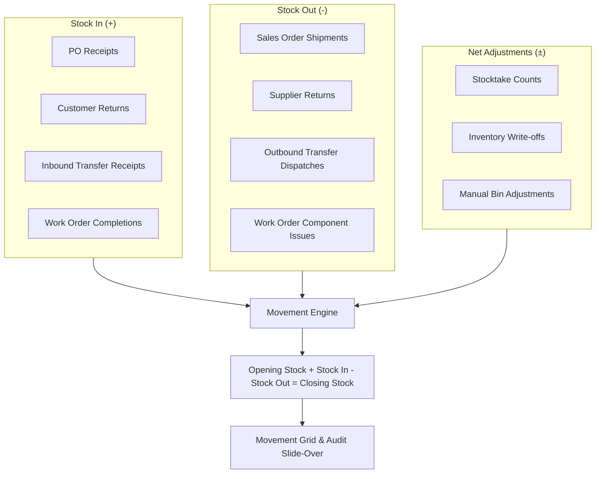

# Movement

The **Movement** analysis module provides complete visibility into inventory velocity, item turnover, and stock flow across your enterprise. By reconstructing opening balances and aggregating operational receipts, shipments, internal transfers, returns, and adjustments, warehouse managers and demand planners can track product movement over customizable time horizons and audit individual ledger transactions.

---

## Movement Aggregation Architecture

### Movement Calculation & Reconciliation
For any selected time period (`startDate` to `endDate`):

* **Opening Balance**: The exact historical physical stock level reconstructed as of `startDate`.
* **Stock In (+)**: All positive inventory ledger entries within the window:
  * Purchase Order Receipts (`PO_RECEIPT`, `GOODS_RECEIPT`)
  * Inbound Transfer Order Receipts (`TO_RECEIPT`, `TRANSFER_IN`)
  * Customer Sales Returns (`CUSTOMER_RETURN`, `SALES_RETURN`)
  * Finished Goods Production Receipts (`WO_RECEIPT`)
  * Positive Inventory Adjustments (`ADJUSTMENT_IN`)
* **Stock Out (-)**: All negative inventory ledger entries within the window:
  * Sales Order Dispatches / Shipments (`SO_SHIPMENT`, `SHIPMENT`)
  * Outbound Transfer Dispatches (`TO_DISPATCH`, `TRANSFER_OUT`)
  * Supplier Purchase Returns (`SUPPLIER_RETURN`, `PURCHASE_RETURN`)
  * Manufacturing Component Issues (`WO_ISSUE`)
  * Negative Inventory Adjustments / Write-Offs (`ADJUSTMENT_OUT`, `WRITE_OFF`)
* **Net Movement**: `Stock In - Stock Out`
* **Closing Balance**: `Opening Stock + Net Movement`
* **Current On Hand**: Current real-time physical balance across warehouse bins (reflecting movements up to the present moment).

---

## Key Capabilities

* **Preset Time Horizons**: Switch seamlessly between **7 Days**, **30 Days**, **60 Days**, **90 Days**, **MTD (Month to Date)**, and **All Time** with persistent filter preferences.
* **Warehouse & Category Scoping**: Filter analysis by individual facility or product group to identify slow-moving or high-velocity items.
* **Executive Summary KPI Cards**: Instant visibility into total enterprise units received (**Stock In**), dispatched (**Stock Out**), overall **Net Movement**, and the number of **Products with Movement**.
* **Detailed Movement Ledger Slide-Over**: Click any product row to open a comprehensive movement slide-over displaying:
  * Summary metrics for the product over the chosen date range.
  * Chronological ledger entries with date, movement type, quantity change (+/-), bin code, document/entry reference, notes, and operator identity.
* **Direct Source Document Linking**: Click any Document / Entry number in the slide-over table to drill directly into the **Perpetual Inventory Ledger** (`/inventory/ledger?entryId=...`) with full resolution of linked Transfer Orders (source to destination route), Purchase Orders, Sales Shipments, and Work Orders.

---

## Step-by-Step Workflows

### 1. Analyzing Inventory Velocity & Turnover
1. Navigate to **Purchasing** → **Demand** → **Movement** (`/demand/movement`).
2. Select your desired analysis period using the **Period** filter (e.g. `30 Days` or `MTD`).
3. Choose a specific **Location** or select `All Locations` to inspect enterprise-wide trends.
4. Review the top KPI cards:
   * **Total Stock In**: Total units absorbed into storage.
   * **Total Stock Out**: Total units dispatched out of the facility.
   * **Net Movement**: Net growth or reduction in inventory volume.
   * **Products with Activity**: Count of unique SKUs with transactions during the window.

### 2. Inspecting Product Movement Details & Ledger Entries
1. Locate the product in the grid by typing its SKU or description in the filter box.
2. Click on the product row.
3. The **Movement Detail** slide-over opens on the right, presenting:
   * Key volume metrics (**Opening**, **Stock In**, **Stock Out**, **Net Change**, **Closing**).
   * The complete chronological activity ledger.
4. To verify the originating business document:
   * Click the **Entry Number** link (e.g. `ENT-2026-0042`) in the table.
   * The **Ledger Entry** drawer opens, revealing complete counterparty details, audit timestamps, and clickable links to the underlying Transfer Order, Purchase Order, Sales Shipment, or Work Order.

---

## Field Reference

| Column / Field | Description |
| :--- | :--- |
| **Product** | SKU / Item Number linking to the product master card. |
| **Description** | Product title and specification. |
| **Group** | Product category classification. |
| **Opening Qty** | Snapshot on-hand quantity at the beginning of the period. |
| **Stock In** | Total units received across all inbound operational channels. |
| **Stock Out** | Total units deducted across all outbound operational channels. |
| **Net Movement** | Net change (`Stock In - Stock Out`) with colored direction badge. |
| **Closing Qty** | Calculated stock balance at the conclusion of the selected period. |
| **Current On Hand** | Real-time physical inventory quantity currently in bins. |
| **Location** | Warehouse facility where the movement occurred. |
| **Entry Date** | Timestamp when the inventory ledger transaction was recorded. |
| **Source Type** | Originating transaction type (e.g. `PO Receipt`, `SO Shipment`, `Transfer In`, `Work Order`). |
| **Bin** | Physical bin location affected by the inventory transaction. |
| **Document #** | Unique inventory entry number linking to full ledger and document details. |
