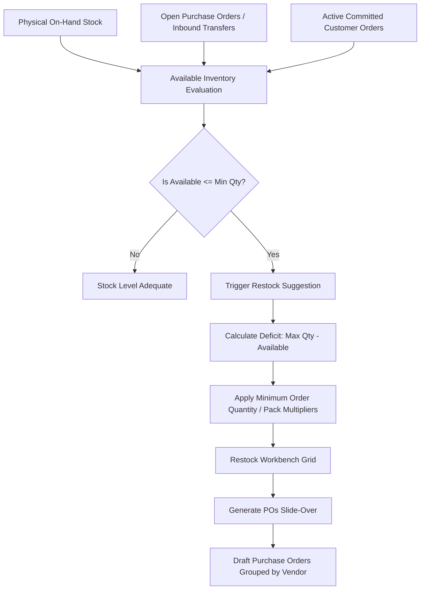

# Restock

The **Restock** workbench enables purchasing managers and inventory controllers to maintain optimal inventory levels across all warehouse facilities. It continuously compares physical and incoming inventory against established safety stock thresholds (minimum and maximum stock levels) and provides a streamlined workflow to generate vendor-grouped Purchase Orders with a single click.

---

## Restock Logic & Calculation Architecture

### 1. Stock Evaluation Formula
The engine evaluates stock requirements on a per-product and per-location basis:

* **Available Stock** = `On Hand - Committed + On Order`
* **Restock Trigger**: An item enters the restock workbench whenever `Available Stock <= Min Quantity`.
* **Suggested Restock Quantity**:
  * If a **Max Quantity** is configured: `Suggested Restock = Max Quantity - Available Stock`.
  * If only a **Min Quantity** is configured: `Suggested Restock = Min Quantity - Available Stock`.
  * If the vendor specifies a **Minimum Purchase Quantity (MOQ)**: `Suggested Restock` is automatically rounded up to meet the supplier's ordering threshold.

---

## Key Features

* **Multi-Warehouse Filtering**: Filter replenishment needs by individual warehouse location or view the aggregate enterprise shortage list.
* **Product Group Segmentation**: Focus replenishment analysis on specific product categories or fast-moving consumable lines.
* **Supplier Grouping & Consolidation**: Automatically groups selected items by preferred supplier and receiving location to minimize freight costs and administrative overhead.
* **Inline Vendor & Quantity Editing**: Modify order quantities, override purchasing costs, or reassign suppliers directly inside the purchase order generation slide-over before finalizing.
* **Direct Supplier Link**: Click any preferred supplier in the table to jump directly to the supplier management tab on the product master record.

---

## Step-by-Step Workflows

### 1. Reviewing Warehouse Replenishment Needs
1. Navigate to **Purchasing** → **Demand** → **Restock** (`/demand/restock`).
2. Use the **Location** filter to select your target warehouse (e.g. `Main Distribution Center`).
3. Optionally filter by **Product Group** to focus on a particular commodity or product line.
4. Review the grid. Items are displayed with their current **On Hand**, **On Order**, **Min Qty**, **Max Qty**, and **Suggested Restock** values.

### 2. Generating Purchase Orders
1. Select specific items to order by clicking their row checkboxes, or leave all rows unselected to process all filtered items.
2. Click the **Generate POs** button in the top action bar.
3. The **Generate Purchase Orders** slide-over opens, displaying items grouped into cards by **Preferred Supplier** and **Receiving Location**:
   * **Supplier Link**: Click the supplier name in any card header to inspect vendor details in a new tab.
   * **Supplier Reassignment**: If a product has no default supplier or you wish to source from an alternate vendor, use the supplier dropdown on the line.
   * **Adjust Quantities**: Modify the **Restock Qty** input for any item. The line total and card subtotal update dynamically.
   * **Exclude Lines**: Click the delete (trash) button on any individual line to remove it from this purchasing batch.
4. Click **Generate POs** in the slide-over footer.
5. The system creates draft Purchase Orders in the Purchasing module and displays a confirmation toast notification with links to the generated orders.
6. Navigate to **Purchasing** → **Purchase Orders** (`/purchase-orders`) to review, approve, and email the purchase orders to suppliers.

---

## Field Reference

| Column / Field | Description |
| :--- | :--- |
| **Product** | Product SKU and part number linking to the product master card. |
| **Description** | Full product name and technical specification. |
| **Group** | Product category classification. |
| **Location** | Target warehouse code and name where stock is needed. |
| **Primary Bin** | Dedicated storage bin location (e.g. `A01-02-B`). |
| **On Hand** | Current physical inventory balance in warehouse storage. |
| **On Order** | Pending inbound units on open Purchase Orders or Transfer Orders. |
| **Min Qty** | Reorder threshold; stock below this number triggers a restock suggestion. |
| **Max Qty** | Target inventory ceiling for optimal storage density. |
| **Suggested Restock** | Calculated quantity needed to replenish the warehouse to max capacity. |
| **Preferred Supplier** | Default vendor mapped on the product card. |
| **Unit Cost** | Unit purchasing price in supplier catalog currency. |
| **Estimated Cost** | Projected line expenditure (`Suggested Restock * Unit Cost`). |
