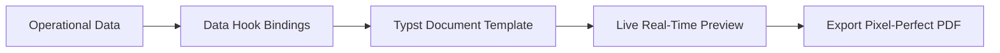

# Reporting & PDF Templates

The **Reporting** module combines interactive operational data explorers with high-precision PDF document generation powered by the modern **Typst** layout engine.

---

## Reporting & Typst PDF Architecture

### 1. Interactive Reports Explorer
View, filter, sort, and aggregate live data across:
- **Sales**: Product sales velocity, customer rankings, margin analysis.
- **Inventory**: Stock valuation by warehouse, slow-moving items, stocktake variances.
- **Finance**: Monthly P&L, Balance Sheet, Aged Receivables & Payables.

### 2. Typst Document Engine
All printable documents (Quotes, Invoices, Pick Slips, Shipping Labels, Statements, Packing Lists, Purchase Debit Notes) use **Typst** templates. Typst offers high rendering speed, modern syntax, and pixel-perfect typographic control.

---

## Step-by-Step Workflows

### 1. Running an Operational Report
1. Go to **Reporting** → **Reports** (`/reporting`).
2. Select a report from the catalog (e.g. Sales Margin by Product).
3. Set your date filters and grouping parameters.
4. Click **Run Report** to view on screen or **Export to CSV/Excel**.

### 2. Customizing a PDF Template
1. Go to **Reporting** → **Configuration** (`/reporting/config`).
2. Click **New Template** (`/reporting/config/new`) or select an existing template to customize (e.g. `Sales Invoice`).
3. Edit the Typst markup (adjust company logo size, font family, footer legal notices).
4. The live preview pane renders changes in real time.
5. Click **Save Template**.

---

## Field Reference

| Field | Description |
| :--- | :--- |
| **Report Title** | Name of the analytical report. |
| **Template Key** | Identifier for the Typst document (e.g. `invoice_standard`). |
| **Export Formats** | PDF, Excel, CSV. |
