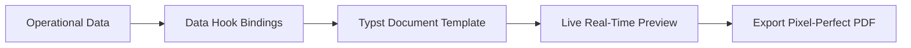

# Reporting & PDF Templates

The **Reporting** module combines interactive operational data explorers with high-precision PDF document generation powered by the modern **Typst** layout engine.

---

## Reporting & Typst PDF Architecture



### 1. Interactive Reports Explorer
View, filter, sort, and aggregate live data across:
- **Sales**: Product sales velocity, customer rankings, margin analysis.
- **Inventory**: Stock valuation by warehouse, slow-moving items, stocktake variances.
- **Finance**: Monthly P&L, Balance Sheet, Aged Receivables & Payables.
- **Custom Report JSON Configurations**: Custom business reports can be created and managed via **Reporting** → **Configuration** (`/reporting/config`).

### 2. PDF Templates Portal (`/admin/settings/pdf-templates`)
All printable documents (Quotes, Invoices, Pick Slips, Shipping Labels, Statements, Packing Lists, Purchase Orders, Debit Notes) use **Typst** templates. Typst offers high rendering speed, modern syntax, and pixel-perfect typographic control.

The centralized **PDF Templates** settings page provides three cohesive management tabs:

1. **Settings Tab**:
   - **Fonts & Colors**: Configure **Primary Text Color** (body text, identifiers, data values), **Accent / Highlight Color** (document titles, section headers, totals), **Muted / Label Color** (field labels, metadata timestamps, footnotes), **Document Font Family** (preset clean sans-serif/serif/monospace or custom system font), and **Base Font Size (pt)**. All adjustments auto-save instantly.
   - **Headers & Footers**: Edit standard modular layout fragments (**Customer Header**, **Customer Footer**, **Supplier Header**, **Supplier Footer**) with an integrated Typst source code editor, live instant PDF preview pane, and save controls.
2. **Templates Tab**:
   - Complete searchable catalog of all configured Typst document templates.
   - Real-time search filter by template name, template slug, description, or filename pattern.
   - Action buttons to edit existing templates or click **Create Template** (`/admin/settings/pdf-templates/new`) to author new document layouts.
3. **Hooks Tab**:
   - Connects business event triggers and context resolvers (e.g. `sales-invoice`, `purchase-order`, `quote`, `customer-statement`) to specific Typst templates.

---

## Organization Payload Reference (`_org`)

When compiling any Typst document or fragment, HeroBM automatically injects the active organization's profile and branding theme into the root data dictionary under the `_org` key.

| Property | Type | Description | Example / Notes |
| :--- | :--- | :--- | :--- |
| `name` | `string` | Company legal / trading name | `"Acme Corporation Pty Ltd"` |
| `addressLine1` | `string` | Physical or billing street address | `"Level 4, 100 Queen Street"` |
| `addressLine2` | `string` | Address suite / unit / building | `"Building B"` |
| `city` | `string` | City or suburb | `"Melbourne"` |
| `state` | `string` | State, province, or region | `"VIC"` |
| `postCode` | `string` | Postal code or ZIP code | `"3000"` |
| `country` | `string` | Country name | `"Australia"` |
| `email` | `string` | Primary business or billing email | `"accounts@acme.example.com"` |
| `phone` | `string` | Main telephone contact number | `"+61 3 9000 0000"` |
| `website` | `string` | Organization website URL | `"www.acme.example.com"` |
| `companyNumber` | `string` | Business / company registration number | `"ACN 123 456 789"` |
| `taxNumber` | `string` | Statutory tax registration number (GST / VAT / ABN) | `"ABN 12 345 678 901"` |
| `bankName` | `string` | Banking institution name | `"Commonwealth Bank"` |
| `bankAccountName` | `string` | Account holder name for remittance | `"Acme Operating Account"` |
| `bankAccountNumber`| `string` | Bank account number | `"1234-5678"` |
| `bankSwiftBic` | `string` | SWIFT / BIC code for international wire transfers | `"CTBAAU2S"` |
| `bankIban` | `string` | IBAN for international electronic transfers | `"AU89CTBA00000012345678"` |
| `logoFile` | `string \| none` | Local filesystem path to staged company logo image | Render via `image(logoFile, height: 32pt)` |
| `pdfThemeConfig` | `dictionary` | Nested theme configuration object | Contains `primaryColor`, `accentColor`, `mutedColor`, `borderColor`, `tableHeaderFill`, `fontFamily`, `baseFontSizePt` |

---

## Typst Fragment Extraction Helpers (`#let get(...)` & `#let getColor(...)`)

To keep custom Typst templates and modular header/footer fragments clean, concise, and easy to maintain without repetitive nested `if / else` boilerplate, use the standard dictionary and color extraction helpers:

```typst
#let get(dict, key, default: none) = {
  if dict == none { return default }
  let val = dict.at(key, default: default)
  if val == none or val == "" { default } else { val }
}

#let getColor(theme, cfg, key, default: none) = {
  let val = get(theme, key)
  if val != none { return val }
  let hex = get(cfg, key)
  if hex != none { rgb(hex) } else { default }
}
```

### Usage Example in Header Fragments

```typst
#let header(data, title: none, theme: none) = {
  let org = get(data, "_org", default: (:))
  let orgName = get(org, "name", default: "Company Name")
  let logoFile = get(org, "logoFile")
  let taxNumber = get(org, "taxNumber")
  let cfg = get(org, "pdfThemeConfig", default: (:))

  let primaryColor = getColor(theme, cfg, "primaryColor", default: rgb("#1e3a5f"))
  let accentColor = getColor(theme, cfg, "accentColor", default: rgb("#2563eb"))
  let mutedColor = getColor(theme, cfg, "mutedColor", default: primaryColor.lighten(30%))
  let borderColor = getColor(theme, cfg, "borderColor", default: primaryColor.lighten(75%))

  grid(
    columns: (1fr, auto),
    gutter: 12pt,
    [
      #if logoFile != none [
        #image(logoFile, height: 32pt, fit: "contain")
      ]
      #text(size: 14pt, weight: "bold", fill: primaryColor, orgName)
      #if taxNumber != none [\ #text(size: 8pt, fill: mutedColor)[Tax No: #taxNumber]]
    ],
    align(right + horizon)[
      #if title != none [
        #text(size: 14pt, weight: "bold", fill: accentColor, title)
      ]
    ]
  )
  v(0.2cm)
  line(length: 100%, stroke: 0.5pt + borderColor)
}
```

---

## Step-by-Step Workflows

### 1. Running an Operational Report
1. Go to **Reporting** → **Reports** (`/reporting`).
2. Select a report from the catalog (e.g. Sales Margin by Product).
3. Set your date filters and grouping parameters.
4. Click **Run Report** to view on screen or **Export to CSV/Excel**.

### 2. Customizing Global Fonts & Colors
1. Go to **Administration** → **Settings** → **PDF Templates** (`/admin/settings/pdf-templates`).
2. On the **Settings** tab under **Fonts & Colors**, adjust the Primary, Accent, or Muted color pickers.
3. Select your desired font family or type a custom font name.
4. Changes are automatically saved in real-time.

### 3. Customizing a Document Template
1. Go to **Administration** → **Settings** → **PDF Templates** (`/admin/settings/pdf-templates`).
2. Switch to the **Templates** tab and use the search bar to locate your template (e.g. `Sales Invoice`, `Purchase Order`).
3. Click the template name or **Edit** to open the template designer.
4. Edit the Typst markup in the integrated code editor and click **Generate Preview** to view the live rendering.
5. Click **Save** to publish the customized template.

