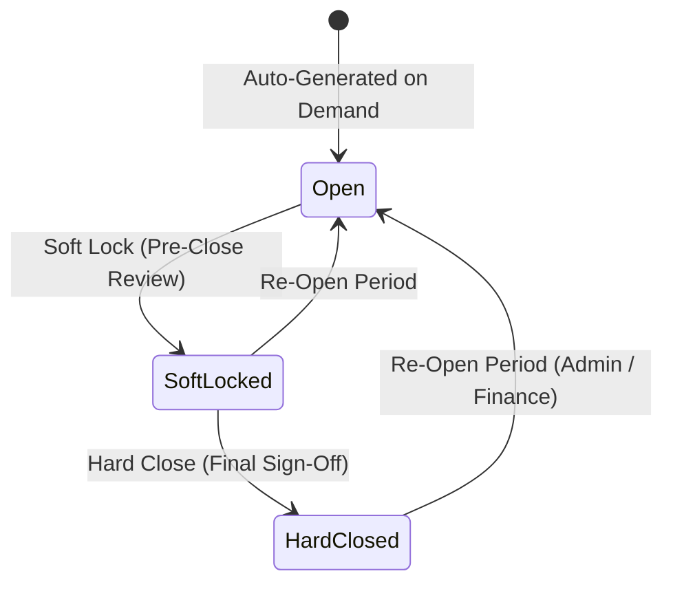

# Fiscal Periods & Financial Locking

The **Fiscal Periods** module enforces financial governance and period-end close procedures. It ensures that transactions, sales invoices, supplier bills, inventory movements, and manual journal entries are posted only into authorized accounting periods, protecting historical financial reporting from retroactive modification and audit drift.

---

## Period Statuses & Posting Rules

Each fiscal period exists in one of three distinct governance states:

### 1. Open
- **Behavior**: Standard operational status. All double-entry postings, operational sales/purchase invoices, payments, inventory adjustments, and manual journal entries dating within this period are accepted.
- **When to Use**: Active accounting periods during regular day-to-day operations.

### 2. Soft Lock
- **Behavior**: Marks the period as under **month-end review and pre-close reconciliation**. Operational posting workflows and back-dated entries into this period are restricted or flagged for review.
- **When to Use**: Used during month-end close when the finance team is performing continuous subledger reconciliation, accruals, prepayments, depreciation, and tax adjustments, preventing non-finance operational staff from posting additional transactions into the period.
- **Reversibility**: Can be transitioned to **Hard Closed** once adjustments are complete, or **Re-opened** if further operational transactions are required.

### 3. Hard Close
- **Behavior**: **Strictly sealed and immutable.** The double-entry general ledger engine (`assertPeriodOpen`) strictly rejects any attempt to post transactions, invoices, or journal entries dating into a Hard Closed period with an authorization error.
- **When to Use**: Permanent financial locking after month-end or year-end sign-off, tax returns, and statutory audit completion.
- **Reversibility**: Only authorized users with `write` permission on `fiscal-periods` (such as Finance or Admin roles) can explicitly re-open a hard-closed period.

> [!WARNING]
> **Hard Close Invariant & Database Triggers**: Attempting to post any journal entry or transaction with an effective date in a **Hard Closed** period is rejected directly at the PostgreSQL trigger and GL engine layer (`enforce_fiscal_period_hard_lock`). This prevents retroactive adjustments, backdating, and unauthorized mutations from corrupting published financial statements or breaking the cryptographic hash chain.

---

## Audit Details & Traceability

For statutory compliance and financial audit integrity, every status transition is immutably recorded in the database and surfaced directly in the **Audit Details** column:

| Audit Attribute | Description | Recorded Event |
| :--- | :--- | :--- |
| **Locked By** (`locked_by`) | The username / actor ID of the user who initiated the soft lock. | Soft Locking a period |
| **Locked At** (`locked_at`) | The exact UTC timestamp when the soft lock was applied. | Soft Locking a period |
| **Closed By** (`closed_by`) | The username / actor ID of the finance manager or administrator who executed the hard close. | Hard Closing a period |
| **Closed At** (`closed_at`) | The exact UTC timestamp when the period was sealed. | Hard Closing a period |
| **Notes** (`notes`) | Descriptive context indicating the period number, fiscal year, and creation or closure history. | Initial creation / status change |

When a period is re-opened back to `Open`, the lock attribution is cleared while maintaining history in the platform business audit log.

---

## Step-by-Step Workflows

### 1. Viewing Periods for a Fiscal Year
1. Navigate to **Finance** → **Fiscal Periods** (`/fiscal-periods`).
2. Select the target **Fiscal Year** (e.g. `FY2026`) from the selector.
3. The 12 monthly periods for that fiscal year are **automatically initialized and presented on demand** according to the organization's configured financial year start month.

### 2. Soft-Locking a Month for Review
1. Locate the period to review (e.g. `2026-08 (Period 8)`).
2. Click the **Soft Lock** button.
3. The status updates to **Soft Locked** with amber badge indicator, and your user ID and timestamp are recorded in the audit details.

### 3. Hard-Closing a Period
1. Once bank reconciliations, trial balance verification, and all adjustments are finalized, click **Hard Close**.
2. The period status transitions to **Hard Closed** (red badge).
3. The GL ledger engine immediately rejects any future postings targeting this period date range.

### 4. Re-Opening a Period
1. If an essential audited adjustment is required in a locked or closed period, click **Re-open Period**.
2. The period returns to **Open**, allowing authorized adjustment journals to be posted. Once complete, immediately re-lock or hard-close the period.

---

## Activity Timeline & Webhook Events

The **Activity Timeline** card at the bottom of the Fiscal Periods page aggregates all lifecycle and governance events for the selected fiscal year in real-time, detailing:
- **Period Creation**: When 12 monthly periods are initialized.
- **Status Transitions**: State shifts between `open`, `soft_locked`, and `hard_closed`.
- **Actor Attribution**: Which user or system role enacted each change with timestamps and contextual notes.

### Webhook Event Dispatch

All fiscal period transitions are enqueued to the transaction outbox and relayed via webhooks to external integrations:

| Event Type | Trigger | Key Payload Fields |
| :--- | :--- | :--- |
| `fiscal_period.created` | Automatic or manual generation of 12 monthly fiscal periods. | `periodName`, `fiscalYear`, `periodNumber`, `startDate`, `endDate`, `status`, `notes` |
| `fiscal_period.status_changed` | Transitioning a period between `open`, `soft_locked`, or `hard_closed`. | `periodName`, `fiscalYear`, `periodNumber`, `previousStatus`, `newStatus`, `notes` |
| `fiscal_period.updated` | Period metadata or notes updated without state transition. | `periodName`, `fiscalYear`, `periodNumber`, `previousStatus`, `newStatus`, `notes` |

