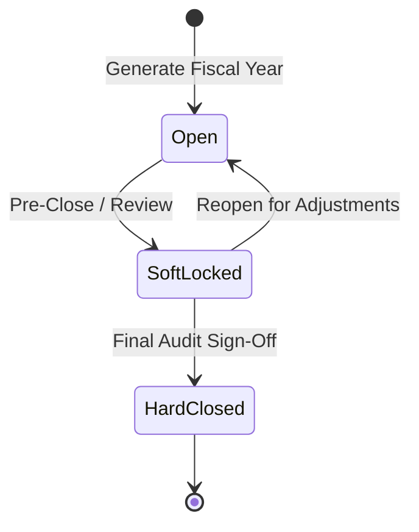

# Fiscal Periods & Financial Locking

The **Fiscal Periods** module enforces financial governance and period-end close procedures. It ensures that transactions, sales invoices, supplier bills, and journal entries are posted only into authorized accounting periods, protecting historical financial reporting from retroactive modification.

---

## Period Statuses & Posting Rules

Each fiscal period exists in one of three distinct governance states:

### Period Status Definitions

| Status | Operational Impact | When to Use |
| :--- | :--- | :--- |
| **Open** | All operational postings and manual journals are permitted without warnings. | Standard day-to-day operations during the active month. |
| **Soft Locked** | Postings trigger a confirmation warning indicating the period is under pre-close review. | Month-end reconciliation while accountants finalize adjustments. |
| **Hard Closed** | **Strictly blocked.** No transactions, invoices, or journal entries can be posted into this date range. | Finalized months and locked financial years after audit sign-off. |

> [!WARNING]
> **Hard Closed Invariant**: Attempting to post any journal entry or transaction with an effective date in a **Hard Closed** period will fail with an authorization rejection (`HTTP 422 / 403`). To post an adjustment, an authorized administrator must explicitly unlock the period.

---

## Step-by-Step Workflows

### 1. Generating Fiscal Periods for a New Year
1. Go to **Finance** → **Fiscal Periods** (`/fiscal-periods`).
2. Select the target **Fiscal Year** (e.g. `2026`) from the year selector.
3. Click **Generate Periods**.
4. The system automatically creates 12 monthly periods configured according to your company's **Financial Year Start** month.

### 2. Soft-Locking a Period for Month-End Review
1. Navigate to **Finance** → **Fiscal Periods** (`/fiscal-periods`).
2. Locate the concluded month (e.g. `Period 08 - August 2026`).
3. Click the **Status** action dropdown and select **Soft Lock**.
4. Operators attempting to back-date transactions into August will receive a notification prompting for confirmation.

### 3. Hard-Closing a Period
1. Complete bank reconciliations, subledger balance verifications, and depreciation journals.
2. In the Fiscal Periods list, click **Hard Close** on the reconciled period.
3. Confirm the lock. The period is now permanently sealed against accidental ledger drift.

---

## Field Reference

| Field | Description |
| :--- | :--- |
| **Fiscal Year** | Four-digit reporting year. |
| **Period #** | Month index (1–12). |
| **Date Range** | Calendar start and end bounds (e.g. `2026-08-01` to `2026-08-31`). |
| **Status Badge** | Visual indicator: Green (`Open`), Amber (`Soft Locked`), Red (`Hard Closed`). |
| **Actions** | Status transition buttons: `Open`, `Soft Lock`, `Hard Close`. |
