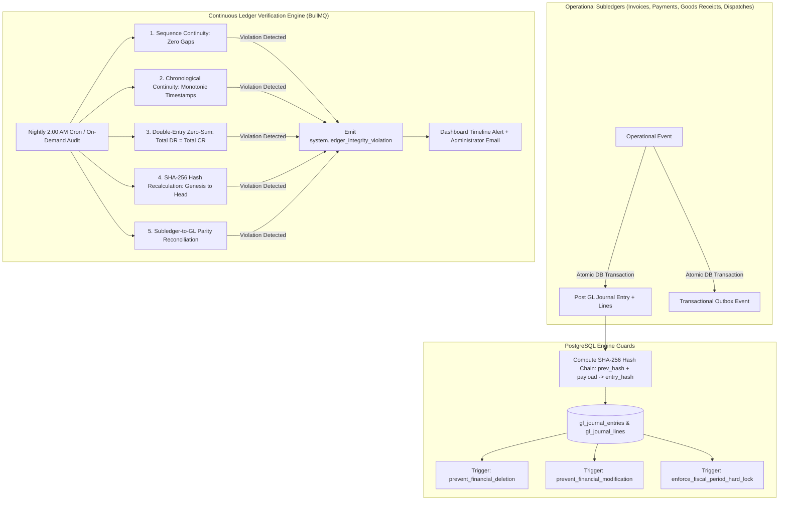

# General Ledger & Chart of Accounts

The **General Ledger (GL)** is the financial backbone of HeroBM. It records all automated postings from operations, supports manual adjusting journal entries, enforces fiscal period lock boundaries, and validates Trial Balance mathematical integrity.

---

## Chart of Accounts & ERPNext Format Import

HeroBM organizes all financial postings within a structured, hierarchical **Chart of Accounts (COA)** across five root classifications: `Asset`, `Liability`, `Equity`, `Revenue`, and `Expense`.

HeroBM natively supports importing Chart of Accounts structured in the **ERPNext JSON format**. When provisioning a new company or updating accounting structures:
- **Built-in Presets**: HeroBM includes ready-to-use regional presets such as Australia Standard (`au_standard.json`) and US Standard (`us_standard.json`), stored in `apps/api/src/gl/charts/`.
- **ERPNext Verified Templates & Custom Charts**: You can import or adapt any country-specific template from the official [ERPNext Verified Chart of Accounts repository](https://github.com/frappe/erpnext/tree/develop/erpnext/accounts/doctype/account/chart_of_accounts/verified).
- **Importing in the UI**: Navigate to **Administration** → **Settings** → **Financial Settings** (`/admin/settings/financial`), scroll to the **Chart of Accounts** section, and click **Import CoA**:
  - **Upload JSON File**: Select or drag & drop any `.json` file from your local machine to upload and import directly in your browser.
  - **Predefined Presets**: Select from pre-packaged regional presets or custom template files placed on the API server in `apps/api/src/gl/charts/`.

---

## Double-Entry Accounting Invariants & Validation

### 1. The Zero-Sum Invariant Rule
Every journal transaction in HeroBM is verified before persistence:

```
Total Debits - Total Credits = 0.00 (Tolerance: |Balance| <= 0.005)
```

If debits and credits do not match within half a cent, the journal is rejected by the API.

### 2. Posting Account & Period Validation
Before an entry is committed:
1. **Posting Node Check**: Accounts must be active leaf nodes (transactions cannot post directly to abstract group header accounts).
2. **Fiscal Period Gate**: Transaction date must fall within an `Open` fiscal period. If the period is `Soft Locked`, an elevated confirmation is required; if `Hard Closed`, the posting is blocked.
3. **Control Account Protection**: System control accounts (Accounts Receivable, Accounts Payable, Inventory Asset, GRNI Clearing) are updated automatically by operational subledgers. Manual adjustments require explicit reconciliation notes.

### 3. Automated Postings Master Map

| Operational Event | Debit Leg(s) | Credit Leg(s) |
| :--- | :--- | :--- |
| **Customer Sales Invoice** | Accounts Receivable Control | Sales Revenue + Output Tax Payable |
| **Sales Order Dispatch (COGS)** | Cost of Goods Sold (COGS) | Inventory Asset Account (at WAC) |
| **Sales Credit Note** | Sales Revenue + Output Tax | Accounts Receivable Control |
| **Goods Receipt (GRN)** | Inventory Asset Account | Goods Received Not Invoiced (GRNI) Accrual |
| **Supplier Invoice Match** | GRNI Accrual + Input Tax (+ PPV/FX) | Accounts Payable Control (+ PPV/FX) |
| **Customer Payment Received** | Bank Account (+ Payment Gateway Fees) | Accounts Receivable Control |
| **Supplier Bill Payment** | Accounts Payable Control | Bank Account (+ Early Payment Discount) |
| **Inventory Scrap / Count Loss** | Inventory Shrinkage Expense | Inventory Asset Account |

### 4. Auditability, Ledger Immutability & Compliance Architecture

HeroBM is architected from the database up to satisfy strict statutory accounting standards (including SOX, GAAP, IFRS, and ATO audit requirements). The ledger incorporates multiple cryptographic, systemic, and operational safeguards to ensure complete auditability, non-repudiation, and tamper detection:



#### A. Cryptographic SHA-256 Hash Chaining
Every posted general ledger journal entry is cryptographically bound to the entire historical sequence of journal entries using a Merkle-style SHA-256 hash chain:
1. **Genesis Seed**: The very first journal entry in the system chains from a fixed 64-zero genesis seed:
   ```
   0000000000000000000000000000000000000000000000000000000000000000
   ```
2. **Deterministic Payload Hashing**: When entry `N` is posted, its cryptographic hash (`entry_hash`) is computed deterministically from:
   - `prev_entry_hash`: The SHA-256 hash of entry `N-1`.
   - `journal_entry_id` and `journal_entry_number`.
   - `posting_date` and `source_type`.
   - Sorted list of line items (`account_code`, `debit_amount`, `credit_amount`, `currency`).
3. **Tamper Detection**: If any record in `gl_journal_entries` or `gl_journal_lines` is modified, inserted out-of-order, or deleted at the database level, the hash chain breaks from that point forward, rendering tampering immediately evident during automated verification.

#### B. Database-Level Trigger Protection (Immutability by Default)
HeroBM enforces immutability directly inside PostgreSQL via native triggers that execute before any SQL statement commits:
- **`herobm_core.prevent_financial_deletion`**: Strictly blocks `DELETE` operations across all financial tables (`gl_journal_entries`, `gl_journal_lines`, `sales_invoices`, `sales_invoice_lines`, `purchase_invoices`, `purchase_invoice_lines`, `sales_credit_notes`, `purchase_debit_notes`, `payment_entries`, `payment_allocations`, and `inventory_ledger_movements`). Draft unposted records can be discarded, but once posted, records are permanent.
- **`herobm_core.prevent_financial_modification`**: Prevents in-place updates to posted monetary amounts, account codes, debit/credit values, and transaction dates.
- **The "Reversal Only" Accounting Law**: To correct any historical transaction, operators must post an explicit offsetting reversal journal entry or issue a formal credit/debit note. This guarantees a permanent, transparent paper trail for auditors.

#### C. Continuous Automated Ledger Integrity Audits (BullMQ)
A dedicated background BullMQ verification engine runs automated integrity audits daily at 2:00 AM (as well as on-demand):
1. **Sequential Monotonicity**: Verifies that journal entry numbers, invoice numbers, and credit note numbers increment continuously without gaps.
2. **Chronological Continuity**: Validates that transaction timestamps never regress or invert.
3. **Zero-Sum Mathematical Invariant**: Recalculates total debits and credits across the entire general ledger, asserting that `Total Debits - Total Credits = 0.00`.
4. **Full SHA-256 Hash Chain Recalculation**: Recomputes all entry hashes sequentially from the genesis seed to the latest entry, confirming cryptographic integrity.
5. **Subledger-to-GL Parity**: Cross-checks every operational document (sales invoices, customer payments, supplier bills, inventory dispatches) against its corresponding GL double-entry lines.

If any anomaly or discrepancy is detected, the verification engine immediately raises a high-priority `system.ledger_integrity_violation` domain event, triggers an administrative email dispatch, and creates a critical alert banner on the Dashboard Timeline.

#### D. Strict Fiscal Period Hard Locking
Fiscal periods can be placed in `Open`, `Soft Locked`, or `Hard Closed` states:
- **Hard Closed Periods**: Permanently locked against new postings or backdated adjustments. Database triggers block any write whose transaction date falls within a hard-closed period.
- **Audit Attribution**: All period status changes record the user ID, timestamp, and justification reason.

#### E. Transactional Outbox Event Colocation
All state transitions and ledger postings atomically insert an audit event into the `sys_outbox` table within the same database transaction (`emitEvent`). This provides an immutable event log recording the actor, timestamp, prior state, new state, and full execution payload for forensic auditing.

---

## Step-by-Step Workflows

### 1. Creating a Manual Journal Entry
1. Go to **Finance** → **General Ledger** → **Journal Entries** (`/general-ledger/journal-entries`).
2. Click **New Journal Entry** (`/general-ledger/journal-entries/new`).
3. Enter the **Transaction Date** and a clear **Description / Reference**.
4. Add line items: select leaf GL accounts and enter Debit and Credit amounts.
5. Verify that total debits equal total credits (`Zero-Sum Variance = 0.00`).
6. Click **Post Journal Entry**.

### 2. Viewing the Trial Balance
1. Go to **Finance** → **General Ledger** → **Trial Balance** (`/general-ledger/trial-balance`).
2. Select the financial period or custom date range.
3. Review debit/credit balances across all active accounts.
4. Verify the zero-sum balanced status banner at the top of the report.

### 3. Reviewing the Statement of Cash Flows
1. Go to **Finance** → **General Ledger** → **Cash Flow** (`/general-ledger/cash-flow`).
2. Select an active **Fiscal Period** or **Custom Date Range**.
3. Verify that the **Parity Verification Banner** is green (reconciled with zero drift).
4. Review direct operating, investing, and financing cash flow breakdowns.

---

## Field Reference

| Field | Description |
| :--- | :--- |
| **Account Code** | Unique numerical GL identifier (e.g. `1000 Bank`). |
| **Account Name** | Descriptive label of the ledger account. |
| **Account Classification** | Root category (`Asset`, `Liability`, `Equity`, `Revenue`, `Expense`). |
| **Debit / Credit** | Double-entry transaction amounts (must balance to zero). |
| **Journal Entry Number** | Unique audit sequence identifier (e.g. `JRN-2026-00041`). |
| **Zero-Sum Variance** | Difference check ensuring debits equal credits (`<= 0.005`). |

