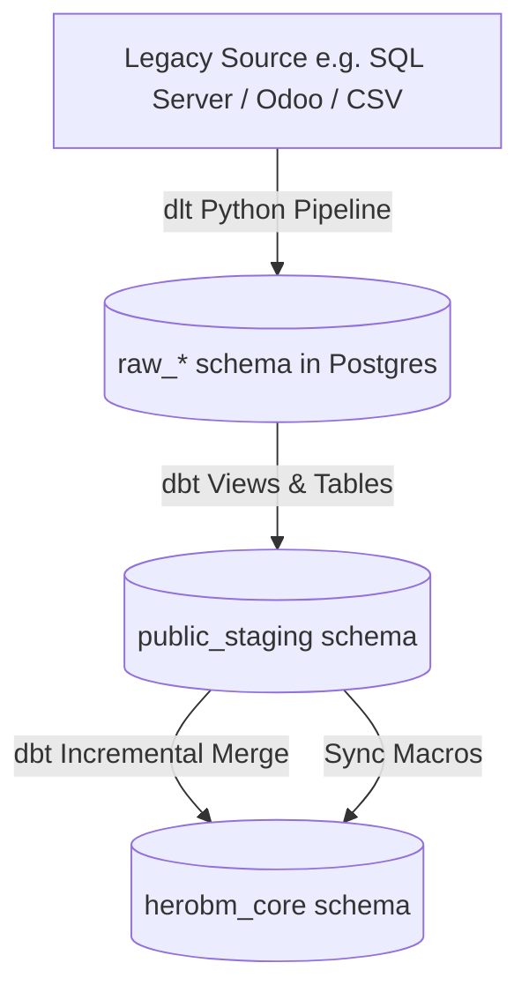

# Data Import Pipelines (ELT Framework)

HeroBM employs a modern **Extract-Load-Transform (ELT)** architecture designed to ingest high-volume legacy database tables (such as ABM SQL Server and Odoo) into clean, validated, relational PostgreSQL schemas.

---

## 1. ELT Pipeline Architecture



The data pipeline operates across three decoupled tiers:

### Tier 1: Extraction Layer (`pipelines/<source>_extract/`)
- Implemented in Python using [`dlt`](https://dlthub.com) (data load tool) and database drivers (ODBC, `pymssql`, `psycopg2`).
- Extracts source tables as raw structured records directly into an isolated raw PostgreSQL schema (e.g. `raw_abm`, `raw_odoo`).
- Supports `--dry-run` to validate connection parameters and schema discovery without writing data.
- **Commands**:
  ```bash
  # Run full extraction:
  make extract

  # Dry run extraction:
  make extract-dry
  ```

### Tier 2: Staging Layer (`pipelines/<source>_transform/models/staging/`)
- Materializes as clean views (or materialized tables for high-volume Z-tables) in the `public_staging` schema.
- **Rename**: Converts source PascalCase/raw column names into standard `snake_case`.
- **Clean**: Strips whitespace with `trim()` and sets sensible fallbacks with `coalesce()`.
- **Cast**: Fixes type anomalies (e.g., converting comma-separated numeric strings into numbers using `safe_cast_numeric`).
- *Rule*: Staging models do **not** join tables or apply business domain rules.

### Tier 3: Import / Core Layer (`pipelines/<source>_transform/models/import/`)
- Incremental `dbt` models using the `merge` strategy targeting Drizzle-managed application tables in `herobm_core`.
- Normalizes legacy entities into Microsoft CDM and Schema.org conventions.
- Preserves UUID primary keys and resolves business IDs into relational foreign keys.
- Sync macros (`run-operation`) handle dependent line items (e.g., `sync_sales_order_lines`).
- **Commands**:
  ```bash
  # Run transformations and import:
  make transform
  make import-legacy

  # Full ELT pipeline in one shot:
  make elt

  # Fast resume without re-extracting:
  make elt-no-extract
  ```

---

## 2. How to Build a New Import Pipeline Model

Follow this step-by-step workflow when adding a new entity to the ingestion pipeline:

### Step A: Declare the Staging Source
In `pipelines/<source>_transform/models/staging/_staging.yml`, declare the raw source table:
```yaml
version: 2
sources:
  - name: raw_abm
    schema: raw_abm
    tables:
      - name: customers
      - name: products
```

### Step B: Create the Staging Model
Create `models/staging/stg_<entity>.sql` following the Common Table Expression (CTE) pattern:
```sql
with source as (
    select * from {{ source('raw_abm', 'customers') }}
),
renamed as (
    select
        unique_id::text                         as source_id,
        trim(coalesce(customer_title, ''))      as customer_name,
        trim(coalesce(account_code, ''))        as account_number,
        {{ safe_cast_numeric('credit_limit') }} as credit_limit,
        is_active::boolean                      as is_active
    from source
)
select * from renamed
```

### Step C: Create the Incremental Core Import Model
Create `models/import/import_<entity>.sql` targeting the Drizzle-managed table:
```sql
{{
    config(
        materialized='incremental',
        unique_key='source_id',
        alias='accounts'
    )
}}

with staging_data as (
    select * from {{ ref('stg_customers') }}
)
select
    -- 1. Preserve existing UUID or generate new random UUID
    coalesce(dest.account_id, gen_random_uuid()) as account_id,
    s.source_id,
    s.customer_name as name,
    s.account_number,
    s.credit_limit,
    s.is_active,
    -- 2. Supply typed NULLs for unmapped target columns
    null::text as external_id,
    null::jsonb as custom_fields,
    now() as created_at,
    now() as updated_at
from staging_data s
left join herobm_core.accounts dest on dest.source_id = s.source_id
```

### Step D: Add Schema Tests & Validate
Add primary key and integrity tests to `_schema.yml`, then run:
```bash
make test-transform
```

---

## 3. Pipeline Development Guidance & Critical Gotchas

> [!WARNING]
> **1. NEVER Use `--full-refresh` on Aliased Import Models**
> When `dbt` runs with `--full-refresh` on an aliased model, it renames the target table to `<table>__dbt_backup`. This instantly breaks foreign key constraints across other Drizzle tables in `herobm_core`. Always use standard incremental merge runs.

> [!IMPORTANT]
> **2. The dbt Merge Column Contract**
> dbt's SQL merge generates an `UPDATE SET col = source.col` statement for **every single column** present in the target Drizzle table.
> If the source `SELECT` query omits even one destination column, the merge will fail with:
> `column dbt_internal_source.<column_name> does not exist`
> **Fix**: Explicitly output every destination column in your `SELECT` statement. For columns without source equivalents, provide typed NULLs (e.g. `null::text as external_id`, `null::jsonb as custom_fields`).

> [!IMPORTANT]
> **3. UUID Primary Key Preservation Pattern**
> Application tables generate UUID primary keys via `gen_random_uuid()`. When re-running incremental imports, you must **preserve existing UUIDs** so dependent foreign keys are not broken:
> ```sql
> coalesce(dest.<entity>_id, gen_random_uuid()) as <entity>_id
> ```
> Always `LEFT JOIN` the target `herobm_core` table on `dest.source_id = s.source_id` to retrieve the existing ID.

> [!TIP]
> **4. Foreign Key (FK) Topological Order**
> Foreign key constraints are strictly enforced in PostgreSQL. Ingestion must follow dependency order:
> 1. **Dimension Masters**: `accounts`, `products`, `suppliers`, `bins`
> 2. **Junction Links**: `product_suppliers`
> 3. **Document Headers**: `sales_orders`, `purchase_orders`
> 4. **Document Lines**: Sync macros (`sync_sales_order_lines`, `sync_purchase_order_lines`)
> 5. **Subledgers & Stock**: `inventory_entries`, `inventory_ledger`, `bin_contents`, `invoices`

> [!NOTE]
> **5. Deduplication of Staging Natural Keys**
> Legacy databases often contain duplicate key pairs (e.g. multiple product-vendor links with conflicting attributes). Use `DISTINCT ON` with an explicit `ORDER BY` to deterministically choose the canonical record:
> ```sql
> select distinct on (p.product_id, s.vendor_id) ...
> order by p.product_id, s.vendor_id, rps.is_preferred desc nulls last
> ```

> [!NOTE]
> **6. Safe Numeric Casting for Z-Tables**
> Denormalized report tables (Z-tables) frequently store numbers as `varchar` strings containing commas, trailing spaces, and blank values (e.g. `" 3,516.53 "`). Direct `::numeric` casts will crash the pipeline. Always use the `safe_cast_numeric` macro:
> ```sql
> {{ safe_cast_numeric('_qty_ordered') }} as qty_ordered
> ```

---

## 4. Field Reference

| Field | Description |
| :--- | :--- |
| **Extraction Source** | Source database engine (`MS SQL Server`, `Odoo Postgres`, `CSV Files`). |
| **Target Schema** | Destination schema in HeroBM (`herobm_core`). |
| **Materialization** | dbt table strategy (`incremental` with `merge`). |
| **Unique Key** | Source identifier (`source_id`) used for idempotent upserts. |
| **Sync Macro** | Transactional dbt operation used for line-level insertion. |
