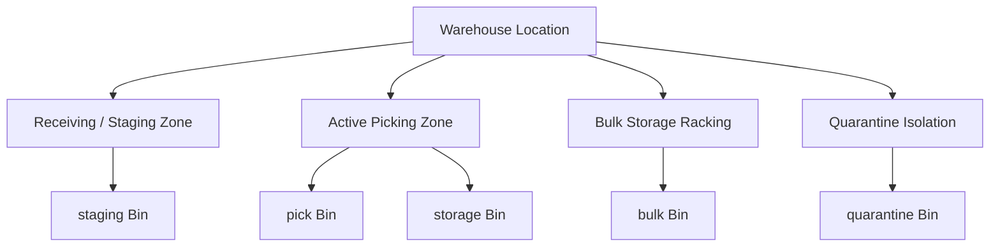

# Inventory & Bin Management

The **Inventory & Bin Management** module provides perpetual inventory visibility across all warehouse facilities, managing stock balances, multi-zone bin structures, and physical stock ledger movements.

---

## Inventory Architecture & Bin Types



### 1. Bin Classifications (`BIN_TYPE`)
Bins are categorized by operational purpose:
* **`storage`**: Standard shelving and pallet positions holding sellable inventory.
* **`pick`**: Dedicated forward pick-face locations.
* **`bulk`**: High-density overstock and reserve pallet racking.
* **`staging`**: Temporary staging zones for dock receiving or outbound shipping.
* **`quarantine`**: Isolated bins holding rejected or damaged stock excluded from sales availability.
* **`in_transit`**: Virtual bin tracking stock moving between company facilities.
* **`wip`**: Work-in-progress holding location for manufacturing assemblies.

### 2. Available Stock Calculation
The system dynamically computes sellable availability:

```
Available Quantity = On-Hand Stock - Allocated Order Reservations - Quarantine Stock
```

* **On-Hand**: Physical inventory present in warehouse storage, pick, and bulk bins.
* **Allocated**: Units committed to confirmed customer sales orders awaiting picking/dispatch.
* **Quarantine**: Units in quarantine bins awaiting inspection or return.

---

## Step-by-Step Workflows

### 1. Performing an Ad-Hoc Stock Adjustment
1. Go to **Inventory** (`/inventory`).
2. Search for the product SKU.
3. Click **Adjust Stock**.
4. Select the **Warehouse** and specific **Bin Location**.
5. Enter the **Quantity Change** (+/-) and select a reason code (e.g. Found Stock, Breakage).
6. Click **Confirm Adjustment**. The inventory ledger updates immediately, and the balancing expense posts to the General Ledger.

### 2. Auditing the Perpetual Inventory Ledger
1. Go to **Inventory** → **Ledger** (`/inventory/ledger`).
2. Filter transactions by date range, warehouse location, or transaction type (`receipt`, `dispatch`, `adjustment`, `transfer`).
3. Inspect the audit trail of perpetual stock movements, unit cost valuations, and linked General Ledger journal entry IDs.

---

## Field Reference

| Field | Description |
| :--- | :--- |
| **Product SKU** | Unique catalog identifier. |
| **Warehouse** | Physical facility location. |
| **Bin Location** | Shelf/rack address (`storage`, `pick`, `bulk`, `staging`, `quarantine`). |
| **On Hand** | Total physical count present in bins. |
| **Allocated** | Units reserved for confirmed customer orders. |
| **Available** | Net sellable stock (`On Hand - Allocated - Quarantine`). |
| **WAC Unit Cost** | Current Moving Weighted Average Cost valuation. |
