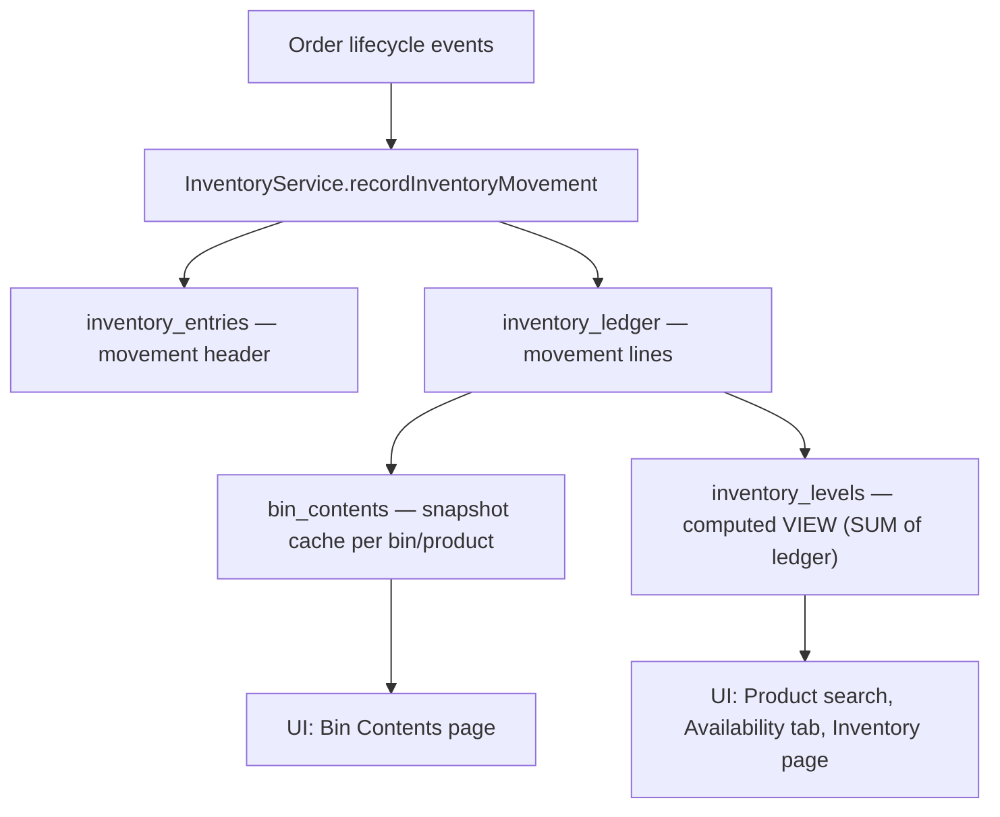

# Inventory Management

This document describes how inventory works in modbm — the data model, how stock levels are tracked, and how movements flow through the system.

---

## Architecture

Inventory uses an **immutable ledger** pattern (similar to double-entry accounting). Stock is never mutated in place — every movement is a new append-only record.



### Tables

| Table | Schema | Purpose | Mutated by |
|-------|--------|---------|------------|
| **inventory_entries** | `modbm_core` | Movement headers — one per event (shipment, receipt, return, etc.) | `recordInventoryMovement` |
| **inventory_ledger** | `modbm_core` | Immutable per-line movements (product × bin × quantity) | `recordInventoryMovement` |
| **bin_contents** | `modbm_core` | Snapshot cache of current stock per bin × product | dbt import (initial), app mutations (future) |
| **inventory_levels** | `modbm_core` | **VIEW** — aggregates ledger into on_hand / committed / on_order per product × location | Not directly mutated — computed from ledger |
| **bins** | `modbm_core` | Physical storage locations (bins within a warehouse) | dbt import |

> [!IMPORTANT]
> The `inventory_levels` table is a **database VIEW**, not a table. It computes stock positions by aggregating the immutable `inventory_ledger`. This means stock levels are always consistent with the movement history — there is no drift.

---

## Data Model

### `inventory_entries` (Movement Header)

| Column | Type | Description |
|--------|------|-------------|
| `entry_id` | UUID PK | Auto-generated |
| `entry_number` | TEXT UNIQUE | Human-readable ID (e.g. `STK-20260325-001`) |
| `entry_date` | TIMESTAMPTZ | When the movement occurred |
| `memo` | TEXT | Description of the movement |
| `source_type` | TEXT | Type: `INITIAL_IMPORT`, `PO_RECEIPT`, `SO_SHIPMENT`, `RETURN`, `ADJUSTMENT`, `TRANSFER` |
| `source_id` | UUID | FK to the originating document (shipment, reception, return) |
| `is_reversed` | BOOLEAN | Whether this entry has been reversed |
| `reversed_by` | UUID | Self-ref to the reversing entry |
| `created_by` | TEXT | User who created the movement |

### `inventory_ledger` (Movement Lines)

| Column | Type | Description |
|--------|------|-------------|
| `ledger_id` | UUID PK | Auto-generated |
| `entry_id` | UUID FK | References the parent entry |
| `product_id` | UUID FK | References `products.product_id` |
| `bin_id` | UUID FK | References `bins.bin_id` |
| `location_no` | TEXT | Warehouse location |
| `quantity` | NUMERIC | Signed: positive = stock in, negative = stock out |

### `inventory_levels` (Computed VIEW)

| Column | Type | Description |
|--------|------|-------------|
| `inventory_level_id` | UUID | Synthetic ID for backwards compatibility |
| `product_id` | UUID | Product reference |
| `location_no` | TEXT | Warehouse location |
| `quantity_on_hand` | NUMERIC | Total physical stock (SUM of all ledger quantities) |
| `quantity_committed` | NUMERIC | Reserved by confirmed orders |
| `quantity_on_order` | NUMERIC | Expected from purchase orders |

### Derived Quantities

| Quantity | Formula | Meaning |
|----------|---------|---------| 
| **Available** | `on_hand − committed` | Stock available for new orders |
| **Projected** | `on_hand − committed + on_order` | Expected future availability |

### `bin_contents` (Snapshot Cache)

| Column | Type | Description |
|--------|------|-------------|
| `bin_content_id` | UUID PK | Auto-generated |
| `bin_id` | UUID FK | References `bins.bin_id` |
| `product_id` | UUID FK | References `products.product_id` |
| `actual_quantity` | NUMERIC | Current stock in this bin |

**Unique constraint:** `(bin_id, product_id)` — one row per product per bin.

---

## How Movements Are Recorded

All inventory mutations go through a single method: `InventoryService.recordInventoryMovement`. This method:

1. **Creates a header** in `inventory_entries` (entry number, source type, memo)
2. **Creates ledger lines** in `inventory_ledger` (product, bin, signed quantity per line)
3. **Emits an outbox event** (`INVENTORY_ENTRY_CREATED`) for ERP sync

The method accepts a `tx` parameter (the active database transaction), ensuring atomicity with the business event that triggered it.

```typescript
await inventoryService.recordInventoryMovement(tx, {
  entryNumber: 'STK-20260325-001',
  sourceType: 'SO_SHIPMENT',
  sourceId: shipment.shipmentId,
  memo: 'Shipment SHP-0042 dispatched',
  userId: actor,
  lines: [
    { productId: '...', binId: '...', locationNo: 'MAIN', quantity: -10 },
  ],
});
```

---

## Stock Movement Events

Stock levels change at specific lifecycle transitions:

### Sales Order Lifecycle

| Event | Source Type | Quantity | Effect |
|-------|-----------|----------|--------|
| **Order confirmed** (quoted → confirmed) | `SO_COMMIT` | Positive committed | Stock reserved for customer |
| **Order cancelled** (from confirmed+) | `SO_RELEASE` | Negative committed | Reserved stock released |

### Shipment Lifecycle

| Event | Source Type | Quantity | Effect |
|-------|-----------|----------|--------|
| **Shipment dispatched** (draft → dispatched) | `SO_SHIPMENT` | Negative on_hand, negative committed | Goods leave warehouse |
| **Shipment reversed** (dispatched → draft/cancelled) | `SO_SHIPMENT_REVERSAL` | Positive on_hand, positive committed | Goods returned to shelf |

> [!NOTE]
> Cancelling a `draft` shipment does **not** create a ledger entry — no stock was deducted.

### Return Lifecycle

| Event | Source Type | Quantity | Effect |
|-------|-----------|----------|--------|
| **Return processed** (confirmed → processed) | `RETURN` | Positive on_hand | Goods returned to stock |

> [!NOTE]
> `committed` is not affected by returns — the original commitment was released when the shipment was dispatched.

### Purchase Order Lifecycle

| Event | Source Type | Quantity | Effect |
|-------|-----------|----------|--------|
| **PO ordered** (draft → ordered) | `PO_ORDER` | Positive on_order | Expected future arrivals |
| **PO cancelled** (ordered → cancelled) | `PO_CANCEL` | Negative on_order | Expected arrivals removed |
| **PO received** (ordered → received) | `PO_RECEIPT` | Positive on_hand, negative on_order | Goods arrive at warehouse |

---

## Summary Matrix

| Event | `on_hand` | `committed` | `on_order` |
|-------|-----------|-------------|------------|
| **Order confirmed** | — | +qty | — |
| **Order cancelled** (from confirmed+) | — | −qty | — |
| **Shipment dispatched** | −qty | −qty | — |
| **Shipment reversed** | +qty | +qty | — |
| **Return processed** | +qty | — | — |
| **PO ordered** | — | — | +qty |
| **PO cancelled** (from ordered) | — | — | −qty |
| **PO received** | +qty | — | −qty |

---

## Transaction Safety

All inventory mutations run **inside the same database transaction** as the state change that triggers them. This guarantees:

- **Atomicity** — if the state change fails, no ledger entries are created.
- **Consistency** — the ledger always reflects complete business events.
- **Auditability** — every movement is traceable to a source document via `source_type` and `source_id`.
- **No eventual consistency gaps** — unlike the outbox pattern used for ERPNext, inventory updates are synchronous.

---

## Inventory Movements Page

The UI provides an **Inventory Movements** page that summarises stock activity over a configurable time window (7 / 30 / 90 days). It queries the `inventory_ledger` directly:

| Column | Description |
|--------|-------------|
| Product | Product name and number |
| Stock In | Sum of positive ledger quantities |
| Stock Out | Sum of negative ledger quantities (absolute) |
| Net Change | Sum of all quantities |

Initial import entries (`source_type = 'INITIAL_IMPORT'`) are excluded from the movements view.

---

## Initial Seeding

The initial stock was loaded from ABM via the dbt import pipeline:

- **`import_inventory_entries`** — creates a single `INITIAL_IMPORT` entry header
- **`import_inventory_ledger`** — creates ledger lines from the ABM bin contents data
- **`import_bin_contents`** — populates the bin × product snapshot cache
- **`import_bins`** — imports bin definitions

This is a one-time import. After seeding, the application owns all inventory data and updates it through the ledger.

---

## Key Design Decisions

1. **Immutable ledger over mutable columns.** Stock levels are never updated in place. This prevents drift between the reported stock and the actual movement history.

2. **VIEW for aggregation.** The `inventory_levels` view computes stock positions on the fly from the ledger. This ensures consistency without the complexity of maintaining a materialised cache.

3. **Bin-level granularity.** Every ledger line records the specific bin where stock moved. The `bin_contents` cache provides fast bin-level lookups for warehouse operations.

4. **Single mutation method.** All inventory changes flow through `recordInventoryMovement`, preventing ad-hoc stock mutations that could bypass the audit trail.

5. **Location-Aware Topography.** There are no global system bins (e.g., no global `DOCK`). All system staging zones like `SHIPPING` and `RECEIVING` are inherently bound to specific physical locations. This prevents cross-location staging stock contamination and supports a true multi-warehouse architecture out of the box.
