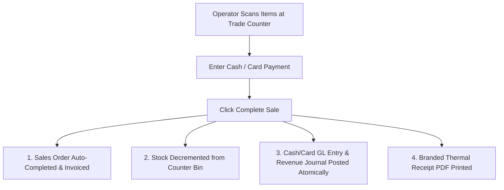

# Over-the-Counter Sales & POS

The **Over-the-Counter (OTC) Sales** module provides a streamlined Point-of-Sale (POS) interface for trade counters and physical branches, combining order creation, payment collection, stock decrement, and receipt printing into an atomic transaction.

---

## Counter Sales Transaction Architecture

### 1. Atomic POS Execution
When the cashier completes an OTC sale, HeroBM executes in a single database transaction:
1. Creates a Sales Order in `Shipped` / `Invoiced` status.
2. Decrements inventory from the branch's counter bin.
3. Generates a fully paid Sales Invoice and records the payment entry into the Cash Drawer or EFTPOS clearing GL account.
4. Generates a compact thermal receipt formatted for counter printers.

### 2. General Ledger Prerequisites
To process counter sales with cash or EFTPOS settlement, the organization must configure default OTC Cash & Card clearing accounts in **Administration** → **Settings** → **Financial Settings** (`/admin/settings/financial`).

---

## Step-by-Step Workflows

### 1. Processing a Walk-In Sale
1. Go to **Sales** → **Counter Sales** (`/sales-orders/counter`).
2. Search or scan product SKUs to add items to the cart.
3. Select the customer (defaults to `Cash Sale / Walk-In`).
4. Select the **Payment Method** (`Cash` or `Card`).
5. For cash sales, enter the **Amount Tendered** to view change due.
6. Click **Complete Sale**. The receipt prints instantly, and stock decrements from the counter bin.

---

## Field Reference

| Field | Description |
| :--- | :--- |
| **Customer** | Account receiving the receipt (Cash Walk-In by default). |
| **Payment Method** | Cash, Card/EFTPOS, Direct Deposit, or Trade Account. |
| **Tendered Amount** | Cash received from customer. |
| **Change Due** | Difference returned to walk-in customer. |
