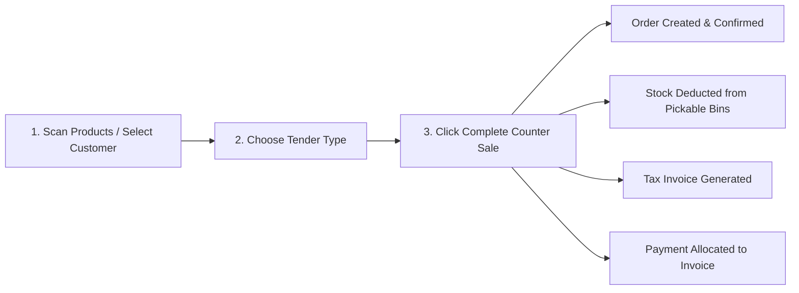

# Over-The-Counter (OTC) Sales

The **Over-The-Counter (OTC) Sales** station provides a streamlined, rapid point-of-sale interface tailored for trade counters, pickup desks, and walk-in retail transactions.

Instead of navigating the standard multi-step fulfillment lifecycle (Order → Pick Queue → Dispatch Shipments → AR Invoicing → Payment Allocation), the OTC module unifies all four operational and accounting actions into a single one-click transaction.

---

## Where to Find It

You can access the Over-The-Counter Sales module in two ways:

1. **Sidebar Navigation**: Go to **Sales** → **Counter Sales** (`/sales-orders/counter`).
2. **Sales Orders List**: Click the **Counter Sale** button in the top action bar of the **Sales Orders** page (`/sales-orders`).

---

## Key Features

- **Hardware Barcode Scanning**: Active scanner listener automatically captures barcode scans without requiring manual mouse focusing.
- **Walk-In & Account Customer Support**: Defaults to the seeded system `Walk-In Customer` (`CUST-WALKIN`) with standard cash terms, while allowing instant lookup of regular trade account customers to apply custom price matrices and discounts.
- **Direct Stock Deduction (No Freight Shipments)**: Automatically deducts physical inventory from available pickable bins at the selected counter location and posts Cost of Goods Sold (COGS) to the General Ledger.
- **Instant Billing & Payment**: Generates a finalized Tax Invoice and records an allocated Payment Receipt in real time.
- **1-Click Printing**: Immediate access to print or download PDF Order Confirmations, Tax Invoices, and Payment Receipts upon completion.

---

## Step-by-Step Counter Workflow

### 1. Identify the Customer & Location
1. **Counter Location**: Ensure the correct warehouse/counter location is selected in the top-right header (e.g. `Warehouse (1)`).
2. **Customer**: 
   - For walk-in retail sales, keep the default **Walk-In Customer**.
   - For trade account customers, type in the **Customer** field to search by company name or account number. Negotiated discounts and price tiers are loaded immediately.

### 2. Add Line Items
- **Barcode Scanning**: Scan product barcodes (EAN/SKU) with a USB or Bluetooth scanner. Each scan increments the line quantity with audio feedback.
- **Search by Name/SKU**: Type SKU or description into the search box and press `Enter` or select from the dropdown.
- **Custom Lines**: Click **+ Add Custom Line** to add one-off non-catalog parts or miscellaneous counter charges.
- **Comment Lines**: Click **+ Add Comment** to attach notes or instructions to the printed invoice.

### 3. Review Pricing & Taxes
- Line quantities, unit prices, discounts (0% to 100%), and tax categories can be edited directly in the grid.
- Subtotal, Tax (GST), and Grand Total calculate live with strict 2-decimal arithmetic rounding.

### 4. Select Tender & Complete Sale
Select the payment method in the bottom right panel:
- **Cash**: Records an immediate customer payment receipt posted to the system **Default OTC Cash Account** (configured under **Admin** → **Settings** → **Financial**).
- **Card / EFTPOS**: Records an immediate customer payment receipt posted to the system **Default OTC Card / EFTPOS Account** (configured under **Admin** → **Settings** → **Financial**).
- **Direct Deposit (EFT)**: Records an immediate electronic receipt posted to the system **Default OTC Card / EFTPOS Account**.
- **On Account**: Generates the invoice with outstanding balance under the customer's payment terms (without creating an immediate cash receipt).

> [!NOTE]
> Under strict accounting mode, if an OTC payment method is tendered and the corresponding default GL account has not been configured in Financial Settings, the payment recording is blocked with a clear prompt to configure the account.

Click **Complete Counter Sale**.

---

## Post-Sale Modal & Documents

Once completed, a summary modal displays the generated entity references:
- **Sales Order** (`ORD-...`): Click the order link to view full order details.
- **Tax Invoice** (`INV-...`): Click to inspect accounts receivable postings.
- **Payment** (`PAY-...`): Click to review the cash receipt entry and journal postings.

Click the **🖨 Print** icon next to any entity to generate and open the official Typst PDF document in a new tab. Click **New Counter Sale** to reset the station for the next customer.
