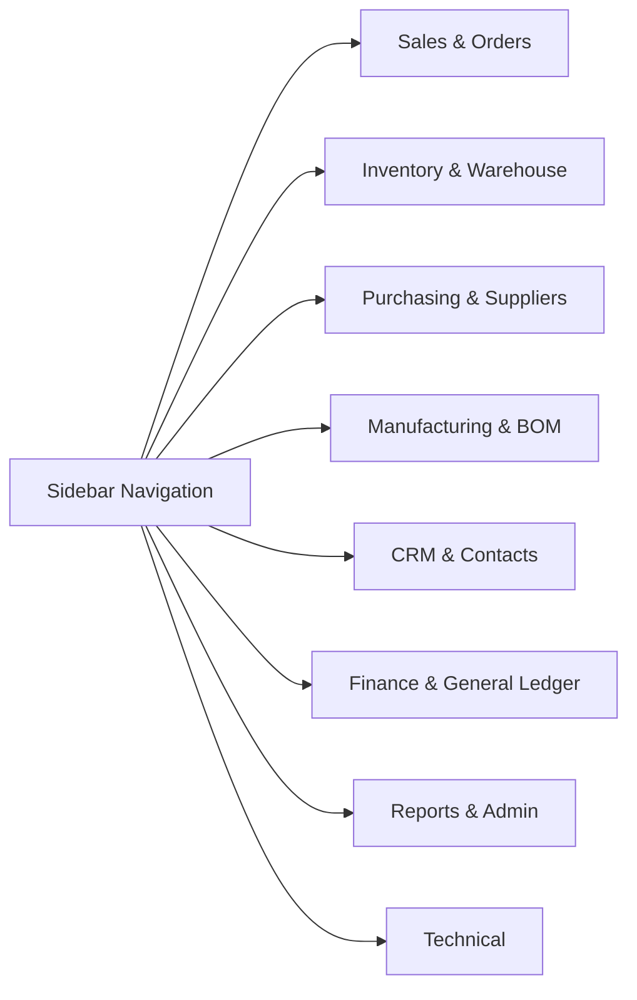

# System Overview

HeroBM is an integrated business management platform connecting sales, warehouse operations, purchasing, manufacturing, CRM, and accounting into a single real-time system.

---

## Navigation & Layout

### Main Interface Areas

1. **Sidebar Navigation (Left)**: Access all modules grouped by workflow. Sub-menus expand automatically based on your active page.
2. **Top Header**: Shows the current page title, search, notifications, and active filters.
3. **Workspace (Center)**: Main data tables, forms, dashboards, and analytical cards.
4. **User & Help Footer (Bottom Left)**:
   - **User Menu**: Click your name to open personal preferences or sign out.
   - **Help Button (`?`)**: Click to open contextual documentation for your current screen.

---

## Core System Concepts

### 1. Unified Actors
Companies, customers, suppliers, and business contacts share a unified **Actor** foundation. An organisation can be both a supplier and a customer without duplicating contact details.

### 2. Perpetual Real-Time Inventory
Every stock movement (receipt, transfer, pick, shipment, or adjustment) immediately updates on-hand and available balances. The single source of truth is the immutable stock ledger.

### 3. Integrated Accounting (General Ledger)
Operational actions post directly to the General Ledger:
- Invoicing a sales order debits Accounts Receivable and credits Revenue and Tax.
- Receiving goods updates Inventory Asset balances.
- Settling invoices posts cash and bank movements.

---

## Getting Help

- **Contextual Help**: Press `?` on your keyboard or click the **?** button at the bottom of the sidebar to view instructions and field definitions for the page you are on.
- **Search Topics**: Use the **Search** tab in the Help Drawer to find topics across the entire manual.
- **Table of Contents**: Use the **Contents** tab to browse the manual in the exact order of the sidebar.
