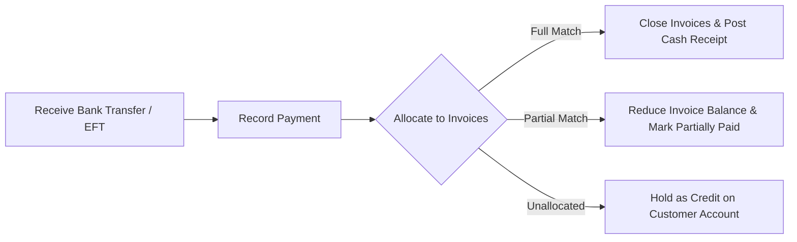

# Payments & Settlements

The **Payments** module processes inbound cash receipts from customers and executes outbound payment runs to suppliers, allocating funds against specific invoices.

---

## Payment Lifecycle & Matching

### 1. Allocation Rules
- When recording a payment, you can allocate funds across one or more open invoices.
- Any unallocated funds remain on the customer's account as unapplied credit, ready to be applied against future invoices.

---

## Step-by-Step Workflows

### 1. Recording a Customer Payment
1. Go to **Finance** → **Payments** (`/payments`).
2. Click **+ New Receipt**.
3. Select the **Customer** and the target **Bank Account**.
4. Enter the **Payment Date**, **Payment Method**, and **Amount Received**.
5. In the open invoices table, check the invoices being settled (or click **Auto-Allocate Oldest First**).
6. Click **Post Payment**.

### 2. Creating a Supplier Payment Run
1. In the payments desk, select **Supplier Payment Run**.
2. Filter open vendor bills due for payment.
3. Select the invoices to pay and click **Generate Batch EFT / ABA File**.
4. Upload the file to your bank portal and click **Mark as Paid**.

---

## Field Reference

| Field | Description |
| :--- | :--- |
| **Payment Number** | Unique payment reference. |
| **Payer / Payee** | Customer or Supplier account. |
| **Bank Account** | Company bank account involved. |
| **Payment Method** | EFT, Wire, Credit Card, Cheque. |
| **Allocated Amount** | Total applied to open bills. |
