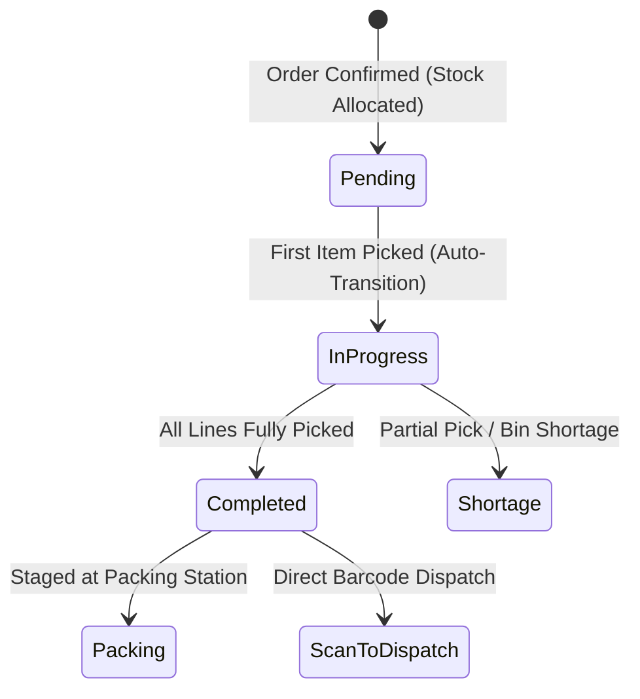

# Picking Operations

The **Picking** module handles single-order and wave picking workflows, guiding warehouse operators through optimized travel paths to retrieve reserved stock from storage bins.

---

## Picking Lifecycle & Business Logic



### 1. Pick Sequencing & Path Optimization
* **Aisle Travel Optimization**: Pick lists are sorted sequentially by warehouse bin coordinates (`Aisle → Rack → Shelf → Position`) to minimize walking distance across warehouse zones.
* **Bin Eligibility**: The picker is directed strictly to pickable bin types (`storage`, `pick`, `bulk`) where `is_unavailable = false` and `is_bonded = false`.

### 2. Auto-State Transitions & Stock Ledger
* **Automatic Status Transition**: When an order is in `Confirmed` state, recording the first item pick scan immediately updates the sales order state to **`Picking`**.
* **Perpetual Ledger Deduction**: Registering a pick deducts the physical quantity from the storage bin and reclassifies it as staged on the picking cart.

### 3. Scan-to-Pick Barcodes & Hardware Integration
* Pick sheets and mobile scanners utilize the canonical barcode standard:
  ```
  PICK:{orderId}:{lineId}:{binId}:{quantity}
  ```
* Scanning the barcode validates the SKU and bin location simultaneously, preventing accidental fulfillment of incorrect items or batch lots.

### 4. Handling Bin Shortages
* If a storage bin contains fewer physical items than indicated:
  1. The operator enters the actual found count as a **Partial Pick**.
  2. The system flags a **Bin Variance**, prompting a cycle count adjustment.
  3. The unpicked balance remains open for fulfillment from an alternate bin or split dispatch.

---

## Step-by-Step Workflows

### 1. Picking an Order
1. Go to **Inventory** → **Picking** (`/inventory/picking`).
2. Select an assigned sales order from the queue.
3. Follow the guided sequence to the indicated bins.
4. Scan the **Bin Barcode** and **Product SKU**, then confirm the **Quantity Picked**.
5. When all lines are retrieved, click **Complete Picking** to transfer items to the packing station (or proceed directly to **Scan-to-Dispatch**).

---

## Field Reference

| Field | Description |
| :--- | :--- |
| **Sales Order** | Target customer order being fulfilled. |
| **Bin Location** | Shelf/rack coordinate to retrieve items. |
| **Quantity Required** | Total allocated units requested on the sales order. |
| **Quantity Picked** | Confirmed physical units collected into the pick cart. |
| **Barcode Payload** | Encoded scan string (`PICK:{orderId}:{lineId}:{binId}:{quantity}`). |
| **Status** | Pick progress (`Pending`, `In-Progress`, `Completed`, `Shortage`). |

