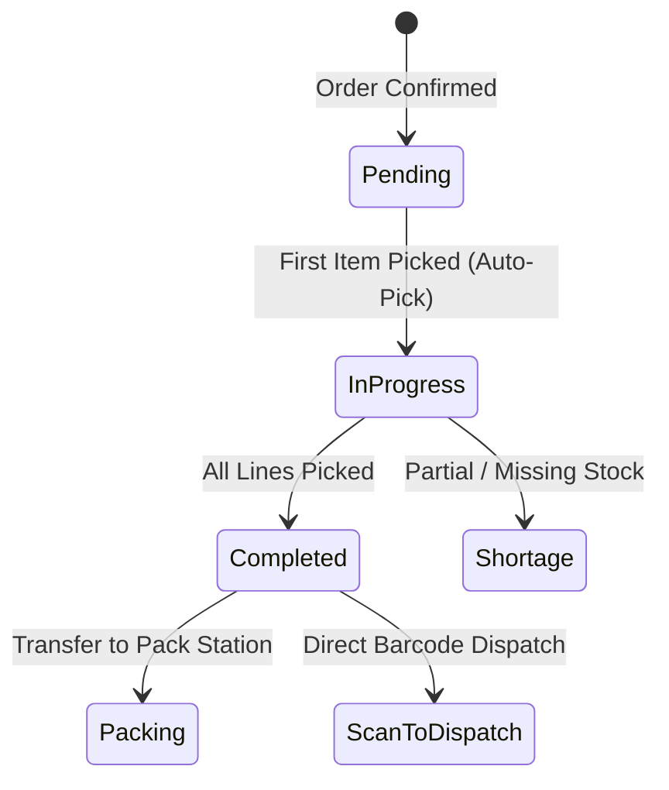

# Picking Operations

The **Picking** module handles single-order picking workflows for warehouse staff, retrieving ordered goods from storage bins and verifying item accuracy before packing.

---

## Picking Lifecycle & Auto-Transitions

### 1. Auto-Picking Trigger
When an order is in `Confirmed` status, picking the first item automatically updates the sales order state to `Picking`.

### 2. Scan-to-Pick Barcodes & Zebra Label Integration
Pick sheets and product labels can include canonical scan-to-pick barcodes (`PICK:{orderId}:{lineId}:{binId}:{quantity}`). Scanning these barcodes directly registers picks and seamlessly integrates with the [Scan-to-Dispatch](file:///docs/user/shipping.md) packing station (`/inventory/shipping/scan-to-dispatch`).

### 3. Handling Shortages
If a bin has less stock than expected:
- The picker can record a **Partial Pick**.
- The system flags the shortage, leaving unpicked quantities open for backorder fulfillment or alternate bin picking.

---

## Step-by-Step Workflows

### 1. Picking an Order
1. Go to **Inventory** → **Picking** (`/inventory/picking`).
2. Select an assigned sales order.
3. Follow the sequence to the indicated bins.
4. Scan or verify the **Bin**, **Product SKU**, and enter the **Quantity Picked**.
5. Move picked items to the packing station and click **Complete Picking** (or take items directly to **Scan-to-Dispatch** for one-step packing and carrier dispatch).

---

## Field Reference

| Field | Description |
| :--- | :--- |
| **Sales Order** | Target customer order. |
| **Bin Location** | Shelf/rack location to retrieve items. |
| **Quantity Required** | Ordered quantity. |
| **Quantity Picked** | Confirmed picked units. |
| **Barcode Payload** | Encoded scan string (`PICK:{orderId}:{lineId}:{binId}:{quantity}`). |
| **Status** | Pick progress (`Pending`, `In-Progress`, `Completed`). |
